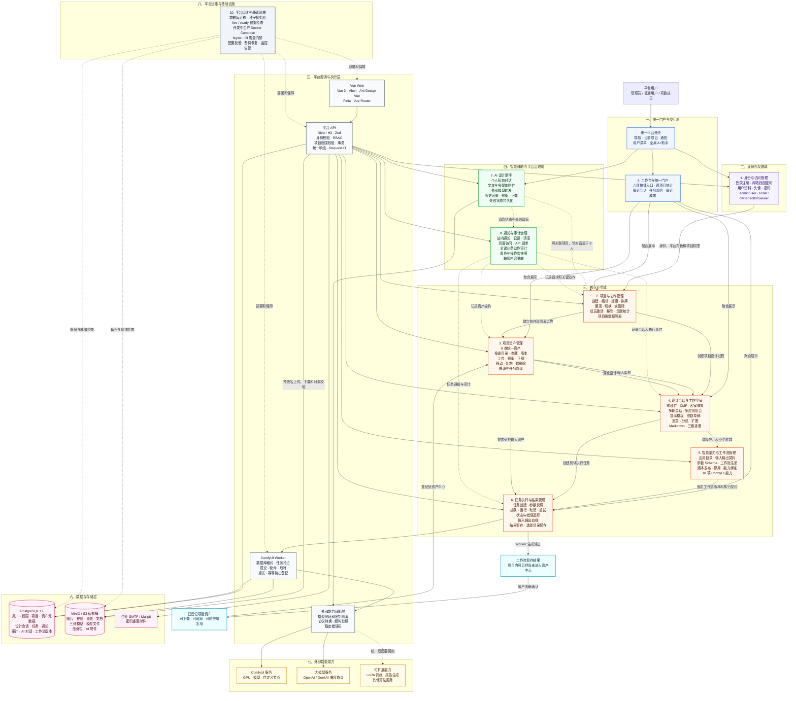

# 客运装备内装模块化分区快速设计平台

面向轨道交通客室方案设计的项目协作与智能能力集成平台。本仓库包含可独立部署的 Web、平台 API、数据库迁移、对象存储接入、部署配置、测试和中文交接文档，不是前端演示项目。

## 当前能力

- 用户名密码认证、注册、企业邮箱找回密码、刷新会话与账号管理
- 管理员/普通用户两级角色、项目范围隔离和后端权限校验
- 项目、资产、版本、任务台账、通知和审计日志
- 首页六项快捷入口、跨项目个人设计检索与项目内多轮设计会话
- 客室零部件、CMF、客室效果三类设计上下文及真实工作流复用
- 登录后全局 AI 助手、用户级会话隔离与附件对象存储
- PostgreSQL 持久化、MinIO/S3 私有对象、预签名上传与下载
- Linux、macOS、Windows 源码运行及单机 Docker 部署

大模型、ComfyUI、LoRA 和报告生成属于外部能力。未配置适配器时平台会返回明确错误，不会用静态数据伪造执行成功。

## 项目逻辑架构



## 仓库结构

| 路径 | 用途 |
| --- | --- |
| `apps/web-antd/` | 实际产品 Web，Vue 3 + Ant Design Vue |
| `apps/platform-api/` | 平台 REST API、迁移、种子与集成验收 |
| `packages/` | Web 实际依赖的共享布局、表单、权限、状态、请求和基础 UI |
| `internal/` | TypeScript、Vite、Tailwind 与代码规范配置 |
| `deploy/rail-platform/` | 开发和生产 Docker、Nginx、环境模板 |
| `docs/rail-platform/` | 产品、架构、质量、部署、运维与重构记录 |
| `scripts/` | 仓库内部依赖和规范检查工具 |

完整说明见 [仓库结构说明](docs/rail-platform/REPOSITORY_STRUCTURE.md)。

## 本地启动

要求 Node.js `^22.18.0` 或 `^24.12.0`、pnpm `11.16.0`、Docker 与 Compose。

```bash
pnpm install --frozen-lockfile
pnpm dev
```

默认地址：

- Web：`http://localhost:5666`
- API：`http://localhost:5320/api/v1`
- MinIO 控制台：`http://localhost:9001`
- Mailpit：`http://localhost:8025`

初始化账号、环境变量和分步启动方式见 [平台开发入口](docs/rail-platform/README.md)。

## 质量门禁

```bash
pnpm lint
pnpm typecheck:rail
pnpm test:rail
pnpm test:rail:integration
pnpm build
```

## 文档入口

- [产品需求](docs/rail-platform/PRODUCT_REQUIREMENTS.md)
- [系统架构](docs/rail-platform/ARCHITECTURE.md)
- [质量门禁](docs/rail-platform/QUALITY_GATES.md)
- [部署说明](docs/rail-platform/DEPLOYMENT.md)
- [运维手册](docs/rail-platform/OPERATIONS.md)
- [产品路线图](docs/rail-platform/PRODUCT_ROADMAP.md)
- [开发记录](docs/rail-platform/DEVELOPMENT_LOG.md)
- [重构计划](docs/rail-platform/REFACTOR_CORE_MODULE_PLAN.md)
- [重构提交日志](docs/rail-platform/REFACTOR_COMMITLOG.md)

## 技术来源与许可

前端基础框架源自 [Vben Admin](https://github.com/vbenjs/vue-vben-admin) 5.7.0，并在本仓库中保留 `@vben/*` 与 `@vben-core/*` 技术包名以避免无业务价值的全量重命名。产品身份、运行入口、业务代码、API、部署和交接文档均以本平台为准。

本项目沿用 MIT 许可证，详见 [LICENSE](LICENSE)。
