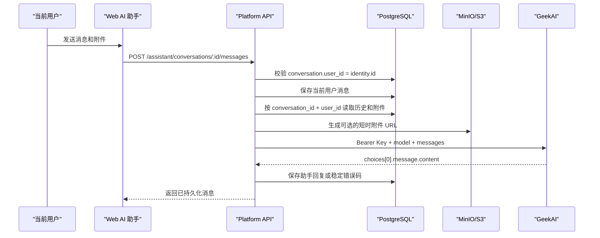

# AI 设计助手 GeekAI 接入与验收手册

## 1. 文档目的

本文档是 AI 设计助手的开发、部署和故障交接入口。目标是让后续开发人员在不重新阅读整个仓库的情况下，可以安全配置 GeekAI、验证用户隔离、定位上游问题并做小范围适配。

官方接口文档：[GeekAI 文本对话](https://docs.geekai.co/cn/api/chat)。

## 2. 当前实现边界

- 已实现：真实 PostgreSQL 会话、消息、附件关系，MinIO/S3 附件，用户隔离，审计，GeekAI Chat Completions 请求与响应适配。
- 已实现：图片使用 `image_url`，视频使用 `video_url`，地址为平台生成的短时预签名 URL。
- 已实现：不支持直读的 PDF、Office、压缩包和音频等附件不传递正文，并向模型明确标注“未读取”。
- 尚未执行：用新 Key 访问真实 GeekAI 的端到端验收。
- 不得宣称：没有完成真实请求时，不得将单元模拟测试描述为 GeekAI 已可用。

## 3. 密钥紧急处理

本次需求中提供的 Key 已经出现在对话正文中，必须视为已泄露：

1. 在 GeekAI 控制台立即撤销该 Key。
2. 生成一个新 Key，最好为本平台单独创建，不与其他系统共用。
3. 只将新 Key 写入本机未跟踪 `.env` 或部署平台的 Secret 管理中。
4. 不得将 Key 写入前端、文档、数据库、截图、审计详情、提交信息或测试快照。

## 4. 数据流与用户隔离



隔离规则：

- 会话列表只查询 `ai_conversations.user_id = identity.id`。
- 单个会话必须通过 `requireAssistantConversation`，他人会话统一返回 `404 AI_CONVERSATION_NOT_FOUND`。
- 附件查询同时校验 `conversation_id` 和 `user_id`。
- 提供商历史查询再次通过会话表约束 `user_id`，不仅依赖路由层校验。
- 管理员只能在审计中看到操作元数据，不能读取其他用户对话正文或附件。

## 5. 配置方法

开发环境在 `apps/platform-api/.env` 中设置：

```dotenv
AI_ASSISTANT_API_URL=https://geekai.co/api/v1/chat/completions
AI_ASSISTANT_API_KEY=<ROTATED_GEEKAI_API_KEY>
AI_ASSISTANT_MODEL=deepseek-v4-flash-0731
AI_ASSISTANT_TIMEOUT_MS=60000
AI_ASSISTANT_MAX_ATTACHMENT_BYTES=52428800
```

生产环境使用 `deploy/rail-platform/.env.production` 或宿主平台 Secret。`AI_ASSISTANT_API_URL` 和 `AI_ASSISTANT_API_KEY` 必须同时填写或同时留空；生产启动会拒绝单边配置、无效 URL 和 `CHANGE_ME` Key。

变更环境变量后必须重启 API 进程。前端只会从 `/assistant/status` 看到以下非敏感信息：

- `configured`：地址和 Key 是否都已配置。
- `provider`：`GeekAI` 或 `OpenAI 兼容服务`。
- `model`：当前模型名。
- `maxAttachmentBytes`：单个附件上限。

接口地址和 Key 均不会返回给浏览器。

## 6. 提供商协议

平台向 GeekAI 发送：

```json
{
  "model": "deepseek-v4-flash-0731",
  "messages": [
    { "role": "system", "content": "轨道客室设计助手约束" },
    { "role": "user", "content": "用户问题" }
  ],
  "sess_id": "平台会话 UUID",
  "stream": false
}
```

鉴权使用 `Authorization: Bearer <key>`。平台只解析非流式响应的 `choices[0].message.content`，并将上游 `id` 保存为 `external_message_id`。

为了降低不必要的个人数据外发，请求不包含平台用户名、真实姓名、角色和邮箱。

## 7. 附件能力与限制

- 图片：转换为 `image_url`，具体模型是否支持视觉输入仍以 GeekAI 模型能力为准。
- 视频：转换为 `video_url`，同样受模型能力限制。
- PDF、Office、文本、压缩包和音频：当前只告知模型文件名且明确正文未传递，不伪造文件分析结果。
- 外部服务必须能访问 `S3_PUBLIC_ENDPOINT` 生成的 URL。如果地址是 `localhost`、宿主机内网名或被防火墙拦截，文本对话可成功，但多模态附件会失败。
- 当前默认模型是文本对话模型。上线多模态前必须换成支持相应输入的模型并重做附件验收。

## 8. 稳定错误码

| 错误码 | 含义 | 首要检查 |
| --- | --- | --- |
| `AI_ASSISTANT_NOT_CONFIGURED` | 地址或 Key 未完整配置 | API 进程环境变量 |
| `AI_ASSISTANT_AUTH_FAILED` | GeekAI 返回 401/403 | Key 是否有效、已轮换或有权限 |
| `AI_ASSISTANT_RATE_LIMITED` | GeekAI 返回 429 | 额度、并发和限流 |
| `AI_ASSISTANT_REQUEST_REJECTED` | GeekAI 返回 400/422 | 模型名、附件格式、模型能力 |
| `AI_ASSISTANT_TIMEOUT` | 超过平台超时时间 | 网络、模型耗时、超时配置 |
| `AI_ASSISTANT_UNAVAILABLE` | 无法建立请求 | DNS、TLS、代理、防火墙 |
| `AI_ASSISTANT_UPSTREAM_ERROR` | 其他非成功响应 | GeekAI 服务状态 |
| `AI_ASSISTANT_INVALID_RESPONSE` | 响应不符合 Chat Completions | 接口地址、协议变更 |

上游错误响应正文不写入数据库或审计日志，前端只显示稳定的中文提示。

## 9. 模拟测试与真实验收

针对性模拟测试：

```bash
pnpm --filter @rail/platform-api test -- utils/domain/assistant/provider.test.ts utils/domain/assistant/conversations.test.ts utils/infrastructure/config.test.ts
```

真实验收顺序：

1. 轮换已暴露 Key，按第 5 节配置新 Key 并重启 API。
2. 登录 `user1`，新建对话并发送“你好”，确认页面显示 GeekAI 和模型名。
3. 刷新页面，确认会话和助手回复仍存在。
4. 退出并登录 `user2`，确认看不到 `user1` 会话。
5. 使用 `user2` 直接请求 `user1` 会话 ID，必须返回 `404 AI_CONVERSATION_NOT_FOUND`。
6. 用管理员检查审计记录：可以看到字符数、附件数和结果，不能看到聊天正文、Key 或完整请求体。
7. 再分别验证 401、429、超时和无效模型，确认页面和任务记录显示对应稳定错误。

项目已有真实集成验收覆盖“`user2` 读取 `user1` 会话必须返回 404”。需要执行全链路验收时运行：

```bash
pnpm test:rail:integration
```

集成测试会使用唯一测试数据并只清理本轮创建的记录，不得手工清空开发数据库。

## 10. 协议微调的最短路径

如果 GeekAI 后续升级响应或更换模型，优先只修改：

- `apps/platform-api/utils/domain/assistant/provider.ts`：请求、附件和响应适配。
- `apps/platform-api/utils/domain/assistant/provider.test.ts`：用最小模拟响应锁定协议。
- `apps/platform-api/utils/infrastructure/config.ts`：仅在环境契约改变时修改。

不要修改对话表、用户隔离 API 或前端存储方式来迁就上游协议；外部差异必须收敛在适配器内。

## 11. 2026-08-08 本机真实部署证据

- 本机 `apps/platform-api/.env` 已配置 GeekAI 地址、模型和受限权限 Key；Key 未写入代码、文档、数据库或版本控制模板。
- API 与 Worker 已重启，页面状态显示 `GeekAI · deepseek-v4-flash-0731`。
- 模拟验收：`14` 个测试文件、`41` 项测试全部通过，未使用真实 Key。
- 真实文本验收：通过平台 AI 助手创建新会话并成功获得 GeekAI 中文回复，没有出现鉴权、协议或模型错误。
- 持久化验收：刷新整个页面并重新打开 AI 助手后，用户问题和助手回复仍可读取。
- 隔离边界：代码继续通过会话归属和提供商历史查询两层 `user_id` 条件保护；本轮未使用已变更密码的第二账号重复登录，以免触发账号锁定，跨用户 404 仍由 `scripts/integration-test.ts` 的真实集成用例负责复验。
- 安全限制：当前 Key 曾出现在需求对话中，虽然已经按用户授权部署，仍应尽快轮换；轮换只需要替换本机/部署 Secret 并重启 API，不需要修改代码或数据库。
