# 当前系统架构说明

> 更新时间：2026-08-08。本文以当前仓库代码、数据库迁移和部署配置为准，不把模拟协议测试描述成真实 GPU 推理已验证。

当前项目已经从纯前端演示升级为可持久化的平台框架。登录、企业邮箱找回密码、用户、权限、项目、资产、任务、通知、审计和 AI 助手会话使用真实 API、PostgreSQL、MinIO 和 SMTP。ComfyUI 已实现 18 项工作流目录、能力映射、独立 Worker、媒体输入和图片/文本/3D 输出登记；本机 18 项能力已完成真实 ComfyUI GPU 推理验收，其他部署环境仍需按服务、模型和自定义节点版本独立预检。

## 1. 核心架构结论

系统采用“稳定平台框架 + 可替换能力适配器”的分层架构：

- 平台框架保持稳定：用户身份、项目上下文、资产、任务、通知、审计、导航和固定工作区。
- 外部能力独立变化：厂商地址、密钥、工作流编号、模型参数和状态协议只应进入后端适配器。
- 项目是数据隔离边界：普通用户只能访问自己参与的项目。
- 资产是跨能力交换协议：某个能力的输出登记为项目资产后，可以被同一项目中的其他能力继续使用。
- 关系数据与大文件分离：PostgreSQL 保存业务关系和文件元数据，MinIO/S3 保存图片、视频、音频、模型和报告等二进制内容。
- 前后端双重权限校验：前端负责菜单和交互可见性，后端负责最终身份、权限和项目数据范围校验。
- 首页使用 `/dashboard` 汇总与 `/design-conversations` 会话查询：聚合结果只返回当前账号可访问的最近任务和八类生成资产；图片预览只返回资产 ID，浏览器仍通过受控预览接口获取短时 URL，其他资产使用集中定义的类型图标；训练与报告是固定平台外壳下的专属页面，执行器未配置前不创建任务。

## 2. 总体架构图

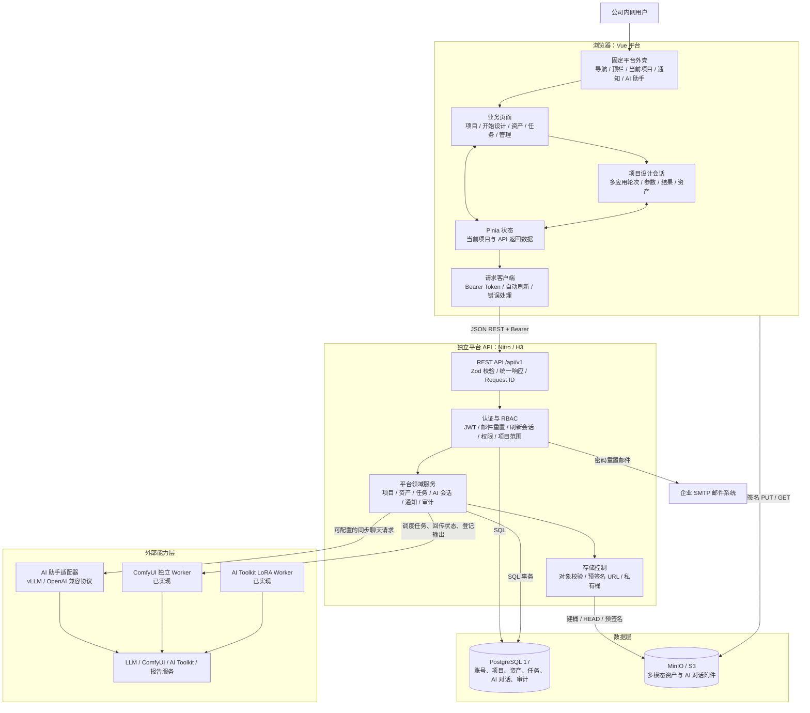

实线表示当前已经存在的运行链路；虚线表示已经预留数据契约，但尚未实现的能力接入链路。

## 3. 开发环境部署图

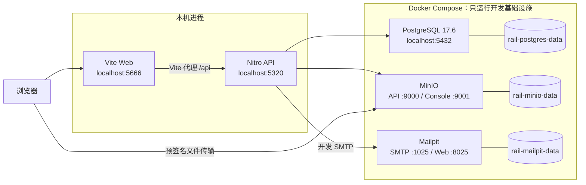

`pnpm dev:rail` 会依次启动 Docker 基础设施、执行数据库迁移、执行幂等种子初始化，再并行启动 Web 与 API。当前 Docker 不负责运行 Web 和 API；Mailpit 只用于本地接收测试邮件，生产环境由企业 SMTP 替代。

生产环境建议把 Web 构建产物部署到静态服务器，通过反向代理将同域 `/api/v1` 转发到 Nitro API；PostgreSQL、对象存储、密钥、备份和监控由生产基础设施单独管理。

## 4. 技术栈

| 层级 | 当前技术 | 主要作用 |
| --- | --- | --- |
| Monorepo | pnpm 11、Turborepo 2 | 工作区依赖、统一脚本、并行构建 |
| Web 框架 | Vue 3、TypeScript、Vite | 单页应用、组件化页面和开发构建 |
| 管理端基础 | Vue Vben Admin 5.7 | 登录守卫、布局、标签页、权限指令、偏好和通用组件 |
| UI | Ant Design Vue、本地 Iconify Lucide 图标集、项目 SCSS/CSS | 表单、弹窗、表格、状态与轨道交通品牌视觉；运行时不依赖公网图标接口 |
| 路由与状态 | Vue Router、Pinia | 页面路由、当前项目和 API 数据状态 |
| HTTP 客户端 | Vben Request/Axios 封装 | Bearer 注入、刷新令牌、统一响应解包和错误提示 |
| 平台 API | Nitro 2、H3、TypeScript | 文件式 REST 路由、中间件和生产服务构建 |
| 输入校验 | Zod | 请求体、查询参数和表单规则校验 |
| 身份认证 | JOSE JWT、Node.js `crypto` scrypt/SHA-256 | 访问令牌、密码散列和刷新令牌哈希 |
| 数据访问 | postgres.js | PostgreSQL 参数化查询和事务 |
| 关系数据库 | PostgreSQL 17.6 | 业务数据、权限关系、会话和文件元数据 |
| 对象存储 | MinIO、AWS SDK for JavaScript v3 | S3 私有桶、预签名上传、下载和图片预览 |
| 邮件服务 | Nodemailer、SMTP | 企业邮箱密码重置邮件；连接与投递只发生在后端 |
| 开发邮件沙箱 | Mailpit | 本地 SMTP 接收与邮件页面验收 |
| 本地基础设施 | Docker Compose | 可复现地启动 PostgreSQL、MinIO 和 Mailpit |
| 测试与质量 | Vitest、Playwright、vue-tsc、ESLint、Oxlint、Stylelint、Oxfmt | 单元测试、浏览器验收、类型和代码质量检查 |

## 5. 前端模块

### 5.1 固定外壳与页面区域

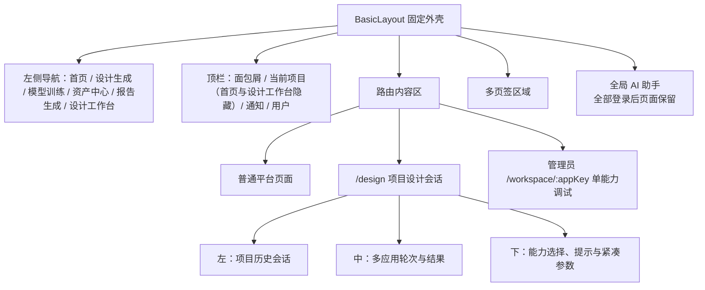

进入不同应用时，只替换路由内容区的应用定义和参数；平台导航、当前项目、资产权限、任务台账、通知和用户身份不变。这正是“平台框架与第三方 API 模块相对独立”的实现位置。

### 5.2 页面与职责

| 模块 | 页面/入口 | 实现技术 | 当前功能 | 主要数据来源 |
| --- | --- | --- | --- | --- |
| 账号认证 | `/auth/login`、`register`、`forget-password`、`reset-password` | Vben Auth、Vue 表单、Zod、Pinia | 用户名密码登录、企业邮箱注册与找回密码、协议校验、登录态恢复 | 认证 API |
| 固定平台外壳 | `layouts/basic.vue` | Vben BasicLayout、Pinia、Ant Design Vue | 导航、当前项目切换、通知、用户 ID/菜单、退出登录 | 项目、通知、当前用户 API |
| 首页 | `/home`（登录默认入口） | Vue、Pinia、响应式 CSS/SVG | 参考甲方 AI 视觉稿建立项目主视觉、四项真实指标、六个业务入口和最近工作区；建筑/客室线稿由本地 SVG/CSS 绘制，不引入外部素材；最近工作只展示无图片任务列表与八类最近生成资产，直接消费 `/dashboard` 权限过滤结果并提供真实空状态；模型训练和报告使用独立禁用页面，不伪造外部成功或系统性能数据 | `/dashboard` 聚合 + 会话、资产、应用状态 API |
| 设计工作台 | `/projects`；旧 `/workspace/overview` 只重定向 | Vue、Pinia、Modal/Form、Tooltip | 由原项目空间升级：单层浅色卡片展示全部可访问项目及统计，支持搜索、排序、创建、修改、个人置顶、软删除、成员管理和项目任务入口；页面内提供平台管理与操作日志入口，用户与权限和工作流管理仅管理员可见，日志对所有账号开放但服务端强制管理员全量、普通用户仅自身 | 项目、成员、个人置顶、软归档、当前项目偏好、用户/角色、工作流与审计 API |
| 资产中心 | `/assets` | Vue、Pinia、浏览器 Fetch、Ant Design Vue | 文件/文本资产登记、业务 ID、成员筛选/排序、持久化多级文件夹、网格/列表、多选批量移动/独立复制/软删除、图片放大、详情、下载和收藏；“收藏”是按当前用户收藏关系展示的系统软链接目录，不改变原资产目录，未确认的工作流结果不进入列表 | 资产/成员/文件夹 API + PostgreSQL + MinIO/S3 |
| 设计生成 | `/design?conversationId=:id` | 平台基础布局内的 Vue 工作区、Pinia、Canvas、MediaDevices | 复用固定平台功能侧栏和顶部项目/用户设置栏，其右侧增加独立可折叠任务栏，主区固定承载结果与底部输入，形成 0820 两级侧栏结构；统一输入器通过可扩展模式目录组织客室零部件、CMF、客室效果和报告能力，三种视觉模式各自定义固定工具、占位提示、结果操作和可维护提示词模板，真实可用性仍由平台 API 决定；任务以 `design_mode` 固化提交时模式，历史轮次据此恢复专属操作；需要图片输入时按能力 Schema 的 `assetIndex` 在编辑框上方生成有序托盘，本地多选先通过既有上传链路登记为当前项目资产，资产中心多选复用项目范围校验，左右移动直接交换槽位并持久化草稿，固定 N 张由槽位数量与必填标记约束；环境更改与平面图填色复用单图编辑契约，多图融合复用三图输入契约，多角度生成复用单图契约，三维生成复用前/左/后/右四视图契约；理解、环境和复合生成入口先将素材带入编辑器，只有用户确认后才创建任务；统一资产选择器、图片/Markdown 输入、遮罩和分区编辑、对比、3D、任务状态与会话内深化设计保持原链路；多图片结果使用自适应网格和支持键盘导航的共享全屏查看器 | 设计会话、应用、能力、资产、资产目录、提示词模板、草稿、任务 API |
| 单能力调试兼容 | `/workspace/:appKey?instanceId=:id` | 隐藏管理员路由、Canvas、MediaDevices | 保留历史实例和旧精确流转链路用于兼容回溯，不在产品菜单展示 | 应用、调试实例、资产、任务 API |
| 项目任务台账 | `/jobs`（不在侧栏展示，由设计工作台项目指标进入） | Vue、Pinia、状态组件 | 显示任务业务 ID、创建成员、状态和进度；失败错误使用限长摘要并可展开完整详情；支持状态/成员/关键词筛选、排序、多选和取消选择；活动任务显示取消操作，没有执行记录的孤立任务立即转为取消，真实 Worker 任务进入取消中，终态任务才可批量软删除 | `jobs`、`job_executions`、`project_members`、`job_inputs`、`job_outputs` |
| 个人中心 | `/profile` | Vben Profile、Vue 表单、Canvas 裁剪 | 展示唯一用户 ID；资料与企业邮箱更新、邮箱安全状态、真实密码修改、消息提醒偏好；角色只读；头像悬浮上传，非方图经 1:1 拖动、缩放、旋转裁剪后写入私有对象存储并刷新全局用户态 | 用户、偏好与头像对象 API |
| 用户与权限 | `/administration/access`（从设计工作台进入） | 路由角色守卫、管理员表格和弹窗 | 仅管理员可见；按字段标明姓名、用户 ID、用户名与邮箱；用户状态、其他用户角色管理、角色统计；窄卡片文字不越界 | 用户、角色 API |
| 操作日志 | `/audit`（从设计工作台进入） | Vue、Pinia、服务端分页与筛选 | 管理员查看全部账号，普通用户只查看自身；区分姓名、用户名和角色快照 | `audit_events` |
| AI 设计助手 | 全部登录后页面的右下角弹窗 | Vue Teleport、Iconify、安全 Markdown 解析、预签名上传 | 个人历史对话、名称搜索、时间排序、重命名、Markdown 回复与复制、附件、预览、下载、清空与服务状态；与项目设计会话分层但共享平台外壳 | AI 助手 API + PostgreSQL + MinIO/S3 |

前端 `usePlatformStore` 只缓存当前会话页面所需的 API 返回值，不把项目、资产或任务的业务真值写入本地静态数据。早期 `modules/platform/data.ts` 样例常量已在核心模块重构中删除，平台领域目录不再保留可被误用的运行时假数据。

## 6. 平台 API 模块

Nitro 使用文件路径生成 `/api/v1` 路由。每个业务接口一般按以下顺序执行：

1. 读取或校验身份。
2. 检查平台权限码。
3. 检查项目成员关系和项目角色。
4. 用 Zod 校验输入。
5. 在 PostgreSQL 事务中修改业务数据。
6. 必要时操作 MinIO/S3。
7. 写入业务审计和通知。
8. 统一响应层在请求结束时写入 API 请求审计。
9. 返回统一响应结构。

| API 模块 | 主要接口 | 实现技术 | 功能与数据 |
| --- | --- | --- | --- |
| 公共接口层 | 全部 `/api/v1/**`、`/health` | Nitro、H3 | CORS、Request ID、错误归一化、统一响应包 |
| 认证与会话 | `/auth/login`、`register`、`refresh`、`logout`、`password-reset/**`、`codes` | JOSE、scrypt、SHA-256、Nodemailer、HttpOnly Cookie | 登录锁定、JWT、刷新会话轮换、企业邮箱注册、一次性密码重置和权限码 |
| 当前用户 | `/user/info`、`profile`、`password`、`notification-preferences` | Zod、postgres.js | 资料、密码和提醒偏好；不允许自助修改角色 |
| 项目 | `/projects`、`/projects/:id`、`/projects/:id/pin`、`/users/me/current-project` | PostgreSQL 事务、项目范围校验 | 创建与可见项目聚合查询、负责人/管理员改名、按用户独立置顶；删除时锁定项目并拒绝仍有活动任务的项目，写入 `archived_at/archived_by`，清理置顶和失效当前项目偏好但保留领域台账 |
| 资产 | `/assets`、`/asset-folders`、`/assets/batch`、`assets/:id`、`uploads`、`text`、`complete`、`favorite`、`download`、`preview`、`versions` | AWS SDK v3、预签名 URL/对象复制、PostgreSQL | 多模态资产、持久化普通目录、批量移动/独立复制/递归软删除、版本、标签、基于 `asset_favorites` 的个人收藏软链接目录、下载、预览、项目范围重命名及创建时间/名称/类型白名单排序；3D 对象通过短时地址交给共享 Three.js 查看器 |
| 应用目录 | `/applications`、`/applications/:key/visibility` | PostgreSQL JSONB、RBAC | 读取应用分类、状态和资产契约；管理员持久化控制普通用户可见性，隐藏能力的详情和任务创建由后端阻断 |
| 设计会话 | `/design-conversations` | PostgreSQL、Zod、项目与用户范围校验 | 项目内创建、列表、重命名和软删除会话；返回轮次数及活动任务状态；首次有效任务在事务内从业务文本生成限长标题，手工改名通过 `title_manually_edited` 永久阻止自动覆盖 |
| 设计草稿 | `/design-conversations/:id/drafts/:appKey` | PostgreSQL、Zod、能力契约校验 | 按设计会话和应用保存参数与精确输入位置；恢复时过滤失效、未登记或越界资产 |
| 历史单能力实例 | `/workflow-instances`、`/workflow-drafts` | PostgreSQL、Zod、项目范围校验 | 保留已有实例草稿和精确流转数据，供历史任务回溯，不对应用调试中心提供入口 |
| 任务 | `/jobs`、`/jobs/:id/cancel` | PostgreSQL、事务级 advisory lock、通知、审计 | 任务台账、参数与有序输入/输出快照、同实例活跃任务互斥、状态、取消和 ComfyUI Worker 调度 |
| 站内通知 | `/notifications/**` | PostgreSQL | 查询、已读、全部已读、单条删除和清空 |
| 用户与角色 | `/users`、`/users/:id/status`、`/users/:id/roles`、`/roles` | RBAC、事务和末位管理员保护 | 管理其他用户状态与角色、角色统计；每个账号只能分配一个角色 |
| 审计 | `/audit-events`、`/audit-events/client` | Request ID、IP、角色快照、统一响应层 | 记录 API 请求、业务事件和页面访问；管理员全量、普通用户仅自身 |
| AI 助手 | `/assistant/status`、`conversations/**`、`attachments/**` | PostgreSQL 事务、AWS SDK 预签名、Zod、可配置外部 `fetch` | 按用户隔离的会话/消息与会话重命名，附件直传、预览和下载，外部 AI 转发，清空对象清理 |

统一成功响应如下：

```json
{
  "code": 0,
  "data": {},
  "error": null,
  "message": "ok",
  "requestId": "..."
}
```

业务错误仍使用相同结构，但 `code` 变为稳定的错误码，并设置对应 HTTP 状态。

## 7. 数据模型

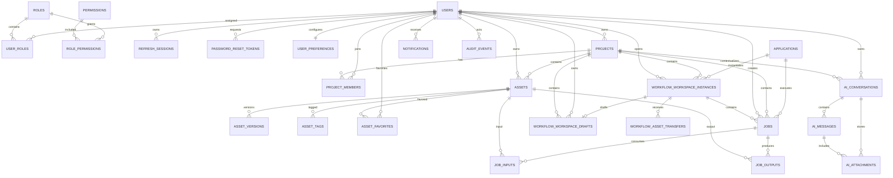

### 7.1 数据域与表

| 数据域 | PostgreSQL 表 | 说明 |
| --- | --- | --- |
| 身份权限 | `users`、`roles`、`permissions`、`user_roles`、`role_permissions`、`password_reset_tokens` | 账号、`USR-*` 业务 ID、企业邮箱、密码散列、角色、权限码和一次性重置令牌摘要 |
| 会话偏好 | `refresh_sessions`、`user_preferences` | 刷新令牌哈希、当前项目、提醒偏好 |
| 项目 | `projects`、`project_members`、`project_user_pins` | `CR-*` 项目元数据、owner/editor/viewer 成员关系、用户级置顶，以及 `archived_at/archived_by` 项目软删除记录 |
| 资产 | `assets`、`asset_versions`、`asset_tags`、`asset_favorites`、`asset_folders` | `AST-*` 统一资产、成员归属、版本、来源、标签、个人收藏软链接和多级普通目录；收藏系统目录不写入 `assets.folder_id` |
| 项目设计与应用任务 | `design_conversations`、`design_conversation_drafts`、`design_prompt_template_catalogs`、`applications`、`jobs`、`job_inputs`、`job_outputs` | 用户项目设计会话、会话内多应用草稿、管理员维护的模式提示词目录、`TSK-*` 任务参数、`design_mode`、成员归属、软归档、状态、输入输出与资产血缘；`job_inputs.asset_id` 始终是适配器消费的原始输入，可选 `annotation_asset_id` 只登记用户可见的分区标记快照 |
| 管理员调试兼容 | `workflow_workspace_instances`、`workflow_workspace_drafts`、`workflow_asset_transfers` | 单能力调试实例及旧精确流转；不再作为普通用户主交互模型 |
| 运营记录 | `notifications`、`audit_events` | 站内消息；操作人快照、请求路径、状态、耗时、IP 和可追踪业务事件 |
| AI 助手 | `ai_conversations`、`ai_messages`、`ai_attachments` | 用户私有会话、消息、上游错误/消息编号和附件对象元数据 |

### 7.2 多模态存储策略

| 内容 | 存储位置 | 数据库保存内容 |
| --- | --- | --- |
| 用户、权限、项目、任务等结构化数据 | PostgreSQL | 完整业务字段和关系 |
| 小文本资产 | PostgreSQL `asset_versions.text_content` | 正文、MIME、大小、SHA-256、版本 |
| 图片、视频、音频、文档、3D、模型和压缩包 | MinIO/S3 私有桶 | 对象键、MIME、文件名、大小、ETag、版本和来源；遮罩图片版本元数据额外登记 `derivedFromAssetId` 原始底图血缘 |
| AI 对话正文 | PostgreSQL `ai_messages.content` | 角色、正文、状态、错误码、外部消息编号和时间 |
| AI 对话附件 | MinIO/S3 私有桶 `assistant/` 前缀 | 对象键、原文件名、MIME、大小、状态和所属消息 |
| 页面临时状态 | Pinia/内存 | 当前项目、列表和交互状态，不作为业务真值 |
| 第三方地址与密钥 | 后续后端适配器配置 | 不进入浏览器；生产环境应使用密钥管理系统 |

默认限制为单个对象文件 2 GiB、小文本 5 MiB，可通过环境变量调整。

## 8. 核心数据流

### 8.1 登录、鉴权与刷新

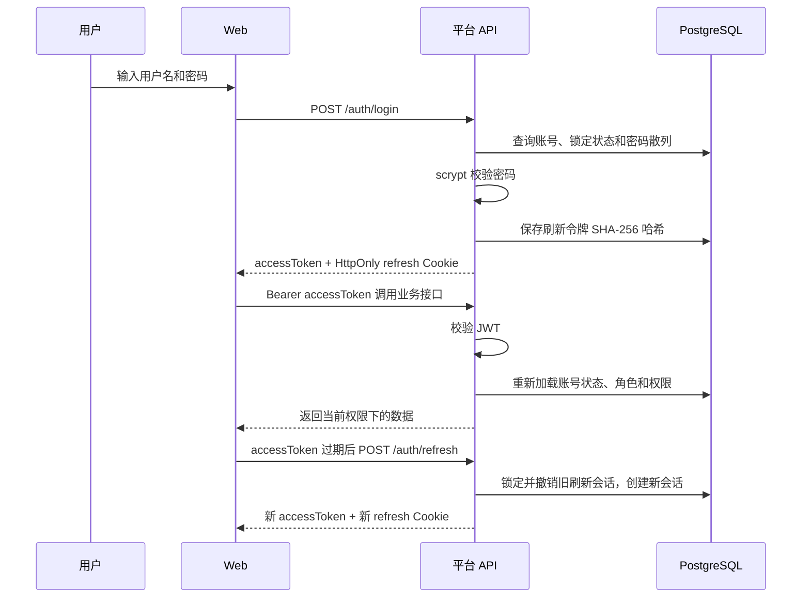

JWT 中的角色不是最终授权依据。每次受保护请求都会根据用户编号从数据库重新加载账号状态、角色和权限，因此停用账号或调整角色能够影响后续请求。

连续登录失败 5 次会触发 15 分钟临时锁定。修改密码或通过邮箱成功重置密码都会撤销该用户的全部刷新会话。

### 8.2 企业邮箱密码重置

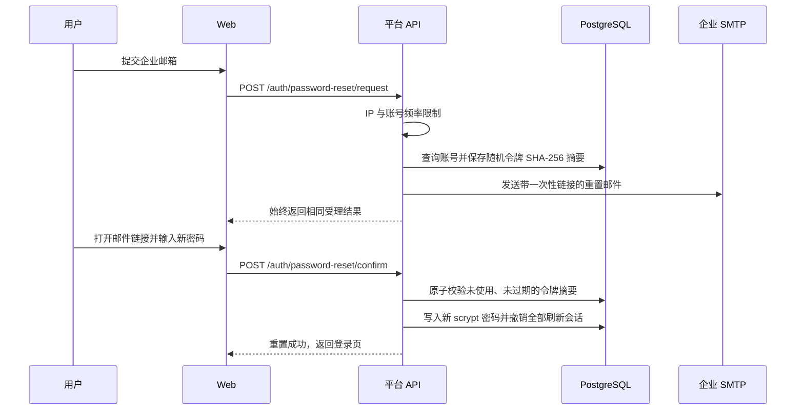

原始重置令牌只出现在用户收到的 HTTPS 链接中，数据库只保存 SHA-256 摘要；令牌默认 30 分钟有效且只能消费一次。申请接口不会根据邮箱是否存在返回不同文案，避免账号枚举。SMTP 密钥只在平台 API 环境变量中配置，不进入 Web 构建产物。

### 8.3 平台初始化与项目切换

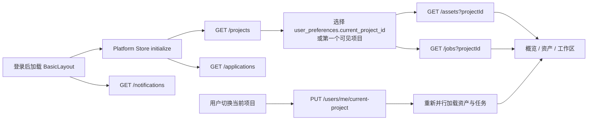

项目编号由 PostgreSQL 序列生成。创建项目时，当前用户同时成为项目 owner，且该项目会写入用户的当前项目偏好。

### 8.4 文件资产上传、预览和下载

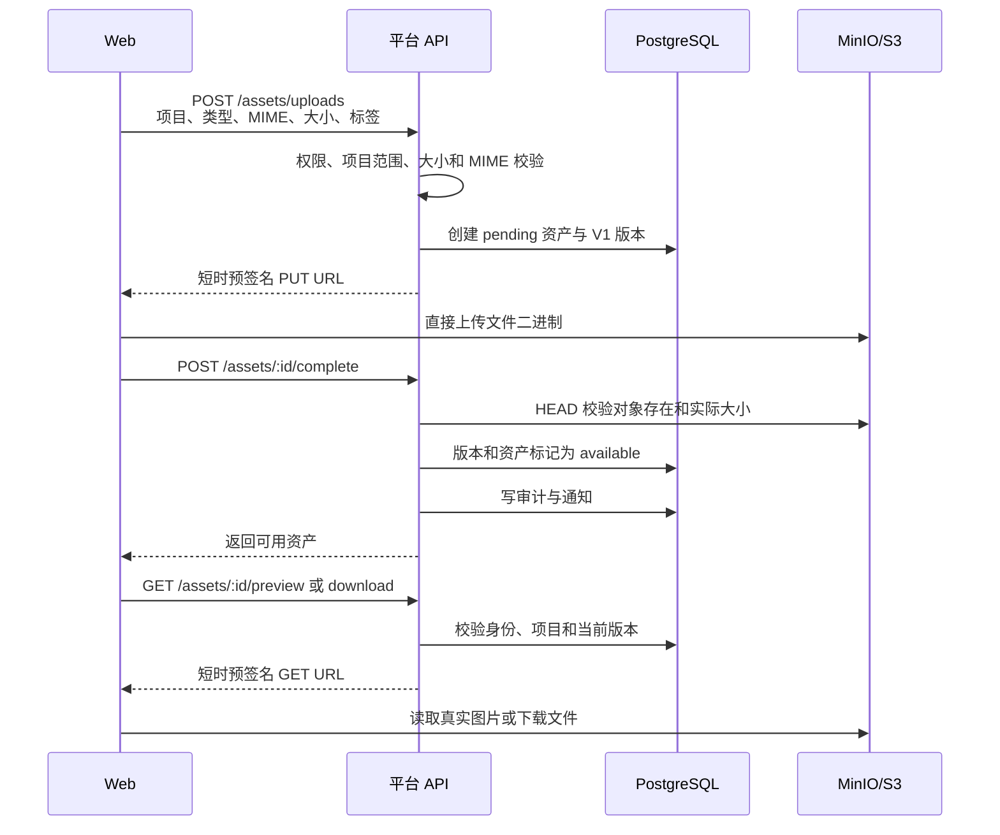

这种设计让大文件不经过 Nitro API 内存，同时对象桶保持私有。文本资产走 `/assets/text`，直接写入 PostgreSQL，不经过 MinIO。

### 8.5 应用任务与外部能力边界

当前真实流程如下：

```mermaid
flowchart LR
  Work["项目设计会话<br/>conversationId + appKey + assetIds + 参数"] --> JobAPI["POST /jobs"]
  JobAPI --> Verify["校验权限、项目范围、能力绑定<br/>参数和输入资产契约"]
  Verify --> Config{"ComfyUI 适配器可用?"}
  Config -->|"否"| Failed["写入 failed 任务<br/>稳定错误码"]
  Failed --> Notice["写入通知和审计"]
  Notice --> UI["任务中心显示真实失败记录"]
  Config -->|"是"| Queued["写入 queued 任务<br/>创建 job_execution"]
  Queued --> Worker["独立 Worker 租约并执行"]
  Worker --> Inputs["从对象存储读取资产<br/>上传 ComfyUI 输入目录"]
  Inputs --> Adapter["按版本映射注入工作流 JSON"]
  Adapter --> External["ComfyUI /prompt、/history、/view"]
  External --> Output["更新任务 + 暂存输出 + job_outputs"]
  Output --> Choice{"用户选择"}
  Choice -->|"加入资产"| Asset["进入资产中心"]
  Choice -->|"选择目录加入资产并深化设计"| Asset
  Choice -->|"仅查看"| Notice
  Asset --> Transfer["当前会话选择目标应用与语义输入位"]
  Asset --> Notice
  Transfer --> Notice
```

因此，当前系统已具备工作流注册、能力绑定、项目设计会话、持久化任务、独立 Worker、输入资产上传、结果暂存、用户确认保存和会话内跨应用复用的闭环。一个设计会话可包含不同 `app_key` 的多个轮次，`jobs.design_conversation_id` 是普通用户时间线归属；事务 advisory lock 保证同一会话只有一个活动任务，不同会话可以并行。暂存结果仍受项目权限约束并保留任务血缘，但不会自动污染资产中心。未配置或无法访问 ComfyUI 时必须明确失败，不会伪造成功结果。

后续适配器应只接收平台语义数据：

```ts
interface CapabilityAdapter {
  cancel(externalJobId: string): Promise<void>;
  getStatus(externalJobId: string): Promise<CapabilityExecutionSnapshot>;
  submit(input: {
    assetIds: string[];
    parameters: Record<string, unknown>;
    projectId: string;
  }): Promise<{ externalJobId: string }>;
}
```

适配器输出必须先写入 MinIO/S3，再登记为 `source = 'workflow'` 的项目资产，并通过 `job_outputs` 建立来源关系。浏览器不应获得第三方密钥或直接访问第三方工作流管理接口。

### 8.6 LoRA 训练数据流

`POST /api/v1/lora/trainings` 是 LoRA 的稳定业务入口。浏览器只提交当前项目图片 ID、逐图 caption 和 Repeat、Epoch、rank、学习率、分辨率、触发词、预览提示词等白名单字段，不接收训练服务器路径或完整 `job_config`。

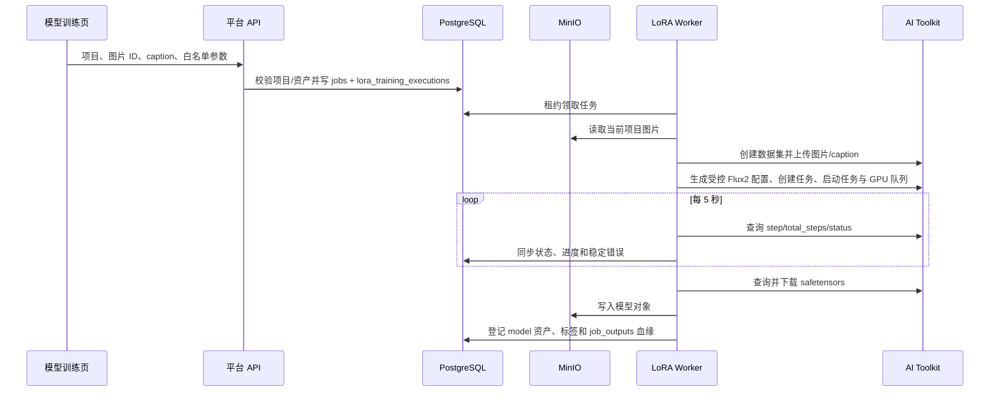

`lora_artifact_receipts` 以外部绝对路径做内部幂等键；该路径、AI Toolkit Token 和公开下载路由都不会返回浏览器。模型和 VAE 路径来自服务端环境配置，默认值与已验证的 `flux2_klein_9b_interior_lora.yaml` 一致。任务取消由 Worker 调用 AI Toolkit 停止接口，训练已完成与取消并发时优先完成产物登记。

### 8.7 AI 助手数据流与隔离

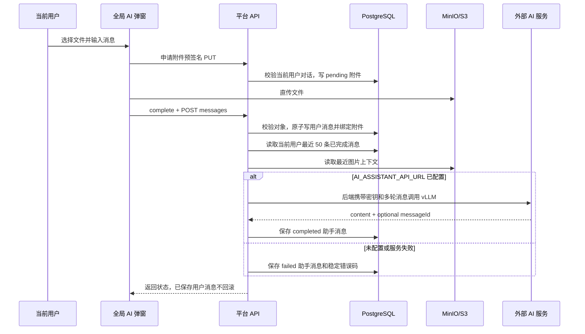

会话、消息、上传、预览、下载和清空接口全部以当前访问令牌中的用户编号重新查询数据库。用户猜测他人 UUID 时得到 404，管理员也没有聊天正文特权。清空对话先删除数据库关系，再尽力删除对应对象文件，对象清理失败会写入审计元数据。

### 8.7 操作日志与审计可见范围

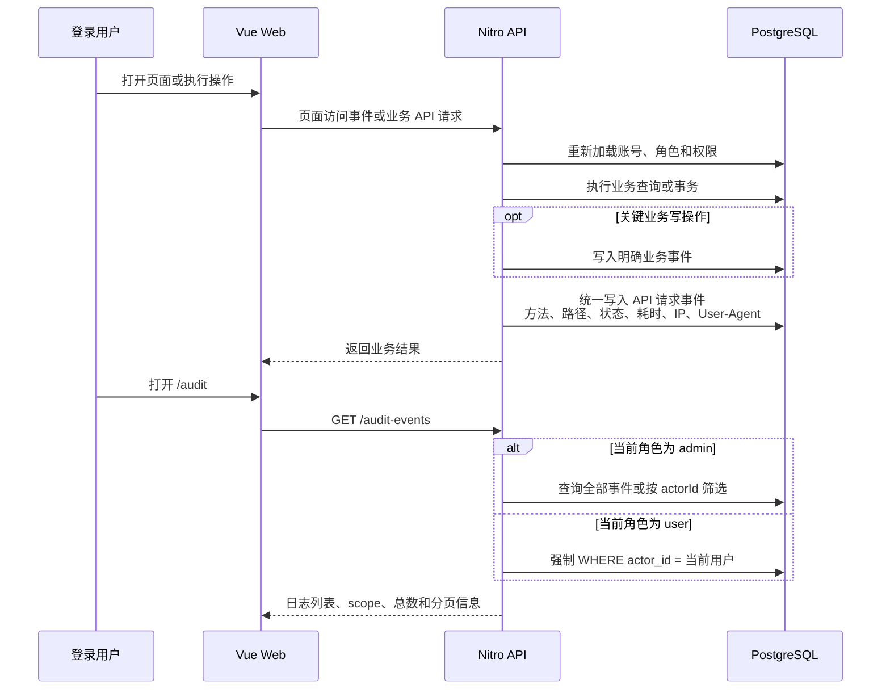

`audit_events` 同时保存 `actor_id` 和操作发生时的 `actor_username`、`actor_real_name`、`actor_roles` 快照。账号删除时外键会把 `actor_id` 置空，但快照继续保留，因此历史日志不会失去操作者名称；临时或多个管理员也能通过不同用户名与管理员角色快照进行区分。

统一响应层为每个已认证 API 请求写入 `api.request`，前端路由守卫为页面切换写入 `page.view`，关键写接口再记录更具体的业务动作。认证失败和无法归属账号的维护动作使用匿名或系统事件。日志只记录必要元数据和经过选择的业务详情，不保存密码、访问/刷新令牌、完整请求体、键盘输入、文件正文或原始二进制。

## 9. 权限模型

### 9.1 平台角色

系统只允许两类平台角色，每个账号必须且只能分配一个角色：

| 角色 | 平台权限 | 数据范围 | 特殊限制 |
| --- | --- | --- | --- |
| `admin` | 用户、角色、项目、资产、任务和日志等全部平台权限 | 全部未归档项目；全部操作日志 | 不能修改自身角色或状态；不能降级或停用最后一名启用管理员 |
| `user` | 项目、资产、任务读写；查看自身操作日志 | 仅参与项目；仅自身日志 | 不能进入用户与权限管理，也不能调用用户/角色写接口 |

### 9.2 项目角色

| 项目角色 | 项目读取 | 资产/任务写入                  |
| -------- | -------- | ------------------------------ |
| `owner`  | 允许     | 允许                           |
| `editor` | 允许     | 允许                           |
| `viewer` | 允许     | 拒绝，返回 `PROJECT_READ_ONLY` |

前端路由的 `authority` 只决定菜单和页面入口。API 的 `requirePermission` 与 `requireProjectAccess` 才是安全边界。

## 10. 目录和依赖边界

```text
rail-cabin-design-platform/
├── apps/
│   ├── web-antd/                       # 实际 Web 应用
│   │   └── src/
│   │       ├── api/                    # 请求客户端与平台 API SDK
│   │       ├── layouts/basic.vue       # 固定外壳、项目切换、通知、退出
│   │       ├── modules/platform/       # 平台领域 TypeScript 类型
│   │       ├── router/routes/modules/  # 平台路由与前端角色入口
│   │       ├── store/                  # Auth Store 与 Platform Store
│   │       ├── styles/platform.css     # 平台品牌令牌
│   │       └── views/                  # 认证、个人中心和平台页面
│   └── platform-api/                   # 独立平台 API
│       ├── api/v1/                     # Nitro 文件式 REST 路由
│       ├── middleware/                 # Request ID 等横切逻辑
│       ├── migrations/                 # PostgreSQL 增量迁移
│       ├── scripts/                    # migrate / seed / reset-users
│       └── utils/                      # 兼容导出层与分层共享实现
│           ├── domain/                 # 资产、项目、AI、审计、通知、能力契约
│           ├── identity/               # 身份、角色、密码、令牌、会话
│           ├── http/                   # Cookie、请求、校验、响应与错误
│           └── infrastructure/         # 配置、数据库、对象存储、邮件、健康检查
├── packages/                           # Vben 通用 UI、布局、Store、Request 等包
├── internal/                           # Vite、TypeScript、Lint 等仓库工具链
├── deploy/rail-platform/compose.yaml   # PostgreSQL + MinIO + 开发 Mailpit
└── docs/rail-platform/                 # 架构、复现和开发记录
```

依赖方向应保持单向：

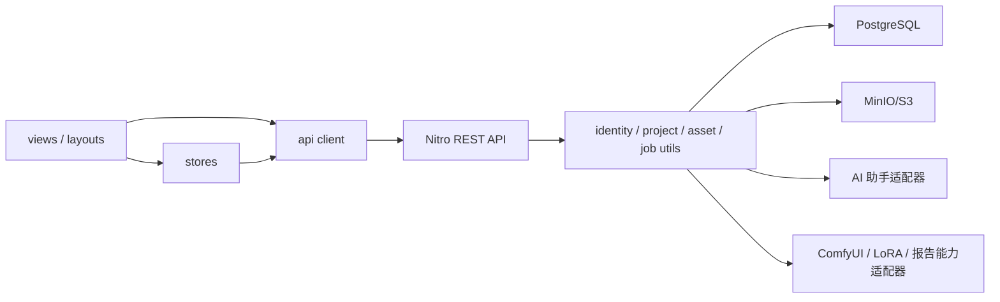

## 11. 当前完成度与明确缺口

### 已经可真实使用

- 用户注册、用户名密码登录、企业邮箱找回密码、令牌刷新、退出和登录失败锁定。
- 用户资料、密码、提醒偏好、用户状态、角色和权限保护。
- 创建、查看和切换项目；项目级数据范围检查。
- 图片、视频、音频、文本、文档、3D 模型、模型文件和压缩包 8 类统一文件资产与真实对象存储。
- 文件直传、文本入库、版本 API、收藏、下载和图片预览。
- 项目“开始设计”、多应用会话时间线、按成员管理的任务台账、通知和审计。
- 全局 AI 设计助手：按用户隔离的会话历史、文本、图片/音视频/文档附件、预览下载、清空、外部 API 转发与失败留痕。
- 报告生成：结构化章节与项目 PNG/JPEG 资产输入、模板/AI 双适配器路由、持久化 Worker、DOCX/PPTX/Markdown 输出、任务取消，以及 `document`/`text` 资产回流。外部 `generate-file` 地址只存在于平台 API/Worker 配置中。
- PostgreSQL/MinIO 数据持久化、SMTP 邮件投递、迁移、种子、测试和生产构建。

### 已预留但尚未完成

- AI 助手的具体内网模型服务需部署时配置；平台端转发适配器已完成。
- 除 ComfyUI、AI Toolkit LoRA、内置 OOXML 报告和外部 AI 报告外的其他任务型能力适配器。
- ComfyUI 目标服务的真实 GPU、模型、自定义节点和效果验收。
- 项目成员移除和角色调整；成员查看及创建者/管理员按用户 ID 邀请已经完成，项目归档已经支持软删除。
- 管理员创建用户、应用配置/发布管理页面。
- 资产版本 API 已存在，但前端尚未提供版本历史和上传新版本界面；任务取消 API 已存在，但任务中心尚未接取消按钮。
- 大数据量列表的服务端分页、缩略图派生、病毒扫描、对象生命周期和配额管理。
- Web/API 的正式容器镜像、反向代理、TLS、集中日志、指标、告警、备份和恢复演练。

### 当前重构兼容边界

- `apps/platform-api/utils` 根目录的同名文件是兼容导出层，保留现有 API 路由、脚本和 Nitro 自动导入稳定；新增实现必须进入 `domain`、`identity`、`http` 或 `infrastructure`。
- `apps/web-antd/src/api/platform/index.ts` 与 `modules/platform/types.ts` 是领域统一导出入口，具体实现和类型按领域拆分。
- 原始模板的 Dashboard、Demos、其他 Web 变体、Mock 服务、文档站和发布设施已经在引用、类型、测试与构建验证后删除；生产动态页面扫描只覆盖平台业务与个人中心。

## 12. 新模块接入原则

后续接入任何外部能力时，应遵守以下边界：

1. 平台先创建任务，适配器不能绕开项目和权限体系自行创建用户可见数据。
2. 浏览器只提交 `projectId`、`assetIds` 和业务参数，不提交服务密钥或底层工作流地址。
3. 适配器通过平台受控方式读取输入资产。
4. 外部结果先进入对象存储和任务暂存区，只有用户确认登记为项目资产后才可跨工作流复用；“加入资产并流转”也必须是一次显式用户确认。
5. 任务、输入资产、输出资产和外部任务编号必须能够互相追溯。
6. 状态更新、取消、失败和重试都必须写审计，必要时生成站内通知。
7. 新能力不能直接修改 Web 固定外壳，只能提供应用定义、参数 Schema、适配器和结果呈现组件。

## ComfyUI 工作流执行子系统（2026-08-08）

ComfyUI 采用“平台 API 创建持久化任务、独立 Worker 执行、输入资产受控上传、输出登记为项目资产”的接入方式。浏览器不直接访问 ComfyUI。工作流定义与版本、能力绑定、任务执行、输出回执、租约和 Worker 心跳保存在 PostgreSQL；输入与输出文件保存在 MinIO/S3 私有桶。

完整架构图、数据关系图、状态机和代码目录映射见 [COMFYUI_WORKFLOW_INTEGRATION.md](./COMFYUI_WORKFLOW_INTEGRATION.md)。当前能力目录包含 18 项独立工作流，真实服务联调和微调见 [COMFYUI_LIVE_SERVICE_HANDOFF.md](./COMFYUI_LIVE_SERVICE_HANDOFF.md)。
