# 当前系统架构说明

## 统一图标语义层（2026-10-08）

- Web 的业务实体、八类文件、动作/状态分别集中在 `semantic-icons.ts`、`asset-types.ts`、`ui-icons.ts`；业务页、路由和结果工具引用映射，不各自写图标字符串。遮罩工具保留原 ComfyUI 图形并集中注册为 `rail:mask`，工具按钮不再维护重复 SVG。
- `getApplicationsApi` 在读取真实应用数据后，用 `capability-icons.ts` 按稳定功能代码归一化显示图标，兼容数据库中旧图标；不改写后端配置、JSON、发布版本、绑定或任何权限。未知功能只使用本地登记图形，无法识别时显示应用图标。
- 共享外壳的刷新、重置、全屏、成功和首页图形与业务页一致；共享包不能反向依赖 Web，因此仍通过同名 Lucide 组件/内部常量渲染，测试约束两者一致。品牌 Logo、曲线和场景示意图不视为动作 icon。
- 完整含义和引用位置见 [ICON_CATALOG.md](ICON_CATALOG.md)，由 `scripts/platform-icon-catalog.mjs` 扫描生成。图标变更只更新 Web，无数据库迁移、API/Worker 重启或 Docker 名称变动。

## 工作流 API JSON 只读查看与导出（2026-10-08）

- 编辑弹窗下方使用 `workflow-json-viewer.vue`，复用 `GET /workflow-management` 返回的 `versions[].apiJson`、版本号和 `activeCapabilities`，仍由 `platform:workflow:read` 服务端权限保护；普通用户不能读取原始工作流。没有新增接口、权限、数据库迁移或文件读取旁路。
- 按版本号降序显示已有版本；唯一绑定版本优先选中，否则显示最新版本。每个版本独立显示绑定功能，名称来自同一管理响应，未知代码原样显示。标签说明最新版本不一定是执行版本、绑定不保证服务可执行，不改变现有发布/绑定逻辑。
- JSON 使用 Vue 文本插值在可滚动 `pre/code` 中展示，不解析为 HTML、不提供编辑；复制复用共享剪贴板工具，下载仅导出所选 `apiJson` 的 UTF-8 JSON，文件名为 `code-vN.json`。Blob URL 延迟撤销并清理临时链接，失败有明确提示。不导出参数映射、模型依赖等平台封装，不把原始 JSON 写入审计日志。
- 版本选择、展开/收起、复制和下载不调用任何更新接口，不改动编辑器未保存的名称/说明。注册新工作流仍使用原有表单，编辑已有工作流不恢复新增版本入口。部署只更新 Web 产物。

## 工作流注册信息编辑（2026-10-08）

管理页行操作使用“编辑”替代“新增版本”，只提交 `name` 与 `description`。复用有 `platform:workflow:write` 鉴权和审计的 `PUT /workflow-management/:id`；`status` 改为可选，未提供时 SQL 保留数据库当前状态，避免打开弹窗后覆盖其他管理员的状态修改。既有发布/停用操作继续显式提交 status。

中文名称为 `workflow_definitions.name`，标识为稳定的 `workflow_definitions.code`，JSON 文件名是初始化目录的文件名，三者不是同一个字段。编辑不修改 capabilities/applications 的功能名称，不改变 `workflow_versions`、参数/输出映射、模型依赖、任务快照、API 原文件或功能绑定。既有版本接口保留兼容，但页面不再提供新增版本入口。目录初始化仅为新工作流写入默认名称/说明/发布状态，已有定义保留管理员维护值；受控版本导入与初始化绑定逻辑仍沿用原有流程，本轮没有修改文生图绑定行为。

## 生成资产命名（2026-10-08）

- ComfyUI、LoRA 与报告 Worker 在资产登记事务中调用 `utils/domain/assets/generated-names.ts`；`assets.name` 和 `asset_versions.original_filename` 初始一致，分别服务展示与下载，不修改对象键。上游原文件名保留在版本 metadata/执行回执中；报告正文标题保持用户填写的内容。
- 格式为 `DSC-00000125-YYYYMMDD-001.ext`。命名读取任务关联设计会话的持久化 `public_id`，不直接显示内部 UUID；专属训练/报告及旧调试链路没有设计会话时读取已有实例的 INS 编号，不伪造 DSC 会话。分配器保留任务 TSK 编号的防御性兜底，但当前数据库约束要求任务存在会话或实例，正常链路不会走该分支。日期由数据库按北京时间分配；同上下文同日所有输出类型共享序号，超过 999 不截断。
- `generated_asset_name_counters` 持久化分配序号，主键为上下文/日期；原子 UPSERT 支持并发和 Worker 重启，资产登记失败时序号一起回滚。保留计数行防止删除资产后重用号码；回执成功路径和报告已有版本路径不重新分配。
- 迁移 037 对实际 `job_outputs` 的 workflow 资产按创建时间、任务时间、输出位置、资产 UUID 稳定排序回填，含已保存、暂存与软删除记录。只改名称，保留 ID、版本、对象内容、权限、目录、标签、状态与血缘。上传及无任务输出关联的用户复制件不受影响；`generated_asset_name_history` 保存原名称与全部版本原文件名用于恢复。
- 后续迁移 039 在 038 业务编号层之上，仅替换真实任务输出名称/各版本下载名中与其来源上下文吻合的自动 UUID 前缀；日期、序号、扩展名、计数器键与高水位不变。手动名称分别独立保留，不强制覆盖；新增 `generated_asset_business_name_history` 保存升级前后名称与版本快照，不改写 037 备份、版本 metadata 或外部回执。
- 前端继续使用真实资产 API，不在浏览器计算序号或伪造名称。手动重命名仍沿用既有接口；统一规则是自动登记及本次历史回填的默认名称，不覆盖用户日后修改。

> 2026-09-23 根 Compose 已采用 `rail-platform:1.0.0`：Web、API、Worker 合入一个业务镜像和一个 `rail-platform-1` 容器，以非 root 用户通过 Supervisor 运行；PostgreSQL、MinIO 和邮件沙箱为独立基础设施容器。推理/训练服务仍独立，平台无需 CUDA 或模型挂载。子项目隔离验证入口见 [部署说明](../../deploy/single-image/README.md)。

> 2026-09-08 跨项目现状核对：见 [开发机整体架构梳理](SYSTEM_ARCHITECTURE_OVERVIEW.md)。该文档补充 Presenton 与共享 vLLM 的实现归属、运行状态以及已知报告契约差异；以下历史验收与能力描述不代表当前服务全部在线。

> 更新时间：2026-08-08。本文以当前仓库代码、数据库迁移和部署配置为准，不把模拟协议测试描述成真实 GPU 推理已验证。

当前项目已经从纯前端演示升级为可持久化的平台框架。登录、用户、权限、项目、资产、任务、通知、审计和 AI 助手会话使用真实 API、PostgreSQL 和 MinIO。2026-10-08 起取消企业邮箱找回密码，注册、资料及管理员新增账号不采集邮箱，不再依赖 SMTP。ComfyUI 已实现 18 项工作流目录、能力映射、独立 Worker、媒体输入和图片/文本/3D 输出登记；本机 18 项能力已完成真实 ComfyUI GPU 推理验收，其他部署环境仍需按服务、模型和自定义节点版本独立预检。

2026-10-08 编号层：内部主键/外键继续 UUID；15 类业务实体统一持久化 `public_id`，输出 `publicId`，类型前缀＋至少 8 位流水号，不加 RAIL。项目 `code` 为兼容别名；历史用户/项目编号进入 `business_id_aliases`，所有解析仍受原权限约束。见 [统一业务编号](BUSINESS_IDS.md)。

## 1. 核心架构结论

系统采用“稳定平台框架 + 可替换能力适配器”的分层架构：

- 平台框架保持稳定：用户身份、项目上下文、资产、任务、通知、审计、导航和固定工作区。
- 外部能力独立变化：厂商地址、密钥、工作流编号、模型参数和状态协议只应进入后端适配器。
- 项目是数据隔离边界：普通用户只能访问自己参与的项目。
- 资产是跨能力交换协议：某个能力的输出登记为项目资产后，可以被同一项目中的其他能力继续使用。
- 关系数据与大文件分离：PostgreSQL 保存业务关系和文件元数据，MinIO/S3 保存图片、视频、音频、模型和报告等二进制内容。
- 前后端双重权限校验：前端负责菜单和交互可见性，后端负责最终身份、权限和项目数据范围校验。
- 首页使用 `/dashboard` 汇总与 `/design-conversations` 会话查询：聚合结果只返回当前账号可访问的最近任务和八类生成资产；图片预览只返回资产 ID，浏览器仍通过受控预览接口获取短时 URL，其他资产使用集中定义的类型图标；训练与报告是固定平台外壳下的专属页面，执行器未配置前不创建任务。

## 2. 总体架构图

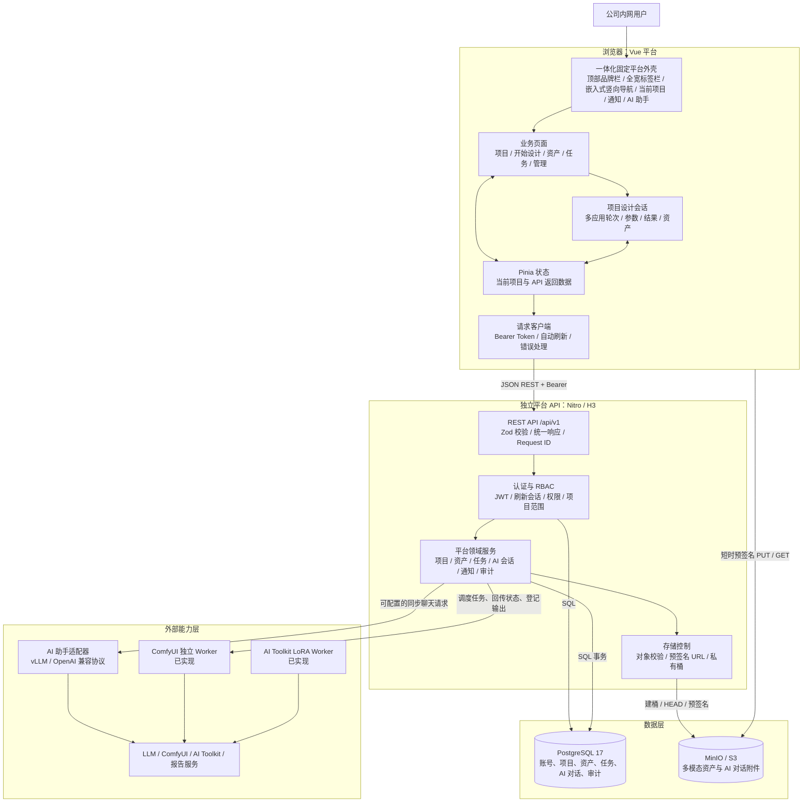
```mermaid
flowchart TB
  User["公司内网用户"] --> Shell

  subgraph Browser["浏览器：Vue 平台"]
    Shell["一体化固定平台外壳<br/>顶部品牌栏 / 全宽标签栏 / 嵌入式竖向导航 / 当前项目 / 通知 / AI 助手"]
    Pages["业务页面<br/>项目 / 开始设计 / 资产 / 任务 / 管理"]
    Workspace["项目设计会话<br/>多应用轮次 / 参数 / 结果 / 资产"]
    Store["Pinia 状态<br/>当前项目与 API 返回数据"]
    Client["请求客户端<br/>Bearer Token / 自动刷新 / 错误处理"]

    Shell --> Pages
    Pages --> Workspace
    Pages <--> Store
    Workspace <--> Store
    Store --> Client
  end

  subgraph PlatformAPI["独立平台 API：Nitro / H3"]
    Gateway["REST API /api/v1<br/>Zod 校验 / 统一响应 / Request ID"]
    Identity["认证与 RBAC<br/>JWT / 刷新会话 / 权限 / 项目范围"]
    Domains["平台领域服务<br/>项目 / 资产 / 任务 / AI 会话 / 通知 / 审计"]
    StorageControl["存储控制<br/>对象校验 / 预签名 URL / 私有桶"]

    Gateway --> Identity
    Identity --> Domains
    Domains --> StorageControl
  end

  Client -->|"JSON REST + Bearer"| Gateway

  subgraph Data["数据层"]
    PG[("PostgreSQL 17<br/>账号、项目、资产、任务、AI 对话、审计")]
    S3[("MinIO / S3<br/>多模态资产与 AI 对话附件")]
  end

  Identity -->|"SQL"| PG
  Domains -->|"SQL 事务"| PG
  StorageControl -->|"建桶 / HEAD / 预签名"| S3
  Browser -->|"短时预签名 PUT / GET"| S3


  subgraph Capability["外部能力层"]
    ChatAdapter["AI 助手适配器<br/>vLLM / OpenAI 兼容协议"]
    JobAdapter["ComfyUI 独立 Worker<br/>已实现"]
    LoraAdapter["AI Toolkit LoRA Worker<br/>已实现"]
    External["LLM / ComfyUI / AI Toolkit / 报告服务"]
    ChatAdapter --> External
    JobAdapter --> External
    LoraAdapter --> External
  end

  Domains -->|"可配置的同步聊天请求"| ChatAdapter
  Domains -->|"调度任务、回传状态、登记输出"| JobAdapter
```

实线表示当前已经存在的运行链路；虚线表示已经预留数据契约，但尚未实现的能力接入链路。

## 3. 开发环境部署图

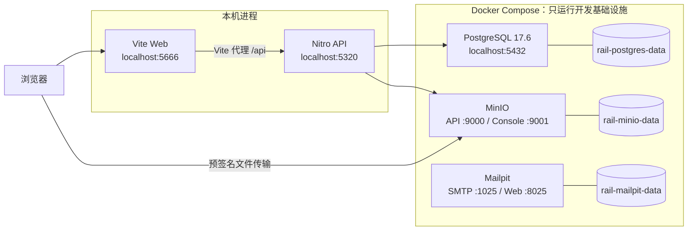
```mermaid
flowchart LR
  subgraph Host["本机进程"]
    Web["Vite Web<br/>localhost:5666"]
    API["Nitro API<br/>localhost:5320"]
  end

  subgraph Docker["Docker Compose：只运行开发基础设施"]
    PG["PostgreSQL 17.6<br/>localhost:5432"]
    MinIO["MinIO<br/>API :9000 / Console :9001"]
    Mailpit["Mailpit<br/>SMTP :1025 / Web :8025"]
    PGVolume[("rail-postgres-data")]
    S3Volume[("rail-minio-data")]
    MailVolume[("rail-mailpit-data")]
    PG --- PGVolume
    MinIO --- S3Volume
    Mailpit --- MailVolume
  end

  Browser["浏览器"] --> Web
  Web -->|"Vite 代理 /api"| API
  API --> PG
  API --> MinIO
  Browser -->|"预签名文件传输"| MinIO
```

`pnpm dev:rail` 会依次启动 Docker 基础设施、执行数据库迁移、执行幂等种子初始化，再并行启动 Web 与 API。当前 Docker 不负责运行 Web 和 API；Mailpit 为旧环境兼容保留，当前业务不再调用邮件服务，生产无需企业 SMTP。

生产环境建议把 Web 构建产物部署到静态服务器，通过反向代理将同域 `/api/v1` 转发到 Nitro API；PostgreSQL、对象存储、密钥、备份和监控由生产基础设施单独管理。

## 4. 技术栈

| 层级 | 当前技术 | 主要作用 |
| --- | --- | --- |
| Monorepo | pnpm 11、Turborepo 2 | 工作区依赖、统一脚本、并行构建 |
| Web 框架 | Vue 3、TypeScript、Vite | 单页应用、组件化页面和开发构建 |
| 管理端基础 | Vue Vben Admin 5.7 | 登录守卫、布局、标签页、权限指令、偏好和通用组件 |
| UI | Ant Design Vue、本地 Iconify Lucide 图标集、项目 SCSS/CSS | 表单、弹窗、表格、状态与轨道交通品牌视觉；运行时不依赖公网图标接口 |
| 路由与状态 | Vue Router、Pinia | 页面路由、当前项目和 API 数据状态 |
| HTTP 客户端 | Vben Request/Axios 封装 | Bearer 注入、刷新令牌、统一响应解包和错误提示 |
| 平台 API | Nitro 2、H3、TypeScript | 文件式 REST 路由、中间件和生产服务构建 |
| 输入校验 | Zod | 请求体、查询参数和表单规则校验 |
| 身份认证 | JOSE JWT、Node.js `crypto` scrypt/SHA-256 | 访问令牌、密码散列和刷新令牌哈希 |
| 数据访问 | postgres.js | PostgreSQL 参数化查询和事务 |
| 关系数据库 | PostgreSQL 17.6 | 业务数据、权限关系、会话和文件元数据 |
| 对象存储 | MinIO、AWS SDK for JavaScript v3 | S3 私有桶、预签名上传、下载和图片预览 |
| 历史开发邮件沙箱 | Mailpit | 旧 Compose 兼容保留，平台不再依赖 |
| 本地基础设施 | Docker Compose | 可复现地启动 PostgreSQL、MinIO 和 Mailpit |
| 测试与质量 | Vitest、Playwright、vue-tsc、ESLint、Oxlint、Stylelint、Oxfmt | 单元测试、浏览器验收、类型和代码质量检查 |

## 5. 前端模块

### 5.1 固定外壳与页面区域

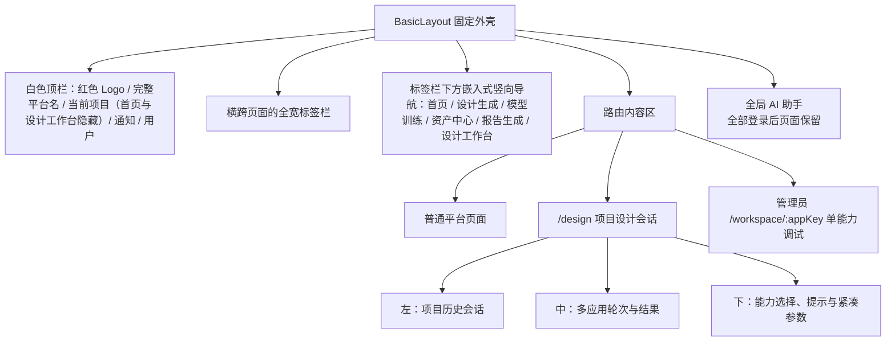
```mermaid
flowchart TB
  Layout["BasicLayout 固定外壳"]
  Layout --> Header["白色顶栏：红色 Logo / 完整平台名 / 当前项目（首页与设计工作台隐藏）/ 通知 / 用户"]
  Layout --> Tabs["横跨页面的全宽标签栏"]
  Layout --> Nav["标签栏下方嵌入式竖向导航：首页 / 设计生成 / 模型训练 / 资产中心 / 报告生成 / 设计工作台"]
  Layout --> RouteArea["路由内容区"]
  Layout --> Assistant["全局 AI 助手<br/>全部登录后页面保留"]

  RouteArea --> Normal["普通平台页面"]
  RouteArea --> DesignArea["/design 项目设计会话"]
  RouteArea --> AppArea["管理员 /workspace/:appKey 单能力调试"]

  DesignArea --> History["左：项目历史会话"]
  DesignArea --> Stage["中：多应用轮次与结果"]
  DesignArea --> Composer["下：能力选择、提示与紧凑参数"]
```

进入不同应用时，只替换路由内容区的应用定义和参数；平台导航、当前项目、资产权限、任务台账、通知和用户身份不变。这正是“平台框架与第三方 API 模块相对独立”的实现位置。

### 5.2 页面与职责

| 模块 | 页面/入口 | 实现技术 | 当前功能 | 主要数据来源 |
| --- | --- | --- | --- | --- |
| 账号认证 | `/auth/login`、`register` | Vben Auth、Vue 表单、Zod、Pinia | 用户名密码登录与无邮箱注册、协议校验、登录态恢复；旧找回页面只重定向登录 | 认证 API |
| 固定平台外壳 | `layouts/basic.vue` | Vben BasicLayout、Pinia、Ant Design Vue | 顶部品牌栏、全宽标签栏与嵌入式竖向导航、当前项目切换、通知、用户 ID/菜单、退出登录；品牌红 Logo 与完整平台名固定在白色顶栏，约 184 px 侧栏从标签栏下方开始，与内容共享画布背景且无分隔边框，并保留折叠和移动端抽屉 | 项目、通知、当前用户 API |
| 首页 | `/home`（登录默认入口） | Vue、Pinia、响应式 CSS/SVG | 参考甲方 AI 视觉稿建立项目主视觉、四项真实指标、六个业务入口和最近工作区；建筑/客室线稿由本地 SVG/CSS 绘制，不引入外部素材；最近工作只展示无图片任务列表与八类最近生成资产，直接消费 `/dashboard` 权限过滤结果并提供真实空状态；模型训练和报告使用独立禁用页面，不伪造外部成功或系统性能数据 | `/dashboard` 聚合 + 会话、资产、应用状态 API |
| 设计工作台 | `/projects`；旧 `/workspace/overview` 只重定向 | Vue、Pinia、Modal/Form、Tooltip | 由原项目空间升级：单层浅色卡片展示全部可访问项目及统计，支持搜索、排序、创建、修改、个人置顶、软删除、成员管理和项目任务入口；页面内提供平台管理与操作日志入口，用户与权限和工作流管理仅管理员可见，日志对所有账号开放但服务端强制管理员全量、普通用户仅自身 | 项目、成员、个人置顶、软归档、当前项目偏好、用户/角色、工作流与审计 API |
| 资产中心 | `/assets` | Vue、Pinia、浏览器 Fetch、Ant Design Vue | 文件/文本资产登记、业务 ID、成员筛选/排序、持久化多级文件夹、网格/列表、多选批量移动/独立复制/软删除、图片放大、详情、下载和收藏；“收藏”是按当前用户收藏关系展示的系统软链接目录，不改变原资产目录，未确认的工作流结果不进入列表 | 资产/成员/文件夹 API + PostgreSQL + MinIO/S3 |
| 设计生成 | `/design?conversationId=:id` | 平台基础布局内的 Vue 工作区、Pinia、Canvas、MediaDevices | 复用固定平台功能侧栏和顶部项目/用户设置栏，其右侧增加独立可折叠任务栏，主区固定承载结果与底部输入，形成 0820 两级侧栏结构；统一输入器通过可扩展模式目录组织客室零部件、CMF、客室效果和报告能力，三种视觉模式共享后端功能目录，分别定义占位提示、首次提示词预设、结果操作和可维护提示词模板，真实可用性仍由平台 API 决定；任务以 `design_mode` 固化提交时模式，历史轮次据此恢复专属操作；需要图片输入时按能力 Schema 的 `assetIndex` 在编辑框上方生成有序托盘，本地多选先通过既有上传链路登记为当前项目资产，资产中心多选复用项目范围校验，左右移动直接交换槽位并持久化草稿，固定 N 张由槽位数量与必填标记约束；环境更改与平面图填色复用单图编辑契约，多图融合复用三图输入契约，多角度生成复用单图契约，三维生成复用前/左/后/右四视图契约；理解、环境和复合生成入口先将素材带入编辑器，只有用户确认后才创建任务；统一资产选择器、图片/Markdown 输入、遮罩和分区编辑、对比、3D、任务状态与会话内深化设计保持原链路；多图片结果使用自适应网格和支持键盘导航的共享全屏查看器 | 设计会话、应用、能力、资产、资产目录、提示词模板、草稿、任务 API |
| 单能力调试兼容 | `/workspace/:appKey?instanceId=:id` | 隐藏管理员路由、Canvas、MediaDevices | 保留历史实例和旧精确流转链路用于兼容回溯，不在产品菜单展示 | 应用、调试实例、资产、任务 API |
| 项目任务台账 | `/jobs`（不在侧栏展示，由设计工作台项目指标进入） | Vue、Pinia、状态组件 | 显示任务业务 ID、创建成员、状态和进度；失败错误使用限长摘要并可展开完整详情；支持状态/成员/关键词筛选、排序、多选和取消选择；活动任务显示取消操作，没有执行记录的孤立任务立即转为取消，真实 Worker 任务进入取消中，终态任务才可批量软删除 | `jobs`、`job_executions`、`project_members`、`job_inputs`、`job_outputs` |
| 个人中心 | `/profile` | Vben Profile、Vue 表单、Canvas 裁剪 | 展示唯一用户 ID；姓名、部门、简介更新，无邮箱填写；真实密码修改、消息提醒偏好；角色只读；头像悬浮上传，非方图经 1:1 拖动、缩放、旋转裁剪后写入私有对象存储并刷新全局用户态 | 用户、偏好与头像对象 API |
| 用户与权限 | `/administration/access`（从设计工作台进入） | 路由角色守卫、管理员表格和弹窗 | 仅管理员可见；按字段标明姓名、用户 ID、用户名；新增账号无需邮箱，保留其他用户密码重置、状态、角色管理与角色统计 | 用户、角色 API |
| 操作日志 | `/audit`（从设计工作台进入） | Vue、Pinia、服务端分页与筛选 | 管理员查看全部账号，普通用户只查看自身；区分姓名、用户名和角色快照 | `audit_events` |
| AI 设计助手 | 全部登录后页面的右下角弹窗 | Vue Teleport、Iconify、安全 Markdown 解析、预签名上传 | 个人历史对话、名称搜索、时间排序、重命名、Markdown 回复与复制、附件、预览、下载、清空与服务状态；与项目设计会话分层但共享平台外壳 | AI 助手 API + PostgreSQL + MinIO/S3 |

前端 `usePlatformStore` 只缓存当前会话页面所需的 API 返回值，不把项目、资产或任务的业务真值写入本地静态数据。早期 `modules/platform/data.ts` 样例常量已在核心模块重构中删除，平台领域目录不再保留可被误用的运行时假数据。

## 6. 平台 API 模块

Nitro 使用文件路径生成 `/api/v1` 路由。每个业务接口一般按以下顺序执行：

1. 读取或校验身份。
2. 检查平台权限码。
3. 检查项目成员关系和项目角色。
4. 用 Zod 校验输入。
5. 在 PostgreSQL 事务中修改业务数据。
6. 必要时操作 MinIO/S3。
7. 写入业务审计和通知。
8. 统一响应层在请求结束时写入 API 请求审计。
9. 返回统一响应结构。

| API 模块 | 主要接口 | 实现技术 | 功能与数据 |
| --- | --- | --- | --- |
| 公共接口层 | 全部 `/api/v1/**`、`/health` | Nitro、H3 | CORS、Request ID、错误归一化、统一响应包 |
| 认证与会话 | `/auth/login`、`register`、`refresh`、`logout`、`codes` | JOSE、scrypt、SHA-256、HttpOnly Cookie | 登录锁定、JWT、刷新会话轮换、无邮箱注册和权限码；旧 `password-reset/**` 已移除 |
| 当前用户 | `/user/info`、`profile`、`password`、`notification-preferences` | Zod、postgres.js | 资料、密码和提醒偏好；不允许自助修改角色 |
| 项目 | `/projects`、`/projects/:id`、`/projects/:id/pin`、`/users/me/current-project` | PostgreSQL 事务、项目范围校验 | 创建与可见项目聚合查询、负责人/管理员改名、按用户独立置顶；删除时锁定项目并拒绝仍有活动任务的项目，写入 `archived_at/archived_by`，清理置顶和失效当前项目偏好但保留领域台账 |
| 资产 | `/assets`、`/asset-folders`、`/assets/batch`、`assets/:id`、`uploads`、`text`、`complete`、`favorite`、`download`、`preview`、`versions` | AWS SDK v3、预签名 URL/对象复制、PostgreSQL | 多模态资产、持久化普通目录、批量移动/独立复制/递归软删除、版本、标签、基于 `asset_favorites` 的个人收藏软链接目录、下载、预览、项目范围重命名及创建时间/名称/类型白名单排序；3D 对象通过短时地址交给共享 Three.js 查看器 |
| 应用目录 | `/applications`、`/applications/:key/visibility` | PostgreSQL JSONB、RBAC | 读取应用分类、状态和资产契约；管理员持久化控制普通用户可见性，隐藏能力的详情和任务创建由后端阻断 |
| 设计会话 | `/design-conversations` | PostgreSQL、Zod、项目与用户范围校验 | 项目内创建、列表、重命名和软删除会话；返回轮次数及活动任务状态；首次有效任务在事务内从业务文本生成限长标题，手工改名通过 `title_manually_edited` 永久阻止自动覆盖 |
| 设计草稿 | `/design-conversations/:id/drafts/:appKey` | PostgreSQL、Zod、能力契约校验 | 按设计会话和应用保存参数与精确输入位置；恢复时过滤失效、未登记或越界资产 |
| 历史单能力实例 | `/workflow-instances`、`/workflow-drafts` | PostgreSQL、Zod、项目范围校验 | 保留已有实例草稿和精确流转数据，供历史任务回溯，不对应用调试中心提供入口 |
| 任务 | `/jobs`、`/jobs/:id/cancel` | PostgreSQL、事务级 advisory lock、通知、审计 | 任务台账、参数与有序输入/输出快照、同实例活跃任务互斥、状态、取消和 ComfyUI Worker 调度 |
| 站内通知 | `/notifications/**` | PostgreSQL | 查询、已读、全部已读、单条删除和清空 |
| 用户与角色 | `/users`、`/users/:id/status`、`/users/:id/roles`、`/roles` | RBAC、事务和末位管理员保护 | 管理其他用户状态与角色、角色统计；每个账号只能分配一个角色 |
| 审计 | `/audit-events`、`/audit-events/client` | Request ID、IP、角色快照、统一响应层 | 记录 API 请求、业务事件和页面访问；管理员全量、普通用户仅自身 |
| AI 助手 | `/assistant/status`、`conversations/**`、`attachments/**` | PostgreSQL 事务、AWS SDK 预签名、Zod、可配置外部 `fetch` | 按用户隔离的会话/消息与会话重命名，附件直传、预览和下载，外部 AI 转发，清空对象清理 |

统一成功响应如下：

```json
{
  "code": 0,
  "data": {},
  "error": null,
  "message": "ok",
  "requestId": "..."
}
```

业务错误仍使用相同结构，但 `code` 变为稳定的错误码，并设置对应 HTTP 状态。

## 7. 数据模型

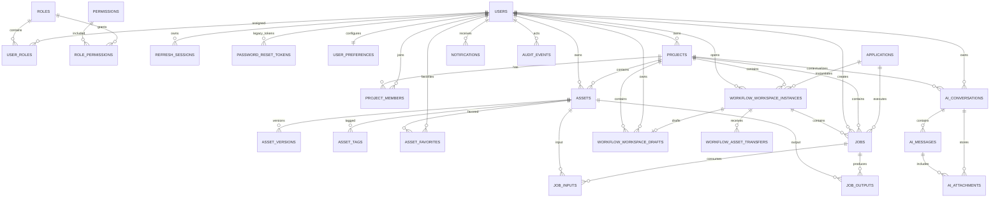
```mermaid
erDiagram
  USERS ||--o{ USER_ROLES : assigned
  ROLES ||--o{ USER_ROLES : contains
  ROLES ||--o{ ROLE_PERMISSIONS : grants
  PERMISSIONS ||--o{ ROLE_PERMISSIONS : included
  USERS ||--o{ REFRESH_SESSIONS : owns
  USERS ||--o{ PASSWORD_RESET_TOKENS : legacy_tokens
  USERS ||--|| USER_PREFERENCES : configures

  USERS ||--o{ PROJECT_MEMBERS : joins
  PROJECTS ||--o{ PROJECT_MEMBERS : has
  USERS ||--o{ PROJECTS : owns

  PROJECTS ||--o{ ASSETS : contains
  USERS ||--o{ ASSETS : owns
  ASSETS ||--o{ ASSET_VERSIONS : versions
  ASSETS ||--o{ ASSET_TAGS : tagged
  USERS ||--o{ ASSET_FAVORITES : favorites
  ASSETS ||--o{ ASSET_FAVORITES : favored

  APPLICATIONS ||--o{ JOBS : executes
  PROJECTS ||--o{ JOBS : contains
  USERS ||--o{ JOBS : creates
  APPLICATIONS ||--o{ WORKFLOW_WORKSPACE_INSTANCES : instantiates
  PROJECTS ||--o{ WORKFLOW_WORKSPACE_INSTANCES : contains
  USERS ||--o{ WORKFLOW_WORKSPACE_INSTANCES : opens
  WORKFLOW_WORKSPACE_INSTANCES ||--o{ JOBS : contains
  WORKFLOW_WORKSPACE_INSTANCES ||--o| WORKFLOW_WORKSPACE_DRAFTS : drafts
  WORKFLOW_WORKSPACE_INSTANCES ||--o{ WORKFLOW_ASSET_TRANSFERS : receives
  JOBS ||--o{ JOB_INPUTS : consumes
  ASSETS ||--o{ JOB_INPUTS : input
  JOBS ||--o{ JOB_OUTPUTS : produces
  ASSETS ||--o{ JOB_OUTPUTS : output
  USERS ||--o{ WORKFLOW_WORKSPACE_DRAFTS : owns
  PROJECTS ||--o{ WORKFLOW_WORKSPACE_DRAFTS : contains

  USERS ||--o{ NOTIFICATIONS : receives
  USERS ||--o{ AUDIT_EVENTS : acts
  USERS ||--o{ AI_CONVERSATIONS : owns
  PROJECTS ||--o{ AI_CONVERSATIONS : contextualizes
  AI_CONVERSATIONS ||--o{ AI_MESSAGES : contains
  AI_CONVERSATIONS ||--o{ AI_ATTACHMENTS : stores
  AI_MESSAGES ||--o{ AI_ATTACHMENTS : includes
```

### 7.1 数据域与表

| 数据域 | PostgreSQL 表 | 说明 |
| --- | --- | --- |
| 身份权限 | `users`、`roles`、`permissions`、`user_roles`、`role_permissions`、`password_reset_tokens` | 账号、`USR-*` 业务 ID、密码散列、角色、权限码；邮箱列与历史重置令牌表仅保留兼容数据，无新邮件重置写入 |
| 会话偏好 | `refresh_sessions`、`user_preferences` | 刷新令牌哈希、当前项目、提醒偏好 |
| 项目 | `projects`、`project_members`、`project_user_pins` | `PRJ-*` 项目元数据、owner/editor/viewer 成员关系、用户级置顶，以及 `archived_at/archived_by` 项目软删除记录 |
| 资产 | `assets`、`asset_versions`、`asset_tags`、`asset_favorites`、`asset_folders` | `AST-*` 统一资产、成员归属、版本、来源、标签、个人收藏软链接和多级普通目录；收藏系统目录不写入 `assets.folder_id` |
| 项目设计与应用任务 | `design_conversations`、`design_conversation_drafts`、`design_prompt_template_catalogs`、`applications`、`jobs`、`job_inputs`、`job_outputs` | 用户项目设计会话、会话内多应用草稿、管理员维护的模式提示词目录、`TSK-*` 任务参数、`design_mode`、成员归属、软归档、状态、输入输出与资产血缘；`job_inputs.asset_id` 始终是适配器消费的原始输入，可选 `annotation_asset_id` 只登记用户可见的分区标记快照 |
| 管理员调试兼容 | `workflow_workspace_instances`、`workflow_workspace_drafts`、`workflow_asset_transfers` | 单能力调试实例及旧精确流转；不再作为普通用户主交互模型 |
| 运营记录 | `notifications`、`audit_events` | 站内消息；操作人快照、请求路径、状态、耗时、IP 和可追踪业务事件 |
| AI 助手 | `ai_conversations`、`ai_messages`、`ai_attachments` | 用户私有会话、消息、上游错误/消息编号和附件对象元数据 |

### 7.2 多模态存储策略

| 内容 | 存储位置 | 数据库保存内容 |
| --- | --- | --- |
| 用户、权限、项目、任务等结构化数据 | PostgreSQL | 完整业务字段和关系 |
| 小文本资产 | PostgreSQL `asset_versions.text_content` | 正文、MIME、大小、SHA-256、版本 |
| 图片、视频、音频、文档、3D、模型和压缩包 | MinIO/S3 私有桶 | 对象键、MIME、文件名、大小、ETag、版本和来源；遮罩图片版本元数据额外登记 `derivedFromAssetId` 原始底图血缘 |
| AI 对话正文 | PostgreSQL `ai_messages.content` | 角色、正文、状态、错误码、外部消息编号和时间 |
| AI 对话附件 | MinIO/S3 私有桶 `assistant/` 前缀 | 对象键、原文件名、MIME、大小、状态和所属消息 |
| 页面临时状态 | Pinia/内存 | 当前项目、列表和交互状态，不作为业务真值 |
| 第三方地址与密钥 | 后续后端适配器配置 | 不进入浏览器；生产环境应使用密钥管理系统 |

默认限制为单个对象文件 2 GiB、小文本 5 MiB，可通过环境变量调整。

## 8. 核心数据流

### 8.1 登录、鉴权与刷新

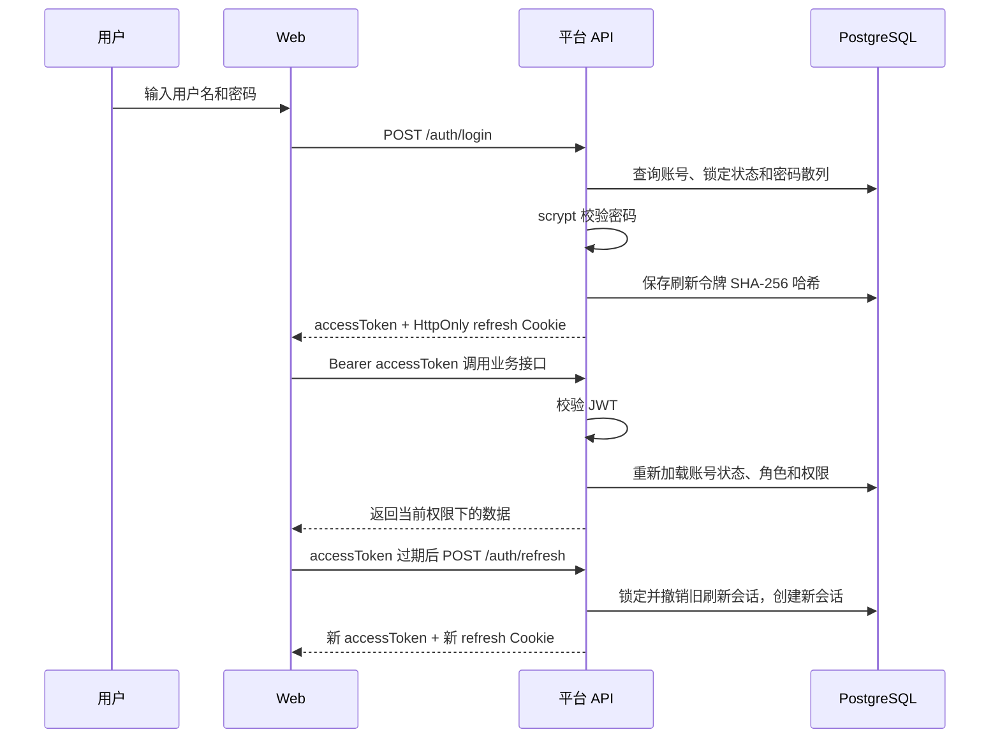
```mermaid
sequenceDiagram
  participant U as 用户
  participant W as Web
  participant A as 平台 API
  participant D as PostgreSQL

  U->>W: 输入用户名和密码
  W->>A: POST /auth/login
  A->>D: 查询账号、锁定状态和密码散列
  A->>A: scrypt 校验密码
  A->>D: 保存刷新令牌 SHA-256 哈希
  A-->>W: accessToken + HttpOnly refresh Cookie

  W->>A: Bearer accessToken 调用业务接口
  A->>A: 校验 JWT
  A->>D: 重新加载账号状态、角色和权限
  A-->>W: 返回当前权限下的数据

  W->>A: accessToken 过期后 POST /auth/refresh
  A->>D: 锁定并撤销旧刷新会话，创建新会话
  A-->>W: 新 accessToken + 新 refresh Cookie
```

JWT 中的角色不是最终授权依据。每次受保护请求都会根据用户编号从数据库重新加载账号状态、角色和权限，因此停用账号或调整角色能够影响后续请求。

连续登录失败 5 次会触发 15 分钟临时锁定。登录后修改密码或管理员重置其他账号密码都会撤销该用户的全部刷新会话；不再提供邮箱找回。

会话续期策略（2026-10-08）：访问 JWT 默认有效 900 秒（15 分钟），这是单个令牌的有效期；刷新会话与 HttpOnly Cookie 默认有效 30 天，每次成功续期轮换。Web 固定启用自动刷新，覆盖旧浏览器偏好；业务请求遇到 401 时，通过 `/auth/refresh` 获取新令牌并重试一次，同一客户端的并发请求共享一次续期。公开登录和注册接口的错误不会触发续期。

当前前后端均没有按用户无操作时长退出的计时器，因此没有需要从较短时长延长到 30 分钟的空闲超时配置；空闲 30 分钟后再次访问时，仍通过有效刷新会话续期。刷新会话缺失、过期、撤销或账号停用会要求重新登录；临时网络超时、刷新接口 5xx 和续期后的业务 5xx 不清空登录状态。旧版本关闭自动续期，导致首次登录约 15 分钟后无论是否操作都可能被业务请求退出，本次已修正该行为。

### 8.2 无邮箱账号与密码维护（2026-10-08）

移除忘记密码/邮件重置页面及 API、邮件工具和 Nodemailer 依赖；旧页面路由仅重定向登录，旧 API 返回 404。`account-input.ts` 统一注册、管理员创建及资料校验，邮箱不再参与输入；旧客户端额外传入邮箱会被忽略。新账号的 `users.email` 为 NULL，资料 SQL 不写邮箱，既有邮箱不改变。历史 `005` 迁移和重置令牌表保留，不删数据、不改写已应用迁移；管理员改密仍可使旧令牌失效。登录后修改密码要求旧密码，管理员重置其他账号要求用户/角色写权限并保护自身；仍撤销刷新会话并审计。不新增迁移，也不要求 SMTP 配置。

### 8.3 平台初始化与项目切换

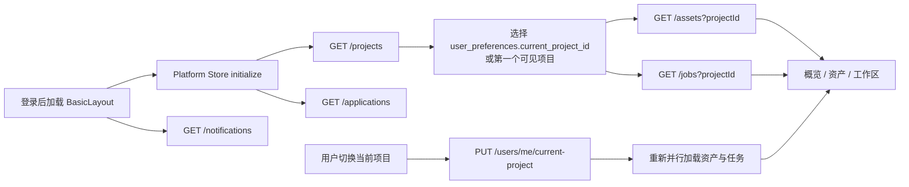
```mermaid
flowchart LR
  Layout["登录后加载 BasicLayout"] --> Init["Platform Store initialize"]
  Init --> Projects["GET /projects"]
  Init --> Apps["GET /applications"]
  Layout --> Notices["GET /notifications"]
  Projects --> Current["选择 user_preferences.current_project_id<br/>或第一个可见项目"]
  Current --> Assets["GET /assets?projectId"]
  Current --> Jobs["GET /jobs?projectId"]
  Assets --> UI["概览 / 资产 / 工作区"]
  Jobs --> UI

  Switch["用户切换当前项目"] --> Save["PUT /users/me/current-project"]
  Save --> Refresh["重新并行加载资产与任务"]
  Refresh --> UI
```

项目编号由 PostgreSQL 序列生成。创建项目时，当前用户同时成为项目 owner，且该项目会写入用户的当前项目偏好。

### 8.4 文件资产上传、预览和下载

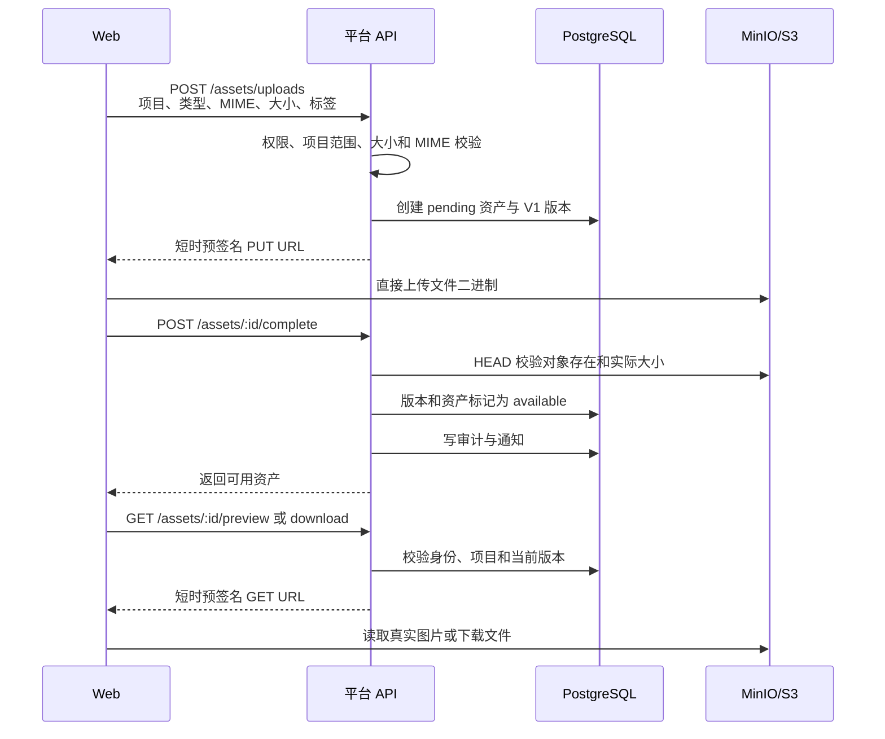
```mermaid
sequenceDiagram
  participant W as Web
  participant A as 平台 API
  participant D as PostgreSQL
  participant S as MinIO/S3

  W->>A: POST /assets/uploads<br/>项目、类型、MIME、大小、标签
  A->>A: 权限、项目范围、大小和 MIME 校验
  A->>D: 创建 pending 资产与 V1 版本
  A-->>W: 短时预签名 PUT URL
  W->>S: 直接上传文件二进制
  W->>A: POST /assets/:id/complete
  A->>S: HEAD 校验对象存在和实际大小
  A->>D: 版本和资产标记为 available
  A->>D: 写审计与通知
  A-->>W: 返回可用资产

  W->>A: GET /assets/:id/preview 或 download
  A->>D: 校验身份、项目和当前版本
  A-->>W: 短时预签名 GET URL
  W->>S: 读取真实图片或下载文件
```

这种设计让大文件不经过 Nitro API 内存，同时对象桶保持私有。文本资产走 `/assets/text`，直接写入 PostgreSQL，不经过 MinIO。

### 8.5 应用任务与外部能力边界

当前真实流程如下：


```mermaid
flowchart LR
  Work["项目设计会话<br/>conversationId + appKey + assetIds + 参数"] --> JobAPI["POST /jobs"]
  JobAPI --> Verify["校验权限、项目范围、能力绑定<br/>参数和输入资产契约"]
  Verify --> Config{"ComfyUI 适配器可用?"}
  Config -->|"否"| Failed["写入 failed 任务<br/>稳定错误码"]
  Failed --> Notice["写入通知和审计"]
  Notice --> UI["任务中心显示真实失败记录"]
  Config -->|"是"| Queued["写入 queued 任务<br/>创建 job_execution"]
  Queued --> Worker["独立 Worker 租约并执行"]
  Worker --> Inputs["从对象存储读取资产<br/>上传 ComfyUI 输入目录"]
  Inputs --> Adapter["按版本映射注入工作流 JSON"]
  Adapter --> External["ComfyUI /prompt、/history、/view"]
  External --> Output["更新任务 + 暂存输出 + job_outputs"]
  Output --> Choice{"用户选择"}
  Choice -->|"加入资产"| Asset["进入资产中心"]
  Choice -->|"选择目录加入资产并深化设计"| Asset
  Choice -->|"仅查看"| Notice
  Asset --> Transfer["当前会话选择目标应用与语义输入位"]
  Asset --> Notice
  Transfer --> Notice
```

因此，当前系统已具备工作流注册、能力绑定、项目设计会话、持久化任务、独立 Worker、输入资产上传、结果暂存、用户确认保存和会话内跨应用复用的闭环。一个设计会话可包含不同 `app_key` 的多个轮次，`jobs.design_conversation_id` 是普通用户时间线归属；事务 advisory lock 保证同一会话只有一个活动任务，不同会话可以并行。暂存结果仍受项目权限约束并保留任务血缘，但不会自动污染资产中心。未配置或无法访问 ComfyUI 时必须明确失败，不会伪造成功结果。

后续适配器应只接收平台语义数据：

```ts
interface CapabilityAdapter {
  cancel(externalJobId: string): Promise<void>;
  getStatus(externalJobId: string): Promise<CapabilityExecutionSnapshot>;
  submit(input: {
    assetIds: string[];
    parameters: Record<string, unknown>;
    projectId: string;
  }): Promise<{ externalJobId: string }>;
}
```

适配器输出必须先写入 MinIO/S3，再登记为 `source = 'workflow'` 的项目资产，并通过 `job_outputs` 建立来源关系。浏览器不应获得第三方密钥或直接访问第三方工作流管理接口。

### 8.6 LoRA 训练数据流

2026-10-08 数据集移除前后端固定 100 张上限，页面显示“已选 N 张”。API 仍校验至少一图、caption、重复/项目/版本及 `LORA_MAX_DATASET_BYTES` 总容量（默认 2 GiB）。Worker 再校验容量，按最多 16 张/目标 32 MiB 分批读取图片与同名标注；单张超目标图片单独传输。每批完整回执后读取下一批，全部成功后才创建训练任务；传输操作间续租并检查取消。失败按同一目录确定性文件名重传，不自动清空目录。细节见 [LoRA 参数说明](LORA_TRAINING_PARAMETERS.md)。

`POST /api/v1/lora/trainings` 是 LoRA 的稳定业务入口。浏览器只提交当前项目图片 ID、逐图 caption 和直接设定的 steps、Repeat、rank、学习率、分辨率、触发词、预览提示词、禁用采样开关等白名单字段，不接收训练服务器路径或完整 `job_config`。2026-10-08 移除新任务 Epoch：普通 demo 的 72 项参数由共享 `lora/demo.ts` 定义，6 项常用参数在主面板、其余 66 项（包括只读）分组放入专业设置，每项有问号说明。配置生成器从同一基准复制并覆盖受控值；旧排队任务保留原 Epoch 计算与采样行为。参见 [LoRA 参数说明](LORA_TRAINING_PARAMETERS.md)。

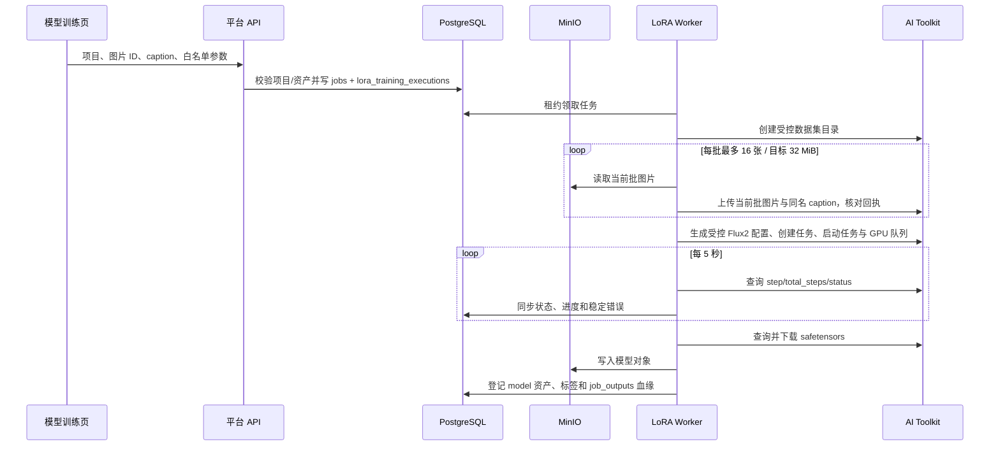
```mermaid
sequenceDiagram
  participant W as 模型训练页
  participant A as 平台 API
  participant D as PostgreSQL
  participant S as MinIO
  participant K as LoRA Worker
  participant T as AI Toolkit
  W->>A: 项目、图片 ID、caption、白名单参数
  A->>D: 校验项目/资产并写 jobs + lora_training_executions
  K->>D: 租约领取任务
  K->>T: 创建受控数据集目录
  loop 每批最多 16 张 / 目标 32 MiB
    K->>S: 读取当前批图片
    K->>T: 上传当前批图片与同名 caption，核对回执
  end
  K->>T: 生成受控 Flux2 配置、创建任务、启动任务与 GPU 队列
  loop 每 5 秒
    K->>T: 查询 step/total_steps/status
    K->>D: 同步状态、进度和稳定错误
  end
  K->>T: 查询并下载 safetensors
  K->>S: 写入模型对象
  K->>D: 登记 model 资产、标签和 job_outputs 血缘
```

`lora_artifact_receipts` 以外部绝对路径做内部幂等键；该路径、AI Toolkit Token 和公开下载路由都不会返回浏览器。模型和 VAE 路径来自服务端环境配置，默认值与已验证的 `flux2_klein_9b_interior_lora.yaml` 一致。任务取消由 Worker 调用 AI Toolkit 停止接口，训练已完成与取消并发时优先完成产物登记。

### 8.7 AI 助手数据流与隔离

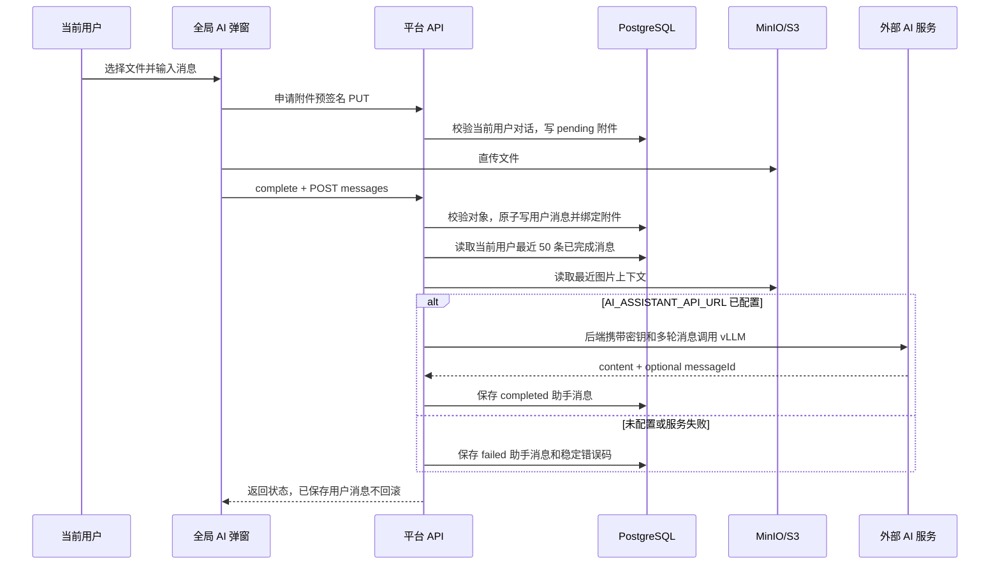
```mermaid
sequenceDiagram
  participant U as 当前用户
  participant W as 全局 AI 弹窗
  participant A as 平台 API
  participant D as PostgreSQL
  participant S as MinIO/S3
  participant X as 外部 AI 服务

  U->>W: 选择文件并输入消息
  W->>A: 申请附件预签名 PUT
  A->>D: 校验当前用户对话，写 pending 附件
  W->>S: 直传文件
  W->>A: complete + POST messages
  A->>D: 校验对象，原子写用户消息并绑定附件
  A->>D: 读取当前用户最近 50 条已完成消息
  A->>S: 读取最近图片上下文
  alt AI_ASSISTANT_API_URL 已配置
    A->>X: 后端携带密钥和多轮消息调用 vLLM
    X-->>A: content + optional messageId
    A->>D: 保存 completed 助手消息
  else 未配置或服务失败
    A->>D: 保存 failed 助手消息和稳定错误码
  end
  A-->>W: 返回状态，已保存用户消息不回滚
```

会话、消息、上传、预览、下载和清空接口全部以当前访问令牌中的用户编号重新查询数据库。用户猜测他人 UUID 时得到 404，管理员也没有聊天正文特权。清空对话先删除数据库关系，再尽力删除对应对象文件，对象清理失败会写入审计元数据。

### 8.7 操作日志与审计可见范围

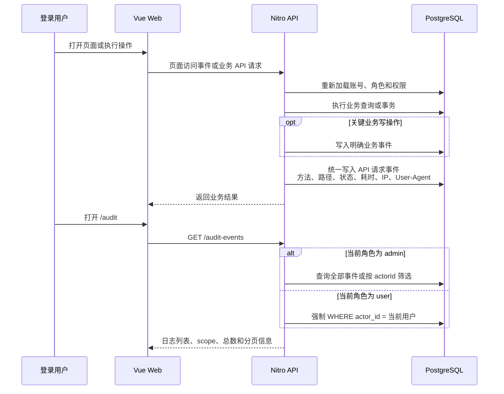
```mermaid
sequenceDiagram
  participant U as 登录用户
  participant W as Vue Web
  participant A as Nitro API
  participant D as PostgreSQL

  U->>W: 打开页面或执行操作
  W->>A: 页面访问事件或业务 API 请求
  A->>D: 重新加载账号、角色和权限
  A->>D: 执行业务查询或事务
  opt 关键业务写操作
    A->>D: 写入明确业务事件
  end
  A->>D: 统一写入 API 请求事件<br/>方法、路径、状态、耗时、IP、User-Agent
  A-->>W: 返回业务结果

  U->>W: 打开 /audit
  W->>A: GET /audit-events
  alt 当前角色为 admin
    A->>D: 查询全部事件或按 actorId 筛选
  else 当前角色为 user
    A->>D: 强制 WHERE actor_id = 当前用户
  end
  A-->>W: 日志列表、scope、总数和分页信息
```

`audit_events` 同时保存 `actor_id` 和操作发生时的 `actor_username`、`actor_real_name`、`actor_roles` 快照。账号删除时外键会把 `actor_id` 置空，但快照继续保留，因此历史日志不会失去操作者名称；临时或多个管理员也能通过不同用户名与管理员角色快照进行区分。

统一响应层为每个已认证 API 请求写入 `api.request`，前端路由守卫为页面切换写入 `page.view`，关键写接口再记录更具体的业务动作。认证失败和无法归属账号的维护动作使用匿名或系统事件。日志只记录必要元数据和经过选择的业务详情，不保存密码、访问/刷新令牌、完整请求体、键盘输入、文件正文或原始二进制。

## 9. 权限模型

### 9.1 平台角色

系统只允许两类平台角色，每个账号必须且只能分配一个角色：

| 角色 | 平台权限 | 数据范围 | 特殊限制 |
| --- | --- | --- | --- |
| `admin` | 用户、角色、项目、资产、任务和日志等全部平台权限 | 全部未归档项目；全部操作日志 | 不能修改自身角色或状态；不能降级或停用最后一名启用管理员 |
| `user` | 项目、资产、任务读写；查看自身操作日志 | 仅参与项目；仅自身日志 | 不能进入用户与权限管理，也不能调用用户/角色写接口 |

### 9.2 项目角色

| 项目角色 | 项目读取 | 资产/任务写入                  |
| -------- | -------- | ------------------------------ |
| `owner`  | 允许     | 允许                           |
| `editor` | 允许     | 允许                           |
| `viewer` | 允许     | 拒绝，返回 `PROJECT_READ_ONLY` |

前端路由的 `authority` 只决定菜单和页面入口。API 的 `requirePermission` 与 `requireProjectAccess` 才是安全边界。

## 10. 目录和依赖边界

```text
rail-cabin-design-platform/
├── apps/
│   ├── web-antd/                       # 实际 Web 应用
│   │   └── src/
│   │       ├── api/                    # 请求客户端与平台 API SDK
│   │       ├── layouts/basic.vue       # 固定外壳、项目切换、通知、退出
│   │       ├── modules/platform/       # 平台领域 TypeScript 类型
│   │       ├── router/routes/modules/  # 平台路由与前端角色入口
│   │       ├── store/                  # Auth Store 与 Platform Store
│   │       ├── styles/platform.css     # 平台品牌令牌
│   │       └── views/                  # 认证、个人中心和平台页面
│   └── platform-api/                   # 独立平台 API
│       ├── api/v1/                     # Nitro 文件式 REST 路由
│       ├── middleware/                 # Request ID 等横切逻辑
│       ├── migrations/                 # PostgreSQL 增量迁移
│       ├── scripts/                    # migrate / seed / reset-users
│       └── utils/                      # 兼容导出层与分层共享实现
│           ├── domain/                 # 资产、项目、AI、审计、通知、能力契约
│           ├── identity/               # 身份、角色、密码、令牌、会话
│           ├── http/                   # Cookie、请求、校验、响应与错误
│           └── infrastructure/         # 配置、数据库、对象存储、健康检查
├── packages/                           # Vben 通用 UI、布局、Store、Request 等包
├── internal/                           # Vite、TypeScript、Lint 等仓库工具链
├── deploy/rail-platform/compose.yaml   # PostgreSQL + MinIO + 开发 Mailpit
└── docs/rail-platform/                 # 架构、复现和开发记录
```

依赖方向应保持单向：

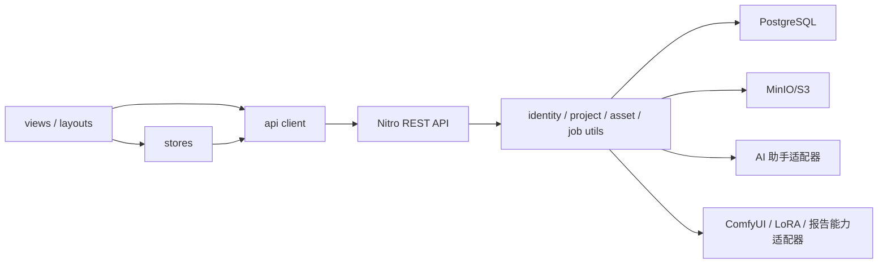
```mermaid
flowchart LR
  Views["views / layouts"] --> Store["stores"]
  Views --> APIClient["api client"]
  Store --> APIClient
  APIClient --> HTTP["Nitro REST API"]
  HTTP --> Domain["identity / project / asset / job utils"]
  Domain --> DB["PostgreSQL"]
  Domain --> Object["MinIO/S3"]
  Domain --> AssistantAdapter["AI 助手适配器"]
  Domain --> Adapters["ComfyUI / LoRA / 报告能力适配器"]
```

## 11. 当前完成度与明确缺口

### 已经可真实使用

- 无邮箱用户注册、用户名密码登录、令牌刷新、退出和登录失败锁定；邮箱找回密码已移除。
- 用户资料、密码、提醒偏好、用户状态、角色和权限保护。
- 创建、查看和切换项目；项目级数据范围检查。
- 图片、视频、音频、文本、文档、3D 模型、模型文件和压缩包 8 类统一文件资产与真实对象存储。
- 文件直传、文本入库、版本 API、收藏、下载和图片预览。
- 项目“开始设计”、多应用会话时间线、按成员管理的任务台账、通知和审计。
- 全局 AI 设计助手：按用户隔离的会话历史、文本、图片/音视频/文档附件、预览下载、清空、外部 API 转发与失败留痕。
- 报告生成：结构化章节与项目 PNG/JPEG 资产输入、模板/AI 双适配器路由、持久化 Worker、DOCX/PPTX/Markdown 输出、任务取消，以及 `document`/`text` 资产回流。外部 `generate-file` 地址只存在于平台 API/Worker 配置中。
- PostgreSQL/MinIO 数据持久化、迁移、种子、测试和生产构建；SMTP 邮件依赖已移除。

### 已预留但尚未完成

- AI 助手的具体内网模型服务需部署时配置；平台端转发适配器已完成。
- 除 ComfyUI、AI Toolkit LoRA、内置 OOXML 报告和外部 AI 报告外的其他任务型能力适配器。
- ComfyUI 目标服务的真实 GPU、模型、自定义节点和效果验收。
- 项目成员移除和角色调整；成员查看及创建者/管理员按用户 ID 邀请已经完成，项目归档已经支持软删除。
- 管理员创建用户、应用配置/发布管理页面。
- 资产版本 API 已存在，但前端尚未提供版本历史和上传新版本界面；任务取消 API 已存在，但任务中心尚未接取消按钮。
- 大数据量列表的服务端分页、缩略图派生、病毒扫描、对象生命周期和配额管理。
- Web/API 的正式容器镜像、反向代理、TLS、集中日志、指标、告警、备份和恢复演练。

### 当前重构兼容边界

- `apps/platform-api/utils` 根目录的同名文件是兼容导出层，保留现有 API 路由、脚本和 Nitro 自动导入稳定；新增实现必须进入 `domain`、`identity`、`http` 或 `infrastructure`。
- `apps/web-antd/src/api/platform/index.ts` 与 `modules/platform/types.ts` 是领域统一导出入口，具体实现和类型按领域拆分。
- 原始模板的 Dashboard、Demos、其他 Web 变体、Mock 服务、文档站和发布设施已经在引用、类型、测试与构建验证后删除；生产动态页面扫描只覆盖平台业务与个人中心。

## 12. 新模块接入原则

后续接入任何外部能力时，应遵守以下边界：

1. 平台先创建任务，适配器不能绕开项目和权限体系自行创建用户可见数据。
2. 浏览器只提交 `projectId`、`assetIds` 和业务参数，不提交服务密钥或底层工作流地址。
3. 适配器通过平台受控方式读取输入资产。
4. 外部结果先进入对象存储和任务暂存区，只有用户确认登记为项目资产后才可跨工作流复用；“加入资产并流转”也必须是一次显式用户确认。
5. 任务、输入资产、输出资产和外部任务编号必须能够互相追溯。
6. 状态更新、取消、失败和重试都必须写审计，必要时生成站内通知。
7. 新能力不能直接修改 Web 固定外壳，只能提供应用定义、参数 Schema、适配器和结果呈现组件。

## ComfyUI 工作流执行子系统（2026-08-08）

ComfyUI 采用“平台 API 创建持久化任务、独立 Worker 执行、输入资产受控上传、输出登记为项目资产”的接入方式。浏览器不直接访问 ComfyUI。工作流定义与版本、能力绑定、任务执行、输出回执、租约和 Worker 心跳保存在 PostgreSQL；输入与输出文件保存在 MinIO/S3 私有桶。

完整架构图、数据关系图、状态机和代码目录映射见 [COMFYUI_WORKFLOW_INTEGRATION.md](./COMFYUI_WORKFLOW_INTEGRATION.md)。当前能力目录包含 18 项独立工作流，真实服务联调和微调见 [COMFYUI_LIVE_SERVICE_HANDOFF.md](./COMFYUI_LIVE_SERVICE_HANDOFF.md)。

## 2026-09-10：统一功能输入器与参数展示

- 功能来源仍是 `/applications` 的可见已发布能力，前端默认显式选中 `text-to-image`。执行调用继续提交确定的 `appKey`，不增加隐式文生文回退。三个视觉模式不再过滤功能列表。
- 2026-10-08 输入器增加“文生图 / 图生图”类别：`text-to-image` 独占文生图，直接展示原有参数；图生图增加第二级功能选择，切入时默认 `inpaint-single`，不可用时提示且保留当前功能，不静默回退。其余已发布功能共享既有目录，`text-chat` 暂从设计输入器及历史重发入口排除，后端 API、已有记录与结果查看保留；`text-to-image-lora` 暂归图生图，不修改其 LoRA 输入契约。
- 分类通过 `design-generation.ts` 从实际 `appKey` 推导，不另存可漂移的分类状态；历史复用、图片编辑与功能切换自动同步类别。快捷参数、媒体槽位和完整抽屉仍读取当前能力 Schema/presentation，分类切换继续走 `chooseApplication` 和既有草稿 API，不增加迁移或环境变量。
- 新表 `capability_parameter_presentations` 按 `capability_code` 保存有序 `quick_field_keys`。能力 GET 返回 `presentation.quickFieldKeys` 和当前 `workflowVersionId`；管理员 PUT `/capabilities/:code/presentation` 使用 `platform:workflow:write`，锁定当前绑定并检查版本，拒绝重复或无效字段，记录 `capability.presentation.update` 审计。参数值和工作流快照不受此配置影响。
- 未配置时沿用非 advanced 常用字段；明确配置空数组时不显示快捷参数。重新绑定工作流后，GET 自动过滤已不存在的字段，完整参数仍按新 Schema 展示。
- `design_conversation_drafts` 主键扩展为 `(conversation_id, app_key, design_mode)`，GET/PUT 接受 `designMode`，省略时为 `cabin`，保留旧客户端行为与旧草稿。项目及会话所有者校验维持原链路。
- `designModeDefaults` 为首次无草稿的文生图提供模式提示词预设；其他参数沿用已发布 Schema 的默认值，已保存草稿优先。函数切换重新读取能力配置，已有页面可刷新或切换功能使管理员新配置生效。
- 部署前运行迁移 `032_design_parameter_presentation.sql`。此迁移不删除旧数据；回退应用可保留新表，但旧版本草稿写入使用双列冲突键，不能直接回退。需要回退时先备份数据库，再导出非 cabin 草稿、恢复旧主键及旧代码，避免丢失新模式草稿。

### 提示词模板扩展与版本（2026-09-10）

- 迁移 `033_prompt_template_expansion_versions.sql` 为目录增加 revision，并建立系统默认基线与历史版本表。迁移保留现有目录，默认基线独立保存，管理员可选择恢复；恢复历史版本产生新的 revision，避免重写历史。
- 模板分类配置语义位置和单/多选；选项将按钮名称与生成/编辑指令分离，可配置作用对象 `{target}`、说明、启用、适用工作流、组合引用、依赖和互斥。引用必须存在，组合不得循环。按主体、场景、视角、外观、风格、光环境、限制顺序组装，显示顺序不决定语义位置。
- `POST /design-prompt-templates/:mode/preview` 使用服务端共享规则展开、去重并校验。普通用户只能预览已保存目录，管理员可提交未保存目录进行模拟。尺寸分类返回独立 size 数据，前端按工作流范围和步长校验后同步实际宽高，设计页确认模板时生成单独的“画面比例”行，实际宽高变化仅同步该行；长度超限不截断而阻止应用。
- `GET .../:mode/maintenance` 限管理员获取默认及最近50个历史版本；PUT 要求 expectedRevision，在事务内锁目录、更新 revision、写入快照，过期保存返回409。审计仅记录模式、版本、分类数量和恢复原因，不记录提示词正文。
- 前端应用前重新校验，目录版本变化时要求重新选择；应用覆盖当前主提示词。恢复选项/分类/目录先展示差异，进入编辑器后显式保存才生效。既有任务、用户输入、工作流版本不随模板维护改写。
- 本期为确定性规则扩展，不接入 LLM 改写服务，也不承诺任意自然语言矛盾自动识别；业务互斥需管理员配置。

## 资产中心 C 版：分类目录与查询（2026-09-10）

资产工作区采用“紧凑模块栏 + 目录面包屑/文件夹入口 + 资源网格”，全局平台导航与 AI 助手沿用现有外壳。常用工具只保留搜索匹配方式、搜索、筛选入口、排序与视图切换；文件类型、来源任务、创建人及日期收进筛选抽屉。

`034_asset_generation_categories.sql` 在 `assets` 和 `asset_folders` 新增可空 `generation_category`（`cmf/component/cabin/report`），不修改八类 `kind`。子文件夹继承父级分类；项目根目录普通文件夹的唯一键包括分类，不同模块可使用同名目录。已有资产按来源任务 `jobs.design_mode` 回填，旧报告按明确的 `report-generator` 来源归类；无法判定的历史资产/旧目录保留为未分类，不根据共享工作流名称猜测视觉模式。

数据库触发器覆盖上传、Worker 输出、结果入库、移动及复制：目标目录有分类时采用目录分类，否则依次保留显式/已有分类、来源任务模式和报告来源。移动到其他分类目录是显式重新归档，来源任务与输入输出血缘保持不变；移动回未分类目录或项目根目录不会抹掉已有分类。复制保留原分类并接受目标分类目录覆盖，继续使用独立对象键。未保存的任务输出仍不进入资产列表。

资产模块首页汇总当前项目内该分类所有已登记资产（包含子目录）；点击文件夹后只查询该目录直属内容。“全部项目”逐项目调用受控资产接口，仅聚合可访问项目，不允许跨项目创建目录、登记、移动或复制。文件夹层级不是跨项目共享目录。

`GET /assets` 在项目范围校验后通过参数化 SQL 执行分类、类型、任务、创建人、日期、收藏以及搜索过滤。模糊匹配使用 `strpos`，`%`/`_` 为字面字符；精准匹配逐字段比较完整名称、业务编号、创建人或单个标签，不把多个字段拼接成一个字符串。日期按本地日期转换为开始时刻及结束日期的次日零点，服务端采用左闭右开区间。排序字段采用白名单并保留 ID 次排序。

资产页面拥有独立请求结果与请求代次保护，不再把筛选后的集合写入设计页共享的 `currentAssets`。页面按 12/24/48 条分页展示，仅为当前页加载图片预览，批量操作单次最多 200 项。当前 API 仍返回完整匹配集合，超大数据量的服务端分页仍是后续工作。资产路由使用 `fullPathKey: false`，详情深链接的打开/关闭不会重建页面并丢失项目、目录和筛选状态。统一资产选择器和设计结果入库目录显示分类名称，区分不同模块的同名文件夹。

部署先执行 `pnpm db:rail:migrate`，再更新 API/Worker 与 Web。迁移为增量加列、索引和触发器，不移动或删除原文件。应用回滚时保留兼容的新增字段；不要直接删除分类列/恢复旧唯一索引，因为不同分类可能已有同名目录。需要完整撤销数据模型时按备份恢复流程处理。

### 2026-09-10：工作台聚合读取

- 新增 `GET /api/v1/workbench?section=designs|projects|tasks|results|saved&page=1&pageSize=6&activeOnly=false`，每页 1–24 条，返回 `{ items, total }`。服务端固定五种 SQL 片段，用户参数均绑定；先构建非归档且当前身份可访问的项目集合，个人会话/任务/成果进一步绑定当前用户。分页按业务时间、ID 降序稳定排序，计数和列表使用同一个数据库语句快照。
- 新前端入口 `views/platform/workbench/index.vue` 通过独立区域状态处理加载、失败、重试、分页与轮询。预览使用既有签名 URL；保存和取消继续调用既有权限/审计 API，不新增运行时样例数据或客户端持久化旁路。
- `/projects/manage` 复用原 `overview/index.vue` 项目管理功能。资产中心增加显式 `projectId`、`folderId`、`module` 深链入口，读取并校验真实项目与目录，支持跳转和刷新恢复。固定外壳及全局 AI 助手保持一致。
- 本次无新增数据库迁移或环境变量；部署需同时更新 Web 和平台 API。资产分类仍依赖此前已有的 `034_asset_generation_categories.sql`。

### AI 助手去项目关联与浮层位置（2026-09-10）

创建会话接口固定写入当前 `user_id` 与空 `project_id`，忽略旧客户端项目字段；前端调用不传项目，也不展示或搜索旧会话的项目元数据。不回写或删除历史会话，原有用户级认证、附件归属和聊天上下文链路不变；无数据库迁移。

浮层锚点保存在组件内，以悬浮按钮位置为基准推导面板位置。`floating-position.ts` 集中定义尺寸和边界，Pointer Events负责鼠标/触摸拖动与5px阈值，路由path监听只收起面板。窗口与VisualViewport变化校正坐标和面板尺寸；事件监听在卸载时清理。位置不是业务数据，不写入数据库或项目状态。标志源文件 `assistant-logo.svg` 以平台 `rail-logo.svg` 的 `#bb1b21` 为主色，并在标题、消息头像及悬浮入口复用。

### AI 历史会话独立删除（2026-09-10）

新增 `DELETE /assistant/conversations/:id`：按当前用户校验归属，在事务中锁定会话、读取附件对象键与消息数量、删除会话，利用已有外键级联删除消息及附件关系；事务后清理私有对象。对象清理失败记录审计计数，沿用现有清空消息的尽力清理策略。审计事件为 `assistant.conversation.delete`，不写聊天正文。无新迁移。前端逐条确认删除，删除当前会话后复位为空白，删除其他会话不改变当前会话。

模板内比例宫格与外部比例入口共用 imageRatios 和 linkedSize，直接读写设计页 parameterValues；比例不使用模板旧尺寸选项作为另一份状态。选择立即生效，确认应用生成格式固定的比例行；宽高监听通过 syncPromptRatio 只替换此行，文本与参数继续经既有草稿 API 持久化。未应用比例模板且无该行时，外部改尺寸不会自动插入文字。

### AI 助手接收生成图片拖拽（2026-10-08）

- 图片画廊主图、缩略图及单张结果通过 `application/x-rail-asset-image` 携带版本、资产 UUID 和展示文件名，不携带预签名 URL、对象键或任意外链。文件名仅作显示，不能作为授权；接收端校验协议和 UUID，不解析外部 HTML/图片 URL。
- 松开后调用现有 `GET /assets/:id/preview` 重新验证项目读取权限、资源存在性和可用状态，再读取新签名地址。此接口支持暂存结果；普通 `GET /assets/:id` 只接受已入库资产，因此不能用来读取尚未保存的会话结果。拖拽不会调用保存资产接口或改变源资产。
- 浏览器校验支持的 PNG/JPEG/WebP/GIF MIME、响应类型和真实字节数，生成 File 并复用助手待发附件列表；读取有超时、重复资产去重及图片/附件数量限制。拖拽不创建 AI 消息或上传对象，点击发送时才沿用申请预签名 PUT、完成登记及发送附件 ID 的既有用户隔离链路。读取过程中阻止发送和对话切换，卸载/上下文改变不追加迟到结果。
- 原有本地选择附件保留，输入区也可接收本地文件拖入；多附件在面板内横向滚动，不撑宽消息列。图片对比滑块保留原交互，先切到结果视图再拖拽。无新 API、数据库迁移、环境变量或 Docker 配置，生产只需更新 Web 产物。

### 设计输入区接收会话生成图片拖拽（2026-10-08）

- 与 AI 助手共用资产 UUID 拖拽协议，接收范围限定为当前项目/会话任务输出；不解析外链或历史签名 URL。数量来自当前能力 Schema 的有序图片槽位，而非按功能名硬编码；每次只填下一个空位，重复与满额拒绝。
- `design-composer-drop.ts` 负责预检查、确认、资源读取/登记及异步后的再次校验。已保存输出经 `GET /assets/:id` 校验，暂存输出经用户确认调用既有 `POST /assets/:id/save`；后端继续执行项目权限与可用性校验。复用原资产 ID，不下载后重新上传；这与 AI 助手的个人附件复制链路不同。
- 会话、项目、应用、业务模式与能力加载代次共同防止迟到结果写入新上下文；缓存仅在上下文匹配后更新，落位复用 `selectAsset`，清除换图后的区域标注并保存既有会话草稿。拖入不修改参数、不切换功能、不创建任务；少于必填图数继续由原提交校验拦截。无新增 API、数据库迁移或部署配置。
