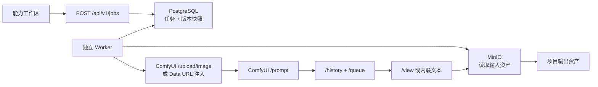

# ComfyUI 真实服务联调与适配微调交接指南

> 更新日期：2026-08-08  
> 适用范围：本仓库中已登记的 18 项 ComfyUI 能力  
> 当前环境：平台代码、API JSON、WebUI Demo 参考、输入输出适配和模拟协议测试已完成；本机 ComfyUI 服务尚未启动。

## 1. 文档目的

本文档专门服务于“ComfyUI 真实服务可访问后”的下一次开发，目标是让接手人不需要重新理解平台架构、查找节点或猜测输出协议，可以直接从“服务预检 -> 单能力冒烟 -> 特殊输入 -> 全量验收”开始。

必须区分三类结论：

- 已实现：工作流注册、能力映射、输入资产上传、独立 Worker、轮询、取消、恢复、图片/文本/GLB 输出登记和项目资产血缘。
- 已模拟验证：18 份真实 API JSON 的节点映射、资产注入、`/prompt`、`/history`、`/view`、文本与 3D 输出解析。
- 尚未真实验证：目标 ComfyUI 的模型文件、自定义节点版本、GPU 推理、实际输出字段、大文件性能和图像效果。

模拟测试不等于真实模型推理通过。运行时代码不包含模拟成功分支；`COMFYUI_API_URL` 未配置时会稳定返回 `ADAPTER_NOT_CONFIGURED`。

## 2. 五分钟理解执行链路



关键边界：

- Web 不知道 ComfyUI 地址、Token、节点 ID、模型文件名或 API JSON。
- 工作流版本在任务创建时固定，后续管理员切换版本不会改变运行中和历史任务。
- 平台资产先从 MinIO 受控读取，再由 Worker 上传到 ComfyUI；浏览器不直连 ComfyUI。
- 外部输出必须经过类型校验、对象存储和资产登记后才算平台任务成功。

## 3. 事实来源与快速定位

| 内容 | 事实来源 |
| --- | --- |
| 18 项能力名称、文件、参数、资产位、输出、模型 | `apps/platform-api/utils/domain/workflows/catalog.ts` |
| 原始 API JSON | `apps/platform-api/workflows/comfyui/` |
| 节点和映射校验 | `apps/platform-api/utils/domain/workflows/schema.ts` |
| 工作流版本与能力绑定 | `apps/platform-api/utils/domain/workflows/repository.ts` |
| ComfyUI HTTP 协议 | `apps/platform-api/utils/domain/capabilities/comfyui/client.ts` |
| 资产输入、执行、输出登记 | `apps/platform-api/utils/domain/capabilities/comfyui/worker.ts` |
| 能力工作区 | `apps/web-antd/src/views/platform/workspace/` |
| 真实服务节点预检 | `apps/platform-api/scripts/comfyui-preflight.ts` |
| 全目录模拟协议测试 | `apps/platform-api/utils/domain/capabilities/comfyui/mock-integration.test.ts` |

外部参考目录只是本次分析来源，不是平台运行依赖：

```text
/Users/huyanwei/projects/ComfyUI/webUI
/Users/huyanwei/projects/ComfyUI/user/default/workflows_api
```

部署到其他电脑时不需要保留这两个绝对路径。

## 4. 真实服务启动前准备

### 4.1 确认 ComfyUI API 模式

平台需要以下 HTTP 端点：

- `GET /system_stats`
- `GET /object_info`
- `POST /upload/image`
- `POST /prompt`
- `GET /history/{prompt_id}`
- `GET /queue`
- `GET /view`
- `POST /queue`
- `POST /interrupt`

常见启动形式如下，实际 Python 环境和参数以 ComfyUI 主机为准：

```bash
cd /path/to/ComfyUI
python main.py --listen 0.0.0.0 --port 8188
```

不要只确认 ComfyUI 页面能打开；必须确认 API 端点可从 Platform API/Worker 所在主机访问。

### 4.2 网络与安全

- 优先使用内网地址或受控反向代理，不要将 ComfyUI 直接暴露到公网。
- 如果使用 Bearer Token，只配置在 Platform API 与 Worker 环境变量中。
- 屏幕捕获在非 `localhost` 环境需要 HTTPS 安全上下文；这是浏览器约束，与 ComfyUI 本身是否使用 HTTPS 不同。
- 不得通过关闭 TLS 验证作为长期方案。

## 5. 第一步：运行自动预检

ComfyUI 启动后，先不启动平台任务，执行：

```bash
pnpm --filter @rail/platform-api exec tsx scripts/comfyui-preflight.ts \
  --url http://COMFYUI_HOST:8188
```

如需 Token：

```bash
pnpm --filter @rail/platform-api exec tsx scripts/comfyui-preflight.ts \
  --url https://comfy.internal.example \
  --token '<runtime-token>'
```

预检脚本会：

1. 验证 `/system_stats` 与 `/object_info` 可访问。
2. 读取仓库中的 18 份 API JSON。
3. 按工作流比对所有 `class_type`。
4. 逐项输出缺失节点。
5. 输出每项能力声明的模型文件清单。
6. 存在缺失节点时以非零状态退出。

预检只能确认节点类型已注册，不能确认模型文件内容完整、显存足够或节点版本语义完全一致。

## 6. 第二步：配置平台并确认 Worker

在 API 与 Worker 使用的环境文件中配置：

```dotenv
COMFYUI_API_URL=http://COMFYUI_HOST:8188
COMFYUI_API_TOKEN=
COMFYUI_TIMEOUT_MS=60000
COMFYUI_POLL_INTERVAL_MS=2000
COMFYUI_LEASE_SECONDS=30
COMFYUI_MAX_OUTPUT_BYTES=268435456
```

然后执行非破坏性迁移与幂等种子：

```bash
pnpm db:rail:migrate
pnpm db:rail:seed
```

重启 Platform API 与 Worker：

```bash
pnpm --filter @rail/platform-api dev:api
pnpm --filter @rail/platform-api worker
```

或使用统一开发命令：

```bash
pnpm dev:rail
```

在“平台管理 -> 工作流管理”确认：

- Worker 心跳为在线。
- 能力数量为 18。
- 每个能力都有活动版本。
- 所有工作流是 `published`。

## 7. 18 项能力真实服务验收矩阵

| 应用键 | 用户输入 | 预期输出 | 主要输出映射 | 首次联调重点 |
| --- | --- | --- | --- | --- |
| `text-to-image` | 提示词、尺寸、种子、步数 | PNG/JPEG | `356.images` | 首个冒烟用例；确认 Flux2 三个基础模型 |
| `text-to-image-lora` | 提示词、尺寸、LoRA 强度 | PNG/JPEG | `356.images` | LoRA 文件名与强度范围 |
| `single-image-edit` | 1 张底图、编辑指令 | PNG/JPEG | `402.images` | `/upload/image` 返回的 `subfolder/name` 能被 `LoadImage` 读取 |
| `screen-capture-edit` | 屏幕捕获或 1 张图、指令 | PNG/JPEG | `402.images` | `413.image_base64` Data URL 大小与 ScreenShare 节点版本 |
| `multi-image-edit` | 基础图、样式图、材质图 | PNG/JPEG | `23.images` | 3 个资产位顺序与参考图语义 |
| `inpaint-single` | 带 Alpha 遮罩的底图、指令 | PNG/JPEG | `363.images` | 遮罩必须是透明 Alpha，不是红色覆盖层 |
| `inpaint-reference` | 遮罩底图、参考图、指令 | PNG/JPEG | `370.images` | 底图与参考图顺序；遮罩扩展/羽化 |
| `outpaint` | 1 张图、四边扩展尺寸 | PNG/JPEG | `366.images` | 扩展数值与显存；输出尺寸是否被节点限制 |
| `region-edit` | 底图、颜色笔画、分区指令 | PNG/JPEG | `293.images` | 自定义 `sum_Ksampler` 的历史输出字段必须核对 |
| `region-marker-edit` | 底图、颜色/编号笔画、指令 | PNG/JPEG | `366.images` | `IO_EasyMark` 笔画格式与坐标系 |
| `multiview-to-3d` | 前、左、后、右 4 张图 | GLB | `83.3d` | `SaveGLB` 的 `3d` 数组与 `/view` MIME |
| `image-understanding` | 1 张图、理解指令 | TXT | `4.text` | `PreviewAny` 返回的 `text` 数组 |
| `text-chat` | 文本指令 | TXT | `5.text` | TextGenerate 输出长度与 `PreviewAny` |
| `image-upscale` | 1 张图、放大倍数 | PNG/JPEG | `90.images` | HYPIR 模型与最大显存 |
| `camera-control-single` | 1 张图、水平/俯仰/缩放 | PNG/JPEG | `36.images` | 同一输入同时注入 `20.image` 和 `85:50.image` |
| `camera-control-multi` | 1 张图 | 多张 PNG/JPEG | `76.images` | Qwen 多角度节点是否一次返回全部图像 |
| `image-edit-base` | 基础图、参考图、指令 | PNG/JPEG | `9.images` | Base 9B 与 VAE 文件名；双图顺序 |
| `image-edit-kv` | 基础图、参考图、指令 | PNG/JPEG | `94.images` | KV Cache 自定义节点与模型版本 |

## 8. 推荐的真实联调顺序

### 8.1 第一组：验证基础协议

1. `text-to-image`：验证提交、轮询、图片下载和资产登记。
2. `single-image-edit`：验证 MinIO -> Worker -> `/upload/image` -> `LoadImage`。
3. `text-chat`：验证内联文本输出。
4. `multiview-to-3d`：验证 GLB 下载、MIME 和 `model3d` 资产。

这四项通过后，平台通用协议可认为基本成立。

### 8.2 第二组：验证输入编组

1. `multi-image-edit`：3 个图像位。
2. `multiview-to-3d`：4 个有业务方向的图像位。
3. `camera-control-single`：1 个资产注入多个节点。

### 8.3 第三组：验证特殊交互

1. `inpaint-single` 和 `inpaint-reference`：PNG Alpha 遮罩。
2. `region-marker-edit`：EasyMark 笔画序列化。
3. `screen-capture-edit`：安全上下文与屏幕捕获。

### 8.4 第四组：全量效果验收

余下能力按第 7 节矩阵逐项运行，记录耗时、显存、输出数量、文件大小、错误码和效果判定。

## 9. 特殊输入适配说明

### 9.1 `LoadImage`

Worker 将平台资产从 MinIO 读取为字节，调用 `/upload/image`，使用子目录 `rail-platform/{jobId}`，将返回的 `subfolder/name` 写入工作流。

如果真实服务报“文件不存在”，优先检查：

1. `/upload/image` 返回的 `name`、`subfolder`和 `type`。
2. 节点需要的是 `name` 还是 `subfolder/name`。
3. 反向代理是否允许 multipart 请求。
4. ComfyUI 进程是否具有输入目录写权限。

### 9.2 透明遮罩

工作区将画笔区域从原图 Alpha 中扣除，导出新 PNG 资产。ComfyUI `LoadImage` 从 Alpha 生成 MASK。不得将红色半透明覆盖图当成最终遮罩文件。

### 9.3 `IO_EasyMark`

平台写入：

- `image_base64`：完整图片 Data URL。
- `brush_data`：`mode:type:size:opacity:r,g,b[:marker]:x,y;x,y|...`。
- `brush_size`：保留工作流默认值。

如果区域偏移，重点核对 Web 画布显示尺寸、图像原始尺寸与 EasyMark 后端解析坐标系。不要盲目修改工作流其他节点。

### 9.4 `ScreenShare`

平台不让 ComfyUI 节点自行访问用户浏览器，而是：

1. Web 使用 `getDisplayMedia()` 获取一帧。
2. 将该帧登记为当前项目资产。
3. Worker 读取资产并注入 `413.image_base64`。

这样页面关闭后 Worker 仍可重试，也避免把大型 Base64 持久化到任务参数 JSON。

## 10. 参数与输出微调流程

真实联调可能发现节点 ID、输入名、输出字段、范围或模型文件名需要微调。修改顺序：

1. 保留 ComfyUI 返回的结构化错误和 `/history/{prompt_id}` 摘要，不记录完整业务正文。
2. 在 ComfyUI 中确认 API Format JSON，不使用普通 UI Workflow JSON 替代。
3. 如图结构改变，替换 `apps/platform-api/workflows/comfyui/` 中对应 JSON。
4. 修改 `catalog.ts` 中对应能力的参数映射、资产目标、输出映射或模型需求。
5. 运行目录校验和模拟协议测试。
6. 执行幂等种子。完整版本快照的 SHA-256 改变时会创建新的不可变版本并绑定到能力。
7. 不要修改已应用的历史迁移或数据库中的旧版本 JSON。
8. 将真实联调证据记录到本文档第 13 节与 `DEVELOPMENT_LOG.md`。

相同 API JSON 但参数映射、输出映射或模型需求改变，也会创建新版本，避免历史任务血缘失真。

## 11. 故障定位最短路径

| 现象 | 先检查 | 典型处理 |
| --- | --- | --- |
| 预检报缺失节点 | `/object_info` 是否包含准确 `class_type` | 安装/升级对应自定义节点，重启 ComfyUI 后重跑预检 |
| `/prompt` 返回 400 | 响应中的节点、输入名和类型 | 对比 API Format JSON 与 `catalog.ts` 映射 |
| 模型不存在 | 报错文件名与模型目录 | 安装模型或在新版本中更新文件名 |
| 图片输入不存在 | `/upload/image` 返回值与 ComfyUI input 目录 | 核对 `subfolder/name` 和代理 multipart 请求 |
| 任务一直排队 | `/queue`、GPU 使用、Worker 心跳 | 先区分 ComfyUI 队列与 Platform Worker 租约 |
| `COMFYUI_OUTPUT_MISSING` | `/history/{prompt_id}.outputs` | 核对 `nodeId.field`，新建工作流版本 |
| `OUTPUT_REGISTRATION_FAILED` | MIME、扩展名、输出大小、MinIO | 修正输出类型或存储配置，不跳过校验 |
| EasyMark 区域偏移 | 原图尺寸与画布坐标 | 修正坐标缩放，不改模型节点 |
| GLB 无法登记 | `83.3d` 的文件对象与 `/view` MIME | 核对 `model/gltf-binary` 或 `application/octet-stream` |
| 文本结果为空 | PreviewAny 是否返回 `text` 数组 | 核对 TextGenerate 连接和输出字段 |

## 12. 真实服务测试命令

当前无 ComfyUI 时可运行：

```bash
pnpm --filter @rail/platform-api test -- \
  utils/domain/workflows/catalog.test.ts \
  utils/domain/capabilities/comfyui/mock-integration.test.ts
```

真实服务可访问后，先运行：

```bash
pnpm --filter @rail/platform-api exec tsx scripts/comfyui-preflight.ts \
  --url "$COMFYUI_API_URL"
```

然后从 Web 工作区按第 8 节顺序手工提交真实任务。不要把模拟协议测试结果记录为真实 GPU 验收。

## 13. 真实联调证据表

当真实 ComfyUI 可用时，在下表追加结果，不覆盖历史：

| 日期 | ComfyUI 版本/提交 | GPU | 能力 | 工作流版本 | 结果 | 耗时 | 输出资产 | 微调说明 |
| --- | --- | --- | --- | --- | --- | --- | --- | --- |
| 待联调 | 待填写 | 待填写 | `text-to-image` | 待填写 | 未验证 | - | - | - |

至少保留：

- 预检结果摘要。
- 首个成功和首个失败任务的结构化错误码。
- 每项能力的工作流版本。
- 输出资产 ID、类型和大小，不在文档中记录密钥、Token 或敏感原始请求。

## 14. 发布前门禁

以下任一条未满足，不能将对应能力标记为“真实服务已验证”：

- 预检无缺失节点。
- 目标模型文件和自定义节点已安装。
- 正常、失败、取消路径都有真实证据。
- 页面关闭后任务继续，Worker 重启后可恢复。
- 输入资产不跨项目，输出资产归属正确。
- 图片、文本或 GLB 能从资产中心预览/下载。
- 审计日志不含 Token、完整提示词、Base64 正文或完整 API JSON。
- 真实联调证据已追加到本文档和 `DEVELOPMENT_LOG.md`。

## 15. 接手人第一天建议

1. 先读本文档第 1、2、3、5、7、8 节。
2. 不改代码，先运行预检并安装缺失节点/模型。
3. 用 `text-to-image` 完成第一个真实任务。
4. 按“图片输入 -> 文本输出 -> GLB 输出”验证通用协议。
5. 最后处理 EasyMark、透明遮罩和 ScreenShare。
6. 只在定位到明确节点/字段差异后才创建新版本，不通过放宽平台校验掩盖真实协议错误。

按此顺序，下次任务的理解成本主要集中在目标 ComfyUI 环境差异，而不再是重新理解平台任务、资产、Worker 和工作流版本架构。

## 14. 2026-08-08 本机交付证据

本次开发环境未启动真实 ComfyUI，以下结果只证明平台侧协议、目录注册与模拟闭环正确，不代表模型、显存、自定义节点和真实生成质量已经验收。

- 数据库迁移：`011_comfyui_workflow_catalog.sql` 已成功应用。
- 目录初始化：种子脚本成功登记 18 项 ComfyUI 能力及其不可变工作流版本。
- 模拟测试：`14` 个测试文件、`38` 项测试全部通过。
- 全目录模拟：逐一加载 18 份真实 API JSON，完成参数注入、媒体引用注入、`POST /prompt`、`GET /history/{prompt_id}`、图片/文本/GLB 结果映射和文件下载。
- 尚未验证：真实 `/object_info` 节点全集、模型文件、LoRA 文件、EasyMark 自定义节点输出字段、GPU 显存与生成耗时。

真实服务可用后的第一条命令仍应是本文第 5 节的预检脚本；预检通过后再按第 7 节顺序做最小样例验收，不需要重新阅读全部实现代码。
