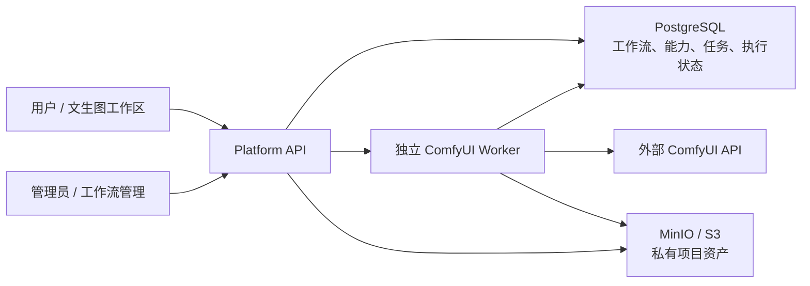
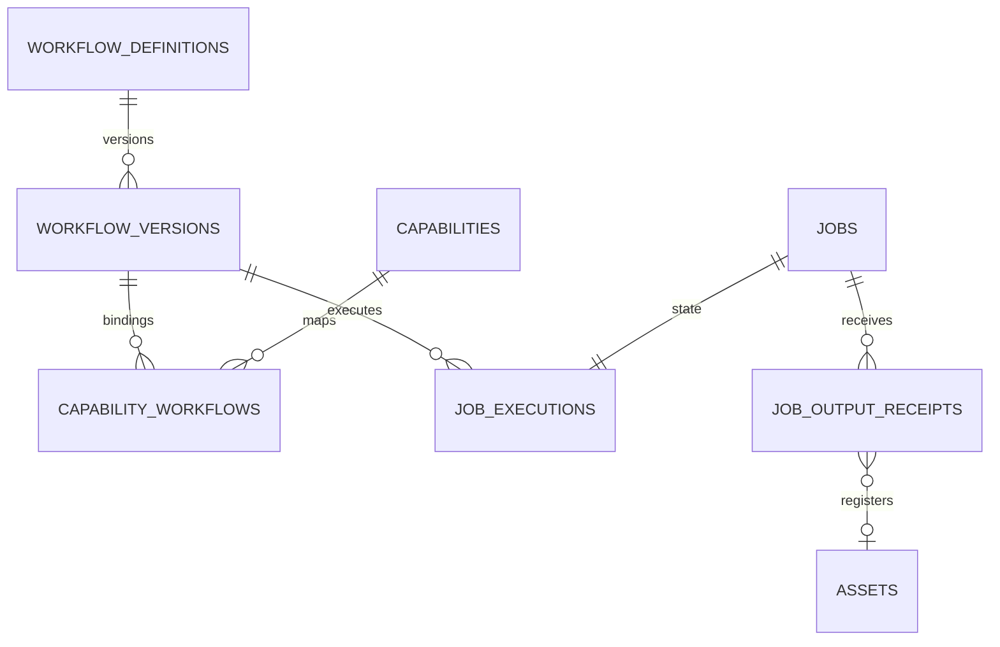
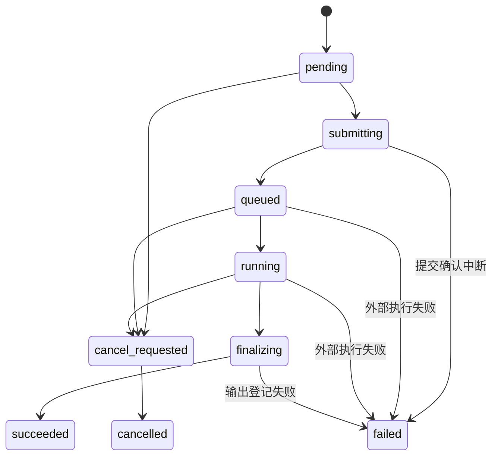

# ComfyUI 工作流集成架构与目录对应关系

## 1. 本期交付边界

本期完成工作流注册、管理员管理、能力映射、独立 Worker 和文生图端到端链路，达到《ComfyUI 工作流 API 集成计划》第二阶段完成判定。

正式能力目录已扩展为 18 项，覆盖文生图、LoRA、单/多图编辑、局部重绘、扩图、分区标记、镜头控制、图片理解、文本生成、放大修复和多视图生三维。所有能力共用工作流注册、不可变版本、参数/资产/输出映射和独立 Worker，不复制任务系统。

本机 HTTPS ComfyUI 已接入，18 项能力均已完成真实 GPU 推理和平台资产回写验收，同时保留进程内模拟服务测试作为快速回归。运行时代码没有静态结果或模拟成功分支；未配置 ComfyUI 时稳定返回 `ADAPTER_NOT_CONFIGURED`。当前验收矩阵和微调记录见 [COMFYUI_LIVE_SERVICE_HANDOFF.md](./COMFYUI_LIVE_SERVICE_HANDOFF.md)。

## 2. 总体架构



职责边界：

- Web 只获取公开参数定义、提交任务、查看状态和预览项目资产，不接触 ComfyUI 地址、节点编号和鉴权信息。
- Platform API 校验身份、项目范围、应用契约和工作流参数，并创建持久化任务与执行记录。
- Worker 使用数据库租约领取任务，向 ComfyUI 提交 API JSON、轮询、取消、下载输出并登记资产。
- ComfyUI 只负责工作流执行，不是平台任务、权限、资产或审计的真值来源。
- PostgreSQL 保存工作流版本与任务血缘；MinIO/S3 保存最终输出文件。

## 3. 目录与文件对应关系

| 路径 | 作用 |
| --- | --- |
| `apps/platform-api/workflows/comfyui/` | 受版本控制的首发工作流 API JSON；仅用于种子初始化，不在运行中从外部电脑读取 |
| `apps/platform-api/migrations/010_comfyui_workflows.sql` | 工作流、版本、能力绑定、执行租约、输出回执和 Worker 心跳的数据模型 |
| `apps/platform-api/utils/domain/workflows/schema.ts` | 工作流 API JSON、参数映射和输出映射校验；向浏览器隐藏节点编号 |
| `apps/platform-api/utils/domain/workflows/repository.ts` | 工作流登记、版本发布、能力绑定和管理员查询 |
| `apps/platform-api/utils/domain/capabilities/comfyui/client.ts` | ComfyUI `/prompt`、`/history`、`/queue`、`/view`、取消协议适配器 |
| `apps/platform-api/utils/domain/capabilities/comfyui/worker.ts` | 数据库租约、提交、轮询、恢复、取消、输出落库和审计 |
| `apps/platform-api/scripts/worker.ts` | 独立 Worker 进程入口，支持长期运行和单轮执行 |
| `apps/platform-api/api/v1/capabilities/` | 面向用户的能力参数查询和管理员能力绑定接口 |
| `apps/platform-api/api/v1/workflow-management/` | 管理员工作流登记、更新和版本发布接口 |
| `apps/web-antd/src/views/platform/workflow-management/` | 管理员工作流注册、版本发布、停用、绑定与 Worker 心跳页面 |
| `apps/web-antd/src/views/platform/workspace/` | 根据能力参数定义渲染的文生图工作区 |
| `deploy/rail-platform/` | API、Web、迁移、Worker 和基础设施的生产部署定义 |

外部参考目录 `/Users/huyanwei/projects/ComfyUI/webUI` 与 `/Users/huyanwei/projects/ComfyUI/user/default/workflows_api` 只在开发分析时读取，不是项目运行依赖，也没有写入仓库脚本或部署配置。

## 4. 数据模型



- `workflow_definitions`：可管理的工作流身份、名称和启停状态。
- `workflow_versions`：不可变 API JSON、校验和、参数映射、输出映射与模型依赖。
- `capabilities`：稳定的平台能力，当前发布 18 项 ComfyUI 业务能力。
- `capability_workflows`：一个能力当前使用哪个已发布版本；切换不影响历史任务。
- `job_executions`：外部任务编号、执行状态、轮询时间、租约、错误与重试信息。
- `job_output_receipts`：按外部输出唯一键防止重复登记资产。
- `worker_heartbeats`：管理员判断 Worker 是否在线的运行元数据。

## 5. 首发文生图工作流

首发工作流为 `flux2-klein-text-to-image-v1.json`，来源文件已在其他电脑的 ComfyUI 环境验证。本平台只把以下参数暴露给用户：

| 参数     | 工作流映射              |
| -------- | ----------------------- |
| 提示词   | `357.inputs.value`      |
| 宽度     | `358.inputs.value`      |
| 高度     | `359.inputs.value`      |
| 批次数   | `346.inputs.batch_size` |
| 随机种子 | `347.inputs.noise_seed` |
| 采样步数 | `352.inputs.steps`      |

主要输出来自 `356.images`，登记为 `image` 项目资产。节点编号只保存在服务端版本快照中，不通过用户能力接口返回。

模型依赖：

- `qwen_3_8b_fp8mixed.safetensors`
- `flux2-vae.safetensors`
- `flux-2-klein-9b-fp8.safetensors`

## 6. 任务状态与恢复



- 页面关闭不影响任务，任务状态保存在 PostgreSQL 中。
- Worker 重启后通过过期租约继续领取任务。
- 状态轮询的临时网络错误自动重试三次。
- 如果 Worker 在 ComfyUI 提交确认窗口中断，任务以 `COMFYUI_SUBMIT_UNKNOWN` 失败，不自动重复提交。
- 输出回执确保同一个外部输出不会重复登记资产。
- 取消同时调用队列删除和执行中断；取消失败返回明确错误，不伪造取消成功。

## 7. 配置与启动

API 与 Worker 使用同一组服务端环境变量：

| 变量                           | 说明                               |
| ------------------------------ | ---------------------------------- |
| `COMFYUI_API_URL`              | ComfyUI 根地址；为空时能力不可执行 |
| `COMFYUI_API_TOKEN`            | 可选 Bearer Token，只存在服务端    |
| `NODE_EXTRA_CA_CERTS`          | 本地 HTTPS 自签 CA 证书路径        |
| `COMFYUI_API_TIMEOUT_MS`       | 单次 HTTP 请求超时                 |
| `COMFYUI_POLL_INTERVAL_MS`     | 状态轮询间隔                       |
| `COMFYUI_WORKER_LEASE_SECONDS` | Worker 数据库租约时长              |
| `COMFYUI_MAX_OUTPUT_BYTES`     | 单个输出下载大小上限               |

开发模式 `pnpm dev:rail` 会启动 API、Web 和 Worker。拆分调试时使用：

```bash
pnpm --filter @rail/platform-api dev:api
pnpm --filter @rail/platform-api worker
```

生产 Compose 中 `platform-worker` 使用与 API 相同镜像和环境配置，但独立运行、独立重启。多实例依靠数据库租约避免重复领取。

## 8. 管理流程

1. 管理员在“工作流管理”导入 ComfyUI API 格式 JSON。
2. 管理员填写稳定工作流标识、版本号、参数映射、输出映射和模型依赖。
3. 平台校验所有节点与输入字段真实存在，保存不可变版本和 SHA-256 校验和。
4. 管理员发布版本并绑定到某个平台能力。
5. 普通用户只看到能力表单，不看到工作流节点和服务地址。
6. 停用工作流或能力绑定只阻止新任务，不修改历史任务和资产血缘。

## 9. 错误码

| 错误码                       | 含义                                   |
| ---------------------------- | -------------------------------------- |
| `ADAPTER_NOT_CONFIGURED`     | 未配置 ComfyUI 或能力没有可用绑定      |
| `WORKFLOW_PARAMETER_INVALID` | 用户参数不满足版本参数定义             |
| `COMFYUI_SUBMIT_FAILED`      | ComfyUI 明确拒绝或提交请求失败         |
| `COMFYUI_SUBMIT_UNKNOWN`     | 提交确认窗口中断，为避免重复执行而终止 |
| `COMFYUI_STATUS_FAILED`      | 连续状态读取失败超过重试上限           |
| `COMFYUI_EXECUTION_FAILED`   | ComfyUI 返回执行失败                   |
| `COMFYUI_OUTPUT_MISSING`     | 已完成但没有配置的主要输出             |
| `OUTPUT_REGISTRATION_FAILED` | 输出下载、校验、对象存储或资产登记失败 |

## 10. 验证范围与已知限制

自动化测试包括 18 份真实 API JSON 的参数、媒体资产和输出映射，ComfyUI 客户端、Worker 输出提取，以及临时模拟服务的提交、历史、图片/文本/GLB 输出与取消协议。

本机未验证真实模型推理、目标 ComfyUI 的模型安装情况和 GPU 性能。部署到可访问的 ComfyUI 后，必须按 `QUALITY_GATES.md` 执行真实服务验收，并确认三个模型文件和自定义节点齐备。

## 11. 2026-08-08 验证证据

- `pnpm lint`：通过，1161 个文件格式与代码规则通过。
- `pnpm typecheck:rail`：Platform API 与 Web 类型检查通过。
- `pnpm test:rail`：Platform API 13 个测试文件、33 项测试通过；Web 2 个测试文件、9 项测试通过。
- `pnpm test:rail:integration`：原平台认证、权限隔离、项目、文本/图片资产、MinIO、AI 会话和审计通过；新增模拟 ComfyUI Worker 真实数据库、轮询、MinIO 和项目资产登记通过。
- `pnpm build:rail`：Nitro 生产构建和 Web Vite 生产构建通过。
- 浏览器桌面验收：管理员工作流入口、V1 注册表、能力未就绪提示、Worker 心跳、文生图表单和 `ADAPTER_NOT_CONFIGURED` 失败路径通过。
- 浏览器移动验收：`390×844` 下工作流管理页和文生图页无横向溢出，核心字段与错误反馈可见。

真实 Worker 集成脚本位于 `apps/platform-api/scripts/comfyui-worker-integration-test.ts`。它只使用临时模拟 ComfyUI，成功后删除本轮对象、任务、资产、审计和测试心跳，不清空开发数据。

## 12. 批量能力目录与真实服务交接

- 能力目录集中位于 `apps/platform-api/utils/domain/workflows/catalog.ts`。
- 原始 API JSON 已以稳定英文文件名纳入 `apps/platform-api/workflows/comfyui/`。
- 输入支持标量参数、ComfyUI 图片上传、Data URL、PNG Alpha 遮罩、EasyMark 分区和屏幕捕获资产。
- 输出支持 ComfyUI 文件对象、PreviewAny 文本和 SaveGLB `3d` 字段。
- 工作流完整快照（API JSON、参数映射、输出映射和模型需求）共同计算校验和，任一部分微调都会创建新的不可变版本。
- 真实 ComfyUI 上线前和微调时统一使用 [COMFYUI_LIVE_SERVICE_HANDOFF.md](./COMFYUI_LIVE_SERVICE_HANDOFF.md)。
