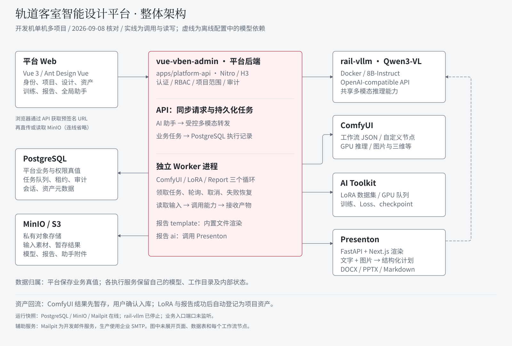
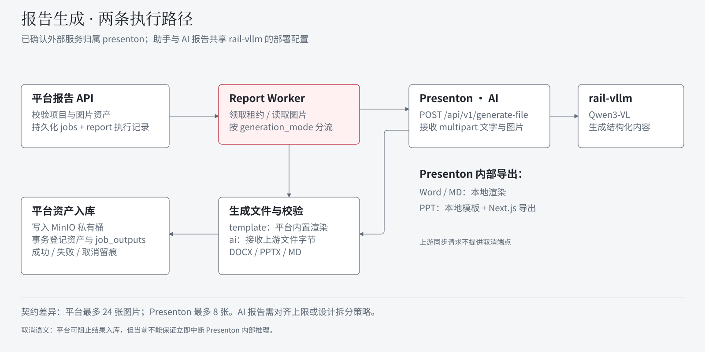

# 开发机整体架构梳理

核对日期：2026-09-08。范围：平台代码、独立子项目、平台本机配置中的非敏感连接信息、Docker 状态及监听端口。没有启动服务、运行生成或训练任务，也没有修改业务代码和数据库。

## 1. 项目背景与整体定位

当前系统采用“一个平台业务核心 + 多个独立能力服务”的结构。`vue-vben-admin` 已从 Vben 前端框架二次开发为轨道客室智能设计平台，同时包含实际 Web、平台 API 和持久化任务 Worker，因此它不只是前端。

平台统一负责身份权限、项目上下文、资产、设计会话、任务、通知、审计与个人 AI 对话；ComfyUI、AI Toolkit、Presenton 和 vLLM 分别负责工作流执行、LoRA 训练、报告内容及文件生成、多模态模型推理。各项目独立维护和启动，通过后端 HTTP 适配器连接。

[打开双图 HTML](architecture-overview/index.html) · [整体架构 PNG](architecture-overview/overview.png) · [报告链路 PNG](architecture-overview/report.png)

图中的连线表达代码或配置关系，不表示所有服务当前在线。图内将平台 API 与独立 Worker 放在一个仓库框内；它们是不同进程。共享数据库队列连接二者，不依赖 API 进程内存保存长任务。

## 2. 子项目与职责

以下路径相对于开发机的项目父目录；为避免把机器目录写入跨平台启动脚本，只记录仓库名。

| 子项目 / 服务 | 实际职责 | 平台接入方 | 数据归属 |
| --- | --- | --- | --- |
| `vue-vben-admin/apps/web-antd` | Vue 3、Ant Design Vue、Pinia、Vue Router；固定外壳与业务交互 | 浏览器 → 平台 API | 页面状态与缓存，不是业务真值 |
| `vue-vben-admin/apps/platform-api` | Nitro/H3、认证、RBAC、项目边界、资产与任务 API、助手适配器 | Web 请求入口 | PostgreSQL 和 MinIO/S3 |
| 同仓库 `scripts/worker.ts` | 同一 Worker 进程并行运行 ComfyUI、LoRA、Report 三个执行循环 | 从 PostgreSQL 领取持久化任务 | 租约、执行记录、输出回执写入平台库 |
| `ComfyUI` | Python 工作流运行时、自定义节点、GPU 模型推理；平台保存 API JSON 与版本、参数映射 | ComfyUI Worker | 自身模型、输入输出目录与执行状态 |
| `ai-toolkit` | UI REST API、内部 GPU 队列与 Python 训练任务；数据集、日志、Loss、checkpoint | LoRA Worker | 内部 SQLite、训练数据集和模型输出目录 |
| `rail-vllm` 容器 | OpenAI 兼容多模态推理，模型实际为 `Qwen3-VL-8B-Instruct`，服务名 `qwen3-vl-8b-instruct` | 助手适配器；Presenton 离线配置 | 模型权重与缓存挂载；不是平台会话数据库 |
| `presenton` | FastAPI 的统一文件生成入口；Word/MD 本地渲染，PPTX 使用 Presenton 模板和 Next.js 导出链路 | Report Worker 的 AI 适配器 | 自身生成计划、导出文件及内部状态；正式项目报告仍回流平台 |

没有证据表明平台报告适配器调用 `private-office-AI`。该项目也存在于开发机，但本次匹配到的 `generate-file` 路由实现属于 `presenton`。

## 3. 接口与开发机部署关系

端口是本次本机配置或启动脚本值，不应理解为统一的生产端口规范。服务 URL 与令牌仅由平台 API/Worker 使用，不返回给浏览器。

| 入口 | 本次配置 / 脚本默认端口 | 协议与用途 |
| --- | --- | --- |
| 平台 Web | 5666 | Vite 开发入口 |
| 平台 API | 5320 | `/api/v1` REST API |
| ComfyUI | 8188 | `/upload/image` 上传输入，`/prompt` 提交图，`/history` 查询，`/view` 读取结果，`/queue` 等用于队列管理 |
| AI Toolkit | 3000 | `/api/datasets/*`、`/api/jobs`、任务 start/stop/log/loss/files、`/api/queue/:gpuIds/start` |
| vLLM | 宿主 18081 → 容器 8000 | 助手完整路径 `/v1/chat/completions`；Presenton 配置基址 `/v1` |
| Presenton FastAPI | 5001 | `POST /api/v1/generate-file`，同步返回文件字节 |
| Presenton Next.js | 32123 | `presenton.sh` 的本机默认渲染进程端口，PPTX 导出依赖它 |
| PostgreSQL | 5432 | 平台关系数据及任务协调 |
| MinIO | 9000 / 9001 | S3 API / 管理控制台 |
| Mailpit | 1025 / 8025 | 开发 SMTP / 邮件查看界面，生产由企业 SMTP 替代 |

`pnpm dev:rail` 启动基础设施、迁移和种子，然后启动平台 API、Worker 和 Web。它不会自动启动 ComfyUI、AI Toolkit、Presenton 或 vLLM。各能力服务有独立生命周期。

本次运行快照：PostgreSQL、MinIO、Mailpit 的容器处于健康运行状态；`rail-vllm` 为 `Exited (0)`。监听表中未发现 5666、5320、8188、3000、5001、32123、18081。因此只能确认代码与配置中的接入，不能宣称当前整条业务链路可用。未重跑健康 API 或真实 GPU 任务验收。

## 4. 四条主要业务链路

### 4.1 设计生成 / ComfyUI

用户在项目设计会话中选择能力并提交参数与资产 → 平台校验项目归属、输入契约及会话互斥 → 固定工作流版本并持久化任务 → Worker 读取输入资产并上传至 ComfyUI → 提交工作流、轮询和接收输出 → 保存任务暂存结果 → 用户明确确认加入项目资产，之后才能跨能力复用。

“工作流部署为 API”在当前平台代码中具体表现为：平台管理多份 API 格式工作流 JSON，通过同一 ComfyUI `/prompt` 协议执行。没有在本次代码核对中发现每份工作流必须拥有独立 HTTP 服务进程的要求。

### 4.2 LoRA 训练 / AI Toolkit

已登记图片与逐图 caption → 平台训练任务 → Worker 创建并上传 AI Toolkit 数据集 → 创建外部任务，同时启动任务和 GPU 队列 → 查询日志、Loss、checkpoint 与停止状态 → 下载 `.safetensors` → 写入 MinIO 并自动登记当前项目的 `model` 资产。

平台 PostgreSQL 负责业务任务，AI Toolkit 的 SQLite 负责训练内部任务。两者通过外部任务 ID / `job_ref` 关联，不共享数据库。模型登记为资产并不等于已经自动安装到 ComfyUI 模型目录；本次没有证据确认训练产物到 ComfyUI 的自动发布闭环，不在图中画成已实现直连。

### 4.3 全局 AI 助手 / vLLM

个人对话与附件 → 平台按 `user_id` 校验 → 助手适配器构建多模态请求 → `rail-vllm` 推理 → 平台保存消息和失败状态。聊天正文及附件按用户隔离，管理员也不能越权读取。审计保存操作元数据，不保存完整聊天正文。

这条路径由平台助手 API 处理，不进入 ComfyUI/LoRA/Report 的长任务 Worker。共享模型服务不意味着共享用户会话。

### 4.4 报告生成 / 内置模板 + Presenton

两种生成模式都先创建平台报告任务，由 Report Worker 处理并回流项目资产：

- `template`：调用平台内置渲染器，生成 DOCX、PPTX 或 Markdown，不依赖 Presenton 和 vLLM。
- `ai`：从 MinIO 读取图片，与中文报告内容组成 multipart 请求发送给 Presenton；`type` 映射为 `word`、`ppt`、`md`。Presenton 调用配置中的 Qwen3-VL 生成结构化内容，再导出文件。

Presenton 的 DOCX 和 Markdown 由本地文件生成服务渲染；PPTX 复用演示文稿生成处理器、模板与 Next.js 导出运行时。离线 Compose 配置和本机启动脚本都默认指向与平台助手相同的 18081 Qwen3-VL 服务，但本次服务未启动，未验证实际运行环境覆盖值。

平台接到文件后校验格式与大小、写入 MinIO，在事务中登记资产、版本和 `job_outputs`；DOCX/PPTX 是 `document`，Markdown 是 `text`。失败时不能以模板文件冒充 AI 成功。

## 5. 已确认的限制与待核对项

| 项目 | 代码事实与影响 |
| --- | --- |
| 报告图片上限不一致 | 平台 schema 允许整份报告最多 24 张；Presenton `MAX_IMAGE_COUNT = 8`。平台适配器去重后逐张上传，超过 8 张不同图片的 AI 报告会触发上游拒绝。需统一 AI 模式限制或实现受控拆分；本次只记录，未修改代码。 |
| AI 报告取消 | 平台 Worker 在安全边界阻止后续入库；Presenton 统一接口是同步请求，未提供取消端点，不能保证立即释放上游计算。 |
| 共享 GPU 资源 | ComfyUI、AI Toolkit、vLLM 均可能使用 GPU。本次未核对所有 GPU 绑定、并发资源占用与统一调度能力；图中不宣称存在跨项目 GPU 调度器。 |
| 运行状态与历史验收不同 | 代码已有适配器不等于当前服务在线。旧文档中的验收记录只能证明对应日期，不能替代本次真实服务联调。 |
| 模型复用闭环 | LoRA 训练产物入库已实现；自动发布至 ComfyUI 模型目录的闭环本次未确认。 |

## 6. 证据索引

平台仓库：

- `apps/platform-api/scripts/worker.ts`：三个 Worker 并行入口。
- `apps/platform-api/utils/infrastructure/config.ts`：能力服务配置。
- `apps/platform-api/utils/domain/capabilities/comfyui/client.ts`、`worker.ts`：工作流提交与结果处理。
- `apps/platform-api/utils/domain/capabilities/lora/client.ts`、`worker.ts`：训练 API、GPU 队列、模型回流。
- `apps/platform-api/utils/domain/assistant/provider.ts`：助手模型转发。
- `apps/platform-api/utils/domain/capabilities/report/ai-adapter.ts`、`worker.ts`、`renderer.ts`、`schema.ts`：报告分流、协议、持久化与校验。
- `apps/platform-api/migrations/010_comfyui_workflows.sql`、`026_lora_training.sql`、`027_report_generation.sql`、`028_report_generation_modes.sql`、`029_report_markdown_format.sql`：执行记录与报告模式/格式。

相关独立仓库（相对于项目父目录）：

- `ComfyUI/server.py`：原生工作流 HTTP 路由。
- `ai-toolkit/LORA_TRAINING_API.md`、`ui/prisma/schema.prisma`：训练接口及 SQLite。
- `presenton/servers/fastapi/api/v1/file_generation/router.py`：统一文件生成路由。
- `presenton/servers/fastapi/services/local_file_generation_service.py`：8 图限制、模型调用和文件渲染。
- `presenton/presenton.sh`、`docker-compose.offline.yml`：本机服务进程、共享模型配置。

其他只读证据：平台本机环境配置的非敏感字段、`docker ps -a`、仅选择模型/端口/挂载字段的 `docker inspect rail-vllm`、`ss -ltnp`。不在本文保存令牌、密码或实际环境文件。

本次交付为架构分析和静态图，无迁移或部署变更。图形使用平台品牌令牌并做本机 Chrome 渲染检查；不运行与文档无关的业务测试、训练、迁移和生产构建。
