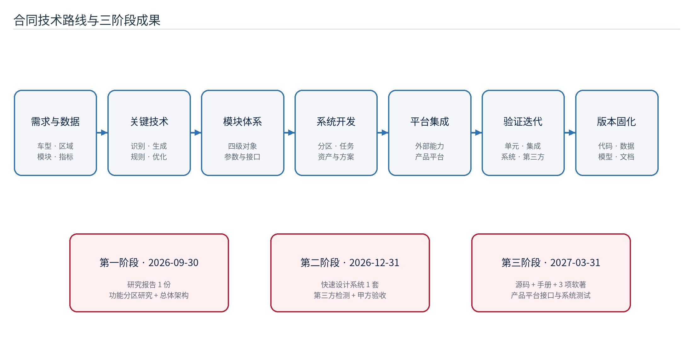
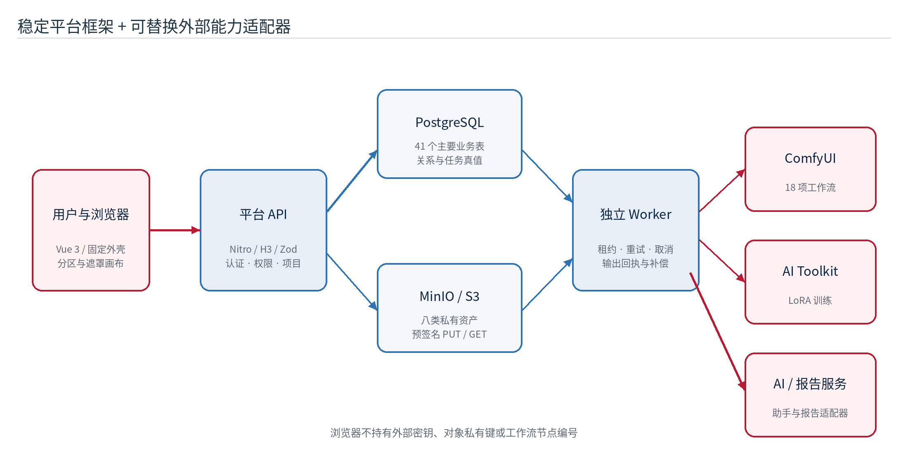
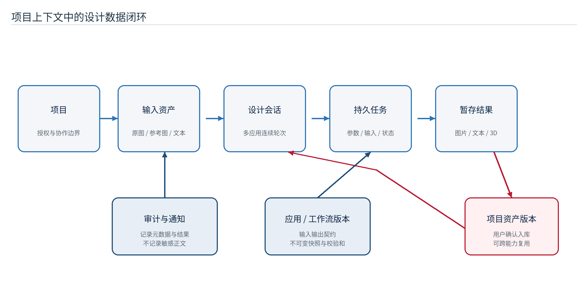
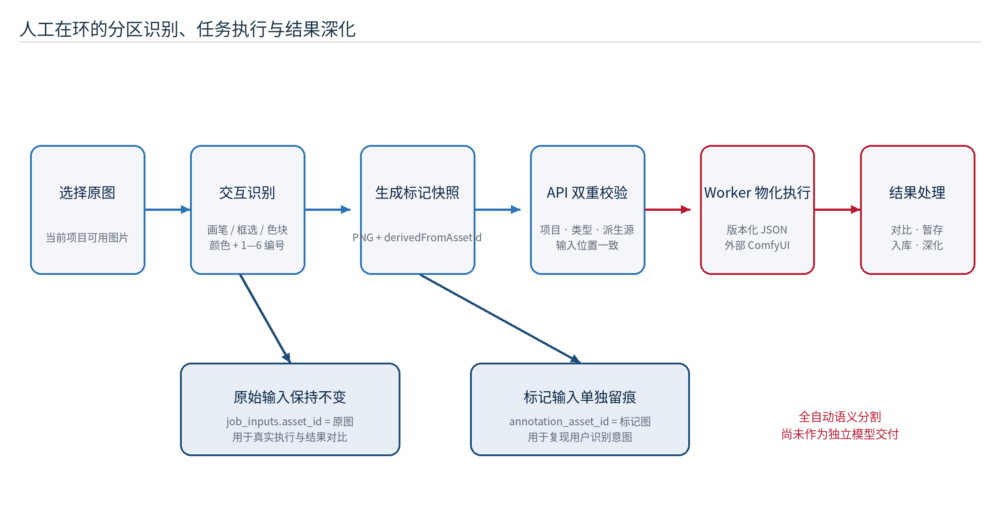
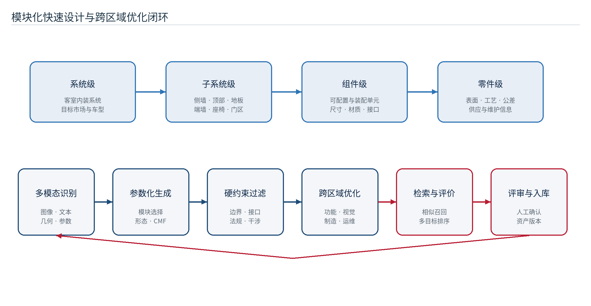
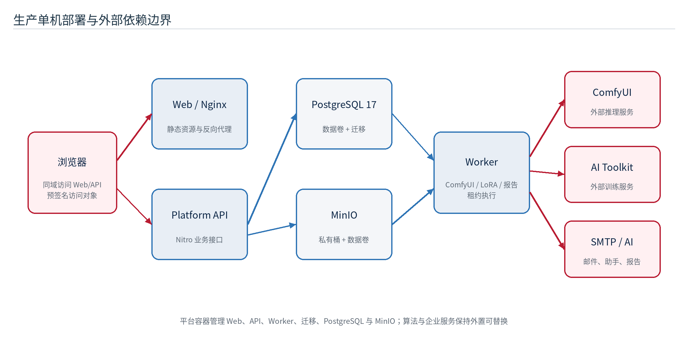

# 摘要

轨道交通客运装备的内装设计同时受车辆边界、功能分区、人机工程、材料工艺、品牌语言、运维安全和交付周期约束。传统方案往往依赖分散的图片、模型、说明文档和外部算法工具，设计意图、局部修改范围、生成参数与结果文件难以在同一项目上下文中追溯，造成重复上传、版本混淆、跨工具协同成本高以及算法结果难以沉淀复用等问题。

本研究依据中车工业研究院有限公司与北京科技大学最新版《面向中车出口产品平台的客运装备内装模块化分区快速设计系统及关键技术研究—技术开发合同（26版）》及其技术规格书，以当前已构建的“客运装备内装模块化分区快速设计平台”为对象，围绕合同第一阶段“功能分区识别技术研究与平台总体架构设计”形成研究成果。报告提出“稳定平台框架 + 可替换外部能力适配器”的系统方案：平台以项目为数据隔离边界，以资产为跨能力交换协议，以设计会话和持久化任务记录一次次设计推演，通过 PostgreSQL 保存用户、权限、项目、资产元数据、任务、通知、审计和会话关系，通过 MinIO/S3 私有桶保存图片、视频、音频、文档、三维模型、模型文件与压缩包，并由 Nitro/H3 平台 API 统一实施身份认证、角色权限、项目范围、参数校验、对象存储控制和审计留痕。

围绕“内装模块分区识别”，当前系统形成了人工在环、可工程落地的分区标注闭环：设计人员在客室或零部件图像上以自由画笔、框选、色块和 1—6 编号描述座椅、扶手、地板、侧墙、顶板、行李架等编辑目标；浏览器生成带标记的 PNG 快照，同时保留标记前原图；后端校验标记图与原始资产的派生关系和输入位置；Worker 将标记协议物化到只读版本化的 ComfyUI 工作流；结果以可对比、可入库、可深化的方式返回设计会话。该路径把“识别对象—编辑区域—生成指令—输出资产”连接起来，但它不是独立的全自动语义分割算法。全自动内装部件检测、语义/实例分割及置信度校核属于后续研究方向，本报告对此不作已交付表述。

围绕“快速设计”，合同要求以模块化、参数化和规则化为基础，研究参数模板、规则引擎、约束检查、方案检索、向量相似度匹配、多目标评价和跨区域优化。本报告将其分解为“四级模块对象—多模态分区识别—参数化方案生成—显式约束过滤—跨区域协同优化—方案评价入库—平台接口交付”的技术路线。当前系统已形成客室零部件、CMF、客室效果和报告生成四类业务模式，接入 18 项版本化 ComfyUI 工作流，并提供局部重绘、多图融合、镜头控制、多视图生三维、图像理解、放大修复、LoRA 训练和 DOCX/PPTX/Markdown 报告生成等链路；专用模块库、规则引擎、向量检索、多目标优化器及中车既有产品平台的专用接口仍属于后续阶段建设内容，不作为当前已实现能力。

当前代码基线包含 31 个顺序迁移、41 个主要业务表、103 个 `/api/v1` 文件式路由。V1.1 编制时重新执行 `pnpm typecheck:rail` 和 `pnpm test:rail`，类型检查通过，平台 API 26 个测试文件、87 项测试和 Web 10 个测试文件、41 项测试全部通过，当前单元测试通过率为 100%。该结果不能替代合同最终要求的三级测试、总体测试用例通过率不低于 99%、无严重及以上缺陷、第三方检测和甲方专家评审；真实 PostgreSQL/MinIO 集成、浏览器全量验收、既有产品平台联调及真实 GPU 推理未在本轮重跑，均列入后续阶段验收计划。

研究表明，当前系统已经完成从需求输入、分区/遮罩标记、外部能力执行、结果暂存、项目资产入库、跨能力深化、任务追踪到报告交付的基础工程闭环，能够支撑合同第一阶段的技术路径论证与总体架构设计。后续阶段应在该底座上补齐客室专用自动识别、四级模块知识模型、工程约束、跨区域优化、方案评价、既有产品平台接口和完整验收证据，最终满足系统指令交互正常、业务流程完整流转、任务真实执行以及成果齐全规范的合同要求。

关键词：轨道交通；客运装备；客室内装；模块分区；人工在环识别；生成式设计；ComfyUI；项目资产；任务血缘；快速设计

# 1 编制说明与研究依据

## 1.1 报告目的

本报告对应合同第一阶段成果“基于轨道交通客运装备的内装模块分区识别与快速设计系统构建研究报告”1 份，计划完成标志为通过甲方验收，合同交付时间为 2026 年 9 月 30 日、交付地点为北京。报告系统说明功能分区识别、多模态识别与分区设计、快速设计算法与优化、跨区域优化、平台总体架构、工程实现、验证策略和后续工作，既描述产品可见功能，也说明支撑功能的 API、数据库、对象存储、Worker、适配器和质量门禁，避免仅凭页面截图判断系统完成度。

本报告不是第二阶段“快速设计系统 1 套”、第三阶段“源代码 1 套、使用手册 1 份及软件著作权 3 项”的替代交付件，也不以研究方案文字替代尚未完成的功能。所有完成度均按“当前代码已实现、已形成技术方案、依赖外部条件、后续阶段建设”四种状态标记。

## 1.2 合同依据与成果定位

| 合同字段 | 本报告采用的信息 |
| --- | --- |
| 项目名称 | 面向中车出口产品平台的客运装备内装模块化分区快速设计系统及关键技术研究 |
| 委托方 | 中车工业研究院有限公司 |
| 受托方 | 北京科技大学 |
| 合同文件 | 技术开发合同（26版）及附件技术规格书 |
| 合同编号 | 合同文件当前未填写，待双方确认 |
| 第一阶段工作 | 内装模块功能分区识别技术研究与平台总体架构设计 |
| 第一阶段成果 | 本研究报告 1 份，纸质文件与电子文件 |
| 第一阶段交付 | 2026 年 9 月 30 日前，北京，甲方专家评审 |
| 合同文件校验 | SHA-256：`1c0d1e8df8721f6d86f15787dbf881df9542493338af5445bfe3c6f21b540fa3` |

合同正文和附件技术规格书是本次改版的需求依据，原文件包含的联系人、电话、邮箱、地址、银行账户和价款等非技术信息不在本研究报告中复述。合同对研究开发成果另有保密、知识产权和品牌使用要求，本报告仅提炼对技术方案、交付和过程治理有直接影响的内容。

## 1.3 代码版本基线

| 基线字段 | 本版记录 |
| --- | --- |
| Git 分支 | `codex/client-feedback-white-shell-20260901` |
| 完整提交哈希 | `51c4095ec269cde31b543dd6c8886802a9a8f452` |
| 短提交哈希 | `51c4095e` |
| 提交时间 | 2026-09-01T21:19:51+08:00 |
| 提交标题 | `fix(project): embed platform navigation into content canvas` |
| 代码取证时间 | 2026-09-03T14:40:10+08:00 |
| 取证时工作区状态 | 仅有 V1.0 合同文档、文档索引和开发日志的未提交变更；应用代码、迁移和部署配置未修改 |
| 远程仓库 | `origin = git@github.com:hywchina/vue-vben-admin.git` |
| 分支说明 | 当前实际分支未配置上游跟踪；本报告如实记录实际基线，不等同于仓库约定的日常 `dev` 分支 |

代码版本是本报告技术结论的首要定位信息。后续功能迭代后，应以新提交重新核验本文的数量、接口、流程、完成度和限制，并发布新文档版本，不得直接沿用本版结论。

## 1.4 研究与取证方法

本报告采用“代码事实优先、文档相互校核、测试结果分级”的方法：

1. 读取技术开发合同（26版）及附件技术规格书，提取研究内容、技术路径、成果形式、质量指标、里程碑和验收方式。
2. 检查当前 Git 分支、提交、远程和工作区状态，建立可重复定位的代码基线。
3. 阅读开发指南、产品需求、系统架构、质量门禁、ComfyUI、LoRA、报告生成和开发日志。
4. 核对前端路由、设计模式目录、分区协议、任务创建接口、工作流目录、31 个迁移和生产 Compose。
5. 针对合同提出的四级模块、规则与约束、向量检索、多目标评价、跨区域优化和既有产品平台接口，在代码中检索真实实现证据，未发现专用实现时明确列为规划项。
6. 统计 API 路由、数据库表、工作流和测试文件，并在本轮重新执行类型检查和单元测试。
7. 将结论划分为“当前代码已实现”“已形成技术方案”“历史材料记录已验证”“本轮重新验证”和“尚未实现/依赖外部条件”五类。

## 1.5 术语与范围

本文所称“内装模块”包括但不限于座椅及附件、扶手、桌板、行李架、地板、侧墙、端墙、顶板、门区、窗区、照明、信息显示、CMF 表面及其他客室可视化设计对象。当前系统并未将上述对象固化为唯一枚举，而是通过项目资产、颜色/编号区域、提示词模板、应用契约和任务血缘灵活表达。

本文所称“分区识别”包含两层含义：一是当前已实现的设计人员对目标区域进行交互识别、编号和语义描述；二是未来可扩展的自动检测、语义分割和实例分割。前者是本版系统事实，后者是研究路线，不混写为同一完成状态。

本文所称“多模态”包括图像、文本、遮罩/分区几何、结构化参数、模块属性和必要的三维视图信息；所称“跨区域优化”是对侧墙、顶部、地板、端墙、座椅及车门周边等区域之间的接口、风格、材质、色彩、纹理和功能约束进行联合校核与方案评价，不等同于仅对一张整图进行生成。

## 1.6 合同技术要求对照总表

| 合同要求 | 本报告响应 | 当前状态 |
| --- | --- | --- |
| 内装模块功能分区识别研究 | 建立四级模块对象、辅助表面/编辑分区及人工在环—自动识别演进路线 | 人工在环已实现；自动识别为后续专题 |
| 多模态识别与分区设计 | 定义图像、文本、几何、参数和多视图的输入协议及候选标注复核机制 | 多模态生成链路已实现；专用识别模型待实现 |
| 内装快速设计算法与优化 | 形成参数化生成、约束过滤、方案检索与评价路线 | 生成式工作流已实现；规则/检索/优化引擎待实现 |
| 跨区域优化设计 | 建立区域依赖图、硬约束与软目标联合优化方法 | 已形成技术方案，尚无专用优化器 |
| 快速设计平台构建 | 项目、资产、任务、四类模式、18 项工作流、权限审计与部署闭环 | 平台基础闭环已实现 |
| 方案数据储存与检索库 | 以项目资产、版本、目录、标签、搜索和血缘形成当前成果库 | 基础库已实现；向量相似检索待实现 |
| 与既有产品平台接口 | 定义身份、项目、模块、资产、任务、回调和审计接口边界 | 通用 REST/适配器基础已实现；专用联调待开展 |
| 三级测试与质量指标 | 规划单元—集成—系统测试和第三方检测证据链 | 单元测试本轮 128/128；最终指标待全量验收 |

# 2 研究背景与问题分析

## 2.1 行业业务特征

轨道交通客室内装不是孤立的造型设计。尤其面向中车出口产品平台时，方案还需要适应不同国家或地区的法规标准、人体尺度、文化审美、气候环境、材料供应、运维习惯和品牌表达，在平台化复用与项目差异化之间取得平衡。设计方案通常需要同时处理车型空间约束、载客与通行组织、无障碍需求、防火与环保、材料耐久、清洁维护、模块安装、视觉识别和制造成本。不同专业人员关注对象不同：总体与工业设计关注空间和语言，结构与工艺关注边界和可制造性，CMF 关注颜色、材料与纹理，算法人员关注输入输出条件，项目管理关注版本、任务和交付物。

合同技术规格书明确将侧墙、顶部、地板、端墙、座椅和车门周边区域列为核心功能区域，并要求同时关注实用性、美观性和独特性。这些区域既具有独立的功能与结构边界，又通过色彩连续、材料接口、安装关系、乘客视线和维护通道相互耦合，因此需要模块化拆解与跨区域协同两类能力并行存在。

这种多专业协作带来三个基本矛盾：第一，设计对象天然按模块和区域组织，而普通生成式图像工具主要接受整图与自然语言；第二，快速生成强调探索速度，工程管理强调可追溯与可复现；第三，外部模型和工作流迭代频繁，平台的用户、权限、项目和资产却必须稳定。

## 2.2 传统流程痛点

- 参考图片、局部截图、材质样本、提示词、模型和报告散落在个人目录或多个工具中，项目边界不清。
- 局部修改往往依赖口头描述，无法稳定表达“哪一块区域、对应什么部件、采用何种修改”。
- 外部算法通常直接返回文件，缺少输入资产、参数、执行状态、输出版本和责任人的统一台账。
- 多轮迭代容易覆盖旧结果，方案对比、复盘和合同交付时难以说明结果来源。
- 外部服务地址、Token 或底层节点参数若直接暴露给浏览器，会形成安全、运维和替换成本。
- 页面成功提示不等于真实能力成功；服务未配置时若以静态样例代替，会破坏验收真实性。

## 2.3 研究问题

本研究围绕以下问题展开：如何按照系统级、子系统级、组件级和零件级建立可复用模块对象；如何把轨道客室图像中的内装模块转化为可供生成工作流消费的分区表达；如何融合图像、文本、遮罩、参数与多视图信息开展多模态识别；如何在不破坏原图血缘的前提下保存标记结果；如何以参数、规则和显式约束控制生成结果；如何对跨区域接口与整体 CMF 一致性进行优化；如何将方案检索、相似度匹配和多目标评价纳入资产库；如何把不同模型、工作流和训练/报告服务纳入统一项目、任务与资产体系；如何与既有产品平台交换项目、模块、资产和任务信息；以及如何保证用户、项目和 AI 私有会话的数据隔离，并对失败给出明确、可审计的结果。

# 3 研究目标、研究内容与研究方法

## 3.1 总体目标

面向中车出口产品平台构建轨道交通客运装备内装模块化分区快速设计系统，形成“模块识别—分区表达—参数配置—方案生成—约束校核—跨区域优化—评价入库—平台交换”的全过程技术体系。设计人员能够在受控项目中完成素材登记、模块分区、生成式方案探索、局部深化、多视角扩展、三维资产形成、模型训练、结果归档和报告交付，并保证全过程具有身份、权限、版本、任务和资产血缘。

## 3.2 分项目标

| 目标方向 | 目标描述 | 当前实现状态 |
| --- | --- | --- |
| 分区表达 | 支持颜色、自由画笔、框选、色块与编号描述内装目标区域 | 已实现，人工在环 |
| 快速生成 | 将文本、图像、遮罩、分区、多图和镜头参数提交到版本化工作流 | 已实现平台链路，执行依赖外部服务 |
| 连续深化 | 结果经用户确认成为项目资产后，可在同一设计会话进入其他能力 | 已实现 |
| 资产治理 | 统一管理八类文件资产、目录、版本、收藏、预览、下载与软删除 | 已实现；前端版本历史仍有缺口 |
| 任务治理 | 持久记录输入、参数、状态、输出、取消、错误和执行租约 | 已实现 |
| 专项能力 | LoRA 训练与 DOCX/PPTX/Markdown 报告生成进入统一 Worker 链路 | 已实现代码与受控接口，外部 AI/训练服务依赖配置 |
| 自动识别 | 自动检测并分割座椅、地板、侧墙等客室部件 | 尚未作为独立模型交付 |
| 四级模块体系 | 按系统级、子系统级、组件级、零件级管理对象、属性和接口 | 已形成模型方案；专用模块库待实现 |
| 参数化与规则化 | 管理尺寸、位置、接口、材质、色彩、纹理及适用范围并校核约束 | 参数 Schema 与提示词模板已实现；规则/约束引擎待实现 |
| 跨区域优化 | 协同优化侧墙、顶部、地板、端墙、座椅和门区的接口与视觉目标 | 已形成方法方案；专用优化器待实现 |
| 方案检索与评价 | 支持元数据检索、向量相似匹配和多目标方案排序 | 元数据搜索已实现；向量检索与多目标评价待实现 |
| 产品平台接口 | 与既有产品平台交换项目、模块、资产、任务和交付信息 | 通用 API 基础已实现；专用协议和联调待完成 |

## 3.3 设计原则

1. 稳定平台与外部能力解耦：平台保存身份、项目、资产和任务；模型细节只进入后端适配器。
2. 项目是数据边界：任何资产、任务、成员和会话查询必须校验项目范围。
3. 资产是交换协议：外部输出只有登记为项目资产后，才能被其他能力复用。
4. 真实失败优先：未配置、超时、协议错误或输出缺失必须失败，不生成静态成功数据。
5. 原图与标记图分离：Worker 消费关系、界面展示和结果对比均保留清晰来源。
6. 前端可见性不代替后端授权：菜单与按钮只改善交互，最终授权在 API。
7. 数据最小暴露：浏览器不获得外部服务密钥、对象存储私有键和底层工作流节点编号。
8. 硬约束优先于生成结果：尺寸、位置、接口、区域边界和适用范围由结构化参数和显式规则校核，图像生成结果不能替代工程依据。
9. 平台化复用与区域适配并重：模块与规则可复用，车型、国家/地区、审美和供应链差异通过受控参数、版本与项目配置表达。

## 3.4 总体技术路线与阶段划分

合同技术规格书规定的总体路线为“需求与数据梳理 → 关键开发技术识别与研究 → 功能模块体系搭建 → 快速设计系统开发 → 平台集成 → 验证与迭代优化 → 版本固化”。本研究将其落实为以下七个工程阶段：

1. 需求与数据梳理：收集车型、客室区域、模块、材料、接口、法规、设计案例和验收指标，建立数据分级与授权清单。
2. 关键技术研究：论证四级模块拆解、多模态识别、生成式设计、规则约束、跨区域优化、方案检索和多目标评价方法。
3. 模块体系搭建：定义模块对象、参数、接口、区域、版本、适用车型和资产关联，并形成可审查的数据字典。
4. 快速设计开发：建设分区标注、参数化配置、生成/重绘、多图与多视图、方案比较、资产入库和任务治理能力。
5. 平台集成：通过后端适配器接入模型、工作流和既有产品平台，统一身份、项目、资产与审计边界。
6. 验证迭代：执行单元、集成和系统测试，开展真实外部服务、性能、安全、兼容性及用户场景验收，并闭环缺陷。
7. 版本固化：冻结代码、迁移、工作流、模型、配置、文档、测试报告和交付清单，形成可复现基线。

## 3.5 研究内容体系

本研究不是对既有平台页面的功能罗列，而是以“轨道交通客运装备内装模块如何被识别、表达、生成、校核、评价和复用”为主线，将研究内容组织为七个相互衔接的专题。每个专题同时形成概念模型、技术方法、平台承载方式和可验证证据，避免算法研究与工程系统彼此脱节。

| 研究专题 | 核心研究内容 | 主要研究产出 | 当前阶段证据 |
| --- | --- | --- | --- |
| 内装模块化分解 | 研究侧墙、顶部、地板、端墙、座椅及车门周边等区域的功能边界、四级层次、参数、接口和适用范围 | 四级模块模型、模块编码原则、属性与接口框架 | 本报告 5.5、6.1 的目标模型与现有资产主干映射 |
| 多模态分区识别 | 研究图像、文本、几何笔划、颜色/编号、参数和多视图信息的联合表达，以及自动候选与人工复核关系 | 分区协议、数据集方案、人工在环与自动识别演进路径 | 当前颜色/编号分区、原图/标记图双快照和任务输入协议 |
| 参数化快速设计 | 研究模块尺寸、位置、形态、材料、颜色、纹理、表面工艺和环境参数的结构化表达与生成映射 | 参数模板、工作流 Schema、提示词模板、版本化生成任务 | 四类业务模式、18 项工作流和参数校验链路 |
| 规则与约束校核 | 研究车辆边界、通道净宽、接口尺寸、安装位置、材料等级、无障碍和运维约束的分类、表达与执行顺序 | 硬约束、条件规则、软目标、命中记录和规则版本方案 | 当前参数校验与权限边界；专用规则引擎为后续建设项 |
| 跨区域协同优化 | 研究核心区域间的接口、视觉连续、功能依赖、维护空间和总体 CMF 一致性 | 区域依赖图、多目标函数、候选方案集与人工决策机制 | 本报告 7.7 的方法设计；当前尚无专用优化器 |
| 方案检索与评价 | 研究按模块、车型、市场、材料、任务血缘和视觉语义检索历史方案，并开展多维评价 | 结构化过滤、向量召回、评价指标、评审记录与基线方案 | 元数据搜索和资产版本已实现；向量检索与多目标评价待实现 |
| 平台构建与集成 | 研究如何用项目、资产、任务、适配器、权限和审计承载上述能力，并与既有产品平台交换数据 | 总体架构、领域模型、API 边界、部署方案、测试与交付体系 | 当前代码、迁移、部署配置、类型检查和单元测试证据 |

七个专题之间存在清晰的数据依赖：模块化分解提供识别类别和参数字典；分区识别确定设计对象及空间范围；参数化生成产生候选方案；规则与约束过滤不可行解；跨区域优化处理局部方案之间的耦合；检索与评价支持方案选择和知识复用；平台构建保证上述研究成果能够在真实项目中被持续执行、记录和交付。

## 3.6 研究方法框架

本研究采用“规范分析 + 系统工程 + 领域建模 + 人机协同 + 原型验证 + 实证评价”的混合研究方法。研究方法既服务于第一阶段的技术路线论证，也为第二阶段系统开发和第三阶段平台联调提供可重复的验证程序。

1. **合同与规范分析法。** 对合同正文、附件技术规格书、项目文档、质量门禁和部署要求进行条目化编码，提取研究对象、技术目标、质量阈值、交付物、里程碑和验收方式；使用合同要求追踪矩阵把每条要求关联到报告章节、代码证据、当前状态和后续行动。该方法解决“研究范围是否完整、结论是否对应合同”的问题。
2. **系统工程分解法。** 采用“目标—功能—对象—数据—能力—验证—交付”的逐层分解逻辑，把总体目标拆解为分区识别、快速设计、约束优化、成果库和平台接口等子目标，再把每个子目标落实到输入、处理、输出、失败路径和验收证据。四级模块体系同时采用自顶向下功能分解与自底向上零部件聚类，避免只按页面或算法划分系统。
3. **领域驱动建模法。** 以项目、模块、区域、资产、应用、工作流、任务、方案、评价和审计为核心对象，分析其标识、状态、版本、归属和关系。对于尚未进入代码的模块库、规则库和特征索引，先定义与现有项目—资产—任务主干兼容的目标模型，使后续迁移能够增量实施而不破坏历史数据。
4. **多模态信息融合法。** 将客室图像的像素特征、文本需求的语义特征、分区笔划的几何特征、模块参数的结构化特征和多视图的空间一致性作为互补证据。当前阶段以人工确认的颜色/编号分区作为可靠锚点；自动识别阶段输出候选类别、掩码、边界和置信度，再由设计人员复核后转入正式生成任务。
5. **人机协同研究法。** 将算法定位为候选生成与辅助识别工具，将设计师定位为语义确认、工程判断和方案决策主体。研究关注的不只是模型精度，还包括人工确认时间、边界修订量、错误发现率、方案采纳率和下游任务成功率，以评价系统是否真正提升设计效率。
6. **快速原型与迭代研究法。** 以可运行平台为研究载体，通过“需求假设—工作流原型—受控任务—结果资产—用户反馈—版本固化”循环检验技术方案。外部模型、节点和服务通过适配器替换，平台的用户、项目、资产与任务模型保持稳定，从而把算法试验和业务数据治理分离。
7. **对照实验与消融分析法。** 对文本直接生成、人工分区生成、自动候选后人工复核、规则校核前后、检索辅助前后以及单区域与跨区域优化等路径设置对照组，比较质量、效率、可复现性和约束满足情况。对多模态方法分别移除文本、分区、参数、参考图或规则信息，分析各模态对结果的贡献。
8. **代码取证与可重复验证法。** 以 Git 提交为系统事实基线，统计迁移、业务表、API 路由、工作流和测试结果，并把每个“已实现”结论定位到代码、数据库、配置或测试。未在当前基线发现专用实现的能力，不因合同出现相关术语而推定已经完成。
9. **场景驱动验证法。** 以设计人员的真实工作链路构造场景：建立项目、导入原图、标记区域、提交任务、比较结果、确认入库、继续深化、生成报告，并加入跨用户访问、外部服务未配置、任务取消、对象登记失败等异常场景。场景验证同时覆盖功能、权限、数据血缘和失败真实性。

## 3.7 研究实施过程与证据链

研究实施遵循“问题定义—模型构建—方法设计—平台实现—试验验证—结论形成”六步过程。第一步根据合同和业务访谈材料明确功能区域、业务角色和交付指标；第二步建立四级模块、分区对象和项目资产领域模型；第三步设计多模态识别、参数化生成、规则校核、跨区域优化和方案评价方法；第四步在现有平台中落实可实现的项目、资产、任务、分区和外部工作流链路；第五步使用代码检查、自动化测试和后续场景实验验证；第六步将证据分为已实现、已形成方案、依赖外部条件和尚未实现，形成阶段性结论。

每项研究结论至少应保留四类证据中的两类，关键验收结论应尽可能覆盖全部类型：一是需求证据，包括合同条目、评审纪要、需求确认单和变更记录；二是设计证据，包括领域模型、架构图、接口协议、参数 Schema、工作流版本和规则版本；三是实现证据，包括 Git 提交、数据库迁移、API 路由、前端交互和部署配置；四是验证证据，包括数据集版本、测试用例、执行日志、指标结果、截图/视频、缺陷记录和验收证明。

为保证研究可复现，每轮实验或系统验证应形成唯一记录，至少包含研究问题、假设、代码提交、模型/工作流版本、输入资产版本、参数、随机种子、执行环境、开始结束时间、输出资产、异常信息、评价人和结论。任何重新运行不得覆盖原记录；参数、模型或数据发生变化时生成新任务和新资产版本。

## 3.8 评价指标与计算方法

评价体系分为识别效果、设计质量、工程约束、检索能力、人机效率、平台可靠性和交付质量七个维度。指标既用于算法横向比较，也用于判断研究成果能否进入下一阶段。

| 评价维度 | 代表指标 | 计算或判定方法 | 使用目的 |
| --- | --- | --- | --- |
| 分区识别 | Precision、Recall、F1、IoU、mIoU、Boundary F-score | IoU = 预测区域与真值区域交集面积 / 并集面积；mIoU 为各类别 IoU 的平均值 | 比较检测、语义分割、实例分割和提示式分割的区域准确性 |
| 人机协同 | 单图确认时间、边界修订率、类别修改率、漏检发现率 | 修订率 = 被人工修改的边界长度或区域面积 / 自动候选总量 | 判断自动候选是否真正减少设计人员负担 |
| 生成质量 | 局部编辑命中率、原结构保持率、文本—图像一致性、多视角一致性 | 机器指标与专家盲评结合；对目标区域和非目标区域分别评价 | 避免只追求整体美观而破坏未编辑区域 |
| 工程约束 | 硬约束通过率、规则命中准确率、接口冲突数、整改次数 | 硬约束通过率 = 通过全部阻断规则的方案数 / 候选方案数 | 过滤尺寸、位置、接口和安全条件不满足的方案 |
| 方案检索 | Recall@K、Precision@K、MRR、nDCG@K | 以专家标注的相关方案集为真值，评价召回和排序质量 | 验证相似方案推荐是否具有业务价值 |
| 综合评价 | 加权得分、Pareto 前沿规模、专家一致性 | 归一化指标乘以版本化权重；硬约束不满足的方案不得进入排序 | 支持功能、美观、制造、运维、成本和复用率多目标权衡 |
| 平台质量 | 任务成功率、P95 响应/排队时间、失败可解释率、血缘完整率 | 统计真实任务，不把未配置服务计为成功；血缘字段缺失即不完整 | 评价系统在真实部署中的可靠性与可追溯性 |

对于单个类别 c，精确率可表示为 Precision(c) = TP(c) / [TP(c) + FP(c)]，召回率为 Recall(c) = TP(c) / [TP(c) + FN(c)]，F1(c) = 2 × Precision(c) × Recall(c) / [Precision(c) + Recall(c)]。对于区域分割，除面积重合度外必须评价边界误差，因为座椅扶手、门边和窗框等细长对象即使面积 IoU 较高，也可能存在影响局部重绘的明显边界偏差。

综合方案评价不直接把各项原始值相加。设方案 j 在指标 i 上的归一化得分为 x(i,j)，权重为 w(i)，则候选综合得分 S(j) = Σ w(i) × x(i,j)，且 Σw(i) = 1。权重由设计、工程、制造、运维和项目人员共同确认并版本化；若方案违反阻断级硬约束，则无论 S(j) 多高都不得进入正式候选集。对于难以形成稳定权重的场景，保留 Pareto 非支配解集，由专家结合项目目标做最终决策。

## 3.9 实验设计与研究假设

为把研究路线转化为可验证命题，本报告设计六组递进实验。当前 V1.1 已完成平台底座、人工分区和单元测试层面的证据整理；需要专用数据集、真实模型、GPU、规则库和既有产品平台的实验，列入后续阶段实施，不以方案设计冒充实验结果。

| 实验编号 | 研究假设 | 对照与实验设置 | 主要观测指标 | 当前状态 |
| --- | --- | --- | --- | --- |
| E1 | 明确分区比纯文本描述更能控制局部修改范围 | 同一原图、同一提示词和随机种子，对比无分区、颜色分区、编号分区 | 局部命中率、非目标区域变化率、专家偏好 | 平台支持实验；真实模型批量结果待采集 |
| E2 | 自动候选加人工复核比完全人工标注更高效，同时保持可接受精度 | 完全人工、自动结果直接使用、自动候选后复核三组 | mIoU、修订时间、错误发现率、下游成功率 | 需专用自动识别模型和标注集 |
| E3 | 参数模板和规则校核能够降低无效任务与工程冲突 | 自由参数提交与 Schema/规则校核后提交对比 | 无效提交率、约束通过率、返工次数 | Schema 已有；工程规则库待实现 |
| E4 | 结构化过滤与向量检索结合比关键词检索更能召回可复用方案 | 关键词、元数据过滤、向量召回、混合检索四组 | Recall@K、nDCG@K、检索耗时、采纳率 | 元数据检索已有；向量索引待实现 |
| E5 | 跨区域联合评价比逐区域局部最优更能保持总体一致性 | 各区域独立生成与区域依赖约束下联合生成/筛选对比 | 接口冲突、CMF 一致性、专家评分、Pareto 解集 | 方法已设计；优化器和评价集待实现 |
| E6 | 稳定平台框架能够降低模型或工作流替换对业务数据的影响 | 更换工作流版本或适配器，比较任务、资产和权限链路 | 数据迁移量、接口改动量、历史可复现率、失败恢复时间 | 当前架构具备实验条件，目标环境验证待开展 |

实验应尽量采用配对设计：同一车辆、视角、原图和需求在不同方法下重复执行，以降低素材差异造成的偏倚；生成式任务固定或记录随机种子、模型、采样器和工作流版本；主观评价采用匿名随机顺序，至少由工业设计、工程和项目三个角色独立评分，并计算一致性。正式结论同时报告平均值、中位数、标准差、置信区间和失败样本，不只展示最佳案例。

## 3.10 数据采集、样本分层与标注方法

研究数据应覆盖车型、车厢、目标市场、功能区域、拍摄视角、光照、遮挡、反射、分辨率、设计阶段和数据来源等差异。核心区域至少包括侧墙、顶部、地板、端墙、座椅和车门周边，并进一步覆盖窗间板、行李架、扶手、灯带、桌板、信息显示、无障碍设施等高频组件。为避免模型只记忆单一车型，训练、验证和测试集优先按车辆或项目分组切分，不把同一场景的相邻帧随机分散到不同集合。

标注规范应同时支持四级模块类别、实例编号、可见/遮挡状态、镜面与窗外区域、边界处理、小目标、不确定标签和忽略区域。双人独立标注后由高级标注员或设计专家仲裁，记录类别修改、边界修订和仲裁原因。对不同标注员计算类别一致率、IoU 或 Cohen's Kappa 等一致性指标；一致性低的类别优先修订定义和示例，而不是直接扩大训练量。

数据治理方面，每项素材应记录权属、授权范围、脱敏状态、可用于训练/验证/展示的范围、保存期限和退出机制。原始数据、标注数据、增强数据和模型输出分层存储；增强操作必须记录方法和参数，避免增强样本泄漏到测试集。涉及出口产品、客户车辆或未公开设计时，训练与评审环境应采用私有存储、最小权限和审计访问。

## 3.11 有效性、可靠性与研究局限控制

本研究需要控制四类有效性威胁。内部有效性方面，模型版本、随机种子、图像质量和评价人差异可能影响结果，需通过配对实验、参数冻结、重复运行和盲评降低干扰。外部有效性方面，单一车型或少量示范图不能代表全部出口市场，应按车型、区域、视角和环境分层抽样，并在新项目上进行留出验证。构念有效性方面，美观、独特性和实用性不能被单一图像相似度替代，应采用算法指标、工程规则和多角色专家评价结合。结论有效性方面，小样本下的百分比波动较大，应报告样本量、区间和失败案例，不把演示成功等同于统计结论。

当前 V1.1 的局限在于：尚未获得可在仓库中核验的客室专用自动识别模型、完整标注集、工程规则库、向量检索服务、跨区域优化器、目标部署环境 GPU 结果、第三方检测报告及既有产品平台联调记录。因此，本报告对这些内容给出研究方法、实验设计、数据边界和验收路径，而对当前系统结论只采用代码、迁移、配置和本轮测试能够支持的证据。该限制说明本身是研究真实性的一部分，也为后续版本定义了清晰的补证任务。

# 4 系统总体方案

## 4.1 总体架构

系统采用浏览器 Web、平台 API、关系数据库、对象存储、独立 Worker 和外部能力服务六类组件。Web 负责固定平台外壳、业务表单、分区/遮罩画布、任务时间线和结果呈现；API 负责认证、权限、项目范围、数据校验和存储控制；Worker 通过数据库租约领取任务并调用 ComfyUI、AI Toolkit 或报告适配器；PostgreSQL 与 MinIO/S3 分别保存关系数据和大文件。

架构中没有从浏览器直连 ComfyUI 或训练服务的旁路。外部服务即使离线，项目、资产、任务、通知、审计和历史设计仍由平台保持一致；算法恢复后可在原任务体系内继续执行或重新提交。

## 4.2 技术栈

| 层级 | 当前技术 | 主要职责 |
| --- | --- | --- |
| Monorepo | pnpm 11.16.0、Turborepo | 依赖、脚本、构建与多应用协作 |
| Web | Vue 3、TypeScript、Vite、Vue Router、Pinia | 固定平台外壳、业务页面、状态缓存与交互画布 |
| UI | Ant Design Vue、本地 Lucide 图标、SCSS/CSS | 表单、弹窗、表格、状态和轨道交通品牌视觉 |
| API | Nitro 2、H3、TypeScript、Zod | `/api/v1` 文件式 REST、校验、统一响应和错误码 |
| 数据访问 | postgres.js、PostgreSQL 17 | 事务、关系模型、权限、任务和审计 |
| 对象存储 | AWS SDK v3、MinIO/S3 私有桶 | 多模态文件、预签名上传、预览与下载 |
| 身份与安全 | JOSE JWT、scrypt、SHA-256、HttpOnly Cookie | 访问令牌、密码散列、刷新会话和重置令牌摘要 |
| 外部能力 | ComfyUI、AI Toolkit、OpenAI 兼容服务、报告适配器 | 图像/文本/三维生成、LoRA 训练、AI 助手和报告生成 |
| 质量体系 | Vitest、vue-tsc、Playwright、ESLint/Oxlint/Stylelint | 单元、类型、浏览器、代码质量和构建门禁 |

## 4.3 固定平台外壳与信息架构

当前界面采用白色顶部品牌栏、全宽标签栏、嵌入内容画布的竖向导航和业务内容区。六个主要入口按“首页、设计生成、模型训练、资产中心、报告生成、设计工作台”排列。设计页面在平台导航右侧增加可独立折叠的历史任务栏，主区域承载多轮结果与底部输入器。任务中心、用户权限、工作流管理和操作日志不作为一级导航堆叠，而从项目或管理入口进入。

该结构保持“平台上下文不变、应用内容可替换”：切换工作流不会移除项目、用户、通知和全局 AI 助手，也不会让单个算法页面脱离权限与资产体系。

# 5 领域模型与数据底座

## 5.1 核心领域关系

项目、资产、应用、任务、设计会话和审计构成系统主干：项目定义授权与协作范围；资产表达输入输出；应用发布业务能力及输入输出契约；任务冻结某次执行的应用、参数、输入、标记快照和输出；设计会话将多个应用任务组织为连续方案过程；审计记录访问和关键动作元数据。

## 5.2 数据规模与迁移事实

当前提交包含 `001_platform_core.sql` 至 `031_component_and_cabin_prompt_templates.sql` 共 31 个顺序迁移，声明 41 个主要业务表。表结构已覆盖：

- 身份权限：`users`、`roles`、`permissions`、`user_roles`、`role_permissions`、`refresh_sessions`、`password_reset_tokens`；
- 项目协作：`projects`、`project_members`、`project_user_pins`、`user_preferences`；
- 资产体系：`assets`、`asset_versions`、`asset_tags`、`asset_folders`、`asset_favorites`；
- 任务与工作流：`jobs`、`job_inputs`、`job_outputs`、`job_executions`、`job_output_receipts`、工作流定义/版本/绑定/草稿/实例/流转与心跳表；
- 会话与模板：设计会话、会话草稿、设计提示词模板目录；
- 专项能力：LoRA 训练执行与产物回执、报告生成执行；
- 平台治理：通知、审计、AI 对话、消息与附件。

## 5.3 八类统一资产

系统文件类型固定为 `image`、`video`、`audio`、`text`、`document`、`model3d`、`model` 和 `archive`。遮罩、CMF、LoRA 和报告属于业务用途，通过标签、来源应用、任务输入输出和版本元数据表达，而不是无限扩展文件类型枚举。

小文本可写入 PostgreSQL；图片、视频、音频、文档、三维模型、模型文件和压缩包写入 MinIO/S3 私有桶。浏览器先向平台申请短时预签名地址，再直传对象存储，完成后 API 使用 HEAD 校验对象存在性与大小并登记可用状态。预览和下载同样先校验用户、项目和资产版本，再签发短时 GET 地址。

## 5.4 稳定业务编号

关系表内部使用 UUID，用户界面和业务沟通使用稳定编号：用户 `USR-000001`、项目 `CR-2026-0001`、资产 `AST-00000001`、任务 `TSK-00000001`。这种双标识设计兼顾数据库关联稳定性和合同、评审、审计场景下的可读性。

## 5.5 模块知识与方案检索的数据架构

当前项目资产、目录、标签、版本、来源应用、任务输入输出和派生关系已经构成方案成果库的工程底座，可按名称、业务编号、标签、成员、文件类型和时间进行检索。为满足合同对模块化、参数化、规则化、方案检索和向量相似匹配的完整要求，后续数据层建议在不改写既有迁移的前提下追加以下领域对象：

| 目标对象 | 核心字段 | 与现有平台关系 |
| --- | --- | --- |
| 模块定义 | 模块编号、四级层级、名称、职责、适用区域、父子关系、版本 | 关联项目、资产和设计任务 |
| 模块参数 | 参数编码、数据类型、单位、范围、默认值、枚举、适用条件 | 复用工作流参数 Schema 的校验思想 |
| 模块接口 | 接口类型、位置、方向、尺寸、公差、连接对象 | 支撑装配与跨区域硬约束 |
| 设计规则 | 规则表达式、严重级别、适用车型/区域、依据、版本 | 任务提交前检查并记录命中结果 |
| 方案特征 | 文本向量、图像向量、结构化特征、模型版本 | 关联具体资产版本，不覆盖原始文件 |
| 评价记录 | 指标、权重、原始值、归一值、人工意见、评价版本 | 关联候选方案资产和评审人 |

上述对象在当前代码中尚无独立业务表和专用 API。本报告给出的是与现有项目—资产—任务主干兼容的目标模型，实施时应从 `032_*.sql` 或当时实际的下一顺序迁移开始追加，不得修改已应用的 `001` 至 `031` 历史迁移。

# 6 内装模块分区识别研究与实现

## 6.1 分区对象模型

客室内装设计中的“区”既可能是物理部件，也可能是视觉或工艺区域。例如同一座椅可进一步区分靠背、坐垫、扶手和壳体；同一侧墙可按窗间板、门区、广告位和照明带划分；CMF 设计还可能按颜色、材料、纹样或表面处理划分。因此，系统不把分区简化成固定矩形，而采用“底图 + 几何笔划 + 颜色 + 可选编号 + 语义指令”的组合表达。

按照合同技术规格书的功能驱动模块化分区拆解法，主模块树采用系统级、子系统级、组件级和零件级四级结构：

| 层级 | 定义 | 客室内装示例 | 关键属性 |
| --- | --- | --- | --- |
| 系统级 | 面向整车功能场景的最高级内装系统 | 客室内装系统、乘客服务系统 | 车型、车厢、总体边界、目标市场 |
| 子系统级 | 具有相对独立职责和区域边界的功能系统 | 侧墙、顶部、地板、端墙、座椅、车门周边、行李架、照明信息 | 功能区域、接口集合、适用范围 |
| 组件级 | 可独立配置、装配或替换的组件 | 窗间板、顶板单元、地板单元、座椅单元、门罩板、灯带、桌板 | 尺寸、位置、材质、颜色、纹理、连接关系 |
| 零件级 | 组成组件的最小受控对象 | 靠背面套、坐垫、扶手壳、紧固件、装饰条、密封件 | 材料、表面、工艺、公差、供应信息 |

空间级、表面级和编辑级不与四级主模块树竞争，而作为辅助维度：空间级描述客室、门区、端部、通道和无障碍区；表面级描述颜色、材料、纹样及表面处理；编辑级记录本轮需要重绘、替换、保留或屏蔽的局部范围。一个分区因此可同时引用“所属四级模块、所在空间、表面方案和本轮操作”。

## 6.2 当前识别方式：人工在环的交互标注

当前系统的分区识别入口由设计人员完成目标判断，画布工具负责结构化记录。`RegionStroke` 协议记录模式、几何类型、画笔尺寸、不透明度、RGB 颜色、可选 1—6 编号和点序列，支持自由画笔、框选、实心方块与擦除。编号分区适合把“1 号座椅、2 号地板、3 号侧墙”等目标与自然语言修改要求对应；无编号颜色分区适合一次描述多个颜色区域。

该方式的研究价值在于：它不依赖尚未具备的专用训练数据即可投入设计流程；标注意图由设计师确认，减少自动分割误识别直接进入生成任务的风险；协议与 ComfyUI EasyMark 类节点语义一致，可把交互数据稳定物化到外部工作流。

## 6.3 原图、标记图与血缘

分区提交不是简单覆盖原图。浏览器根据原始资产的受控预览地址，在原始像素尺寸画布上绘制分区层并生成 PNG 标记快照；保存标记资产时写入 `derivedFromAssetId`；任务创建接口检查标记图是当前项目的可用图片、派生源与对应输入位置的原图一致。数据库 `job_inputs.asset_id` 始终保留 Worker 语义上的原始输入，`annotation_asset_id` 单独记录用户可见的分区标记快照。

这种双快照设计支持三类追溯：一是查看本轮输入时同时看到标记前原图和分区图；二是对比生成结果时以标记前原图为左图，避免误把彩色标记当成设计基准；三是审计或复现任务时能够核对用户当时选择的区域与指令。

## 6.4 遮罩与分区的差异

遮罩主要表达像素级“可编辑/不可编辑”范围，适用于局部重绘；分区同时表达多个区域及编号语义，适用于多目标修改。系统为两者提供共享画布能力，但保持输入契约、派生血缘和结果比较语义清晰。遮罩工具支持画笔、橡皮、填充、反转、边界容差、旋转和镜像等；分区工具支持颜色和编号协议。两类结果都先登记为当前项目图片资产，再进入任务。

## 6.5 现阶段能力边界

仓库中没有独立的自动客室部件检测或语义分割模型，也没有“上传图像后自动输出座椅/地板/侧墙掩码及置信度”的 API。因此，本版系统准确表述为“分区交互识别与标注 + 生成式编辑”，不表述为“全自动分区识别已完成”。ComfyUI 的图像理解能力可生成文本描述，但不能替代具有类别、像素边界、实例编号和指标评测的专业分割服务。

## 6.6 自动识别扩展路线

后续自动识别适配器可复用当前平台边界，建议形成以下流程：

1. 建立轨道客室部件本体与标注规范，明确类别层级、遮挡、镜面、窗外区域和小部件规则。
2. 使用项目授权数据形成训练/验证/测试集，记录车型、视角、光照和域偏移标签。
3. 接入检测、语义分割或实例分割服务，输出类别、掩码、边界、多边形、置信度和模型版本。
4. 自动结果先作为“候选标注资产”进入人工复核，不直接覆盖原图或自动触发生成。
5. 复核后的掩码/分区转换为现有 `annotation_asset_id` 与参数协议，继续使用任务、资产和审计链路。
6. 以 IoU、mIoU、边界 F-score、漏检率、人工修订时间和设计任务成功率综合评估，而非只看模型推理速度。

## 6.7 多模态识别与分区设计技术路径

合同要求“提出并实现基于客室内装模块划分的多模态识别与分区设计技术路径”。结合当前平台能力，本研究将路径定义为五层：

1. 多源输入层：接收客室照片、效果图、平面图、局部截图、前后左右多视图、文本需求、车型参数和已有模块清单。
2. 视觉识别层：使用检测、语义分割、实例分割或提示式分割产生候选类别、掩码、多边形、边界和置信度；在专用模型完成前由人工在环分区协议承担可运行入口。
3. 语义融合层：将视觉候选与文本中的部件名称、功能、材质、色彩和修改指令对齐，映射到四级模块编号及区域编号。
4. 人工复核层：设计人员确认类别、边界、遮挡关系和实例编号，系统保留模型原始输出、人工修订和最终标注三个版本。
5. 分区设计层：把已确认分区、原图、语义指令和结构化参数冻结为任务输入，调用局部重绘、编号分区、多图融合或其他工作流，结果进入对比、评价和资产化流程。

该路径中的第 4—5 层及人工标注入口已由当前系统支持；自动视觉识别、四级模块自动映射和三版本候选标注存储仍需后续实现。自动结果不得直接触发正式生成或覆盖人工成果，应先进入复核状态。

## 6.8 识别数据集与评价设计

客室专用识别数据集应按车型、车厢、区域、视角、光照、遮挡、反射、分辨率和目标市场分层抽样，训练集、验证集与测试集在车辆或项目层面隔离，避免同一场景相邻帧跨集合泄漏。标注规范至少包括四级模块类别、实例编号、可见/遮挡状态、边界处理、镜面与窗外区域、小目标和不确定标记。

评价分为三组：算法指标使用 AP、IoU、mIoU、边界 F-score、漏检率和置信度校准；人机协同指标使用单图确认时间、边界修订量、类别修改率和一致性；业务指标使用分区设计任务成功率、局部编辑命中率、原结构保持率和方案被采纳率。只有在目标车型测试集和真实设计任务中同时达到约定阈值，自动识别适配器才能由“候选能力”转为“已验收能力”。

# 7 快速设计系统构建

## 7.1 四类业务模式

| 业务模式 | 典型对象 | 首屏能力 | 设计输出 |
| --- | --- | --- | --- |
| 客室零部件生成 | 座椅、桌板、行李架等 | 文生图、局部重绘、标记修改、多图融合、多角度、三维、放大、理解 | 图片、文本、三维模型 |
| CMF 生成 | 颜色、材料、纹理和表面图案 | 文生图、局部重绘、多图融合、放大、理解、提示词模板 | 纹样图、材质方案、说明文本 |
| 客室效果生成 | 整体空间、环境、平面图与材料组合 | 文生图、标记生成、局部重绘、部件/材质融合、平面图填色、环境更改、放大、理解 | 效果图、对比图、文本说明 |
| 报告生成 | 项目文字和图片资产 | 报告类型、格式、标题、摘要、章节和图片编排 | DOCX、PPTX、Markdown |

业务模式只对后端已发布且当前用户可见的能力进行筛选、排序和语义包装，不另建静态数据旁路。某项能力缺失真实契约或适配器时，界面必须提示不可用。

## 7.2 统一输入器与媒体槽位

统一输入器按能力 Schema 动态呈现文本、数值、选项和媒体槽位。需要图片的工作流在编辑框上方显示有序托盘，本地文件先登记为项目资产；用户也可从资产中心的多级目录与收藏视图选择。固定需要 N 张图片时，少于 N 张阻止提交，超过 N 张只接受原选择顺序中的前 N 张并提示。三维生成明确要求前、左、后、右四视图，多角度生成只消费一张来源图。

每个应用的参数与输入槽位按用户、项目、设计会话和应用持久保存；恢复时后端重新校验资产是否仍存在、已入库、属于当前项目且类型兼容，避免把浏览器缓存当作业务真值。

## 7.3 多轮设计会话

一个设计会话可按轮次调用不同应用。任务创建时冻结 `app_key`、`design_mode`、参数、有序资产、分区/遮罩快照和工作流版本。历史轮次允许修改业务文本并以原参数和输入创建新轮次，原轮次保持不可变。同一会话使用事务级 advisory lock 保证只能存在一个 `queued`、`running` 或 `cancelling` 任务，不同会话可以并行。

## 7.4 结果呈现、暂存与深化

图片结果按 2/3/4+ 自适应网格展示，可全屏连续查看、缩放和拖动；文本按 Markdown 阅读和复制；GLB、GLTF、OBJ、FBX、STL 和 PLY 交给共享 Three.js 查看器。带遮罩或分区输入的任务可左右滑动比较标记前原图与结果。

外部输出先作为任务暂存结果存在，不自动进入资产中心。用户执行“加入资产”时可选择当前项目普通目录；执行“深化设计”时，系统先确保结果已登记为项目资产，再填入同一设计会话的目标能力输入位。该显式确认机制防止算法试验结果污染正式资产库。

## 7.5 提示词模板

CMF、客室零部件和客室效果模式的提示词模板保存在 PostgreSQL，按一级分类和二级选项组合。普通用户只读并将选择结果填入输入框；具备应用写权限的管理员可维护分类、选项和顺序。已选项以可逐项删除的标签显示。环境更改只展示光环境和窗外环境相关分类，避免跨场景模板混用。

## 7.6 参数化、规则化与约束检查方法

参数化快速配置把内装模块的尺寸、位置、材质、颜色、纹理、表面工艺、接口和适用范围转化为具有类型、单位、范围、枚举和条件依赖的变量。当前平台的工作流参数 Schema、媒体槽位、提示词模板和任务参数快照已经提供参数化生成基础，但生成参数主要服务外部工作流，尚未形成面向工程模块的独立参数库。

后续规则与约束体系建议分为三层：

- 硬约束：车辆边界、通道净宽、接口尺寸、安装位置、干涉、公差、防火材料等级及无障碍要求。硬约束不满足时阻止方案进入正式评审。
- 条件规则：车型、目标市场、区域、材料、供应或维护条件触发的选配与兼容规则。命中后给出替代模块或参数范围。
- 软目标：美观性、独特性、色彩协调、材料统一、舒适性、可维护性、成本和复用率。软目标进入方案评分，不直接冒充法规结论。

每次检查应冻结规则版本、输入参数、命中项、严重级别、处理意见和操作者。规则引擎不能绕过项目权限，也不能只在浏览器中执行；正式校核应由后端服务完成并写入任务或评价记录。

## 7.7 跨区域优化设计方法

跨区域优化以侧墙、顶部、地板、端墙、座椅和车门周边区域为节点，以物理连接、视觉连续、功能依赖、维护空间和乘客行为关系为边，形成区域依赖图。优化流程包括：冻结车辆与法规硬约束；为各区域生成或选择候选模块；检查相邻区域接口、间隙、材质过渡和色彩连续；计算功能、审美、制造、运维、成本和平台复用等软目标；产生 Pareto 候选集；由设计、工程和项目人员联合评审后固化基线。

可采用加权评分、层次分析、约束满足或多目标进化算法，但权重、归一化方法、约束阈值和人工决策必须版本化。图像相似度只能评价外观接近程度，不能替代尺寸、接口、强度、防火或可制造性校核。当前代码尚无专用跨区域优化器，本节为后续开发的算法和数据边界。

## 7.8 方案检索、评价与快速闭环

方案检索采用“结构化过滤 + 向量召回 + 人工复核”的两阶段方式：先按车型、区域、模块层级、材料、时间、状态和权限过滤，再对授权资产的文本、图像或组合特征计算相似度。召回结果必须显示来源项目、资产版本、特征模型版本和相似度，跨项目访问仍受原权限约束。

候选方案评价建议至少覆盖功能符合度、工程约束通过情况、区域一致性、创新性、制造可行性、成本影响、运维便利性和平台复用率。系统保存原始指标与权重，不只保存总分；人工批注、否决原因和最终选择与具体资产版本绑定。当前资产搜索、版本血缘和用户确认入库已经形成闭环基础，向量索引、评价模型和 Pareto 方案管理待后续实现。

# 8 外部能力与任务编排

## 8.1 18 项 ComfyUI 能力

当前能力目录包含 18 份只读 API JSON 和对应参数 Schema：文生图、LoRA 文生图、单图编辑、实时画面编辑、多图融合、两类局部重绘、扩图、两类分区编辑、多视图生三维、图片理解、文本生成、放大修复、两类镜头控制和两类双图编辑。工作流版本保存 API JSON、参数映射、输出映射、模型依赖和 SHA-256 校验和；节点编号不返回浏览器。

平台 API 校验项目、应用、参数和输入资产后创建持久化任务与 `job_execution`。Worker 以数据库租约领取任务，上传输入、物化工作流、调用 `/prompt`、轮询 `/history`、下载 `/view` 输出并写入对象存储。提交确认窗口中断时使用 `COMFYUI_SUBMIT_UNKNOWN` 终止自动重提，以避免同一高成本作业重复执行。

## 8.2 LoRA 训练

模型训练页面从当前项目选择图片或先上传图片，为每张图片填写 caption，只向后端提交 Repeat、Epoch、rank、学习率、分辨率、触发词和预览提示词等白名单字段。后端生成受控 Flux2 Klein 9B 配置，Worker 通过 AI Toolkit 创建数据集、上传图片与文本、启动任务和 GPU 队列、同步日志与 Loss、处理停止和 checkpoint。完成的 `.safetensors` 下载到平台后端，校验后写入私有对象存储并登记为同项目 `model` 资产。

## 8.3 报告生成

报告模块接收当前项目的结构化文字和 PNG/JPEG 图片，支持模板生成或外部 AI 生成，输出 DOCX、PPTX 或自包含 Markdown。任务创建时预分配输出资产 ID 与对象键，最多重试三次仍复用同一目标；对象写入成功但数据库事务失败时进行补偿删除。DOCX/PPTX 登记为 `document`，Markdown 登记为 `text`，并通过 `job_outputs` 保留输入输出血缘。

## 8.4 全局 AI 助手

登录后页面右下角保留个人 AI 助手，支持历史对话、重命名、Markdown 消息、图片/音视频/文档附件、预览、下载和清空。会话、消息和附件始终按 `user_id` 强制隔离，管理员也不能读取其他用户的聊天正文或附件。外部模型通过 OpenAI 兼容接口由后端调用，密钥不进入前端。

## 8.5 稳定错误与失败原则

| 错误码 | 适用场景 | 系统处理原则 |
| --- | --- | --- |
| `ADAPTER_NOT_CONFIGURED` | 外部能力地址未配置 | 明确失败，不生成输出资产 |
| `WORKFLOW_PARAMETER_INVALID` | 参数不满足工作流版本 Schema | 拒绝创建无效执行 |
| `WORKFLOW_ASSET_INVALID` | 输入数量、类型或项目范围不符 | 拒绝跨项目或未入库输入 |
| `COMFYUI_SUBMIT_UNKNOWN` | 提交确认窗口中断 | 不自动重复提交 |
| `OUTPUT_REGISTRATION_FAILED` | 下载、校验、对象写入或登记失败 | 记录错误并按受控策略重试/补偿 |
| `LORA_DATASET_ASSET_INVALID` | 训练图片无效 | 阻止训练进入外部服务 |
| `REPORT_GENERATION_FAILED` | 报告渲染或入库连续失败 | 任务失败且不伪造文档资产 |

# 9 平台业务功能

## 9.1 首页与设计工作台

登录成功固定进入首页。首页使用真实 API 数据组织项目主视觉、指标、六项入口和最近工作，不展示没有采集来源的 CPU、内存或在线人数。设计工作台集中显示当前账号可访问项目，支持搜索、排序、创建、修改、个人置顶、软删除、成员管理及资产/任务/成员统计入口。

## 9.2 项目协作

普通用户只能查看参与项目，管理员可以查看全部未归档项目。项目内角色为 owner、editor 和 viewer，其中 viewer 只读。创建者或平台管理员可通过 `USR-*` 邀请成员并移除非创建者成员；移除只撤销访问关系，不删除成员已经形成的资产、任务、会话和审计记录。删除项目采用软归档，有活动任务时拒绝删除。

## 9.3 资产中心

资产中心支持多级文件夹、网格/列表、名称/编号/标签搜索、成员筛选、类型筛选、排序、多选、取消选择、批量移动、独立复制、软删除、个人收藏、详情、改名、预览和下载。复制对象资产会创建新的资产记录与对象键，不与源资产共享可删除对象。收藏是按用户隔离的软链接视图，不改变原资产目录。

## 9.4 任务台账与通知

任务中心按项目进入，显示任务业务编号、创建成员、状态、进度和失败摘要，支持状态/成员/关键词筛选、排序、多选、取消与批量软删除。活动任务必须先取消；没有 Worker 执行记录的孤立任务可立即取消，真实外部任务等待 Worker 确认。关键完成、失败和业务动作可生成站内通知。

## 9.5 用户、权限与审计

系统平台角色只有 admin 和 user，每个账号必须且只能拥有一个角色。普通用户不能修改角色；管理员只能修改其他账号，不能修改自己的角色或状态，不能降级或停用最后一名启用管理员。操作日志对所有账号开放，但管理员查看全量，普通用户只查看自身；日志保存操作者姓名、用户名和角色快照。

## 9.6 设计方案成果库

合同要求平台具备设计方案成果的数据储存与检索库。当前资产中心已经支持八类文件、项目隔离、多级目录、标签、版本元数据、业务编号、来源应用、任务血缘、名称/编号/标签搜索、成员/类型筛选、排序、收藏、预览和下载，可将图片、文档、三维模型、模型文件等成果统一沉淀。

完整成果库还应增加模块层级、车型、区域、目标市场、方案状态、规则检查、评价结论和评审基线等索引字段，并建设图像/文本向量索引、重复方案识别、相似方案推荐和归档保留策略。向量数据库或索引服务属于可替换基础设施，其写入必须由后端在资产版本确认后触发，删除、权限变化和版本切换需要同步更新或失效索引，避免通过相似检索绕过项目边界。

# 10 安全、隔离与可追溯设计

## 10.1 身份与会话安全

登录只保留用户名和密码。密码使用随机盐 scrypt 散列；访问令牌短时有效；刷新令牌保存在 HttpOnly Cookie，数据库只保存 SHA-256 哈希并在刷新时轮换。连续失败触发临时锁定。企业邮箱密码重置令牌只在邮件链接中出现，数据库保存摘要，默认 30 分钟失效且只能使用一次；成功改密或重置后撤销全部刷新会话。

## 10.2 后端授权

受保护 API 每次从数据库重新加载账号状态、角色和权限，JWT 中的角色不是最终授权依据。资源请求继续执行项目成员关系和项目角色校验。普通用户伪造项目 ID、资产 ID、对话 ID 或 `actorId` 参数不能扩大范围。

## 10.3 审计最小化

统一响应层记录已认证 API 请求的方法、路径、状态、耗时、IP、User-Agent 和 Request ID；页面切换记录 `page.view`；关键写操作记录更具体业务事件。日志可以记录字符数、附件数、文件名、状态和错误码，但不记录密码、令牌、完整聊天正文、完整请求体和文件正文。

## 10.4 全链路追溯

一次设计结果可由以下链路定位：用户与角色快照 → 项目及成员关系 → 设计会话 → 任务业务编号 → 应用与工作流版本 → 参数与有序输入 → 原图及分区/遮罩快照 → 外部执行编号 → 暂存输出 → 用户确认 → 项目资产及版本 → 后续深化任务或报告。该链路是合同成果复核、问题定位和设计复盘的核心基础。

# 11 部署与运行方案

## 11.1 开发环境

开发环境中 Web 与 API/Worker 为本机 Node.js 进程，PostgreSQL 17.6、MinIO 和 Mailpit 由 Docker Compose 运行。`pnpm dev:rail` 依次启动基础设施、执行迁移与幂等种子，再并行启动 API、Worker 和 Web。默认 Web 地址为 `http://localhost:5666`，API 为 `http://localhost:5320/api/v1`。

## 11.2 生产单机部署

生产 Compose 定义 PostgreSQL、MinIO、一次性 migration、API、独立 worker 和 Web 六类服务。Web 容器通过 Nginx 提供静态页面并反向代理同域 API，API 和 Worker共享平台环境变量，外部 ComfyUI、AI Toolkit、企业 SMTP 和 AI 服务仍作为可替换依赖。

## 11.3 配置与密钥边界

生产环境必须显式配置高熵 `JWT_SECRET`、数据库口令、S3 凭据、浏览器可达的对象存储地址、CORS 源和管理员初始化信息。`COMFYUI_*`、`LORA_*`、`REPORT_AI_*`、`AI_ASSISTANT_*` 和 `SMTP_*` 只注入 API/Worker，不进入 Web 构建。正式数据环境不得执行删除数据卷或未经备份的用户重建。

## 11.4 与既有产品平台的接口与交互

当前系统已经提供受身份、权限和项目范围保护的 `/api/v1` REST 接口、稳定业务编号、统一响应包络、Request ID、预签名对象传输和后端适配器边界，可作为与既有产品平台对接的基础。合同第三阶段要求完成接口与交互功能，正式联调建议定义以下接口组：

| 接口组 | 交换内容 | 关键控制 |
| --- | --- | --- |
| 身份与组织 | 用户映射、组织、角色或单点登录声明 | 身份可信源、最小权限、会话撤销 |
| 项目与车型 | 项目编号、车型、车厢、目标市场、状态 | 主数据归属、幂等键、版本 |
| 模块与规则 | 四级模块、参数、接口、适用范围、规则版本 | 数据字典、变更审批、兼容性 |
| 资产交换 | 文件元数据、校验和、对象地址、派生与版本关系 | 私有传输、短时授权、病毒扫描 |
| 任务协同 | 创建、查询、取消、进度、错误、回调 | 幂等、签名、超时、重放防护 |
| 成果与审计 | 方案基线、评价、交付状态、审计关联号 | 双方可追溯、敏感字段最小化 |

接口应优先采用服务端到服务端认证、明确版本号和幂等键；大文件通过受控对象存储或专用文件交换通道传递，不把长期密钥和内部对象键暴露给浏览器。当前仓库未包含中车既有产品平台的专用字段映射、认证协议、回调地址或端到端联调脚本，因此本节是接口架构与验收设计，不代表专用集成已经完成。

# 12 测试、验证与质量评价

## 12.1 本轮重新验证结果

| 验证项 | 结果 | 说明 |
| --- | --- | --- |
| Git 代码基线取证 | 通过 | 应用代码、迁移和部署配置与提交 `51c4095e` 一致；工作区仅有 V1.0 文档、索引和开发日志变更 |
| `pnpm typecheck:rail` | 通过 | Platform API `tsc --noEmit` 与 Web `vue-tsc --noEmit --skipLibCheck` 均通过 |
| `pnpm test:rail` | 通过 | API 26 个测试文件、87 项；Web 10 个测试文件、41 项；本轮单元测试 128/128，通过率 100% |
| DOCX 结构与视觉检查 | 通过 | 56 页逐页复核；表格几何、标题、图片及无障碍检查通过，样式提示经复核均为封面、表头或编号列表的预期格式 |

## 12.2 合同质量指标及证据口径

| 合同指标 | 当前证据 | 阶段判断 | 最终验收所需补充 |
| --- | --- | --- | --- |
| 系统指令交互收发正常 | API、Web、Worker 和适配器接口已形成；单元测试通过 | 基础链路具备 | 目标部署环境真实指令、超时、重试和异常测试 |
| 业务流程按预设逻辑完整流转 | 项目—资产—会话—任务—结果—入库—深化流程已有代码与历史验收 | 阶段性满足 | 按合同需求矩阵覆盖全部流程及失败路径 |
| 任务可正常下发并完成执行 | 持久任务、租约、回执、取消和错误码已实现 | 依赖外部服务 | 使用真实 ComfyUI、AI Toolkit 和报告服务形成完成证据 |
| 平台系统功能 100% 落地 | 平台底座和生成链路已实现，专用自动识别、规则、优化和产品平台接口仍待建设 | 未达到最终指标 | 功能清单逐项完成并由甲方确认范围 |
| 测试用例通过率不低于 99% | 本轮单元测试 128/128，通过率 100% | 仅单元层满足 | 汇总单元、集成、系统、回归和第三方测试总体口径 |
| 无严重及以上级别 Bug | 本轮目标检查无新增严重问题，既有问题需统一登记 | 尚缺正式缺陷基线 | 缺陷分级规则、全量扫描、关闭证明和第三方报告 |
| 成果齐全、文档完整、格式规范 | 已建立版本化合同文档库并形成研究报告 | 第一阶段交付准备中 | 打印版、电子版、交付清单、评审记录和验收证明 |

“单元测试 100% 通过”只描述本轮实际运行的 128 项测试，不能推导为合同全部测试用例通过率。最终“≥99%”的分母、阻断用例、豁免规则和重复执行口径应由甲乙双方在测试计划中书面确认。

## 12.3 全层级并行验证体系

合同技术规格书要求采用单元测试—集成测试—系统测试三级验证体系。建议证据结构如下：

1. 单元测试：覆盖参数解析、权限判断、工作流物化、错误映射、数据转换和前端状态逻辑；每次提交由持续集成自动执行。
2. 集成测试：使用真实 PostgreSQL、MinIO 和邮件沙箱，覆盖认证、项目隔离、对象上传、资产血缘、任务租约、输出登记、取消恢复和审计，不清空开发或生产数据。
3. 系统测试：在目标部署拓扑中使用真实浏览器和外部能力，覆盖端到端业务流程、并发、性能、可靠性、安全、兼容性、备份恢复和既有产品平台接口。

三级测试应并行维护需求—用例—缺陷—版本追踪，而不是等到项目末期串行补测。严重及以上缺陷、身份越权、外部适配器伪成功、任务与资产血缘丢失、迁移失败和关键接口不兼容均作为发布阻断项。

## 12.4 本轮未重新执行

本轮是基于同一代码基线的合同对齐改版，没有启动或修改开发数据，因此未重新执行 `pnpm test:rail:integration`、`pnpm test:rail:browser`、`pnpm build:rail` 和真实 ComfyUI/AI Toolkit/外部 AI 推理。既有开发文档记录过这些门禁和部分真实服务验收，但历史材料中也存在“已完成真实 GPU 验收”与“本机未验证真实模型推理”的表述不一致。基于审慎原则，本报告只确认当前代码包含适配器和测试入口；具体部署环境的模型、节点、GPU 性能、生成效果和既有产品平台联调应在合同验收环境重新预检并留存证据。

## 12.5 发布阻断条件

以下问题应阻断发布：身份绕过、跨用户或跨项目读取、最后管理员保护失效、密码/令牌/聊天正文进入日志、对象存储私有键暴露、迁移失败、外部适配器伪造成功、分区标记与原图血缘错配、任务输入输出无法追溯，以及真实任务未完成却登记成功资产。

## 12.6 建议验收场景

1. admin、user1、user2 三类账号分别验证登录、项目范围、角色写接口和日志范围。
2. 在项目 A 上传客室原图，创建颜色/编号分区，确认标记图派生关系和原图双快照。
3. 提交分区编辑，核对任务输入、工作流版本、失败路径、结果比较、加入资产和深化设计。
4. 验证项目 B 用户无法读取项目 A 的原图、标记图、任务和输出。
5. 验证多图输入顺序、四视图三维契约、任务互斥和取消/恢复。
6. 使用真实外部服务完成文生图、分区编辑、多图融合、三维、LoRA 和三格式报告各一次。
7. 重启 API/Worker 后确认任务租约恢复、数据不丢失且不重复登记资产。
8. 在桌面、平板和 390px 窄屏验证布局、弹窗、上传、预览、全屏、控制台错误和无横向溢出。
9. 建立系统级—子系统级—组件级—零件级模块样例，验证参数、接口、区域和适用范围的版本化管理。
10. 对侧墙、顶部、地板、端墙、座椅和车门周边区域执行规则校核、跨区域方案比较和评价留痕。
11. 与既有产品平台完成项目、模块、资产、任务、回调和审计关联号的双向接口测试。

## 12.7 第三方检测与专家评审

合同规定第一阶段研究报告采用甲方专家评审，第二阶段快速设计系统需取得第三方检测报告并通过甲方验收。建议第一阶段评审材料至少包括本报告、合同要求追踪矩阵、代码版本证明、架构图、当前系统演示、测试记录、限制清单和后续计划；第二阶段第三方检测应基于冻结版本、完整功能清单、双方确认的测试用例和缺陷分级标准开展。

若第一次验收未通过，应按合同约定自收到整改通知书次日起 7 日内完成修正并再次提交。整改时必须保留原版文档、问题清单、修订记录、新代码提交和复测证据，不得直接覆盖已评审版本。验收合格后应归档甲方出具的验收证明文件。

# 13 研究成果与创新点

## 13.1 形成模块化分区的工程表达

本研究没有把“分区”停留在界面涂画，而是形成可序列化笔划协议、颜色/编号语义、标记资产、原图派生关系、任务输入位置和工作流物化的完整数据路径。该表达既可服务当前人工在环设计，也为未来自动分割结果提供兼容入口。

## 13.2 建立资产驱动的能力协同

系统以八类项目资产统一连接图像生成、局部编辑、图像理解、三维生成、LoRA 训练和报告生成。结果只有经用户确认入库后才能跨能力使用，使算法输出从临时文件升级为受权限、版本、目录和血缘约束的项目成果。

## 13.3 将生成式探索纳入任务治理

外部工作流由持久化任务、执行租约、重试、取消、回执和稳定错误码管理。平台既保留生成式设计的速度，又保留工程系统需要的状态真实性、失败可解释性和历史复现能力。

## 13.4 稳定平台与可替换算法解耦

Web 不接触节点编号、服务地址或密钥，能力由后端版本化适配。更换模型、工作流或供应商时，项目、资产、权限、审计和页面外壳无需随之重建，降低后续科研迭代和部署环境变化的系统成本。

## 13.5 私有 AI 与项目资产分层

全局 AI 助手会话按个人隔离，不因管理员全局日志权限而开放正文；项目设计结果则在用户确认后成为项目共享资产。两类数据边界明确，兼顾个人思考空间和团队成果协作。

## 13.6 合同技术路线的可追踪表达

本研究将合同中的模块化、参数化、规则化、多模态、跨区域优化、方案检索、三级测试和平台集成要求映射为具体领域对象、接口、任务、资产和证据项，并在附录建立要求追踪矩阵。其价值在于使“研究内容—系统能力—代码基线—测试证据—交付版本”能够逐项对应，避免技术路线只停留在概念描述，也避免把阶段研究结论误写为最终系统已验收。

# 14 当前完成度、限制与风险

## 14.1 已形成的系统闭环

当前代码已覆盖账号认证、两角色模型、项目协作、八类资产、设计会话、31 版数据迁移、18 项工作流目录、分区/遮罩编辑、有序媒体输入、任务与结果暂存、资产入库与深化、LoRA、报告、通知、审计和个人 AI 助手。平台框架层已经具备持续扩展外部能力的基础。

## 14.2 尚未完成或需外部条件确认

- 全自动客室内装部件检测、语义分割和实例分割模型尚未作为独立能力实现。
- 系统级、子系统级、组件级、零件级四级模块库及其参数、接口和适用范围尚未形成专用数据模型与管理界面。
- 工程规则引擎、尺寸/位置/接口约束检查、跨区域优化器、向量相似检索和多目标评价尚未作为独立能力实现。
- 中车既有产品平台的专用认证、字段映射、文件交换、任务回调和端到端联调尚未完成。
- 外部 ComfyUI 的模型、自定义节点、证书、GPU 容量和生成效果需要在目标部署环境逐项验收。
- AI Toolkit、外部 AI 报告服务和 AI 助手模型需由部署方配置，算法效果和数据合规边界需单独确认。
- 资产版本后端 API 已存在，前端尚未形成完整的版本历史与上传新版本闭环。
- 大数据量分页、缩略图派生、病毒扫描、对象生命周期、配额、集中监控和备份恢复演练仍需持续完善。

## 14.3 主要风险与控制

| 风险 | 影响 | 当前控制 | 后续建议 |
| --- | --- | --- | --- |
| 自动分区模型域偏移 | 错分座椅、窗区或反光表面 | 当前采用人工确认 | 建立车型分层数据集与人工复核阈值 |
| 工作流版本漂移 | 同参数产生不同结果 | 不可变版本与校验和 | 发布前执行模型/节点清单预检 |
| 外部服务不可用 | 任务中断 | 稳定错误码、持久任务、重试 | 增加指标、告警和容量治理 |
| 大文件与多图输入 | 存储/带宽压力 | 私有对象存储、大小上限、预签名直传 | 缩略图、生命周期和配额 |
| 生成结果误入正式资产 | 资产库污染 | 用户显式确认入库 | 增加评审状态与成果基线 |
| 工程约束缺失 | 视觉方案无法进入工程环节 | 报告明确不把生成图等同工程模型 | 建设参数、接口与规则库并强制校核 |
| 跨区域局部最优 | 单区方案破坏整体接口或风格 | 当前依赖人工综合评审 | 建立区域依赖图和多目标优化流程 |
| 产品平台接口不确定 | 字段、权限或回调不兼容 | 采用版本化通用 API 边界 | 尽早冻结接口规范并建设双方联调环境 |
| 文档与代码脱节 | 合同描述失真 | 本目录强制记录代码提交 | 每次发布自动生成版本清单与差异报告 |

# 15 后续研究与建设计划

## 15.1 合同里程碑与阶段成果

合同研究开发期限截至 2027 年 3 月 31 日，三个主要里程碑及本报告建议的版本固化内容如下：

| 阶段 | 合同工作与成果 | 截止时间 | 完成标志 | 建议固化证据 |
| --- | --- | --- | --- | --- |
| 第一阶段 | 功能分区识别研究、平台总体架构设计；研究报告 1 份 | 2026-09-30 | 甲方专家评审通过 | 报告、需求追踪、代码基线、架构图、演示与测试记录 |
| 第二阶段 | 多模态识别与分区设计研究、快速设计平台 1 套 | 2026-12-31 | 第三方检测报告及甲方验收 | 系统安装包、部署配置、功能矩阵、第三方报告、缺陷清单 |
| 第三阶段 | 平台功能测试、既有产品平台接口与交互；源代码 1 套、使用手册 1 份、软件著作权 3 项 | 2027-03-31 | 源码/手册通过验收，软著受理 | 源码标签、迁移、配置模板、接口报告、手册、软著受理材料 |

各阶段结束前均应冻结 Git 提交、数据库迁移、工作流与模型清单、部署参数、测试结果和文档版本。后续阶段可以继承平台底座，但不得把第一阶段研究方案直接标记为第二或第三阶段已完成成果。

## 15.2 分区自动识别专题

第一阶段建立客室内装分类体系、标注手册和基准数据集；第二阶段对检测、语义分割、实例分割及视觉基础模型提示式分割进行对比；第三阶段接入平台候选标注资产和人工复核工作台；第四阶段以分割指标、人工修订时间和下游生成成功率开展联合评估。

## 15.3 设计知识与约束

在提示词模板之外，逐步引入车型边界、材料属性、工艺规则、无障碍和运维约束，形成可版本化的设计知识库。生成任务提交前执行规则检查，输出后形成设计说明、风险提示和可追溯的规则版本，但不让规则引擎绕过项目权限和任务台账。

## 15.4 方案评估与选择

增加多方案评审、指标打分、批注、冻结与基线能力，将审美评价、功能评价、可制造性评价和成本影响与具体资产版本绑定。对 AI 生成图像建立相似性、结构保持、局部编辑命中率和多视角一致性评价。

## 15.5 三维与工程数据衔接

当前多视图生三维主要形成可视化模型资产。后续应研究模型尺度、坐标、部件层级、材质、拓扑和轻量化规范，并定义与 CAD/BIM/PLM 或数字样机系统的交换边界，避免把外观三维生成结果直接等同于可制造工程模型。

## 15.6 运维与合规

完善生产 TLS、集中日志、指标、告警、备份、恢复演练、对象生命周期、模型许可证清单和外部服务数据处理协议。对报告、训练数据和 AI 对话分别制定保存期限、访问审批和脱敏策略。

## 15.7 项目组织与资源配置保障

甲乙双方应建立联合项目组，通过专题调研、线上研讨、线下集中办公、阶段评审和问题台账推进工作。技术工作至少覆盖模块与工业设计、多模态算法、平台前后端、数据与存储、部署运维、测试质量、接口集成和文档交付等职责；关键决策、输入资料、需求变更和验收意见形成书面记录。

资源配置包括：经授权的车辆与设计数据；开发、集成、系统和第三方检测环境；PostgreSQL、MinIO、邮件和监控基础设施；可满足模型推理与训练的 GPU、节点和存储；既有产品平台联调账号与测试接口；备份恢复空间；受控的模型、字体、第三方库和许可证清单。外部服务未准备完成时应记录阻塞与替代验证方案，不得以假数据宣称任务完成。

## 15.8 保密、知识产权与品牌边界

合同约定项目成果、软件著作权和非专利技术成果等权利归属由合同条款确定，双方在项目实施前已有的背景知识产权仍归投入方所有。代码、模型、数据、工作流、技术文档和衍生成果应分别登记来源、许可证、使用范围和权利状态，未经授权不得向第三方提供、公开发布、申报奖项或用于合同目的之外。

合同资料、车辆数据、项目成果和研发过程信息应遵循最小知悉、分级授权、传输加密、私有存储、审计留痕和离岗撤权原则。确需第三方检测、外部模型或云服务处理时，应在披露前取得必要书面许可并约定保密和数据处置责任。甲方品牌、商标、字号和标识不得未经书面授权用于宣传；报告封面和系统界面的正式品牌元素应在交付前由甲方确认。

## 15.9 变更、风险与整改管理

合同或技术规格发生变化时，应在规定时限内完成影响分析，至少评估范围、成本、进度、数据、接口、测试和交付物，并以补充协议、确认单或评审纪要固化。研究风险一旦可能导致失败或部分失败，应及时通知并采取减损措施；技术风险、外部依赖、数据缺口和接口阻塞进入统一风险台账。

验收问题采用“问题编号—合同条款—影响版本—责任人—整改提交—复测结果—关闭依据”的闭环记录。第一次验收未通过后的 7 日整改窗口应预留评审、开发、测试和重新发布时间，文档与代码均以新版本保留历史，不覆盖原交付件。

## 15.10 技术交底、培训与持续服务

成果交付时应同步提供实施所需的技术资料、试验报告、数据说明、部署配置和操作指导。培训至少覆盖系统启动与停止、账号权限、项目与资产、分区标注、设计任务、结果入库、模型训练、报告生成、日志审计、备份恢复、外部适配器配置和常见故障处理；管理员、设计用户和运维人员应分别准备操作场景。

培训和交底应形成课件、环境清单、签到/参训记录、问题与答复、演练结果和后续联系人机制。甲方在实施成果过程中发现障碍或缺陷时，以任务或缺陷编号追踪处理，修复版本继续遵循本报告的代码—文档同步规则。

# 16 结论

本研究依据技术开发合同（26版）及附件技术规格书，围绕轨道交通客运装备内装模块分区与快速设计，形成了四级模块拆解、多模态识别、参数化生成、显式约束、跨区域优化、方案检索评价和产品平台接口的总体技术路线，并构建了以项目、资产、任务和适配器为核心的统一平台。系统通过人工在环的颜色/编号分区协议解决当前阶段局部目标表达与生成工作流衔接问题，通过原图和标记图双快照、任务输入位置与资产派生关系保证结果可解释，通过 18 项工作流、四类业务模式、LoRA、三维和报告链路提升方案探索与交付效率，并以真实 API、PostgreSQL、MinIO、后端权限和审计保证数据长期性与边界真实性。

当前系统的主要成果不是单一算法或若干页面，而是可持续承载算法迭代的工程底座：外部能力可以更换，项目与资产关系保持稳定；设计可以快速试验，失败与结果仍有台账；分区可以由人工识别，未来自动识别结果也能进入同一复核与资产协议。该成果可支撑合同第一阶段的“功能分区识别技术研究与平台总体架构设计”，但不表示合同全部功能已 100% 落地。后续重点是建立客室专用自动分区模型与评价集、四级模块与规则库、跨区域优化和方案评估、既有产品平台专用接口，完成真实外部服务、三级测试及第三方检测，并以代码版本持续驱动文档同步。

# 附录 A 18 项工作流能力清单

| 序号 | 应用键 | 中文名称 | 主要输入 | 主要输出 |
| --- | --- | --- | --- | --- |
| 1 | `text-to-image` | 文生图 | 文本、尺寸、采样参数 | 图片 |
| 2 | `text-to-image-lora` | LoRA 客室生成 | 文本、LoRA 强度、尺寸 | 图片 |
| 3 | `single-image-edit` | 单图设计编辑 | 单张底图、指令 | 图片 |
| 4 | `screen-capture-edit` | 实时画面编辑 | 屏幕/摄像头捕获、指令 | 图片 |
| 5 | `multi-image-edit` | 多图融合编辑 | 基础空间、样式参考、材质参考 | 图片 |
| 6 | `inpaint-single` | 单图局部重绘 | 底图与遮罩、指令 | 图片 |
| 7 | `inpaint-reference` | 参考图局部重绘 | 底图遮罩、替换参考、指令 | 图片 |
| 8 | `outpaint` | 智能扩图 | 原图、四向扩展、羽化 | 图片 |
| 9 | `region-edit` | 分区设计编辑 | 原图、颜色分区、分区指令 | 图片 |
| 10 | `region-marker-edit` | 编号分区编辑 | 原图、颜色与编号分区、指令 | 图片 |
| 11 | `multiview-to-3d` | 多视图生三维 | 前/左/后/右四视图、三维参数 | `model3d` |
| 12 | `image-understanding` | 图片理解 | 图片、理解任务、最大长度 | Markdown 文本 |
| 13 | `text-chat` | 文本生成 | 文本提示 | Markdown 文本 |
| 14 | `image-upscale` | 图像放大修复 | 图片、放大参数 | 图片 |
| 15 | `camera-control-single` | 单视角镜头控制 | 图片、水平/俯仰/距离 | 图片 |
| 16 | `camera-control-multi` | 多视角镜头生成 | 图片、多组镜头参数 | 多张图片 |
| 17 | `image-edit-base` | 双图基础编辑 | 底图、参考图、指令 | 图片 |
| 18 | `image-edit-kv` | KV 双图编辑 | 底图、参考图、指令 | 图片 |

# 附录 B 核心 API 分组

当前共有 103 个 `/api/v1` 路由文件，主要分组如下：认证与密码重置、当前用户资料与头像、项目与成员、资产与目录、应用与能力、设计会话与草稿、任务与取消、工作流管理与流转、LoRA、报告生成、通知、用户与角色、审计、全局 AI 助手、Dashboard 与健康检查。所有业务响应使用统一包络与 Request ID，错误使用稳定错误码。

# 附录 C 文档维护与版本同步

本报告后续更新必须执行以下检查：

1. 记录新的分支、完整提交哈希、提交时间、取证时间和工作区状态。
2. 比较迁移数量和新增表/约束，检查旧迁移是否保持不可变。
3. 比较 API 路由、业务模式、工作流目录、适配器配置和部署服务。
4. 重新运行与变化相关的单元、类型、集成、浏览器和构建门禁。
5. 更新摘要、完成度、限制、能力表和验证表，不沿用过期数字。
6. 重新读取当时有效的合同、技术规格书、补充协议和甲方书面变更，更新需求追踪矩阵。
7. 发布新版本源稿和 DOCX，保留旧版，并更新合同文档登记表与开发日志。

本版所有系统实现结论截至代码基线 `51c4095ec269cde31b543dd6c8886802a9a8f452`。任何晚于该提交的功能、修复或迁移均不属于 V1.1 报告事实范围；V1.1 相对 V1.0 的变化仅为依据技术开发合同（26版）完善研究内容、技术路线、指标口径和交付计划。

# 附录 D 合同要求追踪矩阵

| 编号 | 合同/规格要求 | 报告章节 | 当前实现与证据 | 状态及后续动作 |
| --- | --- | --- | --- | --- |
| CR-01 | 开展内装模块功能分区识别研究 | 6.1—6.8 | 分区协议、原图/标记图、任务血缘已实现 | 人工在环已实现；自动识别待研发 |
| CR-02 | 研究多模态识别与分区设计技术路径 | 6.7—6.8 | 图像、文本、几何、多图和多视图任务链路 | 技术路径已形成；专用识别模型待实现 |
| CR-03 | 快速设计算法与优化研究 | 7.1—7.8 | 18 项工作流、参数 Schema、提示词模板 | 生成链路已实现；规则、检索与优化待实现 |
| CR-04 | 跨区域优化设计方法 | 7.7 | 区域依赖图、硬约束和软目标方法 | 研究方案完成；优化器待实现 |
| CR-05 | 四级模块化分区拆解 | 5.5、6.1 | 四级对象及目标数据模型 | 模型方案完成；模块库待实现 |
| CR-06 | 参数化快速配置 | 7.2、7.5—7.6 | 工作流参数 Schema、草稿、任务快照 | 平台参数化已实现；工程参数库待实现 |
| CR-07 | 规则引擎与约束检查 | 7.6 | 规则分层、版本和执行边界设计 | 待实现 |
| CR-08 | 方案检索、向量匹配、多目标评价 | 5.5、7.8、9.6 | 元数据搜索和资产血缘已实现 | 向量索引与评价待实现 |
| CR-09 | 核心区域形态、材质、色彩、纹理设计 | 2.1、7.1 | 零部件、CMF、客室效果模式 | 平台链路已实现；真实效果待验收 |
| CR-10 | 方案成果储存与检索库 | 5.3、9.3、9.6 | 八类资产、目录、标签、搜索、版本与血缘 | 基础库已实现；高级检索待实现 |
| CR-11 | 与既有产品平台接口与交互 | 11.4 | 通用 REST、业务编号、对象传输、适配器 | 专用协议与联调待完成 |
| CR-12 | 指令收发、流程流转、任务执行正常 | 7—9、12.2 | API、Worker、任务租约与稳定错误码 | 代码链路具备；真实外部环境待验证 |
| CR-13 | 功能 100% 落地、测试通过率 ≥99%、无严重 Bug | 12.1—12.7 | 本轮单元测试 128/128 | 当前仅单元层满足；全量验收待完成 |
| CR-14 | 单元—集成—系统三级验证 | 12.3 | 仓库具备对应测试入口和历史记录 | 本轮仅重跑单元与类型检查 |
| CR-15 | 第一阶段研究报告 1 份 | 1、15.1 | V1.1 源稿、DOCX、图表与版本记录 | 评审稿待甲方专家评审 |
| CR-16 | 第二阶段快速设计系统 1 套及第三方报告 | 15.1 | 当前平台基础闭环 | 截止 2026-12-31 完成并检测 |
| CR-17 | 第三阶段源码、使用手册、软著 3 项 | 15.1 | 源码仓库与文档体系已建立 | 截止 2027-03-31 完成交付/受理 |
| CR-18 | 成果电子/现场交付、技术指导和培训 | 15.1、15.7 | 可复现部署与文档基础 | 形成交接计划、培训材料和签到记录 |
| CR-19 | 保密、知识产权和品牌保护 | 10、15.8 | 权限、私有存储、审计和密钥边界 | 补齐项目级分类、许可和书面授权记录 |
| CR-20 | 专家评审及不通过后 7 日整改 | 12.7、15.9 | 版本化文档与缺陷闭环方案 | 评审时执行并归档证明 |

# 附录 E 第一阶段交付与评审检查表

1. 合同依据：确认合同（26版）、技术规格书、补充协议和甲方书面变更均为当前有效版本。
2. 文件数量：研究报告纸质文件和电子文件各按甲方要求准备，文件名、版本号、页码和目录一致。
3. 内容完整：研究内容、技术目标、总体架构、关键方法、当前实现、限制、里程碑和后续计划均有明确章节。
4. 真实性：所有“已实现”结论能够定位到代码、迁移、配置或测试；研究方案与未实现能力明确区分。
5. 版本证据：附 Git 分支、完整提交哈希、提交时间、工作区状态、迁移数量、API 数量和工作流清单。
6. 测试证据：附类型检查、单元测试、已执行的集成/浏览器/构建记录以及未执行项说明。
7. 演示准备：准备分区标注、任务下发、结果对比、资产入库、深化设计、权限隔离和失败路径演示数据。
8. 安全检查：删除密码、令牌、内部地址、银行账户和非必要个人联系方式；确认外部服务和素材使用授权。
9. 格式检查：完成 DOCX 全页渲染、目录/页码、表格几何、图片清晰度、无障碍和打印适配检查。
10. 评审闭环：记录专家意见、问题编号、责任人和截止时间；如需整改，发布新版本并在 7 日窗口内复测提交。
