# 摘要

本报告面向轨道交通客运装备内装模块化分区快速设计平台建设，围绕“分区识别技术、多模态应用、快速设计关键技术、平台总体架构、功能模块、数据与知识底座、实施路线及进度计划”展开研究。报告定位为平台构建前的技术指导文件：向上承接合同、技术规格书和平台建设需求，向下指导需求细化、数据准备、方案设计、系统开发、联调测试和阶段验收。

研究以侧墙、顶部、地板、端墙、座椅、车门周边等典型客室区域为主要对象，采用模块化分解、多模态信息融合、人机协同识别、参数化设计、规则约束、方案检索与多目标评价等方法，形成从设计资料输入、区域与模块识别、设计方案生成、跨区域校核、人工评审到成果归档复用的业务闭环。平台采用分层解耦和能力适配思路，统一组织项目、资源、任务、规则、模型能力和设计成果，避免将单一算法输出直接等同于工程设计结论。

本报告提出的平台蓝图包含应用层、核心能力层、平台支撑层和数据基础层，明确各层职责、接口边界、安全要求与扩展方式；同时给出分阶段建设路径、数据治理方案、验证指标、风险控制和交付物映射，可作为后续详细设计、开发实施和评审验收的统一依据。

**关键词：**轨道交通；客运装备；内装模块；分区识别；多模态应用；快速设计；平台架构

# 一、报告定位与研究依据

## （一）报告定位

本报告不是系统操作手册，也不是对既有程序细节的说明，而是将前期平台建设要求细化为可执行的研究与工程指导方案。其核心任务是回答四个问题：平台为什么建设、关键技术如何落地、系统由哪些部分组成、各阶段以什么成果和指标判定完成。

前期建设材料明确了总体目标和能力范围，本报告进一步细化研究对象、技术机理、数据流、功能边界、实施步骤、验证方法与风险控制，使后续参与需求、算法、设计、开发、测试和实施的人员能够基于同一技术蓝图开展工作。

表 1 平台建设输入与研究任务的展开关系

| 建设输入 | 本报告研究重点 | 对后续建设的指导作用 |
| --- | --- | --- |
| 项目理解与建设目标 | 研究边界、建设目标、设计原则 | 统一需求范围和验收口径 |
| 总体技术路线 | 研究流程、关键技术链、阶段门 | 指导任务分解和阶段协同 |
| 系统总体架构 | 分层架构、服务边界、数据流和部署边界 | 指导概要设计与接口设计 |
| 分区识别与快速设计方案 | 数据、算法、人机协同、规则与评价 | 指导算法研究和业务流程设计 |
| 平台功能方案 | 功能地图、角色场景、输入输出 | 指导产品与详细功能设计 |
| 实施、测试与交付 | 里程碑、验证指标、证据和风险 | 指导进度控制与阶段验收 |

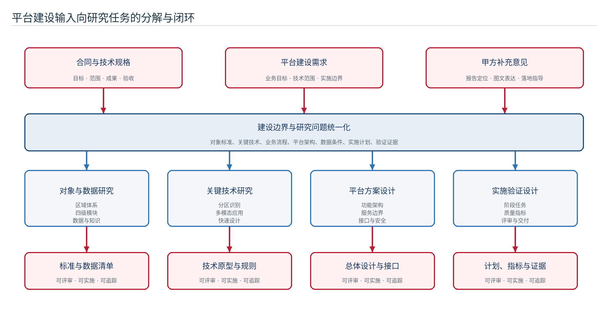

## （二）建设依据

报告主要依据技术开发合同（26版）及附件技术规格书、平台建设需求、甲方关于研究报告定位和图文表达的补充意见，以及项目实施过程中确认的数据、接口、部署与验收条件。不同材料出现差异时，以双方最终签署的合同、补充协议和书面确认文件为准。

## （三）研究范围

研究范围覆盖客室内装模块分区识别、多模态信息处理、模块化与参数化快速设计、跨区域协同、方案检索评价、平台架构、数据资源、系统集成、质量验证和建设计划。工程结构计算、车辆安全认证结论和未经甲方确认的生产工艺参数不由生成模型替代，仍以专业设计、试验和审批结果为准。

## （四）研究方法

本报告综合采用合同与需求分析、系统工程分解、领域对象建模、多模态融合、人机协同、快速原型、场景验证和风险驱动设计等方法。研究过程遵循“需求可追踪、对象可表达、能力可替换、过程可复现、结果可验证”的原则，既关注智能算法效果，也关注平台治理、人工确认和工程可用性。

研究工作按照“问题定义—技术假设—原型验证—工程固化”推进。问题定义阶段从典型设计任务中识别资料准备、区域判断、模块选择、参数调整、规则检查和成果评审等关键活动，形成业务问题与技术问题的对应关系；技术假设阶段明确不同数据条件下拟采用的识别、检索、生成和校核方法，并给出适用前提；原型验证阶段选择典型车型和区域构造可重复样例，通过对照试验、人工复核和场景走查验证效果；工程固化阶段把已验证的方法转化为对象规范、参数模板、规则条目、接口约定和测试用例。

研究过程建立统一证据链。每项结论应能够关联其需求来源、研究对象、数据范围、方法版本、验证样例、评价指标和评审意见。对于仍需现场数据或外部系统条件才能确认的内容，报告只给出研究假设、验证方法和进入下一阶段的条件，不把待验证方案表述为既定结论。该方法可降低研究报告、系统设计和后续验收之间的口径偏差。

# 二、建设背景与总体目标

## （一）业务背景

中车出口客运装备面对多国家、多线路、多车型和多文化审美需求，客室内装设计需要同时兼顾安全、功能、制造、维护、舒适度和视觉一致性。传统工作方式中，图像、图纸、模型、材质、规则和历史方案分散在不同目录或工具中，模块边界不统一，方案复用依赖个人经验，局部调整难以及时反映对相邻区域和整体效果的影响。

平台建设的价值不只是提高单次效果图生成速度，更重要的是将设计对象、数据、规则、任务和成果纳入统一的项目上下文，使每一次识别、设计、修改和评审都能够形成可追溯、可复用的工程资产。

从业务协同角度看，客室内装方案往往需要工业设计、结构、工艺、材料、车辆集成和项目管理等多类人员共同参与。同一对象在不同专业中可能采用不同名称、编号和文件表达，导致资料核对和变更影响分析耗时。平台需要用区域、模块、接口和版本关系建立共同语言，使不同专业能够围绕同一对象讨论，明确谁提出要求、谁修改方案、谁完成确认以及修改影响了哪些相邻区域。

从设计知识积累角度看，历史项目中的可用方案、失败原因、规则冲突和评审意见具有持续价值。如果这些信息只保留在文件目录或个人经验中，新的车型项目仍会重复经历资料查找、方案比选和问题排查。平台应把经过确认的方案及其适用条件转化为可检索知识，同时保留项目边界和授权条件，使复用建立在可追溯、可判断的基础上。

## （二）总体目标

平台建设目标是形成面向客室内装设计的数字化工作环境：建立统一的区域与模块表达方法，形成多模态信息辅助的分区识别能力，构建模块化、参数化和规则化的快速设计流程，沉淀可检索的设计成果库，并预留与既有产品平台的数据和业务交互能力。

总体目标应进一步落实为四类可检查能力。第一类是对象治理能力，能够对车型、客室区域、模块、材料、规则和方案进行统一标识；第二类是智能辅助能力，能够在明确适用范围的前提下输出候选分区、资料关联和设计建议；第三类是设计闭环能力，能够完成从资料输入、方案生成、规则校核、人工评审到成果归档的连续流程；第四类是平台治理能力，能够对项目范围、用户权限、任务状态、版本血缘和接口交互进行持续管理。四类能力需要同步建设，避免形成只有算法演示而没有业务承载，或只有平台页面而缺少专业方法的情况。

表 2 平台建设目标与阶段成果

| 建设目标 | 主要成果 | 完成判定 |
| --- | --- | --- |
| 模块分区标准化 | 区域分类、四级模块对象、属性与接口规范 | 典型区域和模块可统一编码、描述和关联 |
| 分区识别智能化 | 多模态候选识别、人机复核、结果版本化 | 识别结果可解释、可修正、可进入设计任务 |
| 快速设计流程化 | 参数模板、规则校核、生成与比选流程 | 典型设计任务可形成可重复的业务闭环 |
| 成果资源化 | 设计方案、版本、评价与来源关系 | 成果可查询、比较、复用和追溯 |
| 平台能力服务化 | 统一项目、资源、任务、权限和能力接口 | 外部能力可替换，业务流程保持稳定 |
| 建设过程可验收 | 里程碑、测试指标和证据清单 | 各阶段具有明确输入、输出和评审依据 |

## （三）建设原则

1. 业务牵引。以真实设计流程和工程约束确定功能，不以算法展示替代业务闭环。
2. 模块复用。优先沉淀稳定的区域、模块、参数、规则和成果对象，支持不同车型和项目复用。
3. 人机协同。智能能力提供候选、检索和生成建议，设计人员负责语义确认、约束判断和方案决策。
4. 数据贯通。识别输入、设计参数、执行过程、输出结果和评审结论通过统一对象关联。
5. 安全可控。敏感数据、模型服务和系统配置在受控环境中管理，访问和变更可审计。
6. 分步实施。先形成标准和最小闭环，再提升自动化程度和跨区域优化能力。

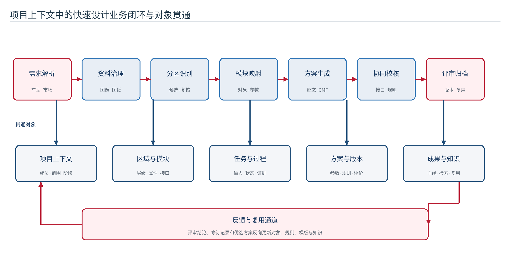

# 三、总体研究框架与关键问题

## （一）研究内容体系

研究内容由四条相互关联的主线构成。第一条是对象主线，解决客室区域、模块、属性、接口和版本如何统一表达；第二条是技术主线，研究多模态识别、参数化生成、规则校核和跨区域优化；第三条是平台主线，建设项目、资源、任务、权限、接口和成果库；第四条是验证主线，通过数据集、指标、场景、测试和评审证明方案可行。

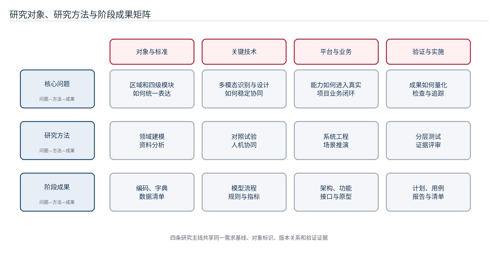

## （二）需要解决的关键问题

1. 如何把图像、三维模型、文本、属性和空间关系转换为统一的区域与模块对象。
2. 如何在样本不足、遮挡、反光和车型差异条件下提高识别稳定性，并允许人工高效修订。
3. 如何把生成式能力与参数、规则和工程约束结合，避免产生无法落地的“纯效果图方案”。
4. 如何处理侧墙、顶部、地板、端墙、座椅和门区之间的接口、风格与装配联动。
5. 如何让算法、工作流或模型升级不破坏既有平台业务、历史数据和验收证据。
6. 如何以阶段成果、量化指标和可追溯证据控制平台搭建进度与质量。

## （三）研究成果形态

研究成果不局限于文字报告，还应包括区域与模块分类、数据字典、标注规范、规则清单、参数模板、算法评测集、功能原型、接口规范、测试用例、设计方案样例和阶段评审记录。各成果之间通过统一编号和版本关系建立映射，避免“报告、系统、数据和验收材料各自独立”。

成果之间的关系应在第一阶段即建立。区域与模块分类决定标注体系和业务页面中的对象选项；数据字典约束平台存储、模型输入和系统接口；规则清单转化为快速设计中的校核项和测试条件；算法评测集用于比较不同技术方案并确认适用范围；方案样例同时作为功能演示、场景测试和人员培训材料。通过一份成果服务多个后续环节，可以减少重复整理，并确保研究结论真正进入平台设计。

# 四、平台总体架构设计

## （一）分层架构

平台采用“应用层—核心能力层—平台支撑层—数据基础层”四层架构。应用层面向设计人员、项目负责人、算法与数据人员、系统管理人员提供场景化工作台；核心能力层封装分区识别、快速设计、规则校核、方案评价和多模态助手；平台支撑层统一处理身份、项目、资源、任务、版本、通知、审计和接口适配；数据基础层保存业务数据、非结构化文件、模块知识、规则和运行记录。

为更准确反映系统复杂度，总体架构在四层业务视角之上进一步区分业务访问、业务应用、领域服务、智能能力、平台支撑以及数据与基础设施六个技术层面。业务访问层承载设计工作台、管理门户、评审入口和产品平台协同；业务应用层按照项目协作、分区识别、模块化设计、整体布置、形态与CMF以及方案评审组织场景；领域服务层稳定表达项目上下文、区域模块、方案版本、资源血缘、任务流程和规则评价；智能能力层组合视觉分割、多模态对齐、知识检索、生成探索、参数优化和跨区域协同；平台支撑层提供统一身份、权限策略、资源管理、任务编排、通知审计和接口适配；底层提供主数据、知识资源、业务数据、文件存储和计算资源。

各层之间采用明确契约连接。上层只依赖下层公开的业务能力，不直接读取下层内部数据结构；智能能力不得绕开项目权限和资源登记；所有耗时处理必须形成任务并报告状态；所有进入后续设计环节的输出必须形成可识别、可授权和可追溯的资源。标准治理和安全运行作为横向能力贯穿各层，分别控制对象规范、数据规范、接口规范、质量基线，以及身份、隔离、审计、监控和恢复要求。

架构设计强调稳定核心与可演进能力分离。项目、对象、资源、任务、规则和方案等业务概念相对稳定，应由平台统一管理；识别模型、生成方法、检索方法和计算资源可能随研究进展调整，应通过能力契约和适配机制接入。这样既允许技术迭代，也避免某一智能服务变化造成业务流程、历史结果或验收证据失效。

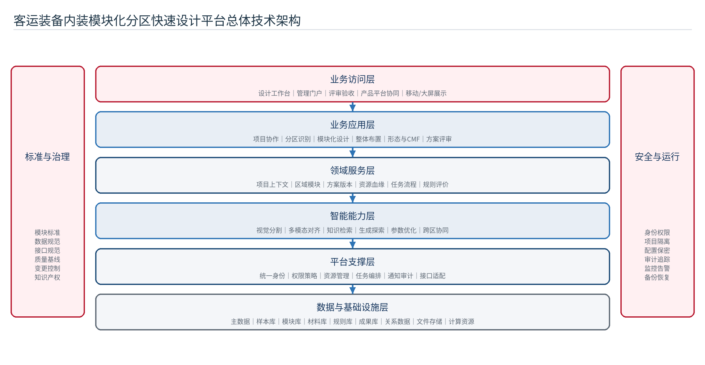

表 3 平台各层职责与建设重点

| 架构层级 | 主要职责 | 建设重点 |
| --- | --- | --- |
| 应用层 | 承载分区识别、快速设计、整体布置、CMF设计、方案评审与管理 | 统一项目上下文、交互一致、任务状态清晰 |
| 核心能力层 | 提供识别、理解、生成、检索、规则校核和评价能力 | 业务语义输入输出、人机复核、能力可替换 |
| 平台支撑层 | 提供身份权限、项目资源、任务编排、版本、通知、审计和接口适配 | 数据隔离、状态一致、失败可解释、全过程留痕 |
| 数据基础层 | 管理结构化数据、文件对象、模块知识、规则参数和运行日志 | 分类编码、版本关系、备份恢复和访问控制 |

## （二）服务边界

浏览器端只负责页面交互、画布操作和结果展示，不直接访问模型服务、计算节点或私有存储。平台服务负责身份校验、项目范围、业务规则、任务编排和成果登记；智能能力服务只接收经过校验的任务输入并返回标准化结果。通过该边界，页面功能、业务数据和算法实现可以独立演进。

服务边界同时规定失败责任。输入资料不完整、对象不在当前项目范围或参数违反基础规则时，由平台在任务提交前拒绝；智能能力超时、不可用或结果格式不正确时，由能力适配层形成明确错误和可重试状态；文件写入或成果登记失败时，平台不得把任务标记为完成；跨系统交换失败时，保留本地结果和交互记录，待条件恢复后按既定策略补偿。每类失败都应具有可理解的提示、责任归属和后续处置方式。

## （三）统一对象和业务协议

平台以项目、区域、模块、资源、任务、方案、规则和评价作为核心对象。所有耗时能力统一抽象为任务，所有输入输出统一登记为项目资源，所有正式方案具有版本和评审状态。外部能力接入时只需完成业务参数映射、任务状态转换和结果登记，不把内部节点或服务细节暴露给普通用户。

统一对象协议至少包含对象标识、项目归属、版本、状态、创建与确认信息、关联资源和适用范围。任务协议包含能力类别、输入引用、参数快照、规则版本、执行状态、错误分类和输出引用；方案协议包含目标区域、模块组合、参数集合、约束结果、评价结果、来源方案和评审结论。对象之间通过标识引用而非文件名猜测建立关系，使同一份图像、模型或方案在移动、重命名或归档后仍保持可追溯。

## （四）部署与扩展架构

部署方案按照访问入口、平台服务区、能力服务区、数据基础设施区和计算资源区进行逻辑分区。各区域之间采用受控接口通信，敏感配置和密钥仅保存在服务端；计算密集型能力可根据任务规模独立扩容。系统应支持开发、测试和生产环境隔离，并形成备份、恢复、监控和升级回退方案。

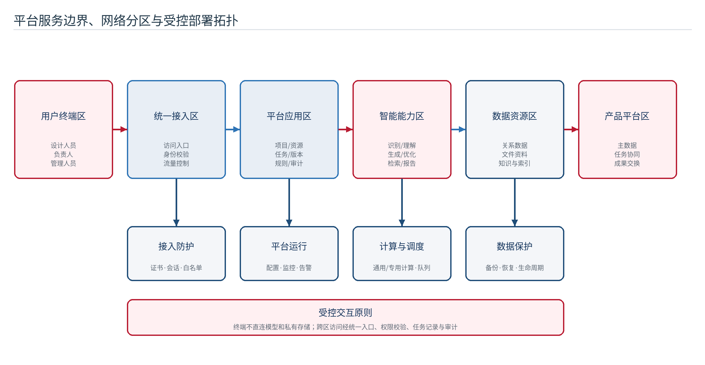

# 五、内装模块分区识别关键技术

## （一）区域与模块对象模型

分区识别首先是业务对象建模问题。平台应按空间位置、功能边界、装配关系和设计任务划分侧墙、顶部、地板、端墙、座椅、车门周边等区域，并在区域下组织系统级、子系统级、组件级和零件级模块。每个对象至少包含名称、编码、类别、适用车型、空间范围、接口、材料、颜色、纹理、版本和来源信息。

对象模型需要同时支持“从整车向零件分解”和“从识别结果向设计对象归并”两种使用方式。自上而下分解用于总体方案、区域责任划分和模块库组织；自下而上归并用于把图像轮廓、图纸图层、三维节点和部件清单关联到同一模块。对于一对多或多对一关系，应通过组成、邻接、接口、依赖和引用等显式关系表达，不能把复杂关系压缩到单一名称字段中。

模块编码应保持稳定且可扩展，编码本身只表达必要分类信息，详细属性通过数据字段维护。模块发生形态、材料或接口变化时，应根据是否影响兼容性确定新增版本还是建立新对象；不同车型使用相同模块时记录适用范围，而不是复制多个无关系条目。识别、设计、校核和成果归档均引用同一对象标识，从而实现跨环节追踪。

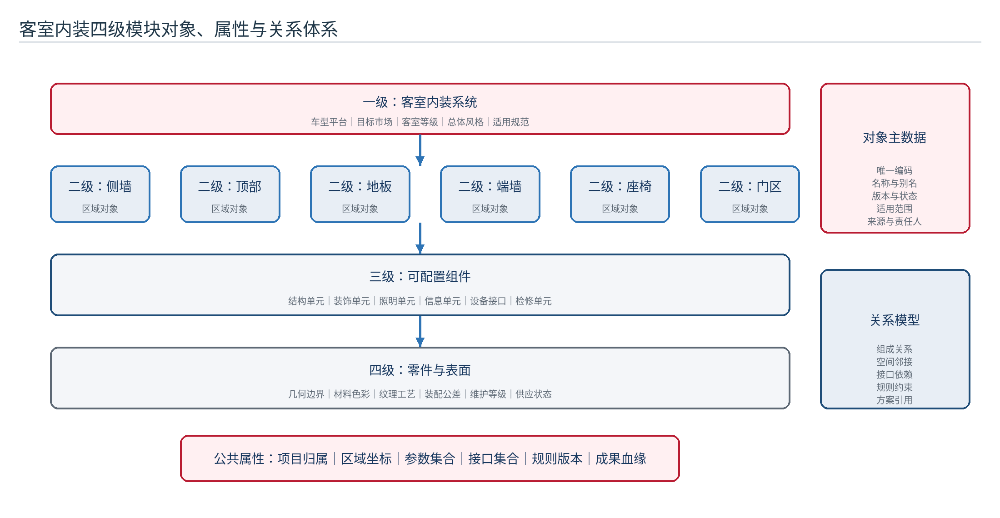

表 4 典型区域的识别对象与设计关注点

| 客室区域 | 主要识别对象 | 关键属性 | 跨区域关系 |
| --- | --- | --- | --- |
| 侧墙 | 墙板、窗带、装饰带、检修构件 | 边界、开口、材质、色彩、安装接口 | 与顶部、地板、座椅和窗区衔接 |
| 顶部 | 顶板、灯带、风口、扶手安装区 | 高度、分段、设备避让、照明关系 | 与侧墙、端墙和设备区协调 |
| 地板 | 地板面、分区铺装、设备固定区 | 通道、拼接、耐磨、防滑、清洁 | 与座椅、门区和端墙过渡 |
| 端墙 | 端墙板、显示区、设备门、贯通区 | 开口、检修、信息显示、视觉中心 | 与侧墙、顶部和通道关系 |
| 座椅 | 座椅单元、扶手、桌板、固定点 | 布置、间距、方向、材料与维护 | 与地板固定、侧墙距离和通道净宽相关 |
| 车门周边 | 门框、门套、踏步、提示与防护构件 | 安全边界、开启范围、警示与耐久 | 与侧墙、地板、通道和无障碍要求相关 |

## （二）多模态输入与预处理

识别数据包括客室照片、效果图、二维图纸、三维模型、部件清单、设计说明、材料属性和历史方案。数据进入识别流程前应完成格式检查、去重、质量分级、坐标或视角对齐、敏感信息处理和版本登记。低质量或来源不明的数据不得直接进入正式训练集和验收集。

不同模态需要分别制定质量门槛。图像资料检查分辨率、畸变、光照、遮挡和拍摄视角；二维图纸检查图层、比例、坐标、标注完整性和版本；三维模型检查坐标系、层级、几何完整性、轻量化结果和属性保留；文本资料检查术语、章节、有效日期和适用范围；结构化属性检查字段完整性、编码一致性和引用有效性。质量不足的数据可以进入待整理区，但必须与正式数据集隔离。

多源资料对齐以区域和模块对象为锚点。图像通过视角和关键点建立空间对应，图纸通过图层、编号和坐标建立几何对应，三维模型通过节点层级和包围范围建立实体对应，文本通过术语词典和实体识别建立语义对应。无法自动确认的对应关系进入人工核验清单，并记录确认依据，避免错误关联在后续训练、检索和方案生成中被放大。

表 5 多模态数据的处理方式

| 数据类型 | 可提取信息 | 预处理重点 | 主要用途 |
| --- | --- | --- | --- |
| 图像与效果图 | 区域边界、部件外观、材质色彩、遮挡关系 | 去畸变、裁切、质量评估、视角标记 | 检测、分割、外观理解与结果对比 |
| 二维图纸 | 轮廓、尺寸、编号、空间与接口 | 图层整理、比例确认、文字识别 | 几何校核和区域边界辅助 |
| 三维模型 | 几何、层级、装配和空间关系 | 坐标统一、轻量化、属性映射 | 模块定位、干涉分析和整体布置 |
| 文本资料 | 部件名称、功能、约束、市场和风格要求 | 术语归一、条款切分、实体提取 | 语义补充、规则建立和设计意图理解 |
| 结构化属性 | 编码、车型、材料、供应和版本 | 字段映射、完整性和一致性校验 | 对象关联、检索和规则判断 |

## （三）候选识别与多模态融合

候选识别可组合目标检测、语义分割、实例分割、文字识别、视觉特征提取和相似度检索等方法。不同方法输出的类别、边界、置信度和语义描述先转换为统一候选对象，再结合区域先验、模块属性、空间邻接和文本要求进行融合。融合结果应保留证据来源和置信信息，便于人工判断。

识别流程可采用“粗定位—精分割—对象归类—关系校验”的分级策略。粗定位先判断客室整体视角和主要区域，缩小后续处理范围；精分割在目标区域内提取部件轮廓和实例边界；对象归类结合视觉特征、部件词典、设计说明和历史样例判断模块类别；关系校验检查区域包含、空间邻接、接口相连和数量范围。分级策略使不同环节可以使用适合的模型和数据，也便于定位误差来源。

多模态融合不应只采用简单平均。对于边界判断，图纸和三维几何通常具有更高几何可信度；对于材料和色彩判断，受控条件下的图像信息更直接；对于名称、功能和适用条件，部件清单与设计说明更可靠。平台应按任务类型设置证据权重，并在模态冲突时输出冲突项而不是强行合并。融合结果包含类别概率、边界质量、证据列表、冲突状态和建议复核方式。

针对客室场景中的细长件、反光表面、遮挡区域和重复纹理，应设置专项处理。可通过多尺度特征、边界增强、区域先验、相邻帧或多视角补充提高稳定性；对于训练样本较少的新车型，可使用迁移学习、少样本适配和人工反馈逐步扩展。技术验证需要单独统计这些困难场景，避免总体指标掩盖关键区域的识别缺陷。

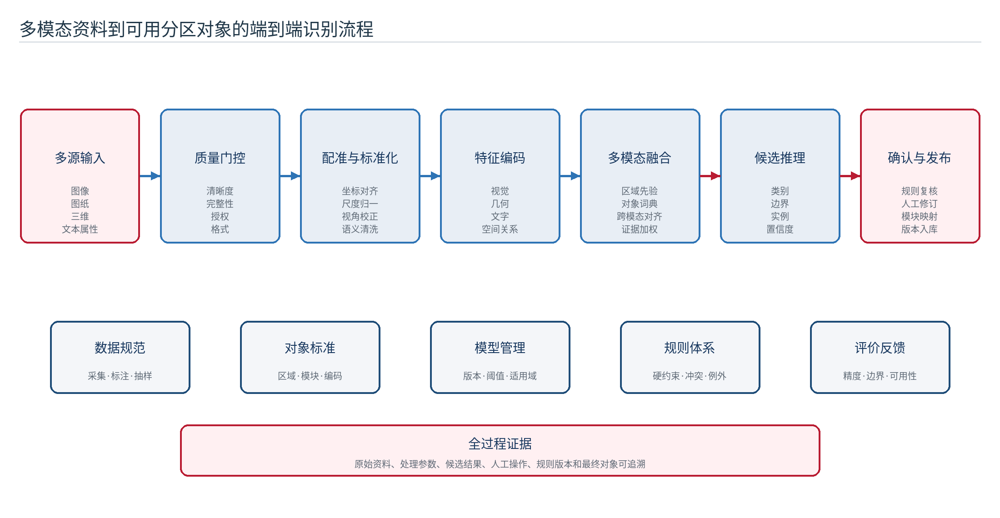

## （四）人机协同复核

自动识别的目标不是完全替代设计人员，而是降低定位、描边、归类和资料检索的重复劳动。系统可按置信度和规则冲突情况分流：高置信且无冲突的候选进入快速确认，中等置信候选进入重点复核，低置信或违反硬约束的候选要求重新标注。人工修订应保留原始候选、修订内容、确认人和时间，形成可用于后续优化的数据闭环。

复核界面应把模型判断依据转化为设计人员能够理解的信息，包括候选区域、预测类别、置信区间、关联资料、规则冲突和历史相似对象。设计人员可以调整边界、修改类别、拆分或合并实例、补充属性并说明原因。对于影响安全、接口或总体布置的对象，即使置信度较高，也应设置强制确认；对于重复出现且规则稳定的对象，可在抽样监督下提高确认效率。

人工反馈进入数据闭环前需要质量控制。复核结果经责任人确认后形成新版本，原始候选保持只读；存在争议的样例进入复审队列，由专业负责人给出最终结论。可用于后续优化的反馈需要注明适用车型、区域、场景和质量等级，防止将临时妥协或项目特例误当作通用知识。

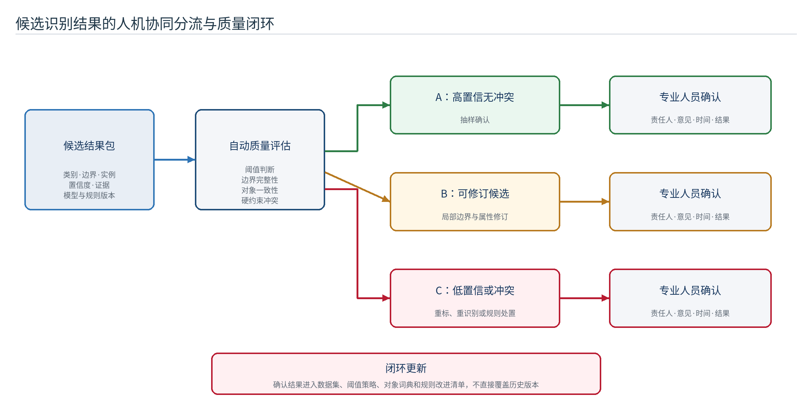

## （五）识别数据集与评价指标

数据集应按车型、区域、视角、光照、遮挡、图像质量和来源进行分层，训练、验证和测试样本按项目或场景隔离，避免相近图片同时出现在不同集合。评价既关注算法精度，也关注人工干预强度和设计任务可用性。

数据集建设建议采用版本化清单管理。每一版记录样本来源、授权范围、筛选规则、标注规范、标注人员、复核比例、类别分布和困难样例比例。测试集在阶段评测期间保持稳定，新增样本进入下一版本，避免反复调整测试数据导致指标失真。类别不均衡时分别报告宏平均、微平均和关键类别结果，并说明阈值设置。

评价报告除总体数值外，还应提供按区域、车型、视角和困难场景拆分的结果，以及典型正确、漏检、误检和边界偏差样例。人工效率通过统一任务脚本记录确认时间、修改点数和退回率；业务可用性由设计人员判断结果能否直接进入模块映射或快速设计。只有精度、人工干预强度和业务可用性共同达到阶段目标，才能认定识别能力具备进入平台流程的条件。

表 6 分区识别建议评价指标

| 指标类别 | 指标示例 | 评价目的 |
| --- | --- | --- |
| 类别识别 | 准确率、召回率、F1值 | 判断模块和区域类别识别能力 |
| 区域分割 | 交并比、平均交并比、边界F值 | 判断区域覆盖和边界质量 |
| 小目标与遮挡 | 小目标召回率、遮挡场景召回率 | 判断复杂客室场景适应性 |
| 人机效率 | 单图确认时间、边界修订量、重标率 | 判断识别结果是否真正减少重复操作 |
| 业务可用性 | 可进入设计任务比例、规则冲突率 | 判断输出是否满足后续快速设计需要 |
| 稳定性 | 不同车型、视角和光照下的指标波动 | 判断跨场景泛化能力 |

# 六、多模态应用关键技术

## （一）多模态能力定位

多模态能力用于理解不同资料之间的互补关系，而不是简单把图像和文字同时提交给模型。平台应建立统一的项目术语、区域编码和模块编码，使图像中的候选区域、图纸中的编号、三维模型中的节点、文本中的部件名称能够映射到同一业务对象。

多模态应用按任务可分为识别型、检索型、生成型和解释型。识别型能力把多源资料转换为区域、模块和属性候选；检索型能力根据文字、图像或对象条件查找关联资料与相似方案；生成型能力在目标区域、参考资料和约束条件下提出方案变体；解释型能力汇总规则结果、方案差异和来源证据。不同类型使用统一对象输入和资源输出，但评价指标、风险等级和人工确认方式应分别定义。

## （二）语义对齐与知识增强

系统可通过术语词典、模块知识库、向量检索和规则库为多模态理解提供上下文。模型生成的描述或分类结果需要经过对象词典和项目范围校验，不能引用无权限资料。对设计问答和资料推荐，应同时返回关联对象、来源和适用范围，便于设计人员判断可靠性。

语义对齐需要处理同义词、缩略语、项目习惯名称和多语言表达。平台维护规范名称、别名、上位概念、下位概念和适用区域，并把文本实体与对象编码关联。检索时先应用项目范围和权限过滤，再组合关键词、结构化条件、语义相似和视觉相似结果；返回内容同时说明匹配原因，避免只给出难以判断的排序列表。

知识增强内容按照可信等级管理。经标准或正式评审确认的规则和对象属于高可信知识，可用于自动校核；项目资料和历史方案属于有范围知识，使用时必须带出项目、版本和适用条件；模型自动生成的描述属于候选知识，只有经过人工确认才能进入正式知识库。不同等级知识在界面和任务结果中应有明确标识。

## （三）能力编排

复杂任务通常由多个能力协同完成。例如“根据端墙参考图修改材质并保持设备开口”需要依次完成对象识别、区域确认、参考资料检索、设计参数生成、局部方案生成、结构保持检查和人工评审。平台通过统一任务编排管理各步骤的输入、状态、超时、失败和输出，使单项能力可以替换而不改变完整业务流程。

编排过程区分业务步骤与技术调用。业务步骤采用设计人员熟悉的名称并明确输入输出，技术调用则由平台根据能力可用性和适用范围选择。每个步骤保存输入资源、参数快照、规则版本、能力版本和运行结果；可重试步骤不得重复产生正式成果，不可重试步骤失败后保留诊断信息并转人工处理。流程模板经过测试和发布后才能用于正式项目，修改时形成新版本。

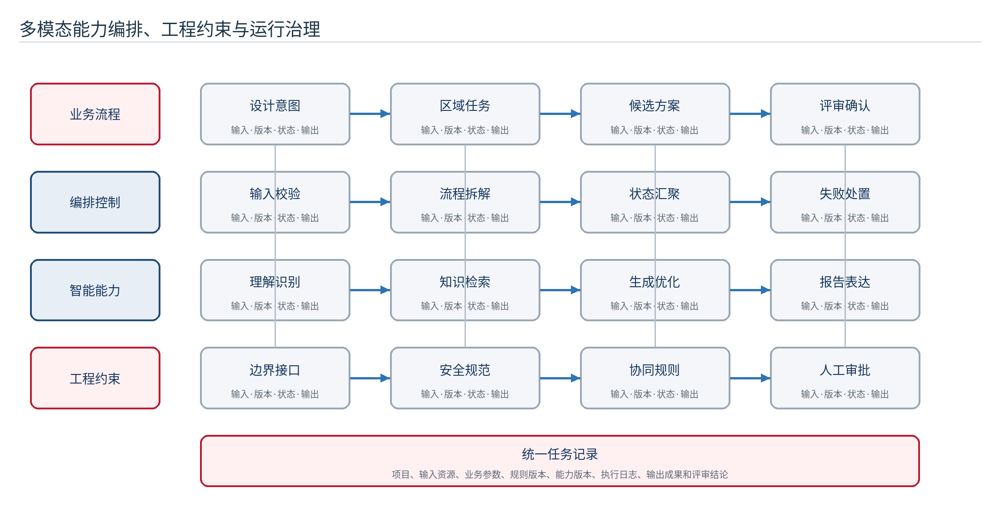

## （四）模型选型与评测

模型选型应以能力类别、数据安全、中文理解、结构保持、部署条件、处理时延和运行环境适配性为依据，不在业务页面中绑定单一模型。正式选型前使用代表性样例开展对比试验，记录输入条件、模型配置、输出质量、失败类型和设计人员评价。影响尺寸、接口、装配和安全的结论必须由结构化规则或专业人员确认。

# 七、快速设计系统关键技术

## （一）模块化、参数化与规则化

快速设计的基础是把可复用模块、可调整参数和必须满足的规则分开管理。模块定义“可选什么”，参数定义“可以怎样调整”，规则定义“哪些组合允许进入正式评审”。三者共同作用，使设计方案既具有生成式探索空间，又保持工程边界。

模块化设计需要明确模块粒度和接口稳定性。粒度过大，难以形成多样化组合；粒度过小，会增加参数、规则和装配关系的管理负担。建议以能够独立选配、具有明确边界和接口、能够形成版本的组件作为主要设计模块，以材料、表面和紧固等信息作为下级对象。模块库中的每个条目应包含预览、适用区域、参数集合、必选接口、互斥关系和历史使用情况。

参数化设计将可调整内容转化为具有名称、单位、范围、默认值和联动关系的参数。几何参数控制尺寸、位置和分段，功能参数控制设备、照明和检修需求，CMF参数控制材料、色彩、纹理和表面效果，项目参数控制车型、市场和客室等级。参数之间存在计算或条件依赖时，应明确驱动方向和更新顺序，防止循环引用和局部修改造成不一致。

## （二）快速设计流程

设计人员在项目和目标区域下选择模块或历史方案，配置形态、材质、色彩、纹理及业务参数，系统生成候选方案并执行规则校核。通过的方案进入对比评价，不通过的方案返回冲突原因和调整建议。人工确认后的结果形成新版本并进入成果库，可继续深化或复用于其他项目。

快速设计流程首先固定目标对象和设计边界，再加载适用模块、参数模板和规则集。系统根据用户选择和参考资料生成多个可比较变体，每个变体均关联同一输入基线；规则引擎先执行硬约束校核，再执行条件规则和软目标评价。设计人员能够查看不同方案在模块组合、关键参数、冲突项和评价维度上的差异，并选择某一方案继续深化，而不是在无版本记录的情况下覆盖结果。

流程中的自动化程度应按风险分级。视觉风格、纹理和非关键形态可以提供较大探索空间；设备开口、通道、装配接口和安全边界只允许在明确参数范围内调整；涉及工程结论的内容必须由规则、专业计算或责任人员确认。平台通过操作记录和方案分支保留探索过程，使被否决方案及原因也能用于后续规则完善。

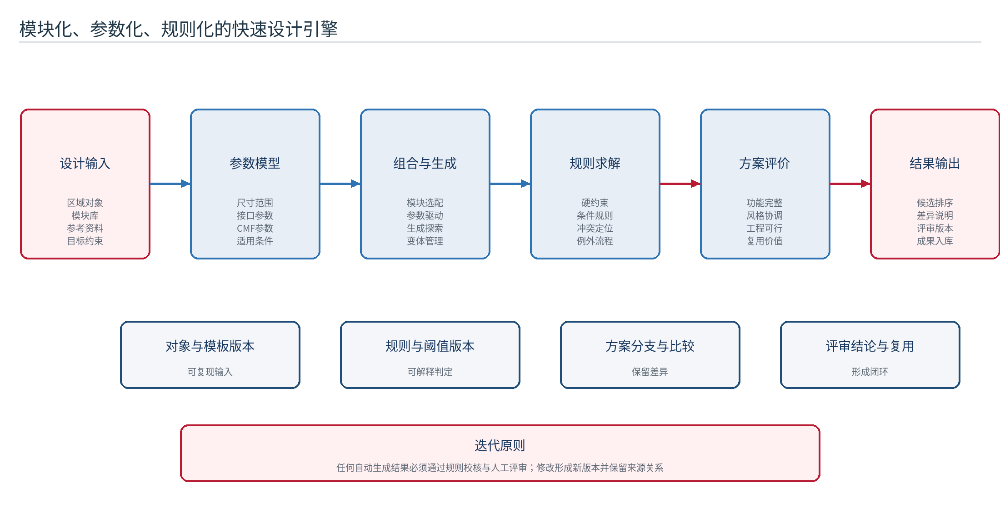

## （三）规则与约束体系

规则体系分为硬约束、条件规则和软目标。硬约束包括区域边界、接口尺寸、设备避让、通道与安全要求，不满足时阻止方案进入正式评审；条件规则由车型、市场、材料、供应或维护条件触发；软目标用于评价美观、协调、独特性、制造与维护便利性。

规则以“适用对象—触发条件—判断逻辑—结果等级—提示内容—依据来源”的结构维护。硬约束失败产生阻断结果并定位冲突对象；条件规则根据车型、区域、材料或项目条件限制可选项；软目标输出分项评价而不直接代替设计决策。规则发布前使用正常、边界和异常样例验证，确认不会误伤已有有效方案；规则发生变化时，历史方案继续保留原规则版本，同时可按需要执行影响分析。

当规则之间发生冲突时，按照安全与法规、接口与装配、功能要求、项目约束、风格目标的优先级处理。无法自动裁决的冲突进入例外流程，由责任人说明原因、适用范围和有效期限。例外不是删除规则，而是形成带审批和证据的项目级决策，以便后续复核。

表 7 设计约束分类与处理策略

| 约束类别 | 典型内容 | 系统处理方式 | 结果表达 |
| --- | --- | --- | --- |
| 硬约束 | 边界、尺寸、接口、干涉、安全和法规要求 | 自动校核，失败则阻断 | 冲突对象、规则依据和修改建议 |
| 条件规则 | 车型、市场、材料、供应和维护条件 | 条件触发，限制选项或参数范围 | 触发条件、可选范围和替代项 |
| 软目标 | 美观、色彩协调、独特性、制造适配、复用率 | 多目标评分和排序 | 分项得分、权重和综合评价 |
| 人工判断 | 风格取舍、品牌表达和例外批准 | 评审确认并记录理由 | 评审结论、责任人和适用范围 |

## （四）跨区域协同优化

客室各区域通过空间邻接、装配接口、功能影响和视觉连续性形成区域依赖图。局部调整后，系统识别受影响的相邻区域和关联模块，执行接口、材质、色彩、纹理和整体风格检查。优化过程采用“硬约束先过滤、条件规则再限制、软目标后排序、人工评审最终确认”的顺序。

为避免复杂关系图产生大量交叉连线，平台以“区域—约束维度”依赖矩阵表达协同关系。矩阵按顶部、侧墙、地板、端墙、门区和座椅等区域组织行，按空间边界、装配接口、功能联动和风格协调组织列，每个单元记录检查项、关联对象和责任专业。方案修改后只展开受影响的矩阵单元，生成可读的检查清单和处理顺序。

协同优化采用影响传播而非全量重算。首先定位被修改对象，再沿空间邻接和接口依赖确定直接影响项，随后根据功能与风格规则确定间接影响项。硬约束冲突优先处理，条件规则限定可用调整范围，软目标用于比较多个可行方案。系统输出冲突来源、受影响区域、建议调整和未决事项，由相关专业共同确认。

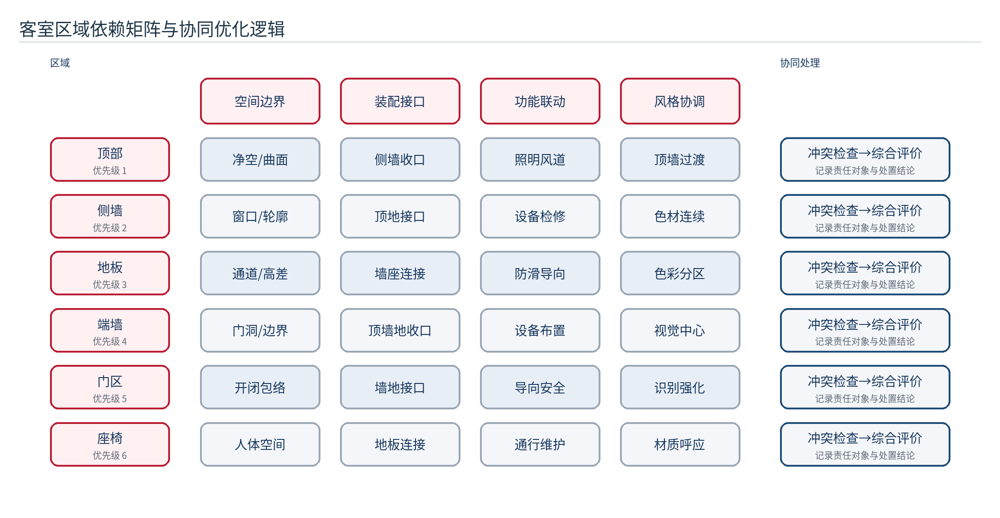

## （五）方案检索、评价与复用

成果库支持按车型、区域、模块、材料、色彩、风格、项目和评审状态检索，并可通过语义与视觉特征召回相似方案。复用时不直接覆盖原方案，而是建立来源关系并生成新版本；设计人员可查看差异、适用条件和历史评价，减少重复劳动并保留创新空间。

# 八、平台功能模块设计

## （一）功能总体布局

平台以设计工作台为统一入口，围绕项目上下文组织资料准备、分区识别、快速设计、任务执行、方案评审和成果归档。业务功能与管理功能分离，设计人员看到业务语义和结果，系统管理人员负责能力、规则、权限、数据和运行配置。

功能划分遵循高内聚、低耦合和对象贯通原则。项目协同域管理范围、成员、资料和阶段；智能设计域管理识别、模块组合、形态与CMF以及整体协同；成果知识域管理方案版本、评价、检索和复用；运营管理域管理用户权限、规则能力、运行状态和审计。各功能域共享统一身份、项目上下文、资源版本和任务状态，避免形成互不关联的独立工具。

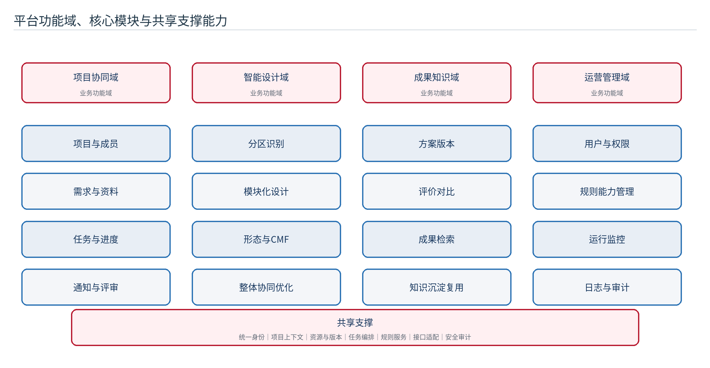

表 8 平台功能模块及主要输入输出

| 功能模块 | 主要输入 | 主要处理 | 主要输出 |
| --- | --- | --- | --- |
| 项目与协作 | 项目信息、成员和范围 | 项目建立、成员协作、权限控制 | 项目空间和协作记录 |
| 设计资源管理 | 图像、图纸、模型、材料和文档 | 分类、编码、标签、版本和权限 | 可检索的项目资源 |
| 分区识别 | 客室资料、区域规则和模块知识 | 候选识别、融合、人工复核 | 区域与模块识别结果 |
| 模块化快速设计 | 目标区域、模块、参数和约束 | 方案生成、规则校核、调整 | 零部件和大部件候选方案 |
| 整体布置设计 | 多区域方案和空间关系 | 组合、位置调整、跨区域检查 | 客室整体布置方案 |
| 形态与CMF设计 | 形态、材质、色彩、纹理和参考资料 | 配置、生成、对比和评价 | 装配效果和CMF方案 |
| 方案成果库 | 确认方案、评价和来源关系 | 版本、检索、比较和复用 | 可追溯的设计成果 |
| 任务与通知 | 识别、生成、检索和报告任务 | 排队、执行、进度、取消和失败处理 | 任务状态、结果和通知 |
| 规则与能力管理 | 规则、参数模板和能力配置 | 测试、发布、停用、回退 | 受控的业务能力版本 |
| 用户与运行管理 | 用户、角色、日志和运行指标 | 身份、权限、审计和监控 | 安全可控的运行环境 |

## （二）典型业务场景

典型场景从项目建立开始：导入客室资料，选择目标区域，调用分区识别并完成人工确认；系统将确认结果转换为模块清单、参数和约束，设计人员生成候选方案并比较；方案通过规则检查和评审后入库，再用于整体布置、深化设计或后续项目复用。全过程应能够查看任务状态、来源关系和版本差异。

除正常流程外，功能设计需要覆盖资料不完整、识别结果存在冲突、外部能力暂不可用、任务超时、方案规则不通过、成员权限变化和成果回传失败等异常场景。异常处理不能只显示失败提示，还应保留已完成步骤、说明未完成原因、提供可执行的继续方式，并避免重复生成或丢失已经确认的成果。

## （三）角色与权限

设计人员负责资料选择、分区确认、方案生成和评审；项目负责人负责范围、成员、阶段成果和风险；算法与数据人员负责数据集、识别能力、规则与评测；系统管理人员负责用户、权限、能力发布、运行监控和备份。权限必须由平台服务统一校验，页面按钮隐藏不能代替数据范围控制。

# 九、数据资源与知识底座

## （一）数据资源体系

平台数据底座由客室基础资料、内装模块库、材料色彩纹理库、规则与参数库、设计成果库和运行审计数据构成。各类数据使用统一分类、编码、标签、版本和归属关系，结构化数据与文件资料通过资源标识关联。

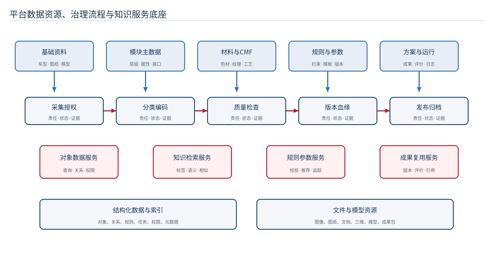

表 9 数据资源建设内容

| 数据资源 | 主要内容 | 建设要求 | 主要应用 |
| --- | --- | --- | --- |
| 客室基础资料 | 车型、区域、图纸、模型、照片和设计条件 | 来源明确、版本可查、权限受控 | 需求分析和识别输入 |
| 内装模块库 | 四级模块对象、属性、接口和适用范围 | 编码唯一、层级清晰、可扩展 | 分区识别、模块选择和组合 |
| 材料色彩纹理库 | 材料、颜色、纹理、工艺和样例 | 参数规范、样例关联、适用条件明确 | CMF配置和方案评价 |
| 规则与参数库 | 约束、条件规则、参数范围和模板 | 规则可解释、可测试、可版本化 | 快速设计和自动校核 |
| 设计成果库 | 方案、版本、评价、评审和输出文件 | 来源可追溯、状态可管理 | 检索、比较、复用和交付 |
| 运行与审计数据 | 任务、操作、异常、接口和监控记录 | 最小必要、敏感信息脱敏 | 问题定位、质量证明和安全审计 |

## （二）数据治理流程

数据治理包括资料清点、分类编码、质量检查、权限确认、入库、使用、变更、归档和清理。训练数据和验收数据分别管理；规则、参数模板和模块知识变更前必须经过评审与测试。设计成果对外共享或进入正式交付前，应确认来源、授权、版本和适用范围。

数据治理责任应落实到具体角色。资料提供方确认来源和授权，数据人员负责清洗、标注与质量报告，领域人员负责对象归类和规则解释，项目负责人确认共享范围和阶段状态，系统管理人员负责权限、备份和生命周期策略。平台以状态流转控制草稿、待复核、已确认、已发布和已归档数据，未达到质量门槛的内容不得进入正式检索、训练或验收范围。

## （三）数据质量控制

数据质量从完整性、一致性、准确性、唯一性、及时性和可追溯性六个维度评价。平台应为必填字段、编码冲突、无效关联、孤立文件和过期版本设置检查规则，并建立问题修复责任和关闭记录。

# 十、系统集成与接口设计

## （一）与既有产品平台的交互

平台预留项目、车型、模块、设计资料、任务状态和成果方案等接口。具体字段、调用方向、身份方式、网络边界和错误处理应在项目启动阶段与甲方确认。接口设计遵循最小权限、版本兼容、重复提交可识别、异常可定位和数据可追溯原则。

接口设计先形成业务对象映射，再确定传输方式。双方需共同确认主数据来源、唯一标识、字段含义、枚举值、时间与版本表达、文件引用方式和状态转换规则。对于尚未具备真实联调条件的接口，可使用受控样例和模拟服务验证字段、幂等、超时和错误处理；正式联调后用真实记录替换模拟证据，并保留差异说明。

表 10 建议的系统集成对象

| 集成对象 | 交换内容 | 建议方式 | 关键控制 |
| --- | --- | --- | --- |
| 项目与车型 | 项目编号、车型、市场、阶段和成员范围 | 结构化接口或受控导入 | 主数据映射、权限和版本 |
| 设计资料 | 图像、图纸、模型、说明和属性 | 资源标识与受控文件传输 | 文件校验、断点和来源记录 |
| 模块与规则 | 模块编码、属性、接口、参数和规则版本 | 版本化结构数据 | 冲突检测、适用范围和审批 |
| 任务与进度 | 任务编号、状态、进度、错误和结果 | 查询、事件通知或消息方式 | 幂等、超时、重试和状态一致 |
| 设计成果 | 方案版本、评价、输出文件和评审状态 | 结构化数据与资源引用 | 来源关系、签收和回传确认 |

## （二）外部智能能力接入

识别、理解、生成、检索或三维处理能力通过独立适配层接入。适配层负责业务参数转换、资源准备、任务提交、进度获取、错误映射和结果登记。外部服务未配置、超时或返回无效结果时必须明确失败，不生成虚假成果。

## （三）接口验证

接口验证至少覆盖身份权限、字段映射、大文件传输、重复请求、超时重试、状态回调、版本兼容、异常恢复和审计留痕。联调记录应包含输入、预期、实际结果、问题原因、修复版本和复验结论。

# 十一、安全、质量与运行保障

## （一）安全与保密

平台按照甲方网络分区、身份认证、访问控制和数据保密要求部署。项目资料、模型、接口协议、测试结果和设计成果不得通过未授权渠道传输；敏感配置仅在服务端受控保存。核心人员按项目要求签署保密承诺，资料使用、导出和共享保留审批与审计记录。

安全设计贯穿数据进入、业务处理、能力调用和成果输出全过程。访问控制同时校验用户身份、角色、项目成员关系和对象状态；智能能力只能读取任务明确引用且当前用户有权使用的资料；日志记录必要的操作元数据和错误分类，不记录密码、令牌或完整敏感正文；导出与跨系统传输执行权限复核、文件校验和接收确认。安全规则应通过越权访问、失效会话、错误项目引用和异常导出等场景验证。

## （二）可追溯设计

平台为每个设计方案保留项目、区域、模块、输入资料、参数、规则版本、任务过程、输出结果、人工修订和评审结论。可追溯设计既服务于问题定位，也为研究评测、成果复用和合同验收提供证据。

## （三）运行保障

运行保障包括服务监控、任务监控、容量预警、日志留存、数据备份、恢复演练、版本升级和故障回退。正式运行前应明确服务等级、数据保留期限、备份频率、恢复目标和问题处置机制，并在目标环境中完成验证。

# 十二、实施技术路线与进度计划

## （一）总体实施路线

实施按照“需求与数据梳理—关键技术研究—模块与规则体系建设—平台开发集成—联调验证—成果固化”推进。每个阶段设置输入条件、输出成果和评审门，不满足前置条件时不应直接进入下一阶段，以减少后期返工。

标准与数据、关键技术、平台系统、测试交付四条工作流并行推进，并在阶段门汇合。第一阶段重点冻结研究范围、对象标准、数据条件、总体架构和评价方法；第二阶段以典型场景为牵引完成技术原型、核心功能、能力接入和分层测试；第三阶段完成产品平台协同、目标环境验证、资料固化和人员培训。阶段门评审同时检查成果内容、版本关系、问题闭环和下一阶段输入是否具备。

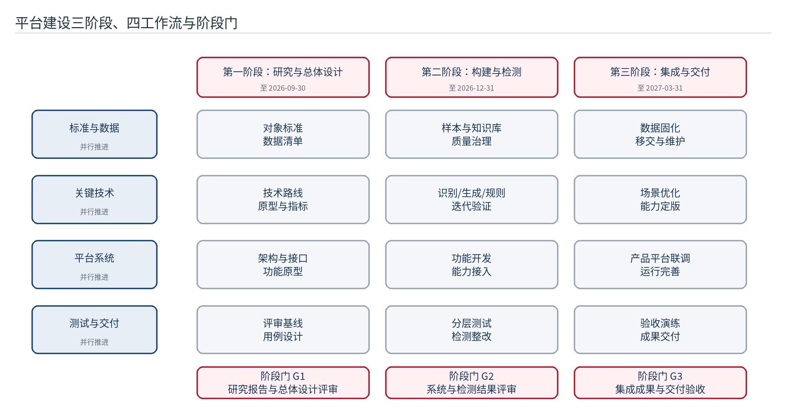

## （二）阶段进度计划

表 11 建设阶段、主要工作与里程碑

| 阶段 | 计划节点 | 主要工作 | 主要成果 | 阶段门 |
| --- | --- | --- | --- | --- |
| 第一阶段：研究与总体设计 | 2026-09-30前 | 需求、数据、分区识别、快速设计关键技术和总体架构研究 | 研究报告、总体架构、技术路线、功能蓝图和数据方案 | 研究报告通过专家评审，建设范围和路线获得确认 |
| 第二阶段：平台构建与检测 | 2026-10至2026-12-31 | 模块与规则整理、核心功能开发、外部能力接入、内部联调和第三方检测 | 快速设计系统阶段版本、测试资料和问题闭环 | 主要功能完成，第三方检测和甲方阶段验收通过 |
| 第三阶段：完善、集成与交付 | 2027-01至2027-03-31 | 产品平台接口、系统测试、性能安全优化、资料固化和培训 | 交付系统、源程序、使用手册、软著及验收材料 | 系统测试和最终验收通过，成果完成归档移交 |

## （三）近期工作分解

1. 完成客室区域、四级模块、属性、接口和编码规则评审。
2. 建立数据清单、样本分层、标注规范和数据授权记录。
3. 选取侧墙、顶部、地板等典型场景开展识别和快速设计原型验证。
4. 固化项目、资源、任务、方案、规则和评价对象及其关系。
5. 完成平台概要设计、功能原型、接口清单和部署条件确认。
6. 建立需求—设计—功能—测试—交付的追踪矩阵。

## （四）项目组织与沟通

项目组织建议设置项目负责人、技术负责人、算法与数据负责人、系统设计与开发负责人、测试负责人和实施培训负责人。项目启动后按合同要求提交实施计划，定期汇报完成情况、下一步安排、问题和风险；重大变更和关键接口条件以书面方式确认。

# 十三、验证方法与验收建议

## （一）分层验证方法

验证分为算法与规则验证、模块功能验证、系统集成验证、业务场景验证和验收资料核查。算法验证关注识别和评价指标，功能验证关注输入输出与异常处理，集成验证关注数据和状态一致性，场景验证关注设计人员能否完成完整任务，验收核查关注成果物和证据是否齐全。

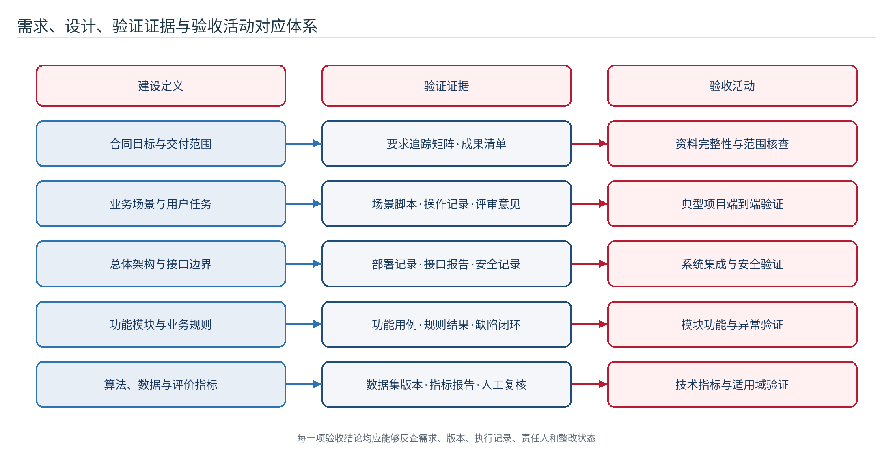

表 12 建议验证指标与证据

| 验证维度 | 建议指标或检查项 | 主要证据 |
| --- | --- | --- |
| 技术可行性 | 识别精度、边界质量、人工修订时间、规则命中正确性 | 算法评测报告、样例和复核记录 |
| 功能完整性 | 约定功能完成率、正常与异常流程覆盖 | 需求追踪矩阵、功能测试记录 |
| 流程可用性 | 典型任务成功率、平均操作时间、用户问题数 | 场景测试、试用反馈和改进记录 |
| 系统质量 | 测试用例通过率、严重缺陷、连续运行稳定性 | 测试报告、缺陷台账和运行监控 |
| 安全合规 | 身份、权限、数据隔离、审计、备份恢复 | 安全测试、权限矩阵和恢复演练记录 |
| 交付完整性 | 报告、系统、源程序、手册和测试资料一致 | 交付清单、版本清单和签收记录 |

## （二）典型验收场景

验收场景应覆盖项目建立、资料导入、分区候选识别、人工复核、参数配置、候选方案生成、规则冲突提示、跨区域检查、方案评价、成果入库、历史方案检索、版本比较、权限隔离、任务失败和恢复等完整流程。测试数据、环境、角色和预期结果需提前固化。

验收用例按“前置条件—操作步骤—预期结果—实际结果—证据位置—问题状态”记录。每个关键场景同时验证正常路径、边界条件和失败恢复，涉及多角色协作时分别验证各角色可见范围和操作权限。测试结果与需求、功能模块、规则版本和交付成果建立对应关系，确保问题整改后能够定位受影响用例并完成复验。

## （三）质量指标处理原则

合同规定的功能完成率、测试通过率、严重缺陷和稳定运行指标应通过可复核证据证明。合同、补充协议或后续书面文件对整改时限等要求不一致时，以最终生效文件为准，并在验收计划中明确起算条件、责任人和复验方式。

# 十四、主要风险与控制措施

表 13 平台建设主要风险与控制措施

| 风险 | 可能影响 | 预警信号 | 控制措施 |
| --- | --- | --- | --- |
| 数据不足或质量不稳定 | 识别效果波动，难以形成可靠评测 | 样本集中、标注分歧大、低质量资料占比高 | 分层采样、标注复核、质量分级和数据补充计划 |
| 模块与区域标准不统一 | 数据无法关联，功能反复调整 | 同一对象多名称、多编码、边界争议 | 优先完成分类编码和数据字典评审 |
| 智能结果与工程约束脱节 | 方案不可制造或不可评审 | 规则冲突多、人工推翻率高 | 结构化参数、硬约束过滤和人工终审 |
| 外部能力不稳定 | 任务积压、失败或结果不一致 | 超时增加、版本变化、输出格式漂移 | 适配层、能力版本、超时重试和替代方案 |
| 产品平台接口条件滞后 | 联调延期、字段反复修改 | 接口责任人和测试环境未明确 | 提前形成接口清单、模拟验证和书面确认 |
| 范围扩张与进度冲突 | 里程碑延期、质量下降 | 新需求持续进入且无取舍 | 变更评估、优先级和阶段范围冻结 |
| 安全与授权不清 | 数据无法使用或产生合规风险 | 数据来源、许可或共享范围缺失 | 数据授权清单、最小权限和导出审批 |

## （一）风险管理机制

项目建立风险台账，记录风险等级、责任人、触发条件、应对措施、计划日期和关闭证据。高风险事项纳入阶段评审，影响里程碑、数据安全或核心技术路线的风险及时向甲方报告并形成书面决策。

# 十五、结论与建设建议

本报告围绕平台搭建的关键技术和实施方法，形成了从模块对象、多模态分区识别、快速设计、规则约束、跨区域优化到平台架构、数据底座、系统集成和验证计划的完整指导框架。其核心思想是以稳定的业务对象和平台治理承载可演进的智能能力，以人工复核和显式规则保证工程可用性，以项目资源、任务和版本关系保证全过程可追溯。

后续建设应优先完成区域与四级模块标准、数据清单、标注规范、规则参数和典型场景定义，在此基础上同步推进识别原型、快速设计闭环和平台支撑能力。第一阶段重点固化研究结论和总体设计；第二阶段围绕核心功能、能力接入和检测形成可运行系统；第三阶段完成产品平台集成、系统级验证和成果交付。所有阶段均应以可检查的成果和证据关闭，而不以页面展示或模型单次成功替代工程完成判定。

# 附录 A 甲方关注事项与报告章节对应表

表 14 甲方要求追踪矩阵

| 甲方关注事项 | 对应章节 | 本报告落实说明 |
| --- | --- | --- |
| 聚焦平台搭建技术点 | 第五、六、七章 | 系统论述分区识别、多模态应用、参数化与规则化快速设计关键技术 |
| 说明平台搭建架构 | 第四、九、十章 | 给出分层架构、服务边界、数据底座、部署和接口设计 |
| 明确技术路线 | 第三、十二章 | 给出研究主线、实施路线、阶段门和近期任务分解 |
| 明确功能模块 | 第八章 | 给出功能地图、主要输入输出、典型场景和角色职责 |
| 明确搭建进度计划 | 第十二章 | 对齐三阶段时间节点、主要工作、成果和完成条件 |
| 报告作为建设前指导文件 | 第一章及全文 | 将建设要求细化到对象、数据、技术、功能、实施和验证方法 |
| 图文并茂 | 全文 | 统一设置15幅技术图和14张数据表，并在正文中逐一引用 |
| 可用于后续落地与验收 | 第十至十四章 | 明确接口、安全、运行、验证、证据和风险控制方法 |

# 附录 B 后续详细设计输入清单

1. 经确认的区域分类、四级模块清单、编码规则和对象数据字典。
2. 数据来源、样本规模、质量等级、授权范围和标注规范。
3. 典型车型、典型区域、典型设计任务和验收样例。
4. 设计参数、硬约束、条件规则、软目标和例外审批机制。
5. 既有产品平台的主数据、接口字段、身份方式和测试环境。
6. 模型能力、计算资源、网络分区、存储容量和安全要求。
7. 用户角色、项目权限、成果共享、审计和保密要求。
8. 阶段里程碑、交付物、质量指标、评审组织和整改流程。
