# 摘要

本研究面向中车出口客运装备客室内装的分区识别与快速设计需求，围绕侧墙、顶部、地板、端墙、座椅和车门周边等核心区域，研究功能驱动的模块划分方法、区域标记与局部设计方法、快速设计流程和平台构建方案。报告依据技术开发合同（26版）及其技术规格书，结合技术响应第四版中的技术方案和平台现有业务基础，形成后续平台建设、研究验证和阶段交付的指导文件。

研究采用需求分解、功能模块拆解、交互原型分析、对照试验设计和分层验证方法。平台方案以项目为业务组织边界，以资产为设计资料及成果的载体，以设计会话和任务记录连接输入、参数与输出；生成和编辑能力通过后端适配器执行。当前分区设计以人工颜色标记、编号标记和遮罩编辑为主要交互基础，由设计人员指定修改对象、提出设计要求、比较原图与结果并确认保存。自动语义分区、模块知识结构化、工程约束校核和跨区域优化属于需要进一步研究与验证的内容，不能由效果图生成能力直接推定完成。

平台的多模态辅助在本报告中限定为 AI 聊天助手的文本与图片联合输入，用于图像问答和设计问题交流，与设计生成工作流分开论述。研究结论是：应先固化区域术语、模块层级、典型任务和评价口径，再在现有项目、资产、任务及分区交互基础上开展方法对比和功能完善；以真实场景、可追溯结果和合同质量要求控制平台建设进度。报告提出总体架构、关键技术、功能分工、数据组织、接口建设、阶段计划及验证方法，不以尚未开展的实验替代研究证据。

关键词：轨道交通客运装备；客室内装；模块分区；交互式设计；快速设计平台

# 一、研究依据与任务界定

## （一）报告用途与建设依据

本报告服务于内装模块化分区快速设计平台的构建，重点回答研究对象如何划分、设计能力如何组织、平台如何承载业务、哪些条件需要先行确认以及如何判断建设成果达到要求。报告既为第一阶段的分区识别研究和总体架构设计提供论证，也为后续详细设计、技术验证、平台完善和系统集成提供输入。报告中的系统方案不是最终工程设计审批结论，涉及尺寸、接口、装配和安全的判断仍须依据经确认的技术资料与专业评审。

主要依据包括技术开发合同（26版）正文第 2 条、第 6 条及附件技术规格书，技术响应第四版中的总体路线、分层架构、分区设计研究和功能方案，以及甲方对报告定位、技术内容和图文表达的补充意见。合同确定研究对象、目标、成果、指标和节点；技术响应提供可采用的方案方向；平台现有业务基础用于分析落地条件。技术响应中的备选技术不等于已经选定的实施组件，合同提出的研究目标也不等于当前系统已经实现的功能。

本研究将依据关系落实为需求追踪：每项技术内容先定位到合同研究任务，再说明技术响应中的方法，随后分析平台承载方式与尚需完成的工作，最后给出验证材料。这样可以把总体要求转化为可执行的研究和建设任务，避免只复述合同条文，也避免用平台扩展功能稀释内装分区与快速设计的核心目标。

## （二）合同研究范围

合同要求开展内装模块功能分区识别、以模块划分为基础的识别与分区设计技术路径、快速设计算法与优化、跨区域优化方法及快速设计系统开发。空间对象包括侧墙、顶部、地板、端墙、座椅和车门周边等区域；设计对象覆盖客室零部件、大部件模块、整体布置和装配效果；设计要素包括形态、材质、色彩与纹理。平台还应具备设计成果存储检索能力和与既有产品平台的接口交互能力。

技术规格书提出系统级、子系统级、组件级、零件级的四级模块拆解方法，以及参数化快速配置和单元测试、集成测试、系统测试的三级验证方法。参数化模板、规则引擎、约束检查、方案检索、向量相似度匹配和多目标评价属于技术规格书允许采用的支撑方法，实施时需根据业务数据、研究效果与现场条件确定组合，而非要求把每种备选方法都写成既有能力。

表 1 合同要求与研究任务对应关系

| 合同关注点 | 本报告研究任务 | 建设与验证重点 |
| --- | --- | --- |
| 功能分区识别 | 区域分类、模块层级、标记与识别方法 | 对象边界明确，结果可复核 |
| 快速设计与优化 | 局部编辑、参数配置、结果比较 | 输入约束明确，设计过程可追溯 |
| 跨区域设计 | 相邻区域影响与整体协调方法 | 先明确关系，再验证处理效果 |
| 平台系统构建 | 业务架构、任务执行、数据管理 | 流程连续，权限和状态一致 |
| 成果存储与检索 | 资产组织、来源关系、查找复用 | 文件可读，来源可查，复用受控 |
| 既有平台交互 | 对象映射、文件交换、联调计划 | 接口经确认，真实交互可验证 |

## （三）当前基础与研究边界

现有平台已形成用户与权限、项目协作、资产中心、设计会话、任务执行、通知、审计和个人 AI 会话等业务基础。设计生成按客室零部件、CMF 和客室效果组织图像生成及编辑工具，并提供颜色分区、编号分区、遮罩、图像比较和结果保存等交互。模型训练和报告生成设有独立业务入口，作为平台支撑与扩展能力使用，不代替本项目的分区识别研究。

当前平台尚不能据此认定已经具备自动识别六类客室区域、自动建立四级模块对象、自动计算工程干涉、规则引擎自动判定设计合规或向量相似方案检索等完整功能。这些内容需要形成明确的数据规范、算法或规则实现、业务交互和测试证据后再评价完成度。现有三维预览及三维生成同样不能等同于参数化 CAD 建模、装配求解或工程校核。

本报告采用“现有基础”“拟开展研究”“实施条件”三种口径。现有基础描述平台中可定位的业务链路；拟开展研究说明解决合同任务的方法与实验方案；实施条件说明依赖的资料、参数、模型、接口和环境。本文未给出未经实测的识别准确率、效率提升比例、性能容量或完成百分比。阶段验收应以目标环境的实际执行和正式评审材料为准。

## （四）术语范围

“多模态辅助”专指 AI 聊天助手在同一消息及其受限历史上下文中处理文本与图片，输出文字答复。它不是图像生成工作流的统称，不表示助手自动调用工作流，也不表示系统已实现图纸、三维模型与文本之间的统一语义对齐。合同对识别与分区设计提出的更广研究要求仍然保留，后续应结合代表性样本验证适用技术路径。

“分区标记”是设计人员对修改位置和对象的表达，“区域语义识别”是识别对象类别及其范围的研究任务，两者不能混用。“参数配置”在现有平台主要指提示内容、参考素材和已公开的生成编辑参数；工程参数化还需要真实尺寸、单位、取值范围、依赖关系和约束依据。“成果入库”指将输出保存为项目资产，不自动表示已经通过专业评审或批准用于制造。

# 二、问题分析与研究方法

## （一）客室内装设计问题分解

出口客运装备内装需要针对车型、线路、市场和使用环境调整功能与视觉表达。侧墙与顶部构成连续空间界面，地板与座椅关系到布置和通道，端墙与车门周边兼具设备、信息和通行功能。设计人员既要处理部件本身的形态、材料与纹理，又要判断局部修改对整体空间的影响。因此，快速设计不能只比较单张图片是否美观，还要明确修改对象、保留条件和成果用途。

资料准备中的主要问题是同一对象可能分散在图片、图纸、模型、说明和历史方案中，名称与版本不一致。交互中的主要问题是文字难以准确指向重复出现的座椅、扶手或墙板，整图生成容易改变不希望修改的区域。评价中的主要问题是视觉符合、结构保持和工程可用属于不同判断，若混合为单一好坏结论，就难以确定下一轮应调整输入、参数、模型还是设计要求。

平台构建还要解决过程连续性。资料上传、任务提交、外部计算、结果查看和成果保存发生在不同时间，用户关闭页面不能导致任务历史丢失，服务失败不能留下伪造结果。多人在同一项目中使用资料时，需要保留创建者、任务来源和可见范围；个人聊天内容则不能因为关联了项目就自动成为项目共享资料。

## （二）研究问题与方法选择

第一项研究问题是区域与模块如何形成稳定的表达。采用功能驱动拆解法，从客室整体功能出发，结合空间位置、可替换边界和维护需求形成四级模块清单；再通过典型部件走查检验分类是否重复、遗漏或粒度失衡。分类体系应能指导资料命名和设计任务组织，不以分类数量多作为成熟度标准。

第二项研究问题是怎样准确表达局部设计意图。采用交互原型与任务分解方法，比较纯文字、颜色标记、编号标记和遮罩输入对设计目标定位的作用。研究记录不只保存最终图，还应保存原始底图、用户标记、文字要求、参数和完整输出，使区域指代错误、模型理解偏差与生成质量问题可以分别分析。

第三项研究问题是怎样评价快速设计是否有效。采用受控对照试验，在相同底图、设计目标和能力配置下比较不同输入方法，记录目标修改达成、非目标区域保持、人工修改次数、可接受方案数量及任务耗时。若配置、样本或操作人员不同，应在结果中分组说明，不能把差异全部归因于某个算法。

第四项研究问题是如何把方法接入平台并稳定运行。采用系统工程与场景验证方法，沿项目、输入资产、设计会话、执行任务和输出资产逐步核查。每个环节同时明确正常输入、拒绝条件、失败状态和恢复方式，使研究方法能够成为可使用的业务功能，而不止停留在独立实验演示中。

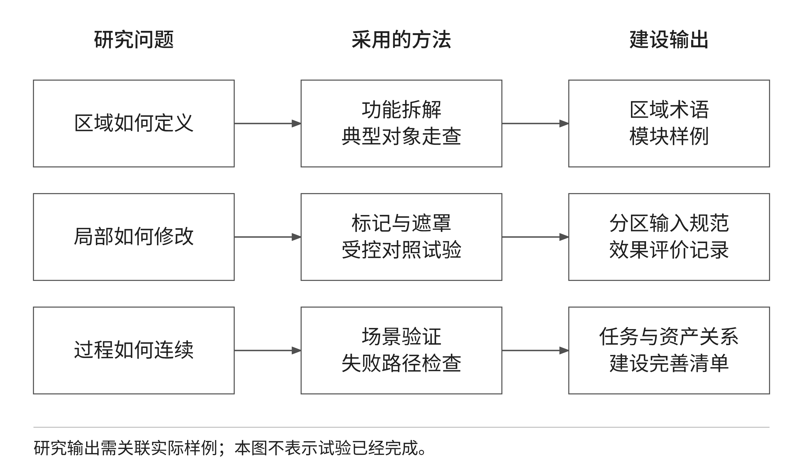

## （三）研究组织与证据形成

研究按“定义问题、整理样例、选择方法、实施对照、分析偏差、形成建设决策”推进。资料整理阶段由业务人员确认车型、区域、设计要求和允许使用范围；方法研究阶段明确哪些变量可以改变、哪些条件保持一致；对照阶段保存成功与失败样例；分析阶段将问题归为输入歧义、区域边界、生成偏移、工程约束缺失或平台过程问题，分别制定改进措施。

每项研究结论应有明确适用范围。例如某种编号标记方式在重复座椅场景中有效，只能说明该样本条件下的对象指代更清楚，不能直接推断对全部车型或复杂遮挡均有效。对少量样例得到的结论，应使用试验观察或待复核结论表达；只有数据规模、样本分布和重复验证均满足评测方案，才讨论稳定性与推广条件。

研究成果应包括区域术语表、模块拆解样例、分区标记规范、典型任务说明、参数配置记录、对比结果、问题分类及平台完善清单。文档与数据之间通过任务编号和资料编号关联。专业评审意见可作为项目文档保存，但现有平台的资产保存状态不能代替正式审批状态；后续若建设审批功能，应单独定义流程、人员和权限。

# 三、平台总体构建方案

## （一）总体结构与职责分工

平台采用稳定业务框架与可替换能力适配器分离的结构。业务框架负责身份、项目、资料、设计会话、任务、通知及审计；能力适配器负责将已校验的业务输入转换为外部服务可接受的调用，并处理状态和结果。该结构延续技术响应的分层思路，同时以当前已经采用的业务链路细化职责，不把备选基础设施和研究算法全部叠加到现状架构中。

从建设视角划分为交互应用、平台服务、执行与适配、数据与运行基础四个层面。交互应用层包括首页、设计生成、模型训练、资产中心、报告生成和设计工作台，并在登录后页面保留 AI 聊天助手。平台服务层统一处理身份权限、项目成员、资产目录、设计会话、任务台账、应用目录、通知和审计。执行与适配层区分设计工作流、训练、报告和聊天服务，彼此承担不同任务。数据基础保存业务关系与文件对象，运行基础负责服务部署、网络、存储和计算条件。

图 2 将主设计链路与个人聊天链路分开表达。设计生成由项目、资产和任务组织，外部工作流由独立执行进程调度；聊天助手使用个人会话和消息，在平台后端组装图文上下文后请求模型答复。两者共享身份与基础存储设施，但不共享执行语义，不能在架构图中画成由聊天助手统一编排设计生成、训练和报告的自动代理系统。

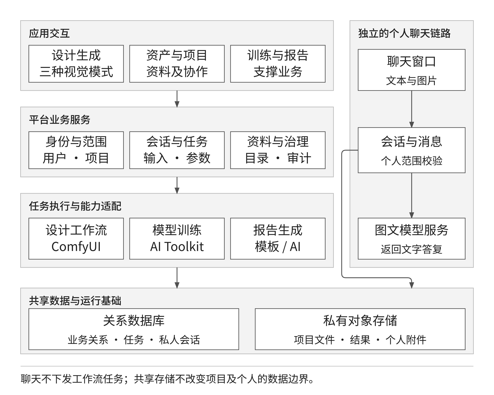

## （二）应用层与平台服务层

应用层保持固定导航、用户身份和项目上下文。设计生成页面内部承载会话历史、输入素材、参数和多轮结果，切换能力时不重新建立独立的用户、资料和任务体系。用户从结果继续深化时，仍处于原项目范围，并通过资产引用将素材交给目标能力。首页的概览数据来源于当前用户可访问的数据，不以演示案例或无采集依据的运行数字代替真实统计。

平台服务层是业务一致性的控制位置。身份校验确认当前用户，权限校验确定可执行动作，项目范围校验决定可以读取或修改的资料。创建任务时还需要确认输入资产已经登记、处于可用状态并符合目标能力的类型与顺序要求。前端的禁用与提示用于减少误操作，最终判断由服务端完成。外部模型地址、密钥和内部资源路径不交给浏览器维护。

项目、资产和任务是现有业务对象，区域模块的标准化属性与工程规则是后续建设对象。总体方案采用逐步扩展的方式：先以项目目录、标签和任务记录组织区域设计资料，再依据评审通过的数据字典补充模块属性、规则及评价关系。不能把文件夹名称当作已经建成的模块知识库，也不能把文字说明当作可计算的参数模型。

表 2 平台各层的现有基础与后续工作

| 层面 | 现有基础 | 后续研究与完善 |
| --- | --- | --- |
| 交互应用 | 业务模式、画布、设计会话、结果查看 | 区域术语与模块任务表达细化 |
| 平台服务 | 身份、项目、资产、任务、通知、审计 | 研究对象、评价资料与业务关系补充 |
| 执行与适配 | 工作流、训练、报告和聊天分别接入 | 在目标环境验证依赖与能力效果 |
| 数据基础 | 关系数据与私有文件分开管理 | 模块清单、规则条目、样本集建设 |
| 运行基础 | 服务与独立执行进程、容器化配置 | 现场部署、性能、安全及恢复验证 |

## （三）任务执行与能力替换

设计生成采用持久化任务与独立执行进程。任务创建后保存所属项目、会话、应用、输入素材及参数快照，执行进程领取任务、准备输入、提交外部工作流并获取结果。页面负责展示任务状态，而不是承担长时间计算。现有设计工作流目录包含 18 项能力，但目录数量不等于合同功能完成率，合同仍须按业务需求和测试用例逐项验收。

任务固定所采用的工作流版本，避免后续能力配置变化改变历史任务的含义。独立执行进程通过租约控制任务领取，并保存外部任务关联与输出回执，处理状态查询、取消和异常恢复。工作流输出首先形成任务结果，用户确认后进入资产中心；模型训练和报告生成则按各自受控流程自动登记相应产物。三种输出保存策略有差别，不能统一描述为所有结果自动成为正式设计成果。

能力替换主要发生在后端映射、外部配置和版本管理范围内。替换之前应检查输入素材数量、参数含义、输出文件类型和取消语义是否兼容。即使外部服务返回成功，也必须完成结果读取、格式检查和平台登记才算任务链路成功。外部能力不可用或结果无效时，平台应呈现明确失败，不使用样例图、空文档或其他方式伪造成功。

## （四）数据与部署结构

关系数据库保存用户、项目成员、资产元数据、会话、任务和审计等关系信息；私有对象存储保存图片、模型、文档和附件。小型文本资产可直接保存在关系数据中。文件上传由平台先检查身份和范围，再签发短时地址，浏览器随后向对象存储传输文件；上传完成后仍需平台校验对象并登记可用状态。因此，“浏览器不直接访问存储”的一般性方案表述在当前系统中应具体解释为不能绕过授权访问私有桶，而非禁止受控的预签名传输。

生产部署包含前端入口、平台服务、独立执行进程、关系数据库和对象存储，外部模型、工作流、训练服务以及企业邮件服务按环境配置接入。现有任务队列依托关系数据库和任务租约，不以 Redis、独立消息中间件或容器集群为既成前提。技术响应列出的这些组件可作为后续容量与运维条件变化时的备选，是否引入需另行论证。

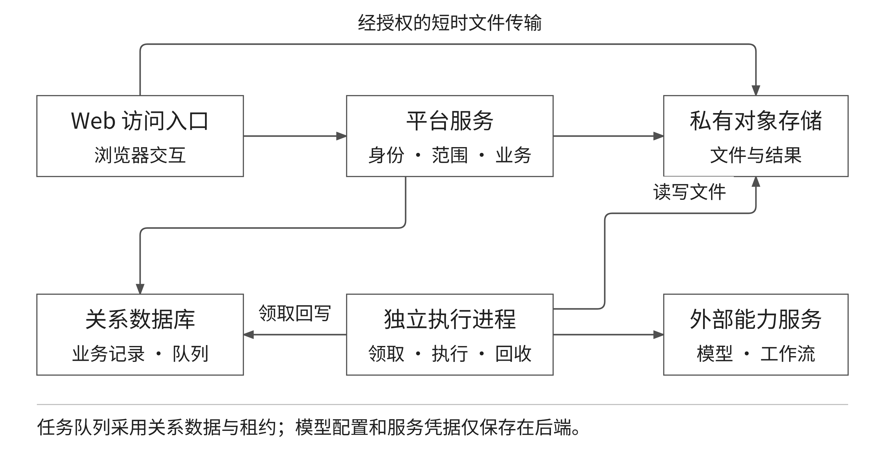

部署前需明确访问网络、文件访问域名、服务认证、计算资源、存储容量和备份位置，分别验证网页访问、文件上传、预览下载、任务执行与邮件功能。开发环境成功不能代替目标环境验收，尤其是外部服务模型、自定义节点、驱动及文件访问条件存在差异时，应重新执行代表性任务。容量和并发指标由目标场景测试确定，本报告不预设未经验证的数值。

# 四、内装模块划分与分区设计研究

## （一）功能驱动的区域划分

区域划分以客室功能和设计任务为出发点，不只依据图像颜色或几何轮廓。侧墙可包含墙板、窗带与检修构件，顶部可包含顶板、照明与风口区域，地板需要考虑铺装与设备固定，端墙涉及显示、设备门和贯通区域，座椅涉及座椅单元及关联附件，车门周边关注门框、过渡和通行区域。上述内容作为研究分类示例，具体对象及边界需由实际车型资料确认。

同一零部件可能在空间上跨越两个区域。研究时应区分主要归属区域与关联区域，例如扶手可按主要功能归入相应模块，同时记录它与顶部、地板或座椅的安装关系。若仅按图像框位置归属，容易造成跨区对象重复登记。区域分类必须说明包括什么、排除什么、边界如何判断，以及无法判断时由谁确认。

表 3 核心区域与设计检查重点

| 区域 | 典型对象 | 设计检查重点 |
| --- | --- | --- |
| 侧墙 | 墙板、窗带、检修构件 | 开口保持、分段衔接、表面连续性 |
| 顶部 | 顶板、灯带、风口 | 设备关系、层次、与侧墙的过渡 |
| 地板 | 铺装、通道、固定区域 | 纹理方向、拼接、座椅与门区衔接 |
| 端墙 | 端墙板、显示与设备区域 | 开口和功能区保留、视觉中心 |
| 座椅 | 座椅单元、扶手、桌板 | 形态一致性、排列关系、固定条件 |
| 车门周边 | 门框、门套、过渡构件 | 通行与开启范围、边界和提示信息 |

## （二）四级模块拆解方法

技术规格书要求按系统级、子系统级、组件级和零件级开展拆解。研究中以客室内装为系统级，以具有相对完整功能和空间范围的单元为子系统级，以可组合或替换的功能组件为组件级，以具体零件为零件级。图 4 采用侧墙模块的代表性拆解说明层级关系，不作为已批准的产品结构清单。各车型的子系统划分及部件归属仍应由专业资料核实。

拆解时需要同时检查功能独立性、边界清晰度和接口稳定性。功能独立性用于判断该模块是否承担可描述的任务；边界清晰度用于判断图纸、图像或清单是否能够定位对应对象；接口稳定性用于判断模块替换时是否会改变上级功能和相邻模块。过大的模块粒度会限制组合，过小的粒度则增加资料与约束维护负担，主要设计粒度应结合典型任务确定。

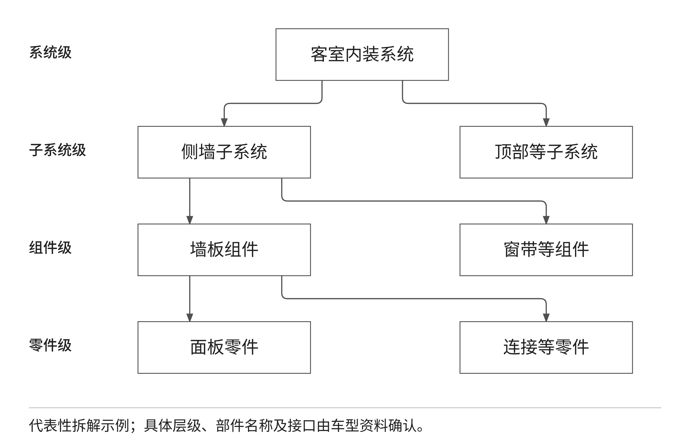

模块研究清单建议记录名称、层级、上级对象、主要区域、关联区域、形态与材料属性、适用车型、接口说明和依据文件。具备真实尺寸时应同时保存单位和测量或图纸来源，不能由效果图比例推算成正式参数。对于同名但接口不同的对象，需要保留区别；对于同一模块在多个项目中的使用，需要标明适用范围和来源，而不是简单复制名称。

现有资产目录与标签能够支撑模块资料的初步分类，但四级模块的结构化维护、关系检查和专门选择界面仍需进一步建设。第一阶段宜先形成可评审的拆解样例和字段定义，利用真实资料检验是否满足零部件、大部件与整体布置任务，再确定后续数据结构和交互方案。

## （三）现有分区交互方法

当前分区设计提供颜色标记和颜色加编号标记两种主要方式。用户在底图上绘制笔画或框选标记，以颜色或编号指代需要修改的对象，再输入对应的编辑要求。颜色适于区分位置分散、目标数量较少的对象；编号适于补充重复部件的指代关系。标记只表达设计意图，并不自动证明区域类别正确，也不等于已获得精确语义分割边界。

标记流程需要同时保留原图和标记快照。原图是设计工作流消费的基础图像，笔画与编辑说明共同表达本轮操作；标记快照用于历史回看，让用户知道当时指定了哪个对象。后续进行原图与结果对比时，应使用标记前的底图作为比较基准。若把带标记图作为原图比较，就会把标记消失误当作设计改善，影响研究评价。

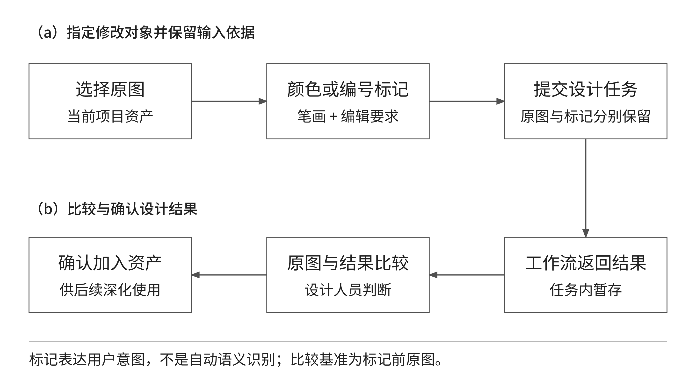

研究应重点分析对象指代、标记覆盖和编辑说明三者的一致性。对象指代检查文字中的颜色或编号是否能在图上找到；标记覆盖检查笔画是否落在目标对象而非背景或邻近部件；编辑说明检查修改目标与保持条件是否相互矛盾。平台能保存标记信息，但这些业务含义仍需要设计人员判断，不能把信息保存成功表述为系统已自动理解所有语义。

## （四）遮罩编辑与区域保持

遮罩编辑用于明确局部修改范围，与编号标记的任务不同。编号标记重点解决“修改哪一个对象”，遮罩重点解决“允许修改哪一片图像范围”。用户选定原图后绘制或调整遮罩，保存新的输入素材，再在当前项目中执行局部重绘。原始图像关系应保留，以支持结果对比和后续分析。对于边缘细碎、遮挡或半透明对象，遮罩范围本身就可能影响生成结果，需要作为实验变量记录。

区域保持研究从目标区域和非目标区域两个方面展开。目标区域检查设计要求是否得到表达，例如材料替换、形态调整或颜色变化是否符合要求；非目标区域检查原有开口、座椅排列、设备和整体视角是否发生非预期变化。视觉相似度可作为辅助指标，但不能证明安装接口、安全距离或尺寸符合要求，这些内容仍由工程资料和专业检查确认。

对颜色标记、编号标记和遮罩的比较，应选取相同底图与相近设计要求，不宜用不同难度图片比较方法优劣。记录目标定位时间、标记修改次数、每轮生成结果、保留区域变化与最终人工判断。若某种方法只在规则形状或少量对象场景下有效，应明确适用场景，不将其描述为通用解决方案。

## （五）自动区域识别的后续研究

合同中的分区识别任务还需要研究区域类别、对象归属与边界的辅助判定。现有人工标记可以提供交互入口和样本组织基础，但不能替代自动识别算法与数据集。后续研究宜先选定实际设计中反复出现的区域和困难样例，建立人工参考标注，再比较候选定位与分割方法。方法选择以样本和效果为依据，不预设某个模型一定达到要求。

研究流程建议分为图像质量检查、候选区域获取、区域类别判断、人工核验和设计输入整理。候选方法可参考技术响应提出的图像分类、目标检测、语义或实例分割等方向；是否采用文字识别或其他辅助方法，应由具体资料中是否存在可用编号与文字决定。二维图纸和三维模型目前作为设计依据与资料保存，自动跨格式对齐、装配关系提取和几何推理仍需另行论证其数据条件与实施路径。

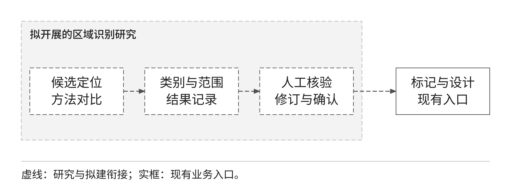

研究输出应区分候选和确认结果。候选信息记录类别、范围、依据与方法配置，人工确认记录修订内容及原因。拟开展的研究需要补充这一结构化记录方式，候选置信度管理、冲突处理和争议复核均属于后续设计范围。第一阶段可先通过受控研究资料形成评测记录，验证可行后再决定哪些信息进入平台的固定功能。

## （六）样本与标注质量控制

样本应覆盖核心区域、不同视角、重复部件、遮挡、反光、低对比度和材质纹理变化等条件。样本规模由可用资料和评测方案确定，并在研究实施前形成清单。每个样本应能关联原始资料、授权范围、车型或场景、区域类别及标注版本。缺少来源或无法解释的样本不得直接用来形成正式评测结论。

同一原始图像的裁切、缩放或连续视角具有较强关联，应作为同源组管理，避免同时进入训练集与测试集造成数据泄漏。标注规范需要约定可见范围、遮挡区域、边界归属和无法判断对象的处理方式。争议样本应保留原始意见并由业务人员复核，而不是为了统一结果随意修改参考标注。

区域识别研究可使用交并比、类别召回率和边界偏差等指标，同时报告各区域的差异。只有输出为像素区域时才评价分割质量，只有提供类别时才评价类别识别，不能对不具备对应输出的现有分区编辑功能直接计算自动识别准确率。研究应另行记录人工确认时间和修订程度，以判断算法辅助是否真正减少工作，而不只是增加了一次模型调用。

# 五、快速设计与跨区域优化研究

## （一）快速设计任务的基本组织

当前快速设计围绕项目设计会话组织。设计人员选择业务模式和可用能力，输入文字、选取或上传素材，配置必要参数后提交任务；结果按轮次保留，并可查看、下载、加入资产中心或继续深化。客室零部件模式关注部件形态、局部修改和多视角表达，CMF 模式关注颜色、材料和纹理，客室效果模式关注整体视觉、部件材质融合、平面图填色和环境调整。

这些业务模式用于整理工具和交互，不等于三个独立算法系统。不同模式可以复用同一个工作流，但历史任务应保留当时所用模式，使结果操作和业务含义在刷新后保持一致。研究与验证应根据真实的输入输出契约描述能力，不因按钮名称不同就重复计算功能数量，也不把模式标签当作自动理解车型、模块或工程规则的证据。

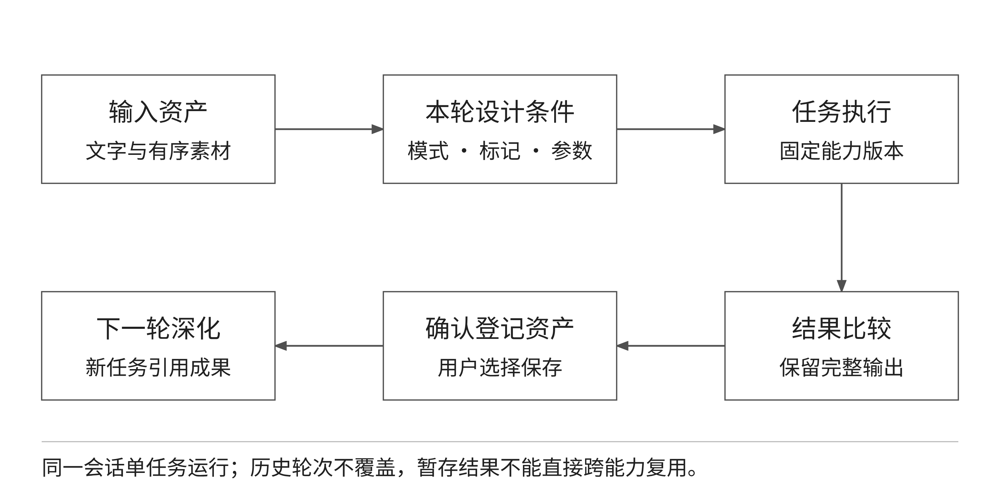

## （二）设计输入与参数配置

有效的设计输入包括目标对象、预期变化、需要保持的内容和参考素材。目标对象可由文字配合标记或遮罩定位；预期变化应尽量具体，例如某区域的材料表现或颜色关系；保持条件说明不希望改变的开口、排列、视角和背景。输入中存在冲突时应先由设计人员整理，不能假设生成模型会自动解决相互矛盾的要求。

当前平台按能力契约组织参数与素材槽位。需要多张图片的能力必须检查数量和顺序，素材不足时不得提交；三维生成所需的前、左、后、右四视图与单图多角度生成是不同输入条件。已登记素材才能成为后续任务的输入。相关控制保证任务输入可解释，但不代表多张参考图在语义、尺寸和视角上已经由系统自动对齐。

提示词模板可按业务模式维护分类和选项，帮助用户组合常用颜色、材质、纹样及环境描述。模板的作用是统一输入表达、减少重复录入，不是工程参数计算器。管理员维护模板内容，普通用户选择并调整具体描述；研究阶段应比较模板与自由输入的目标明确程度和重复使用效果，并保留不适用样例。

工程参数化是后续需要深入的研究内容。尺寸、位置、接口和适用范围要形成明确字段、单位、取值约束和依据；参数之间存在依赖时，需要定义驱动顺序和异常处理。只有将这些内容落实为可操作、可计算和可验证的功能，才可以认定形成工程参数化能力。现有提示词和生成参数不应承担未经实现的尺寸联动或装配求解功能。

## （三）局部修改与结果比较

快速设计应保持一轮任务对应一组清晰的输入条件。对于同一底图的材质、形态或色彩探索，宜采用多个独立轮次保留差异，而不是覆盖原图和历史任务。当前历史输入修改重发会形成新轮次，原记录保留；结果可以继续作为素材深化，但应保留来源关系。研究时可沿这条关系检查变更是否只发生在目标区域，以及多轮修改是否逐步偏离初始要求。

比较应至少包括目标达成、非目标保持和整体协调三个方面。目标达成关注是否完成指定变化，非目标保持关注其他区域是否出现非预期改变，整体协调关注修改后与周边视觉关系是否合理。图像对比滑块和多图查看提供观察手段，最终判断仍由设计人员完成。系统不应将“生成成功”或“已下载”解释为方案质量通过。

重复试验需要固定底图与基本要求，并记录随机因素和参数配置。在同一配置下结果可能仍有变化，应保存全部试验结果而非只保留最好的一张。评价可以记录可接受结果占比、需要重做的原因和人工调整轮次。对于无法稳定保持关键结构的任务，应缩小修改范围或调整方法，不应仅增加生成次数后宣称问题已经解决。

## （四）规则与工程约束的建设方法

合同要求对尺寸、位置、接口、区域边界和适用范围开展校验。当前平台已具备身份、输入类型、数量和参数合法性等业务校验，但这与工程规则校核不同。后续应从真实设计资料中提取可验证的约束，先形成规则清单和手工判定样例，再研究哪些规则能够自动化，哪些需要专业计算或人工评审。

规则条目建议包含适用对象、依据文件、触发条件、判断方式、结果等级和处置要求。能够直接由结构化参数判断的规则可优先实现；只依赖效果图、无法获得真实尺寸的规则应保持人工检查；涉及工程安全或标准适用性的判断应由责任专业确认。规则范围不得由通用模型自行编造，也不能把经验性建议包装为强制规范。

表 4 设计约束的研究与实现分工

| 约束类别 | 数据前提 | 处理方法及当前边界 |
| --- | --- | --- |
| 输入合法性 | 用户、项目、素材及能力契约 | 平台已有校验链路，继续测试异常输入 |
| 区域修改范围 | 原图、标记或遮罩、设计要求 | 现有交互支撑表达，结果由人工复核 |
| 尺寸与安装接口 | 真实尺寸、单位及批准资料 | 拟研究结构化校核，不能由效果图判定 |
| 车型与材料适用性 | 适用条件、材料资料与规则 | 先整理清单，再确认自动检查范围 |
| 美观与整体协调 | 对比方案及评价口径 | 设计人员评价，可研究辅助评分 |

规则测试应覆盖符合、不符合、边界值、信息缺失和多条规则冲突。信息缺失不能默认通过；不同来源相互冲突时应返回待确认问题。规则更新后需要检查原有典型方案的判定是否改变，并保存变更理由。规则编辑、例外审批和影响分析尚需根据上述方法开展详细设计与验证。

## （五）跨区域协同优化

跨区域优化的研究对象是局部变化对相邻空间、功能和视觉表达的影响。侧墙调整可能影响顶部过渡和座椅背景，地板变化可能影响门区和座椅区域的视觉分隔，端墙变化可能影响设备开口及整体视觉中心。首先应由设计人员识别真实关联，再决定是否需要同步修改，不能对所有区域无差别连线或自动重绘。

研究建议使用“变化对象、关联区域、影响内容、检查依据、处置结果”的记录方式。图 8 以一个侧墙修改任务展示方法：先确定修改范围，再分别检查顶部衔接、座椅背景和门区过渡，最后合并为是否需要补充修改的判断。图中的关系是研究检查路径，不表示当前系统会自动识别全部邻接对象或执行全局优化。

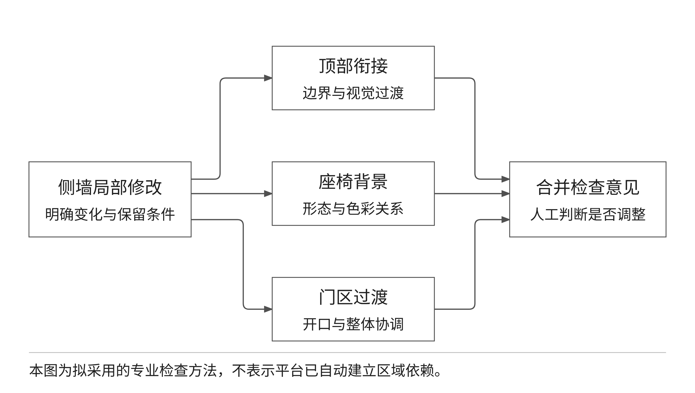

优化过程可先人工检查，再逐步结构化。对于有明确尺寸和接口条件的关联，可研究规则判断；对于色彩、纹理方向和视觉连续性，可研究局部对比与专业评分；对于多个可行方案，应保留分项评价而不是只给出综合分。这样可以看出某方案在整体协调方面较好、但需要更多人工调整的实际差异。

跨区域研究的对照任务应固定相同整体底图和修改目标，比较单区域独立修改与按照关联检查清单调整后的结果。记录被影响区域、新增调整次数、视觉一致性评价和未决问题。若评价人员意见分歧较大，应分析判断口径和样本特征，不能通过任意设置权重强行形成一致排序。

## （六）成果检索与复用

现有资产中心提供项目范围内的目录、标签、名称及编号搜索、类型筛选和排序，为设计资料与结果查找提供基础。颜色、材料、区域和模块信息可以先按约定命名、目录和标签组织，但专门的结构化字段查询、视觉相似检索、向量召回和评价排序仍需进一步建设。报告不将普通关键词搜索表述为已经形成智能知识检索。

后续检索研究可先建立有明确相关性判断的查询任务，比较现有关键词方式与候选增强方式。评价应关注目标资料是否找到、前列结果是否相关、检索时间以及用户能否判断适用范围。无论采用何种检索方法，都必须先遵守项目权限和资料授权，不能为提高召回范围直接向用户暴露其他项目的内容。

复用需要保存来源素材、原任务与新任务的关系。当前会话内的深化设计已经要求素材登记后再进入兼容能力；跨项目的正式方案共享与模块复用则需要另行明确权限和适用范围。可以查到文件不等于允许用于其他项目，已登记资产也不等于其材料、接口或品牌表达适用于新的车型。

# 六、平台功能模块与业务衔接

## （一）功能布局

平台功能以当前业务组织为基础，按首页、设计生成、模型训练、资产中心、报告生成和设计工作台设置主要入口。设计工作台管理项目并提供按权限开放的管理入口；任务通过项目进入，操作日志区分普通用户与管理员可见范围。图 9 表达这些功能与共用支撑服务的关系，不额外虚构独立的工程装配、自动审批或规则管理门户。

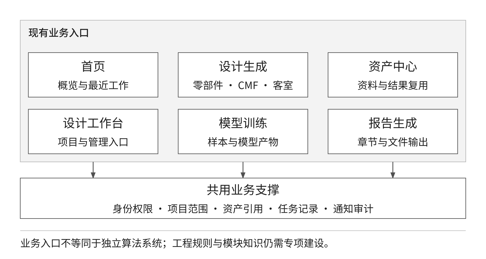

表 5 功能模块与合同任务的关联

| 功能模块 | 当前承担的工作 | 与本研究的关系 |
| --- | --- | --- |
| 设计生成 | 分模式输入、标记与遮罩、生成编辑、多轮结果 | 分区交互与快速设计的主要载体 |
| 资产中心 | 资料入库、目录标签、预览下载、查找复用 | 成果存储检索的现有基础 |
| 设计工作台 | 项目、成员、管理入口及项目任务 | 组织资料范围与设计协作 |
| 首页 | 真实数据概览、快捷入口与最近工作 | 提供统一访问和进度观察入口 |
| 模型训练 | 图片与说明组织、训练任务和模型产物 | 支撑需要时开展专项模型适配 |
| 报告生成 | 章节与项目图片编排、文档输出 | 支撑设计成果整理，不代替研究评审 |

## （二）典型设计业务流程

典型业务从确认项目和资料范围开始。设计人员上传或选择已登记图像，根据任务选择客室零部件、CMF 或客室效果模式；需要局部修改时，先进行标记或遮罩处理，并写明修改目标与保持条件。提交后查看任务状态，结果返回后先比较原图与输出，再决定保存、重新生成或进入下一轮深化。被选用的结果通过资产中心形成可再次使用的项目素材。

同一设计会话只允许一个活动任务，不同会话可以并行。该约束用于保持轮次与输入输出关系清晰，不表示平台具有无限并发能力。历史记录用于回溯和修改重发，不应在重新设计时覆盖旧任务。对于资料失效、类型不兼容、权限变化或外部服务失败，流程应明确停留位置和后续处置，不将异常简单隐藏为无结果。

以座椅表面材质探索为例，用户选择已有座椅图作为输入，使用 CMF 描述或局部遮罩限定变化，提交后比较纹理、色彩与非目标区域保持情况。若准备继续进行整体客室效果表达，先将所选结果登记为项目资产，再按目标能力要求补齐整体底图或其他素材。平台保证资料与任务关联，座椅实际材料选择、固定关系和制造条件仍需工程资料确认。

## （三）AI 聊天助手的图文辅助

AI 聊天助手仅作为辅助交流入口。用户可在一条消息中输入文字并附加一张或多张图片，后端在数量和容量限制内组织当前个人会话的近期上下文，向已配置的模型服务请求文字答复。适用任务包括询问图片中的视觉差异、讨论设计表达和整理需要进一步确认的问题。答复质量受所用模型与输入图片影响，不能作为自动分区、工程校核或合同验收结论。

聊天会话、消息和附件按用户隔离，管理员也不能读取其他用户的聊天正文。非图片附件虽然可以保存或下载，当前聊天接口不把其正文传给模型，因此不能宣称助手已经读懂图纸文档、音视频或三维文件。聊天助手不调用 ComfyUI 工作流，不自动发起设计、训练或报告任务，也不会自动将答复或附件登记为项目公共成果。

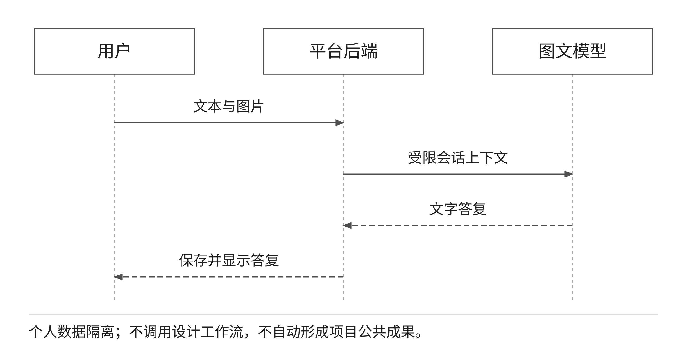

## （四）训练与报告支撑能力

模型训练以项目图片及逐图说明组成输入，用户填写限定范围的训练参数，由后端对接训练服务。平台提供任务、日志、进度、损失曲线、停止与模型产物管理。上述能力可支撑需要时开展特定内装风格或部件样例的适配研究，但训练入口存在并不证明已经建立区域识别模型，也不证明训练产物已适合正式业务。是否开展训练，应先依据样本质量、目标差异与评测方案决定。

报告生成使用项目文字、章节与图片组织设计材料，支持模板生成与外部 AI 生成，并形成相应的文档资产。当前可输出 Word 文档、演示文稿和自包含 Markdown 文档。模板生成与 AI 生成应明确区分，外部 AI 不可用时不能把模板结果伪装为 AI 生成成功。研究报告中的专业判断、工程结论和验收意见仍须由责任人员审核，不能因为文件生成完成就视为内容审核通过。

这些功能在本研究中的定位是支撑资料组织、效果适配和成果整理。研究重点仍然是分区识别、快速设计、跨区域方法和平台构建，不对扩展功能安排与核心合同任务等量的篇幅，也不将它们作为合同范围增加的默认依据。

# 七、数据资源与成果管理

## （一）数据分类与资料组织

平台资产按图片、视频、音频、文本、文档、三维模型、模型文件和压缩包八类文件类型管理。遮罩、CMF 材料样例、训练模型和研究报告属于业务用途，不是额外的文件类型。业务用途通过目录、标签、来源应用和任务关系表达。该方法保持通用资料管理稳定，也便于新能力使用已有素材，不要求每个业务工具另建孤立文件库。

面向内装研究，建议在项目内按基础资料、区域设计、模块样例、试验记录和确认成果组织目录，并约定区域、车型与任务相关的命名和标签。该组织方案是研究资料管理建议，不表示当前系统已具备所有专项资料库。需要进行结构化检索的字段，应先确定含义和维护责任，再逐步进入平台功能，避免在标签中混杂无法解释的属性。

表 6 研究资料与现有资产载体

| 研究资料 | 现有载体 | 后续需要补充的信息 |
| --- | --- | --- |
| 客室图像与参考方案 | 图片资产、项目目录 | 场景、区域、授权及适用范围 |
| 分区标记与遮罩 | 图片、参数与输入关联 | 标记规范、研究用途及人工判断 |
| 模块和材料资料 | 文档、模型、图片及标签 | 层级、真实属性、接口与依据 |
| 试验输入与结果 | 设计会话、任务及输出资产 | 试验组别、判定口径与评测记录 |
| 评审和交付资料 | 文档、文本及项目目录 | 确认记录、问题关闭与适用版本 |

## （二）上传与成果入库

文件先经过身份、项目范围、类型和大小检查，再取得短时上传地址。浏览器完成文件传输后，平台检查对象存在及基本信息，确认后才能作为可用资产。文件上传成功与资产登记成功是两个步骤；缺少登记或对象校验失败的文件，不能作为正式任务输入。研究数据清单也应关联已完成登记的资料，避免只记录用户本机路径。

设计工作流结果先保存在任务结果范围，用户可查看并决定是否加入资产中心。保存时保持原任务来源，后续深化任务引用该资产。图 11 表达原始资料、任务快照、暂存输出、确认资产和后续任务之间的关系。暂存结果与确认资产在管理上不同，使用者应能理解当前结果是否已经形成可复用资料。

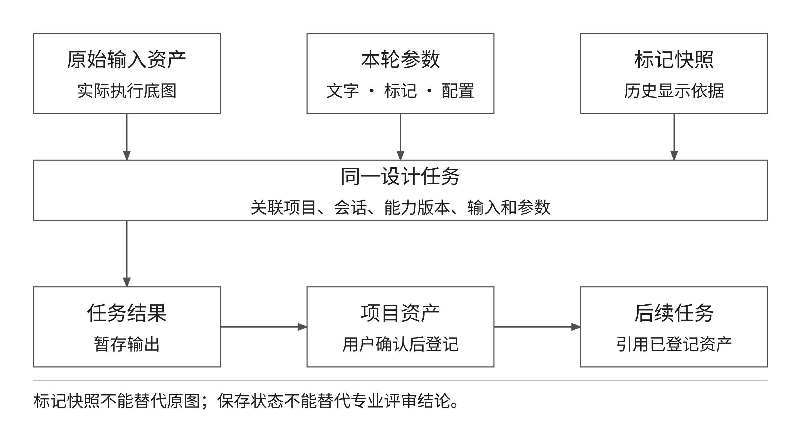

训练模型和报告文件按相应流程自动登记，仍需区分文件可用与研究质量确认。原始资料、生成结果和专业确认材料应分别组织，不以“已保存”统一表示三者的可信程度。针对后续增加的模块参数和评审信息，应明确其关联对象、修改权限和历史保留方式，保持文件与结构化记录能够互相定位。

## （三）版本与研究记录

现有平台可保留资产版本关系、任务参数及来源信息，但不能因此描述为已经提供完整的前端版本比较、任意版本恢复和研究结论自动同步功能。研究工作应在资料清单中记录本次使用的底图、参数、能力配置和输出，重要修订另存新版本，避免用同名文件反复覆盖。正式交付时还需校对文档、系统和试验资料是否对应同一阶段。

版本记录至少回答三个问题：本次结论基于哪些资料，采用什么处理条件，后续哪些变更会使结论需要复核。输入底图、标记规范、模板内容、外部模型或工作流发生变化时，应评估代表性样例是否需要重做。只修改排版不需要重新解释算法效果；改变输入语义或能力映射则可能影响研究结果，需按风险重新验证。

资料管理还要考虑保留与删除。项目或会话的软删除不应破坏历史任务、已形成资产和审计关系。成员退出项目不应删除其已提交资料。个人聊天清理与项目资料管理分开，不能把两种数据域的清理操作混为一谈。研究人员在整理样本或交付材料时，应确认没有把个人附件误当作项目公共数据。

# 八、既有产品平台接口与系统集成

## （一）接口范围与现有条件

合同要求平台具备与既有产品平台的接口和交互能力，并在第三阶段完成相关功能。现有平台自身的项目、资产和任务服务可以作为后续集成基础，但内部业务接口存在不等于已经完成与中车既有产品平台的真实对接。当前需进一步确认对方对象标识、数据格式、网络、认证和测试环境，再确定具体交换内容与实施方式。

集成范围宜围绕合同直接相关的业务：设计资料导入、项目或产品对象关联、成果文件输出，以及必要的任务状态和交互记录。项目主数据由哪一方维护、模块编码是否已有标准、文件采用推送还是受控获取、结果是否需要签收，都应在接口确认阶段形成明确记录。不在缺少资料时假设已有企业单点登录、自动双向同步或模块规则回写能力。

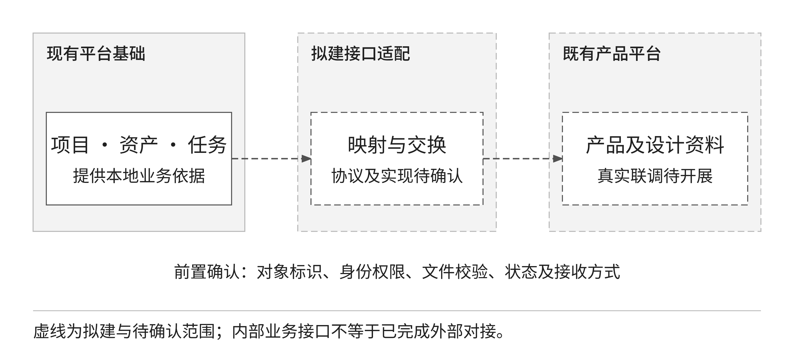

## （二）对象映射与文件交换

对象映射先于接口开发。平台中的项目、资产、任务和对方的产品、车型、设计对象可能不是一一对应，需要说明关联规则和主数据来源。字段映射表应包含双方字段含义、是否必填、取值范围、单位、时间表达、空值处理和版本标识。对不能直接转换的字段保留待确认项，不以默认值掩盖资料缺失。

文件交换需要确认格式、大小、完整性校验、访问期限和接收结果。大文件不宜在普通业务报文中直接堆叠传输，宜通过受控文件机制配合资产引用完成；具体方式以甲方网络条件和接口协议为准。对方获得文件不自动取得所有关联项目的权限，链接有效期也不能代替项目授权。

表 7 接口确认与联调工作清单

| 确认事项 | 需形成的内容 | 验证方式 |
| --- | --- | --- |
| 对象关系 | 项目、产品、车型及设计资料映射 | 使用真实样例逐字段核对 |
| 身份与权限 | 调用身份、数据范围及凭据管理 | 合法调用与越权拒绝测试 |
| 文件传输 | 类型、容量、校验及获取期限 | 完整上传下载与异常中断验证 |
| 状态交互 | 任务状态、错误、重试与签收 | 正常、重复、超时及失败场景 |
| 版本兼容 | 字段变更与历史资料处理 | 新旧版本样例及回归测试 |

## （三）接口实施与失败处理

接口实施建议依次完成协议确认、受控样例验证、平台侧适配、目标环境联调和场景验收。模拟服务可用于检查字段、重复请求、超时和错误处理，但正式接口完成必须有真实对方系统参与的记录。测试报告应说明哪些证据来自模拟、哪些来自真实联调，不能用模拟回执替代最终对接证据。

重复请求应能识别相同业务动作，避免形成重复资料或任务；传输中断应保留已完成的本地结果及错误信息；对方拒收应说明原因并支持人工处置。自动重试是否安全取决于接口操作的幂等性，不能对所有写操作无条件重试。未获得对方确认前，不将“请求已经发出”视为成果已完成交付。

# 九、安全与运行保障

## （一）身份权限与数据隔离

现有平台采用管理员和普通用户两类平台角色，项目内另有创建者、编辑和只读等权限范围。管理员可以进行管理操作，但受到自身角色保护及末位启用管理员保护。普通用户只能使用授权项目的数据；只读成员不能通过直接调用服务绕过页面限制进行写入。研究样本、成果及任务的访问均应纳入相同权限边界。

个人 AI 会话采用用户范围隔离，项目资料采用项目范围隔离，两者分别判断。管理员可查看操作元数据，不获得其他用户聊天正文的读取权限。图片上传、预览和下载都需要重新检查归属，不能仅根据文件地址是否可猜测来保护数据。权限测试应覆盖修改对象编号、切换项目、成员移除与会话失效后的读取。

## （二）保密与审计

平台接触的车型资料、图纸、模型、研究记录和设计成果应按甲方保密要求使用。外部能力服务的可访问性不构成数据发送授权，涉及外部传输时应先确认部署位置与数据使用边界。研究报告、样例图和试验资料对外提供前，应检查是否包含未经授权的项目内容、账号信息和内部服务配置。

审计记录请求与关键业务动作的必要元数据，如操作者、项目、任务、状态、时间和错误摘要，不采集完整聊天正文、文件正文、密码或令牌。研究人员可以通过任务与资产关系定位问题，再在有权限的业务页面查看相应资料，不需要为方便排障把敏感内容复制进日志。不同管理员的操作应保留可区分的身份快照，不能只记为同一个管理角色。

## （三）运行与故障恢复

运行保障包括平台服务、独立执行进程、数据库、对象存储和外部能力健康检查。应分别观察服务可访问、任务可领取、外部任务可执行、结果可读取和资产可登记，而不是用单一网页能打开判断整个系统正常。外部服务未配置、超时或返回格式错误时，应保留明确状态，避免任务长期显示生成中而无法解释。

正式运行前需确定备份频率、保留期限、恢复目标和责任人，并使用隔离环境验证恢复后资料可读、任务关系完整、用户权限有效。数据库备份与文件对象备份需要对应，同步了业务记录但缺少对象文件不能形成可用恢复。恢复演练和容量测试应在目标环境开展，依据实测结果确定服务保障目标与运行条件。

# 十、技术路线与建设进度计划

## （一）阶段路线与依赖关系

总体路线遵循合同提出的需求与数据梳理、关键技术识别与研究、功能模块体系搭建、快速设计系统开发、平台集成、验证与迭代优化、版本固化。实施中不必等待全部研究结束才完善平台基础，但对象分类、输入语义和验收口径必须先于相关功能冻结。研究与开发并行时，采用代表性任务作为共同检查点，使方法变化能够及时反映到业务流程和测试用例。

第一阶段主要形成问题界定、区域划分、模块拆解、现有交互分析、总体架构与验证方案。第二阶段围绕合同业务完成研究方法落地和快速设计系统完善，形成第三方检测及甲方验收材料。第三阶段完成既有产品平台接口、系统功能测试、使用与交付资料。图 13 标出合同截止节点，阶段内安排是建议工作分解，不表示各项任务已经实际完成。

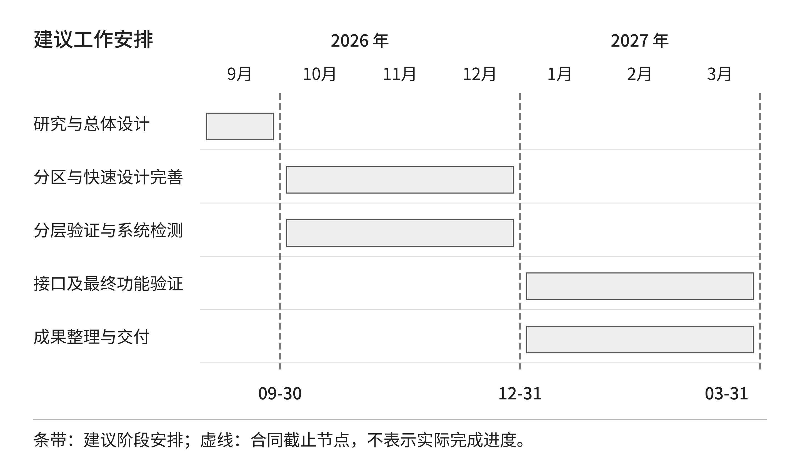

## （二）合同里程碑

表 8 阶段节点与交付要求

| 阶段 | 合同截止时间 | 主要工作及成果 | 完成依据 |
| --- | --- | --- | --- |
| 阶段一 | 2026-09-30 | 功能分区研究、总体架构及研究报告 1 份 | 报告专家评审与甲方验收 |
| 阶段二 | 2026-12-31 | 识别与分区设计研究、快速设计系统 1 套 | 第三方检测报告及甲方验收 |
| 阶段三 | 2027-03-31 | 功能测试、平台接口、系统源程序 1 套、手册 1 份、软件著作权 3 项 | 成果验收与软件著作权受理 |

第一阶段交付不要求把未开展的后续研究写成完成结论，但报告应足以指导下一阶段：说明研究问题、对象与数据、方法选择、平台边界、验证步骤和风险。对于需要甲方资料或接口才能明确的事项，应形成可追踪的确认清单，写明对哪项任务有影响，而不是泛泛标注待定。

第二阶段应以典型场景闭环检查合同功能，覆盖区域设计、零部件和大部件效果、整体布置表达、成果管理及异常处理。平台辅助功能可同步完善，但不能以新增扩展工具替代核心功能缺口。第三方检测之前需要稳定测试对象与用例，保留内部问题整改记录，防止临近检测时频繁修改输入语义和版本。

第三阶段的接口工作应提前准备资料，不宜到最后阶段才开始联系对接条件。正式接口实现与验收可在第三阶段集中完成，但对象映射、认证方式和测试环境确认应前置。系统交付时应同步整理使用流程、部署条件、运行维护与研究样例，确保接收方能够复现典型任务并理解结果边界。

## （三）近期工作分解

1. 确认六类核心区域的术语、边界及代表性资料，形成四级模块拆解样例。
2. 制定颜色标记、编号标记和遮罩的任务说明与标注规范，固定对照试验样本。
3. 核对现有能力与合同功能的对应关系，列出自动识别、工程参数、规则及接口的差距。
4. 按研究任务补充评价记录和对照结果，区分人工判断、平台校验及拟建算法。
5. 明确目标部署环境、模型依赖、文件访问与既有产品平台接口条件。
6. 形成阶段评审清单、测试计划和整改记录，对变化较大的方法先开展小范围验证。

工作分解应按研究对象、技术实现、数据准备、验证和交付分别指定责任。资料提供人员确认来源与适用性，设计人员确认分区和效果判断，技术人员负责能力衔接与状态一致性，测试人员负责用例与复测，项目负责人控制范围和里程碑。实际人员安排以双方项目组织为准，报告不擅自增加角色承诺或人员数量。

# 十一、研究验证与合同验收

## （一）研究试验设计

试验 A 比较局部设计意图表达方式。采用相同底图、相同修改目标和相同能力配置，分别使用纯文字、颜色标记、编号标记或遮罩；不适用某种输入形式的任务应单独分组。记录目标定位、准备时间、修改达成、非目标变化和人工调整次数。该试验评价交互方法与生成效果，不直接等同于自动识别精度测试。

试验 B 评价区域识别候选方法。在人工参考标注确定之后，固定独立测试集，比较候选方法对区域类别和范围的判断。分类输出使用对应的分类指标，区域输出使用重叠或边界指标；按核心区域和困难场景分别统计。自动识别研究尚未形成稳定方法时，应如实报告方法差异和失败类型，不先写结论再挑选支持样例。

试验 C 评价快速设计过程。固定设计任务和可接受标准，观察从资料选择、输入准备、任务执行到人工确认的总过程，分别统计人工操作与外部等待。任务失败、结果不接受和二次修改均计入过程记录，不能只统计一次成功生成的时长。若要与既有工作方式比较，应统一任务难度、操作人员和判定条件，并说明学习效应。

试验 D 评价跨区域检查方法。选择存在相邻关系的局部修改任务，对比未使用关联检查清单和使用清单后的结果，记录遗漏问题、补充修改和整体协调评价。评审人员应尽量在不知道方法分组的条件下判断，并保留分歧与原因。不能凭单一综合分宣称解决全部跨区域工程问题。

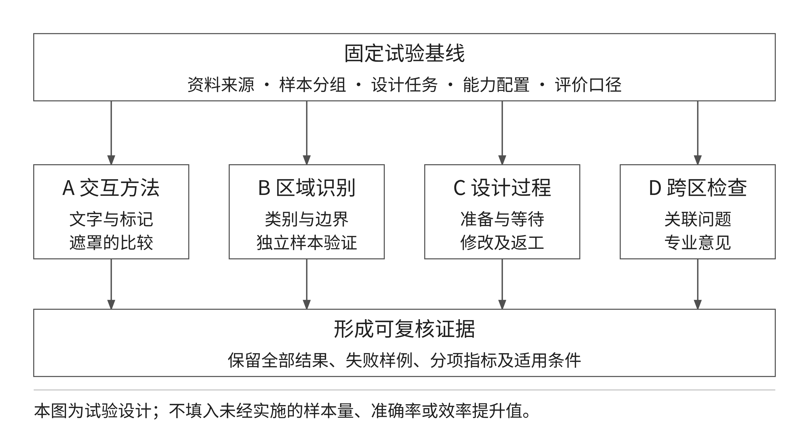

## （二）指标选择与结果解释

表 9 研究指标与适用前提

| 评价对象 | 可采用指标 | 必须说明的条件 |
| --- | --- | --- |
| 区域类别识别 | 准确率、召回率、类别 F1 | 标签定义、类别分布及独立样本 |
| 区域范围 | 交并比、边界偏差 | 输出为区域，参考边界经确认 |
| 局部设计 | 目标达成、非目标变化、接受比例 | 设计要求与人工判断口径一致 |
| 设计效率 | 准备时间、等待时间、修改轮次 | 包含失败与返工，不只记录最好结果 |
| 跨区域协调 | 关联问题发现、遗留问题、专业评分 | 检查关系和评价尺度事先确定 |
| 平台可靠性 | 任务成功、恢复、结果可读及权限拒绝 | 环境与用例固定，保留完整过程 |

指标阈值应在试验方案中事先确定或通过基线试验共同确认。不能把测试用例通过率不低于 99% 的合同要求解释为区域识别准确率不低于 99%，二者分母、任务和意义不同。识别指标衡量候选方法在样本集上的表现，系统测试通过率衡量已确定用例的执行结果，功能完成率则衡量合同功能是否落地。

结果报告需要给出样本来源、数量、分组、配置、重复次数、失败样例和判断方式。样本不足时应说明限制，类别差异较大时应分区域报告，人工评分应保留评价人员及分歧。研究提出的建议只有在对应证据支持下才转化为建设决策，未被验证的方案可继续列为候选，而不通过文字修饰制造确定性。

## （三）三级系统验证

单元验证检查输入解析、标记数据、类型判断、权限规则、参数转换和状态处理。它能发现局部逻辑问题，但不能证明完整设计流程可运行。集成验证使用真实数据库、对象存储及平台服务，检查资产上传、项目隔离、任务关系、结果登记、取消与异常补偿。涉及外部协议的模拟测试应明确模拟范围，不代替真实模型执行。

系统验证在目标部署条件下开展，覆盖登录、项目、资料、分区交互、任务执行、结果对比、成果保存、检索复用、报告整理和接口交互。应检查页面关闭后任务继续、执行进程重启后的任务恢复、输入失效、外部服务失败、对象读取失败及权限变化等场景。三维生成与训练任务需要相应的真实计算和模型条件，不能只用普通页面检查确认完成。

安全和运行验证包括跨用户与跨项目拒绝、个人会话隔离、敏感内容不进入日志、备份恢复和目标环境兼容性。对关键风险，即使总体通过率达到要求，也必须单独检查。已知越权、成果丢失或外部伪成功不能被大量低风险用例的通过结果掩盖。

## （四）合同指标与评审材料

合同明确要求平台系统功能 100% 落地，测试用例通过率不低于 99%，无严重及以上级别缺陷，并完成第三方检测和甲方验收。实施前应形成经确认的功能清单、用例分母、缺陷分级及复测口径。未执行、受环境阻断、失败和通过应分别统计，不能把未执行用例排除后直接宣称达到合同指标。

表 10 验收要求与证据材料

| 要求 | 应形成的证据 | 判断边界 |
| --- | --- | --- |
| 指令与流程正常 | 典型任务全过程、状态与结果记录 | 页面存在不代表流程完整 |
| 功能全部落地 | 合同需求与功能逐项追踪 | 研究设想不计为已完成功能 |
| 用例通过率不低于 99% | 固定用例集、执行及复测结果 | 不等于算法识别准确率 |
| 无严重及以上缺陷 | 分级缺陷台账与关闭证据 | 关键问题必须单独关闭 |
| 检测与甲方验收 | 第三方报告、评审与确认材料 | 内部测试不替代正式验收 |
| 资料完整规范 | 报告、系统、手册及成果清单 | 内容、格式和对应版本一致 |

第一阶段报告采用专家评审，应重点审查研究对象、方法依据、架构合理性、现有基础与拟建范围、进度及验证可行性。第二阶段准备系统检测和业务场景证据，第三阶段补齐接口与交付材料。合同规定首次验收未通过时，在收到整改通知次日起 7 日内修正并再次提交；整改范围、责任、复验用例和提交材料应形成记录，按最终生效文件执行。

# 十二、风险分析与建设建议

## （一）主要风险

表 11 研究与平台构建风险

| 风险 | 影响 | 控制措施 |
| --- | --- | --- |
| 资料不足或边界不统一 | 识别样本与模块分类不稳定 | 先确认术语、来源、标注及争议处理 |
| 现有功能与研究目标混淆 | 错估建设工作与验收状态 | 分列现有基础、拟建任务和验证条件 |
| 局部生成改变非目标区域 | 结果难以用于后续设计 | 保留原图，按区域比较并统计失败 |
| 工程约束缺少结构化依据 | 无法自动判断尺寸与接口 | 先整理真实参数，保留专业复核 |
| 外部模型和节点变化 | 结果或执行协议不稳定 | 固定版本，使用代表性任务复测 |
| 接口条件确认滞后 | 联调与交付延期 | 提前完成对象、认证及环境确认 |
| 数据授权或访问范围不清 | 研究资料误用或外泄 | 最小权限、授权清单与资料审查 |

## （二）实施优先级

优先完成区域术语、模块拆解样例、分区标记规范和对照试验方案。这些工作直接决定研究内容能否落到真实任务，也决定后续结构化数据和算法评价的基础。其次完善现有分区交互、任务执行和成果保存链路，使研究记录能够持续积累。自动识别、工程参数、规则校核与检索增强应依据明确样本和业务问题逐项实施，不能以同时引入大量技术概念代替问题分析。

跨区域研究应先从可解释的人工检查关系开始，逐步识别可自动化部分。外部能力选型应以实际样本、部署条件和数据边界为依据，不把某一模型名称写成不可替换的技术结论。既有平台接口应提前确认数据关系，避免最后阶段因编码、权限和文件传输差异产生返工。

进度管理应以成果和证据关闭任务。分类规范需要经过典型对象走查，交互方法需要对照记录，功能完善需要真实流程验证，接口完成需要对方系统回执。未获得上述证据时，可以记录阶段进展与剩余条件，但不应宣布任务已完成。这样既保留研究探索空间，也使后续建设和合同验收能够使用同一事实口径。

# 十三、研究结论

内装模块分区识别与快速设计平台的构建，需要把区域对象、设计意图、执行过程和成果管理组织成连续业务。本报告形成的方案以现有项目、资产、设计会话和任务基础为承载，以颜色标记、编号标记和遮罩作为当前局部设计入口，围绕模块拆解、自动识别候选方法、参数与规则、跨区域检查及成果复用安排后续研究。平台基础能提供过程控制，不能直接替代区域识别精度、工程适用性和专业评审结论。

AI 聊天助手的图文输入保持辅助定位，与生成工作流分别建设和验证。工程参数化、自动规则判断、结构化模块库和智能检索应根据技术规格书及实际资料逐步落实，未形成数据、功能和测试证据前不视为完成。整体架构坚持后端统一权限与资料管理、能力分别适配、结果保留来源，支持后续迭代而不丢失研究依据。

后续工作应围绕合同三个节点推进：第一阶段固化研究范围、方法和总体架构，第二阶段完成方法落地与快速设计系统检测，第三阶段完成既有产品平台交互和成果交付。研究成果的价值应由可重复的设计任务、可解释的结果和可核验的验收材料体现，最终形成能够持续使用和维护的内装分区快速设计平台。

# 附录 A 合同技术要求追踪表

表 12 合同技术要求与本报告章节

| 要求来源 | 关键要求 | 对应章节 |
| --- | --- | --- |
| 合同 2.1.1 与技术规格书 | 内装模块功能分区识别研究 | 第二章、第四章、第十一章 |
| 合同 2.1.2 与 2.1.3 | 多模态识别与分区设计路径及平台构建 | 第一章、第三至第六章 |
| 合同 2.2.1 | 快速设计算法及跨区域优化 | 第五章、第十一章 |
| 技术规格书开发方法 | 四级模块拆解及参数化配置 | 第四章、第五章 |
| 技术规格书主要内容 | 零部件、大部件、整体与装配效果 | 第四至第六章 |
| 技术规格书主要内容 | 成果储存检索与既有平台交互 | 第七章、第八章 |
| 合同 2.4 与技术规格书 | 功能、测试及严重缺陷指标 | 第十一章 |
| 合同 6.2 与成果清单 | 三阶段节点与交付成果 | 第十章、第十一章 |

# 附录 B 下一阶段研究与设计输入

1. 经确认的车型、六类区域样例、模块层级及名称对照。
2. 图像、图纸、模型和设计说明的来源、授权与版本清单。
3. 颜色标记、编号标记、遮罩和原图对比的典型任务脚本。
4. 拟研究自动识别方法的样本分组、参考标注与评价口径。
5. 真实尺寸、安装接口、材料适用条件及相关专业确认资料。
6. 既有产品平台对象映射、认证、网络与联调环境说明。
7. 外部能力的模型、节点和运行条件及代表性任务记录。
8. 经确认的阶段功能、测试用例、缺陷分级和评审资料清单。
