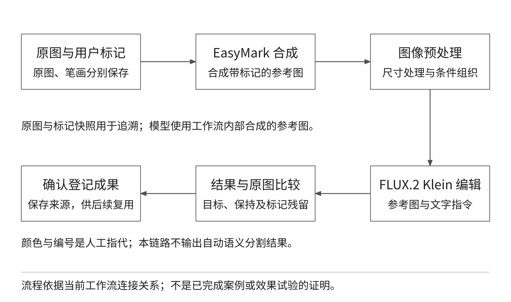
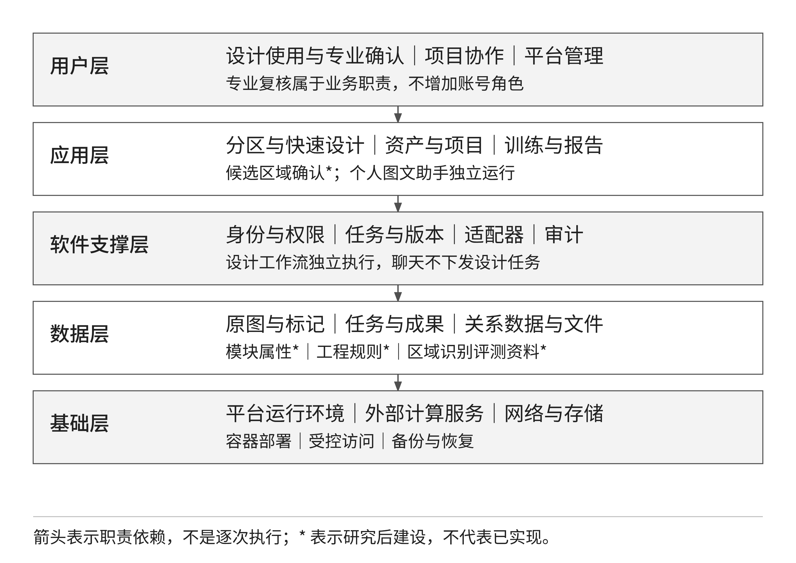
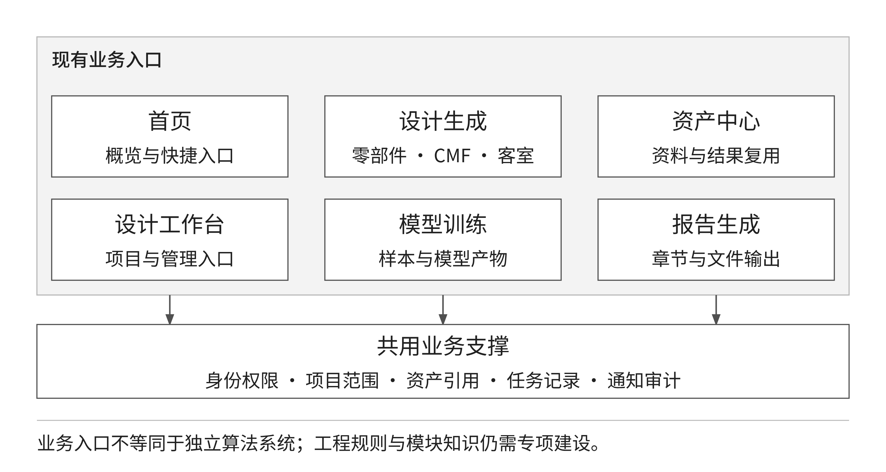

# 概述

出口客运装备内装设计需要在产品族共性与项目差异之间取得平衡。侧墙、顶部、地板、端墙、座椅及车门周边具有不同的功能和接口条件，局部形态、材质、色彩与纹理的变化又会影响客室整体表达。以稳定模块组织设计资料，以清晰的区域指代组织方案修改，是提高资料复用、方案探索与协同评审效率的基础。本研究依据项目技术开发合同及技术方案，对内装模块化、图像区域识别和条件生成方法进行分析，形成分区快速设计的技术路线及平台构建方案。

研究以功能为模块划分主线，以空间区域建立图像索引，以结构接口和维护替换条件校核模块边界，按系统、子系统、组件和零件四级组织研究对象。在识别与交互方法上，比较检测、语义分割、实例分割和提示分割的输出及数据条件，结合现有工具选择人工颜色或编号标记配合文字指令的设计路径，并将提示分割与人工类别确认作为下一阶段优先验证的辅助识别路径。设计流程贯通原图选择、标记与指令组织、条件编辑、区域保持评价、跨区域检查和成果复用，工程参数与接口条件仍由专业资料和显式约束管理。

平台构建采用用户、应用、软件支撑、数据和基础五个逻辑层次。已有项目、资产、设计会话、执行任务和外部能力适配基础，能够承载分区交互及设计过程记录；模块数据、自动候选识别、工程约束和既有产品平台交互按研究验证结果分阶段完善。报告形成了方法选择、业务流程、平台架构、数据组织、实施计划和验证方案，为快速设计技术的工程应用提供前期基础。设计加速效果和识别质量通过统一任务、同源对照及目标环境测试评价，不以图像生成完成代替工程设计确认。

# 一、出口客运装备内装设计现状与研究方法

## （一）出口产品平台与内装模块化需求

项目面向中车出口产品平台开展研究。“产品平台”指支撑系列车型和项目变型的共性产品技术、模块及接口体系，“快速设计平台”指管理设计输入、调用技术能力并保存成果的软件系统。前者决定哪些模块能够复用、哪些条件必须保持，后者负责把这些知识与设计操作组织起来。二者通过产品对象、项目资料和成果关系衔接，不能因建立了文件库便认定已经形成产品平台的全部能力。

项目技术方案将不同国家、线路和车型的差异，以及零部件资料、材质信息、模型、规则与历史方案分散，作为建设需求的主要背景。由此，本研究将出口内装设计问题分解为共性模块复用、项目差异表达、局部与整体协调、资料和成果追溯四类问题。这是基于现有技术资料的需求分析，企业具体车型覆盖、资料流转方式和瓶颈程度，应由对应业务流程及实际项目记录核实。

产品架构研究关注功能如何分配到物理部件以及部件间如何形成关系[1]。对客室内装而言，视觉上连续的侧墙可以由多个具有不同拆装和维护要求的组件组成；形状相似的座椅也可能因安装条件、附件和使用场景不同而不能直接互换。因此，模块化不能只依据外观相似度。应以功能、接口及适用范围形成复用依据，再以图像区域建立设计操作入口。

本项目关注的设计层次包括客室零部件、大部件模块、整体布置和装配效果，设计变量包括形态、材质、色彩和纹理。快速设计首先作用于概念方案表达、局部修改和方案比较；对安装尺寸、连接结构和专业安全条件，仍需沿用可核查的工程数据与评审。这样可以在利用生成能力扩大方案探索范围的同时，保持概念效果与工程定型之间的清晰分工。

## （二）设计流程问题与设计加速需求

从研究任务出发，内装方案设计可分解为需求转换、资料查找、模块选择、方案表达、协调评审和成果整理六个环节。实际项目可以存在并行与回退，这一分解用于确定研究变量，不限定甲方必须采用同一种管理流程。需求转换要明确目标区域、使用场景和保持条件；资料查找要定位适用车型及版本；模块选择要检查功能和接口；方案表达要形成可比较的视觉结果；协调评审要检查关联区域；成果整理要保留设计依据。

文字描述对重复部件的指向往往不够明确，例如同一透视图中的多组座椅、扶手或墙板可能同时符合一句描述。纯整图修改还可能改变无关开口、透视和布置。颜色、编号及遮罩的研究价值在于让修改位置可见、让目标对象可核对，而不是增加输入形式本身。资料来源不清和多轮结果覆盖则会使设计人员难以判断某一结果采用了哪张底图、哪些约束以及何种处理条件。

表 1 设计环节与研究切入点

| 设计环节 | 需要解决的问题 | 技术切入点 | 验证对象 |
| --- | --- | --- | --- |
| 需求与资料 | 对象名称、适用范围和版本不一致 | 模块术语、资料索引及来源管理 | 找到正确资料所需操作 |
| 对象定位 | 文字对重复对象指代不清 | 颜色、编号、遮罩及候选分割 | 定位时间与人工修订 |
| 方案表达 | 重复改图及局部生成偏移 | 图文条件编辑与保持条件 | 修改达成与非目标变化 |
| 协调评审 | 局部调整影响相邻区域 | 关联关系与分项检查 | 遗漏问题及返工 |
| 成果复用 | 结果缺少输入与版本依据 | 任务记录与确认资产关联 | 资料查找和复现完整性 |

设计加速应以完整任务过程衡量。准备标记可能增加一次输入操作，却减少反复描述对象的次数；自动候选分割可能缩短初次绘制，却增加修订复杂边界的时间。研究必须把资料查找、输入准备、计算等待、比较和返工纳入同一口径，检验增加技术环节后总过程是否更有效，不能只比较生成按钮到图片返回的时长。

## （三）研究方法选择与证据形成

本研究采用功能拆解、交互任务分析、技术比较、受控对照和系统场景验证相结合的方法。功能拆解用于建立区域及四级模块关系；交互任务分析用于识别用户在“选对象、提要求、判结果”各环节的困难；技术比较依据输出类型、数据需求和平台兼容性筛选方法；受控对照检验标记、遮罩和候选识别的作用；系统验证检查方法从独立试验进入平台后的完整性。

方法选择遵循先确定输出再选择算法的顺序。需要模块名称时评价类别判断，需要可编辑边界时评价区域输出，需要局部效果时评价条件生成，需要工程可用性时检查尺寸及接口。模型能够描述图像，不代表它提供可直接计算的区域边界；模型能够产生区域，也不代表区域自动对应经确认的产品模块。

研究资料以同一任务为单位，保存原始输入、对象定义、处理条件、完整输出和人工判断。方法比较采用同源样本、相近任务难度及一致的判断尺度，并分别记录失败和争议。区域术语、模块拆解、对照记录和平台完善决策之间建立关联，使研究结论可以解释为在哪些条件下选择了何种方法，而不只表现为一组效果图。

## （四）人工智能相关技术现状与适用能力

图像识别技术可按输出粒度分为图像类别、目标位置、像素类别和独立实例。分类回答图中主要包含什么，检测给出对象的大致范围，语义分割为像素赋予类别，实例分割进一步区分同类对象。在重复座椅和遮挡条件下，这些输出的可用性不同；研究应分别测试对象指代和边界精度，避免用通用图像分类效果推断客室局部设计能力。

图文表征技术通过图像与文字之间的关联学习，使自然语言能够参与视觉概念匹配。CLIP 的研究展示了图文监督用于学习可迁移视觉表示的路径[2]。它为按语义描述组织图像比较提供方法依据，但图文相似度本身不提供安装接口、真实尺寸或已确认的像素边界。将其用于本项目时，必须另行定义区域标签、适用范围和人工判断口径。

分割研究中，U-Net 采用收缩路径与扩展路径结合的结构，面向密集像素预测[3]；Mask R-CNN 将对象检测与实例掩膜预测结合，区分同类目标[4]；SAM 探索可提示的图像分割，使点、框等交互能够驱动候选掩膜[5]。这些方法提供不同的数据与交互选择，并不因其通用能力而自然具备客室六类区域的业务语义。针对本项目的适用性，需要在反光、重复构件、遮挡和不同视角样本上检验。

生成编辑技术则以设计变化为输出。ControlNet 展示了向图像生成加入边缘、深度或分割等空间条件的路线[6]；FLUX.2 官方资料描述了文本指令与参考图像结合的图像编辑能力[7]。本项目现有分区工具采用标记参考图与文字指令配合的编辑链路。候选分割、区域语义判断和条件生成应作为可组合但职责不同的环节分别验证，而不合并为一个笼统的“智能识别”能力。

# 二、内装模块划分与分区设计研究

## （一）功能驱动的区域划分

区域划分以客室功能和设计任务为出发点，不只依据图像颜色或几何轮廓。侧墙可包含墙板、窗带与检修构件，顶部可包含顶板、照明与风口区域，地板需要考虑铺装与设备固定，端墙涉及显示、设备门和贯通区域，座椅涉及座椅单元及关联附件，车门周边关注门框、过渡和通行区域。上述内容作为研究分类示例，具体对象及边界需由实际车型资料确认。

同一零部件可能在空间上跨越两个区域。研究时应区分主要归属区域与关联区域，例如扶手可按主要功能归入相应模块，同时记录它与顶部、地板或座椅的安装关系。若仅按图像框位置归属，容易造成跨区对象重复登记。区域分类必须说明包括什么、排除什么、边界如何判断，以及无法判断时由谁确认。

表 2 核心区域与设计检查重点

| 区域     | 典型对象               | 设计检查重点                   |
| -------- | ---------------------- | ------------------------------ |
| 侧墙     | 墙板、窗带、检修构件   | 开口保持、分段衔接、表面连续性 |
| 顶部     | 顶板、灯带、风口       | 设备关系、层次、与侧墙的过渡   |
| 地板     | 铺装、通道、固定区域   | 纹理方向、拼接、座椅与门区衔接 |
| 端墙     | 端墙板、显示与设备区域 | 开口和功能区保留、视觉中心     |
| 座椅     | 座椅单元、扶手、桌板   | 形态一致性、排列关系、固定条件 |
| 车门周边 | 门框、门套、过渡构件   | 通行与开启范围、边界和提示信息 |

## （二）四级模块拆解方法

技术规格书要求按系统级、子系统级、组件级和零件级开展拆解。研究中以客室内装为系统级，以具有相对完整功能和空间范围的单元为子系统级，以可组合或替换的功能组件为组件级，以具体零件为零件级。图 2 采用侧墙模块的代表性拆解说明层级关系，不作为已批准的产品结构清单。各车型的子系统划分及部件归属仍应由专业资料核实。

拆解时需要同时检查功能独立性、边界清晰度和接口稳定性。功能独立性用于判断该模块是否承担可描述的任务；边界清晰度用于判断图纸、图像或清单是否能够定位对应对象；接口稳定性用于判断模块替换时是否会改变上级功能和相邻模块。过大的模块粒度会限制组合，过小的粒度则增加资料与约束维护负担，主要设计粒度应结合典型任务确定。

模块研究清单建议记录名称、层级、上级对象、主要区域、关联区域、形态与材料属性、适用车型、接口说明和依据文件。具备真实尺寸时应同时保存单位和测量或图纸来源，不能由效果图比例推算成正式参数。对于同名但接口不同的对象，需要保留区别；对于同一模块在多个项目中的使用，需要标明适用范围和来源，而不是简单复制名称。

现有资产目录与标签能够支撑模块资料的初步分类，但四级模块的结构化维护、关系检查和专门选择界面仍需进一步建设。第一阶段宜先形成可评审的拆解样例和字段定义，利用真实资料检验是否满足零部件、大部件与整体布置任务，再确定后续数据结构和交互方案。

## （三）传统机械设计与模块化划分方法

传统模块化划分首先确定功能与物理结构之间的对应关系，再结合装配、维护和变型需求形成模块边界。功能划分把同一任务所需对象组织为单元，例如照明、承载、遮蔽或信息展示；结构划分依据实体连接及装配关系组织零部件；接口划分关注模块间传递的力、空间、能量或信息条件；维护划分关注检修与替换时需要一起处理的对象。不同划分可以产生不同粒度，需要结合具体设计任务选择。

按功能划分能够保持模块职责清晰，但一个实体可能承担多种功能；按结构装配划分便于衔接工程清单，却可能把跨结构的视觉关系分开；按维护替换划分有利于定义可替换边界，但不一定与概念设计中的局部改图范围一致。产品族分析还需区分共用模块、可配置模块和项目专用对象，共用的判断应依据接口与适用条件，而非文件名称或图像外观一致。

表 3 模块划分方法与项目适用性

| 划分方法 | 主要依据 | 对本项目的作用 | 需要的资料 |
| --- | --- | --- | --- |
| 功能驱动 | 使用任务与功能分解 | 确立模块职责与四级层次 | 功能说明及专业意见 |
| 空间与结构 | 客室位置、实体组成 | 建立区域索引及对象定位 | 总布置、模型及图像 |
| 接口关联 | 连接、安装与相互影响 | 检查替换和跨区域影响 | 接口、尺寸与连接条件 |
| 维护替换 | 检修可达与替换单元 | 校核实际模块边界 | 维护说明与拆装流程 |
| 产品族共性 | 共用、变型及适用范围 | 支撑跨项目资料复用 | 车型配置及模块清单 |

本项目采用“功能主线、空间索引、接口校核”的组合划分。先从客室内装功能形成四级模块框架，再用六类区域组织图像和设计任务，最后检查与相邻模块的连接、维护和适用条件。以侧墙为例，图中可见的连续墙面作为区域索引，具体墙板、窗带及检修构件按各自职责和接口进入模块清单。图像边界与工程拆分不一致时，应保留映射关系，不强行把一个图像区域等同于一个零件。

划分成果包括对象名称、层级、主要区域、关联区域、功能、输入资料和接口说明。可复用对象须附适用条件，跨区对象须注明主要归属与影响范围，暂不能确认的连接关系进入专业核查。其研究检验方式是使用同一组典型设计任务走查分类：能否找到正确对象，是否出现重复归属，替换时能否指出需要复核的相邻对象，而非单纯统计划分数量。

## （四）AI 区域识别与交互方法比较

检测方法以目标框表达对象位置，适合为用户提供粗粒度定位入口；若要直接修改不规则墙板、座椅轮廓或缝隙，矩形框仍会包含背景。语义分割为像素赋予类别，适合连续区域，但同类相邻座椅可能形成同一类别区域。实例分割为各对象输出独立掩膜，更有利于重复部件指代，代价是需要一致的实例定义和相应训练或验证样本。选择方法时应使输出粒度与任务要求对应。

以 U-Net 为代表的编码—解码结构利用不同空间尺度的特征恢复像素输出[3]。其在本项目中的候选用途是学习固定区域标签；标签之间的边界、跨车型外观变化及小部件样本不足都需要专门处理。Mask R-CNN 在检测分支之外预测实例掩膜[4]，可作为重复对象识别的比较方法，但“一个座椅实例”究竟按座椅单元还是座椅组定义，仍由研究标注规范决定。

提示分割通过用户提供点、框或已有掩膜获得候选区域。SAM 的方法将图像编码、提示编码和掩膜解码结合[5]。这一形式与设计人员先指定对象再编辑的行为较为接近，可用于减少轮廓绘制操作。候选掩膜不直接给出本项目确认的区域类别，错误边界也可能存在，因而仍需人工确认或结合专用分类。选择提示分割是对交互条件的阶段性判断，并非未经试验的精度结论。

图文条件编辑关注“在什么位置作何变化”。颜色标记提供位置线索，编号补充重复对象的指代，文字说明变化目标及保持要求。模型以这些条件生成新图像，其结果属于设计表达，不是分割标注。遮罩进一步限定允许修改的图像范围，与仅表达对象位置的颜色笔画不同。结构条件生成可作为保持轮廓和布局的比较方向[6]，但须在对应工作流真正接入后评价，不因理论可行便写成当前配置。

表 4 识别与设计方法比较及阶段选择

| 方法 | 主要输出 | 适用问题 | 本项目处理 |
| --- | --- | --- | --- |
| 目标检测 | 类别与目标框 | 粗定位、重复对象候选 | 作为候选定位对照 |
| 语义分割 | 像素类别区域 | 固定功能区域划分 | 有标注条件后验证 |
| 实例分割 | 逐对象掩膜 | 同类部件单独指代 | 对照重复构件场景 |
| 提示分割 | 提示驱动的候选掩膜 | 辅助勾选和边界修订 | 下一阶段优先验证 |
| 颜色或编号编辑 | 条件生成图像 | 指定局部设计变化 | 当前实施主路径 |
| 遮罩局部重绘 | 限定范围的设计图像 | 局部材质及形态修改 | 当前补充交互路径 |

比较试验分为“是否找到正确对象”“边界是否可用”和“生成变化是否符合要求”三个任务，分别采用对象判断、区域重叠及设计评价。分类或掩膜结果可以成为生成输入，生成图却不能反推为识别准确的证据。这样能够判断失败来自定位、边界、条件理解还是生成保持能力，便于选择正确的改进环节。

## （五）项目方法选择与平台集成

当前采用人工颜色或编号标记与文字指令结合的路线，以遮罩编辑补充范围控制。选择依据是平台已有标记输入、原图关联、任务参数、工作流适配和结果比较基础，设计人员能够直接确认修改对象，适合开展可追溯的概念方案探索。该选择不以已建立完整自动分区数据集为前提，能够先积累真实任务及失败类型，再据此决定自动辅助的优先位置。

现有颜色分区和编号分区都使用 EasyMark 处理原图及笔画，在工作流内部形成带标记的参考图，再交给 FLUX.2 Klein 编辑链路。平台保存原图与历史标记快照，工作流按笔画重新合成用于模型输入的图像；历史快照与模型实际条件图承担不同用途。标记中的颜色和编号是对设计对象的约定，不是模型自动识别出的部件类别。

下一阶段优先验证“提示分割获取候选范围—人工修订并赋予区域语义—转换为设计输入”的辅助路线。其目标是减少绘制与修订操作，不改变设计人员确认对象和成果的责任。监督式语义或实例分割作为对照，在样本类别稳定、标注充分时评价其自动化收益。只有在边界质量、人工修订时间和任务成功方面获得证据后，才确定正式接入的模型与版本。

平台集成宜保持输入原图、候选区域、人工确认结果和设计输出的来源关系。候选算法通过后端适配运行；确认界面展示区域及修订状态；设计入口接收经确认且兼容的标记或遮罩；任务保留方法配置和输入快照。当前已有后半段的设计任务与资产基础，候选算法及确认信息结构需在验证后补充，不让前端直接访问模型内部资源或跳过项目权限。

## （六）样本与标注质量控制

样本应覆盖核心区域、不同视角、重复部件、遮挡、反光、低对比度和材质纹理变化等条件。样本规模由可用资料和评测方案确定，并在研究实施前形成清单。每个样本应能关联原始资料、授权范围、车型或场景、区域类别及标注版本。缺少来源或无法解释的样本不得直接用来形成正式评测结论。

同一原始图像的裁切、缩放或连续视角具有较强关联，应作为同源组管理，避免同时进入训练集与测试集造成数据泄漏。标注规范需要约定可见范围、遮挡区域、边界归属和无法判断对象的处理方式。争议样本应保留原始意见并由业务人员复核，而不是为了统一结果随意修改参考标注。

区域识别研究可使用交并比、类别召回率和边界偏差等指标，同时报告各区域的差异。只有输出为像素区域时才评价分割质量，只有提供类别时才评价类别识别，不能对不具备对应输出的现有分区编辑功能直接计算自动识别准确率。研究应另行记录人工确认时间和修订程度，以判断算法辅助是否真正减少工作，而不只是增加了一次模型调用。

# 三、快速设计与跨区域优化研究

## （一）快速设计任务的基本组织

当前快速设计围绕项目设计会话组织。设计人员选择业务模式和可用能力，输入文字、选取或上传素材，配置必要参数后提交任务；结果按轮次保留，并可查看、下载、加入资产中心或继续深化。客室零部件模式关注部件形态、局部修改和多视角表达，CMF 模式关注颜色、材料和纹理，客室效果模式关注整体视觉、部件材质融合、平面图填色和环境调整。

三个视觉模式共享可见工作流目录，分别组织提示模板、默认参数和结果操作，不是三个独立算法系统。草稿按会话、工作流和模式区分，历史任务保留当时的模式及参数，使刷新与修改重发仍能解释输入来源。研究与验证应根据真实的输入输出契约描述能力，不因按钮名称不同就重复计算功能数量，也不把模式标签当作自动理解车型、模块或工程规则的证据。

## （二）标记驱动设计的实际技术流程

颜色分区设计从项目原图开始。用户用不同颜色绘制目标位置，输入与颜色对应的修改要求，平台把原图和笔画作为独立条件保存并提交。EasyMark 生成合成参考图，随后进行图像尺寸处理、参考图与文本条件组织及采样输出。这里的区域指代由人建立，编辑模型负责解释图文条件并生成变化；它与自动预测六类客室区域的识别任务不同。

编号分区采用相同的原图与笔画组织方式，但将编号加入视觉提示，使相同颜色或相近部件能够进一步区分。文字应明确每个编号的变化，避免把“一号座椅”写成所有座椅。标记的大小、位置和遮挡程度会改变输入条件，需要保留原始笔画和最终显示状态。两条分区工作流均以带标记的合成图作为编辑参考，而不是直接将 EasyMark 可输出的各色掩膜接成独立区域约束。

工作流输出后，以未加标记的原图作为比较基准，逐项观察目标变化、标记残留、非目标区域保持及整体协调。标记消失是输入提示被去除的现象，不构成设计质量提高的独立证据。发现窗带、座椅排列或视角偏移时，应记录失败并调整标记或使用遮罩路径，不把多次筛选后的最好结果代表全部任务表现。

上述过程体现了图像、文字与视觉标记共同约束的设计编辑，是合同多模态识别与分区设计研究的一个实际切入点。这里的“辨识”强调模型对指定对象及编辑意图的条件理解，其业务正确性通过人工比较验证；个人 AI 助手的图文问答仍是另一条链路，不负责下发这些工作流，也不能替代设计任务和资产管理。

### 1．典型任务组织与案例记录

以局部墙板材质变化的任务为例，先确定不允许变化的窗洞、地板边界和座椅排列，再以颜色或编号指向墙板，写明目标材料及变化范围。提交后把完整结果与原图并列检查；若墙板变化可接受而相邻过渡不协调，另建一轮调整，不覆盖原记录。该例用于说明任务组织方式，不是已完成效果试验的结果描述。

真实案例采用同源资料组管理：原图、实际标记图、文字指令、生成结果和评价记录应对应同一任务。图片可以作并列排版，但保留相同视角和可比较范围，不用不同来源图像拼接出效果提升。案例评价记录目标达成、边界保持、残留标记和失败原因，耗时记录包含准备、等待和返工；没有完整任务依据时，不据单张结果图形成定量结论。

## （三）设计输入与参数配置

有效的设计输入包括目标对象、预期变化、需要保持的内容和参考素材。目标对象可由文字配合标记或遮罩定位；预期变化应尽量具体，例如某区域的材料表现或颜色关系；保持条件说明不希望改变的开口、排列、视角和背景。输入中存在冲突时应先由设计人员整理，不能假设生成模型会自动解决相互矛盾的要求。

当前平台按能力契约组织参数与素材槽位。需要多张图片的能力必须检查数量和顺序，素材不足时不得提交；三维生成所需的前、左、后、右四视图与单图多角度生成是不同输入条件。已登记素材才能成为后续任务的输入。相关控制保证任务输入可解释，但不代表多张参考图在语义、尺寸和视角上已经由系统自动对齐。

提示词模板可按业务模式维护分类和选项，帮助用户组合常用颜色、材质、纹样及环境描述。模板的作用是统一输入表达、减少重复录入，不是工程参数计算器。管理员维护模板内容，普通用户选择并调整具体描述；研究阶段应比较模板与自由输入的目标明确程度和重复使用效果，并保留不适用样例。

工程参数化是后续需要深入的研究内容。尺寸、位置、接口和适用范围要形成明确字段、单位、取值约束和依据；参数之间存在依赖时，需要定义驱动顺序和异常处理。只有将这些内容落实为可操作、可计算和可验证的功能，才可以认定形成工程参数化能力。现有提示词和生成参数不应承担未经实现的尺寸联动或装配求解功能。

## （四）局部修改与结果比较

快速设计应保持一轮任务对应一组清晰的输入条件。对于同一底图的材质、形态或色彩探索，宜采用多个独立轮次保留差异，而不是覆盖原图和历史任务。当前历史输入修改重发会形成新轮次，原记录保留；结果可以继续作为素材深化，但应保留来源关系。研究时可沿这条关系检查变更是否只发生在目标区域，以及多轮修改是否逐步偏离初始要求。

比较应至少包括目标达成、非目标保持和整体协调三个方面。目标达成关注是否完成指定变化，非目标保持关注其他区域是否出现非预期改变，整体协调关注修改后与周边视觉关系是否合理。图像对比滑块和多图查看提供观察手段，最终判断仍由设计人员完成。系统不应将“生成成功”或“已下载”解释为方案质量通过。

重复试验需要固定底图与基本要求，并记录随机因素和参数配置。在同一配置下结果可能仍有变化，应保存全部试验结果而非只保留最好的一张。评价可以记录可接受结果占比、需要重做的原因和人工调整轮次。对于无法稳定保持关键结构的任务，应缩小修改范围或调整方法，不应仅增加生成次数后宣称问题已经解决。

## （五）规则与工程约束的建设方法

合同要求对尺寸、位置、接口、区域边界和适用范围开展校验。当前平台已具备身份、输入类型、数量和参数合法性等业务校验，但这与工程规则校核不同。后续应从真实设计资料中提取可验证的约束，先形成规则清单和手工判定样例，再研究哪些规则能够自动化，哪些需要专业计算或人工评审。

规则条目建议包含适用对象、依据文件、触发条件、判断方式、结果等级和处置要求。能够直接由结构化参数判断的规则可优先实现；只依赖效果图、无法获得真实尺寸的规则应保持人工检查；涉及工程安全或标准适用性的判断应由责任专业确认。规则范围不得由通用模型自行编造，也不能把经验性建议包装为强制规范。

表 5 设计约束的研究与实现分工

| 约束类别 | 数据前提 | 处理方法及当前边界 |
| --- | --- | --- |
| 输入合法性 | 用户、项目、素材及能力契约 | 平台已有校验链路，继续测试异常输入 |
| 区域修改范围 | 原图、标记或遮罩、设计要求 | 现有交互支撑表达，结果由人工复核 |
| 尺寸与安装接口 | 真实尺寸、单位及批准资料 | 拟研究结构化校核，不能由效果图判定 |
| 车型与材料适用性 | 适用条件、材料资料与规则 | 先整理清单，再确认自动检查范围 |
| 美观与整体协调 | 对比方案及评价口径 | 设计人员评价，可研究辅助评分 |

规则测试应覆盖符合、不符合、边界值、信息缺失和多条规则冲突。信息缺失不能默认通过；不同来源相互冲突时应返回待确认问题。规则更新后需要检查原有典型方案的判定是否改变，并保存变更理由。规则编辑、例外审批和影响分析尚需根据上述方法开展详细设计与验证。

## （六）跨区域协同优化

跨区域优化的研究对象是局部变化对相邻空间、功能和视觉表达的影响。侧墙调整可能影响顶部过渡和座椅背景，地板变化可能影响门区和座椅区域的视觉分隔，端墙变化可能影响设备开口及整体视觉中心。首先应由设计人员识别真实关联，再决定是否需要同步修改，不能对所有区域无差别连线或自动重绘。

研究建议使用“变化对象、关联区域、影响内容、检查依据、处置结果”的记录方式。图 7 以一个侧墙修改任务展示方法：先确定修改范围，再分别检查顶部衔接、座椅背景和门区过渡，最后合并为是否需要补充修改的判断。图中的关系是研究检查路径，不表示当前系统会自动识别全部邻接对象或执行全局优化。

优化过程可先人工检查，再逐步结构化。对于有明确尺寸和接口条件的关联，可研究规则判断；对于色彩、纹理方向和视觉连续性，可研究局部对比与专业评分；对于多个可行方案，应保留分项评价而不是只给出综合分。这样可以看出某方案在整体协调方面较好、但需要更多人工调整的实际差异。

跨区域研究的对照任务应固定相同整体底图和修改目标，比较单区域独立修改与按照关联检查清单调整后的结果。记录被影响区域、新增调整次数、视觉一致性评价和未决问题。若评价人员意见分歧较大，应分析判断口径和样本特征，不能通过任意设置权重强行形成一致排序。

## （七）成果检索与复用

现有资产中心提供项目范围内的目录、标签、名称及编号搜索、类型筛选和排序，为设计资料与结果查找提供基础。颜色、材料、区域和模块信息可以先按约定命名、目录和标签组织，但专门的结构化字段查询、视觉相似检索、向量召回和评价排序仍需进一步建设。报告不将普通关键词搜索表述为已经形成智能知识检索。

后续检索研究可先建立有明确相关性判断的查询任务，比较现有关键词方式与候选增强方式。评价应关注目标资料是否找到、前列结果是否相关、检索时间以及用户能否判断适用范围。无论采用何种检索方法，都必须先遵守项目权限和资料授权，不能为提高召回范围直接向用户暴露其他项目的内容。

复用需要保存来源素材、原任务与新任务的关系。当前会话内的深化设计已经要求素材登记后再进入兼容能力；跨项目的正式方案共享与模块复用则需要另行明确权限和适用范围。可以查到文件不等于允许用于其他项目，已登记资产也不等于其材料、接口或品牌表达适用于新的车型。

# 四、平台总体构建方案

## （一）分层总体架构

平台架构承接前文的模块划分、条件编辑、候选识别及跨区域检查方法，采用稳定业务框架与可替换能力适配器分离的结构。研究方法通过明确的输入、确认、任务和输出关系进入平台，平台再用身份权限、资料管理、过程记录和失败处理保证方法可持续使用。系统整体能力由数据、业务和外部模型共同构成，不能仅以模型可调用判断平台构建完成。

技术方案中的基础层、软件支撑层、数据层和应用层提供总体分工。本报告在其上显式展开用户层，形成图 8 的五层逻辑架构：用户层明确操作及专业确认责任，应用层承载设计任务，软件支撑层组织权限、任务与能力适配，数据层保存对象与过程，基础层提供计算、存储和运行环境。它是职责分层，不要求每层部署成独立服务；现有功能与拟建研究能力分别标识。

## （二）用户层与应用层

用户层包含设计使用、项目协作和平台管理等职责。专业复核是业务活动，不据此增加现有系统之外的账号角色。设计人员确认原图与对象、组织标记和指令并判断结果；项目协作负责资料范围和成果组织；平台管理负责账号、能力配置和运行管理。界面应让用户知道当前项目、输入来源及操作后果，减少跨项目误用和历史记录混淆。

应用层以设计生成、资产中心、设计工作台、模型训练、报告生成及首页为现有入口。设计页面保留会话、素材、参数及多轮结果，三个视觉模式共享工作流能力并保持各自提示和参数上下文。内装模块对象选择、候选分割确认和规则检查按研究结果扩展到相应业务位置，不另建相互隔离的账号、资料和任务系统。

个人图文助手在用户自己的会话范围内组织问答，不经由项目设计任务执行。其文字与图片输入可用于交流设计问题，但不会自动触发 ComfyUI、训练或报告任务。把个人会话与项目设计分开，有利于同时保持交流便利与成果权限清晰；共享基础存储并不意味着二者可以相互读取全部内容。

## （三）软件支撑层与执行机制

平台服务先核对身份、项目范围、输入资产状态及能力契约，再创建可持久化的任务。输入素材数量和顺序、参数合法性及版本均需在服务端检查，前端隐藏按钮或禁用操作只用于减少误操作。外部模型地址和凭据由后端管理，模型接入变化不要求普通用户修改底层配置。

设计任务由独立执行进程领取，完成输入准备、外部提交、状态查询和结果回收。当前以关系数据库和租约管理队列，工作流目录包含 18 项能力；这一数量用于说明已有适配基础，不作为合同功能完成率。任务固定执行版本，保留取消和失败状态，使页面关闭或网络短时中断不丢失本轮输入及执行关系。

颜色和编号分区通过既有适配器将图像与笔画映射为外部条件；后续候选识别也应使用受控的输入输出约定。设计输出先形成任务结果，由用户确认登记为可复用资产；训练模型及报告文件按各自流程登记。外部能力返回成功之后，还须验证文件可读、格式有效并完成登记，不能用空文件或示例结果替代真实失败。

## （四）数据层与知识资源建设

数据层分开保存业务关系与文件内容。关系数据包括用户、项目、资产元数据、会话、任务和审计；对象存储保存图像、模型、文档和个人附件；可直接保存的小型文本按业务类型管理。原图、标记快照、参数及输出由来源关系连接，使同一任务的设计依据能够回溯。资产目录与标签提供初步分类，但不能替代完整模块属性和工程知识结构。

后续知识资源以研究确认的模块清单、区域语义、接口条件和评价资料为输入。先定义字段及维护责任，再建立结构化对象和检索关系；已有资料文件继续作为依据留存。规则与参数数据需关联来源和版本，方法评价需关联同源样本及执行条件。通过逐步增加对象关系，避免把现有通用文件库一次性描述为已完成的模块、规则与向量知识库。

## （五）基础层与部署结构

基础层提供网络、计算、数据库、私有文件存储及备份恢复条件。现有生产方案包含前端入口、平台服务、独立执行进程、关系数据库和对象存储，外部模型、工作流、训练和企业邮件按环境接入。计算密集能力可与平台业务分别配置；是否引入独立消息中间件或集群，应根据任务量和运维条件论证，不作为当前已部署组件。

浏览器上传或读取文件前，由平台完成身份与资源范围校验并签发短时地址，再直接传输私有对象。受控预签名传输不等于开放对象存储，也不同于浏览器直接调用模型服务。上传完成后仍须核验对象并登记资产。部署验证应分别检查网页、文件传输、任务执行、结果获取和邮件等路径，不能用一个入口可访问代替整个业务可运行。

表 6 各逻辑层的建设落实方式

| 层次 | 当前承载基础 | 研究落地重点 |
| --- | --- | --- |
| 用户层 | 用户角色、项目成员及个人会话 | 明确设计确认和资料使用责任 |
| 应用层 | 设计、资产、项目、训练与报告 | 接入区域对象、候选确认和评价 |
| 软件支撑层 | 权限、版本任务、能力适配与审计 | 统一新增方法的输入输出和异常处理 |
| 数据层 | 关系数据、文件对象及来源关联 | 建设经确认的模块、规则和样本资料 |
| 基础层 | 服务进程、容器、网络和存储 | 在现场验证容量、安全及恢复 |

# 五、平台功能模块与业务衔接

## （一）功能布局

平台功能以当前业务组织为基础，按首页、设计生成、模型训练、资产中心、报告生成和设计工作台设置主要入口。设计工作台管理项目并提供按权限开放的管理入口；任务通过项目进入，操作日志区分普通用户与管理员可见范围。图 10 表达这些功能与共用支撑服务的关系，不额外虚构独立的工程装配、自动审批或规则管理门户。

表 7 功能模块与合同任务的关联

| 功能模块 | 当前承担的工作 | 与本研究的关系 |
| --- | --- | --- |
| 设计生成 | 分模式输入、标记与遮罩、生成编辑、多轮结果 | 分区交互与快速设计的主要载体 |
| 资产中心 | 资料入库、目录标签、预览下载、查找复用 | 成果存储检索的现有基础 |
| 设计工作台 | 项目、成员、管理入口及项目任务 | 组织资料范围与设计协作 |
| 首页 | 真实数据概览与快捷入口 | 提供统一访问和进度观察入口 |
| 模型训练 | 图片与说明组织、训练任务和模型产物 | 支撑需要时开展专项模型适配 |
| 报告生成 | 章节与项目图片编排、文档输出 | 支撑设计成果整理，不代替研究评审 |

## （二）典型设计业务流程

典型业务从确认项目和资料范围开始。设计人员上传或选择已登记图像，根据任务选择客室零部件、CMF 或客室效果模式；需要局部修改时，先进行标记或遮罩处理，并写明修改目标与保持条件。提交后查看任务状态，结果返回后先比较原图与输出，再决定保存、重新生成或进入下一轮深化。被选用的结果通过资产中心形成可再次使用的项目素材。

同一设计会话只允许一个活动任务，不同会话可以并行。该约束用于保持轮次与输入输出关系清晰，不表示平台具有无限并发能力。历史记录用于回溯和修改重发，不应在重新设计时覆盖旧任务。对于资料失效、类型不兼容、权限变化或外部服务失败，流程应明确停留位置和后续处置，不将异常简单隐藏为无结果。

以座椅表面材质探索为例，用户选择已有座椅图作为输入，使用 CMF 描述或局部遮罩限定变化，提交后比较纹理、色彩与非目标区域保持情况。若准备继续进行整体客室效果表达，先将所选结果登记为项目资产，再按目标能力要求补齐整体底图或其他素材。平台保证资料与任务关联，座椅实际材料选择、固定关系和制造条件仍需工程资料确认。

## （三）AI 聊天助手的图文辅助

AI 聊天助手仅作为辅助交流入口。用户可在一条消息中输入文字并附加一张或多张图片，后端在数量和容量限制内组织当前个人会话的近期上下文，向已配置的模型服务请求文字答复。适用任务包括询问图片中的视觉差异、讨论设计表达和整理需要进一步确认的问题。答复质量受所用模型与输入图片影响，不能作为自动分区、工程校核或合同验收结论。

聊天会话、消息和附件按用户隔离，管理员也不能读取其他用户的聊天正文。非图片附件虽然可以保存或下载，当前聊天接口不把其正文传给模型，因此不能宣称助手已经读懂图纸文档、音视频或三维文件。聊天助手不调用 ComfyUI 工作流，不自动发起设计、训练或报告任务，也不会自动将答复或附件登记为项目公共成果。

## （四）训练与报告支撑能力

模型训练以项目图片及逐图说明组成输入，用户填写限定范围的训练参数，由后端对接训练服务。平台提供任务、日志、进度、损失曲线、停止与模型产物管理。上述能力可支撑需要时开展特定内装风格或部件样例的适配研究，但训练入口存在并不证明已经建立区域识别模型，也不证明训练产物已适合正式业务。是否开展训练，应先依据样本质量、目标差异与评测方案决定。

报告生成使用项目文字、章节与图片组织设计材料，支持模板生成与外部 AI 生成，并形成相应的文档资产。当前可输出 Word 文档、演示文稿和自包含 Markdown 文档。模板生成与 AI 生成应明确区分，外部 AI 不可用时不能把模板结果伪装为 AI 生成成功。研究报告中的专业判断、工程结论和验收意见仍须由责任人员审核，不能因为文件生成完成就视为内容审核通过。

这些功能在本研究中的定位是支撑资料组织、效果适配和成果整理。研究重点仍然是分区识别、快速设计、跨区域方法和平台构建，不对扩展功能安排与核心合同任务等量的篇幅，也不将它们作为合同范围增加的默认依据。

# 六、数据资源与成果管理

## （一）数据分类与资料组织

平台资产按图片、视频、音频、文本、文档、三维模型、模型文件和压缩包八类文件类型管理。遮罩、CMF 材料样例、训练模型和研究报告属于业务用途，不是额外的文件类型。业务用途通过目录、标签、来源应用和任务关系表达。该方法保持通用资料管理稳定，也便于新能力使用已有素材，不要求每个业务工具另建孤立文件库。

面向内装研究，建议在项目内按基础资料、区域设计、模块样例、试验记录和确认成果组织目录，并约定区域、车型与任务相关的命名和标签。该组织方案是研究资料管理建议，不表示当前系统已具备所有专项资料库。需要进行结构化检索的字段，应先确定含义和维护责任，再逐步进入平台功能，避免在标签中混杂无法解释的属性。

表 8 研究资料与现有资产载体

| 研究资料           | 现有载体                 | 后续需要补充的信息           |
| ------------------ | ------------------------ | ---------------------------- |
| 客室图像与参考方案 | 图片资产、项目目录       | 场景、区域、授权及适用范围   |
| 分区标记与遮罩     | 图片、参数与输入关联     | 标记规范、研究用途及人工判断 |
| 模块和材料资料     | 文档、模型、图片及标签   | 层级、真实属性、接口与依据   |
| 试验输入与结果     | 设计会话、任务及输出资产 | 试验组别、判定口径与评测记录 |
| 评审和交付资料     | 文档、文本及项目目录     | 确认记录、问题关闭与适用版本 |

## （二）上传与成果入库

文件先经过身份、项目范围、类型和大小检查，再取得短时上传地址。浏览器完成文件传输后，平台检查对象存在及基本信息，确认后才能作为可用资产。文件上传成功与资产登记成功是两个步骤；缺少登记或对象校验失败的文件，不能作为正式任务输入。研究数据清单也应关联已完成登记的资料，避免只记录用户本机路径。

设计工作流结果先保存在任务结果范围，用户可查看并决定是否加入资产中心。保存时保持原任务来源，后续深化任务引用该资产。图 12 表达原始资料、任务快照、暂存输出、确认资产和后续任务之间的关系。暂存结果与确认资产在管理上不同，使用者应能理解当前结果是否已经形成可复用资料。

训练模型和报告文件按相应流程自动登记，仍需区分文件可用与研究质量确认。原始资料、生成结果和专业确认材料应分别组织，不以“已保存”统一表示三者的可信程度。针对后续增加的模块参数和评审信息，应明确其关联对象、修改权限和历史保留方式，保持文件与结构化记录能够互相定位。

## （三）版本与研究记录

现有平台可保留资产版本关系、任务参数及来源信息，但不能因此描述为已经提供完整的前端版本比较、任意版本恢复和研究结论自动同步功能。研究工作应在资料清单中记录本次使用的底图、参数、能力配置和输出，重要修订另存新版本，避免用同名文件反复覆盖。正式交付时还需校对文档、系统和试验资料是否对应同一阶段。

版本记录至少回答三个问题：本次结论基于哪些资料，采用什么处理条件，后续哪些变更会使结论需要复核。输入底图、标记规范、模板内容、外部模型或工作流发生变化时，应评估代表性样例是否需要重做。只修改排版不需要重新解释算法效果；改变输入语义或能力映射则可能影响研究结果，需按风险重新验证。

资料管理还要考虑保留与删除。项目或会话的软删除不应破坏历史任务、已形成资产和审计关系。成员退出项目不应删除其已提交资料。个人聊天清理与项目资料管理分开，不能把两种数据域的清理操作混为一谈。研究人员在整理样本或交付材料时，应确认没有把个人附件误当作项目公共数据。

# 七、既有产品平台接口与系统集成

## （一）接口范围与现有条件

合同要求平台具备与既有产品平台的接口和交互能力，并在第三阶段完成相关功能。现有平台自身的项目、资产和任务服务可以作为后续集成基础，但内部业务接口存在不等于已经完成与中车既有产品平台的真实对接。当前需进一步确认对方对象标识、数据格式、网络、认证和测试环境，再确定具体交换内容与实施方式。

集成范围宜围绕合同直接相关的业务：设计资料导入、项目或产品对象关联、成果文件输出，以及必要的任务状态和交互记录。项目主数据由哪一方维护、模块编码是否已有标准、文件采用推送还是受控获取、结果是否需要签收，都应在接口确认阶段形成明确记录。不在缺少资料时假设已有企业单点登录、自动双向同步或模块规则回写能力。

## （二）对象映射与文件交换

对象映射先于接口开发。平台中的项目、资产、任务和对方的产品、车型、设计对象可能不是一一对应，需要说明关联规则和主数据来源。字段映射表应包含双方字段含义、是否必填、取值范围、单位、时间表达、空值处理和版本标识。对不能直接转换的字段保留待确认项，不以默认值掩盖资料缺失。

文件交换需要确认格式、大小、完整性校验、访问期限和接收结果。大文件不宜在普通业务报文中直接堆叠传输，宜通过受控文件机制配合资产引用完成；具体方式以甲方网络条件和接口协议为准。对方获得文件不自动取得所有关联项目的权限，链接有效期也不能代替项目授权。

表 9 接口确认与联调工作清单

| 确认事项   | 需形成的内容                   | 验证方式                   |
| ---------- | ------------------------------ | -------------------------- |
| 对象关系   | 项目、产品、车型及设计资料映射 | 使用真实样例逐字段核对     |
| 身份与权限 | 调用身份、数据范围及凭据管理   | 合法调用与越权拒绝测试     |
| 文件传输   | 类型、容量、校验及获取期限     | 完整上传下载与异常中断验证 |
| 状态交互   | 任务状态、错误、重试与签收     | 正常、重复、超时及失败场景 |
| 版本兼容   | 字段变更与历史资料处理         | 新旧版本样例及回归测试     |

## （三）接口实施与失败处理

接口实施建议依次完成协议确认、受控样例验证、平台侧适配、目标环境联调和场景验收。模拟服务可用于检查字段、重复请求、超时和错误处理，但正式接口完成必须有真实对方系统参与的记录。测试报告应说明哪些证据来自模拟、哪些来自真实联调，不能用模拟回执替代最终对接证据。

重复请求应能识别相同业务动作，避免形成重复资料或任务；传输中断应保留已完成的本地结果及错误信息；对方拒收应说明原因并支持人工处置。自动重试是否安全取决于接口操作的幂等性，不能对所有写操作无条件重试。未获得对方确认前，不将“请求已经发出”视为成果已完成交付。

# 八、安全与运行保障

## （一）身份权限与数据隔离

现有平台采用管理员和普通用户两类平台角色，项目内另有创建者、编辑和只读等权限范围。管理员可以进行管理操作，但受到自身角色保护及末位启用管理员保护。普通用户只能使用授权项目的数据；只读成员不能通过直接调用服务绕过页面限制进行写入。研究样本、成果及任务的访问均应纳入相同权限边界。

个人 AI 会话采用用户范围隔离，项目资料采用项目范围隔离，两者分别判断。管理员可查看操作元数据，不获得其他用户聊天正文的读取权限。图片上传、预览和下载都需要重新检查归属，不能仅根据文件地址是否可猜测来保护数据。权限测试应覆盖修改对象编号、切换项目、成员移除与会话失效后的读取。

## （二）保密与审计

平台接触的车型资料、图纸、模型、研究记录和设计成果应按甲方保密要求使用。外部能力服务的可访问性不构成数据发送授权，涉及外部传输时应先确认部署位置与数据使用边界。研究报告、样例图和试验资料对外提供前，应检查是否包含未经授权的项目内容、账号信息和内部服务配置。

审计记录请求与关键业务动作的必要元数据，如操作者、项目、任务、状态、时间和错误摘要，不采集完整聊天正文、文件正文、密码或令牌。研究人员可以通过任务与资产关系定位问题，再在有权限的业务页面查看相应资料，不需要为方便排障把敏感内容复制进日志。不同管理员的操作应保留可区分的身份快照，不能只记为同一个管理角色。

## （三）运行与故障恢复

运行保障包括平台服务、独立执行进程、数据库、对象存储和外部能力健康检查。应分别观察服务可访问、任务可领取、外部任务可执行、结果可读取和资产可登记，而不是用单一网页能打开判断整个系统正常。外部服务未配置、超时或返回格式错误时，应保留明确状态，避免任务长期显示生成中而无法解释。

正式运行前需确定备份频率、保留期限、恢复目标和责任人，并使用隔离环境验证恢复后资料可读、任务关系完整、用户权限有效。数据库备份与文件对象备份需要对应，同步了业务记录但缺少对象文件不能形成可用恢复。恢复演练和容量测试应在目标环境开展，依据实测结果确定服务保障目标与运行条件。

# 九、技术路线与建设进度计划

## （一）阶段路线与依赖关系

总体路线遵循合同提出的需求与数据梳理、关键技术识别与研究、功能模块体系搭建、快速设计系统开发、平台集成、验证与迭代优化、版本固化。实施中不必等待全部研究结束才完善平台基础，但对象分类、输入语义和验收口径必须先于相关功能冻结。研究与开发并行时，采用代表性任务作为共同检查点，使方法变化能够及时反映到业务流程和测试用例。

第一阶段主要形成问题界定、区域划分、模块拆解、现有交互分析、总体架构与验证方案。第二阶段围绕合同业务完成研究方法落地和快速设计系统完善，形成第三方检测及甲方验收材料。第三阶段完成既有产品平台接口、系统功能测试、使用与交付资料。图 14 标出合同截止节点，阶段内安排是建议工作分解，不表示各项任务已经实际完成。

## （二）合同里程碑

表 10 阶段节点与交付要求

| 阶段 | 合同截止时间 | 主要工作及成果 | 完成依据 |
| --- | --- | --- | --- |
| 阶段一 | 2026-09-30 | 功能分区研究、总体架构及研究报告 1 份 | 报告专家评审与甲方验收 |
| 阶段二 | 2026-12-31 | 识别与分区设计研究、快速设计系统 1 套 | 第三方检测报告及甲方验收 |
| 阶段三 | 2027-03-31 | 功能测试、平台接口、系统源程序 1 套、手册 1 份、软件著作权 3 项 | 成果验收与软件著作权受理 |

第一阶段交付不要求把未开展的后续研究写成完成结论，但报告应足以指导下一阶段：说明研究问题、对象与数据、方法选择、平台边界、验证步骤和风险。对于需要甲方资料或接口才能明确的事项，应形成可追踪的确认清单，写明对哪项任务有影响，而不是泛泛标注待定。

第二阶段应以典型场景闭环检查合同功能，覆盖区域设计、零部件和大部件效果、整体布置表达、成果管理及异常处理。平台辅助功能可同步完善，但不能以新增扩展工具替代核心功能缺口。第三方检测之前需要稳定测试对象与用例，保留内部问题整改记录，防止临近检测时频繁修改输入语义和版本。

第三阶段的接口工作应提前准备资料，不宜到最后阶段才开始联系对接条件。正式接口实现与验收可在第三阶段集中完成，但对象映射、认证方式和测试环境确认应前置。系统交付时应同步整理使用流程、部署条件、运行维护与研究样例，确保接收方能够复现典型任务并理解结果边界。

## （三）近期工作分解

1. 确认六类核心区域的术语、边界及代表性资料，形成四级模块拆解样例。
2. 制定颜色标记、编号标记和遮罩的任务说明与标注规范，固定对照试验样本。
3. 核对现有能力与合同功能的对应关系，列出自动识别、工程参数、规则及接口的差距。
4. 按研究任务补充评价记录和对照结果，区分人工判断、平台校验及拟建算法。
5. 明确目标部署环境、模型依赖、文件访问与既有产品平台接口条件。
6. 形成阶段评审清单、测试计划和整改记录，对变化较大的方法先开展小范围验证。

工作分解应按研究对象、技术实现、数据准备、验证和交付分别指定责任。资料提供人员确认来源与适用性，设计人员确认分区和效果判断，技术人员负责能力衔接与状态一致性，测试人员负责用例与复测，项目负责人控制范围和里程碑。实际人员安排以双方项目组织为准，报告不擅自增加角色承诺或人员数量。

# 十、研究验证与合同验收

## （一）研究试验设计

试验 A 比较局部设计意图表达方式。采用相同底图、相同修改目标和相同能力配置，分别使用纯文字、颜色标记、编号标记或遮罩；不适用某种输入形式的任务应单独分组。记录目标定位、准备时间、修改达成、非目标变化和人工调整次数。该试验评价交互方法与生成效果，不直接等同于自动识别精度测试。

试验 B 评价区域识别候选方法。在人工参考标注确定之后，固定独立测试集，比较候选方法对区域类别和范围的判断。分类输出使用对应的分类指标，区域输出使用重叠或边界指标；按核心区域和困难场景分别统计。自动识别研究尚未形成稳定方法时，应如实报告方法差异和失败类型，不先写结论再挑选支持样例。

试验 C 评价快速设计过程。固定设计任务和可接受标准，观察从资料选择、输入准备、任务执行到人工确认的总过程，分别统计人工操作与外部等待。任务失败、结果不接受和二次修改均计入过程记录，不能只统计一次成功生成的时长。若要与既有工作方式比较，应统一任务难度、操作人员和判定条件，并说明学习效应。

试验 D 评价跨区域检查方法。选择存在相邻关系的局部修改任务，对比未使用关联检查清单和使用清单后的结果，记录遗漏问题、补充修改和整体协调评价。评审人员应尽量在不知道方法分组的条件下判断，并保留分歧与原因。不能凭单一综合分宣称解决全部跨区域工程问题。

## （二）指标选择与结果解释

表 11 研究指标与适用前提

| 评价对象 | 可采用指标 | 必须说明的条件 |
| --- | --- | --- |
| 区域类别识别 | 准确率、召回率、类别 F1 | 标签定义、类别分布及独立样本 |
| 区域范围 | 交并比、边界偏差 | 输出为区域，参考边界经确认 |
| 局部设计 | 目标达成、非目标变化、接受比例 | 设计要求与人工判断口径一致 |
| 设计效率 | 准备时间、等待时间、修改轮次 | 包含失败与返工，不只记录最好结果 |
| 跨区域协调 | 关联问题发现、遗留问题、专业评分 | 检查关系和评价尺度事先确定 |
| 平台可靠性 | 任务成功、恢复、结果可读及权限拒绝 | 环境与用例固定，保留完整过程 |

指标阈值应在试验方案中事先确定或通过基线试验共同确认。不能把测试用例通过率不低于 99% 的合同要求解释为区域识别准确率不低于 99%，二者分母、任务和意义不同。识别指标衡量候选方法在样本集上的表现，系统测试通过率衡量已确定用例的执行结果，功能完成率则衡量合同功能是否落地。

结果报告需要给出样本来源、数量、分组、配置、重复次数、失败样例和判断方式。样本不足时应说明限制，类别差异较大时应分区域报告，人工评分应保留评价人员及分歧。研究提出的建议只有在对应证据支持下才转化为建设决策，未被验证的方案可继续列为候选，而不通过文字修饰制造确定性。

## （三）三级系统验证

单元验证检查输入解析、标记数据、类型判断、权限规则、参数转换和状态处理。它能发现局部逻辑问题，但不能证明完整设计流程可运行。集成验证使用真实数据库、对象存储及平台服务，检查资产上传、项目隔离、任务关系、结果登记、取消与异常补偿。涉及外部协议的模拟测试应明确模拟范围，不代替真实模型执行。

系统验证在目标部署条件下开展，覆盖登录、项目、资料、分区交互、任务执行、结果对比、成果保存、检索复用、报告整理和接口交互。应检查页面关闭后任务继续、执行进程重启后的任务恢复、输入失效、外部服务失败、对象读取失败及权限变化等场景。三维生成与训练任务需要相应的真实计算和模型条件，不能只用普通页面检查确认完成。

安全和运行验证包括跨用户与跨项目拒绝、个人会话隔离、敏感内容不进入日志、备份恢复和目标环境兼容性。对关键风险，即使总体通过率达到要求，也必须单独检查。已知越权、成果丢失或外部伪成功不能被大量低风险用例的通过结果掩盖。

## （四）合同指标与评审材料

合同明确要求平台系统功能 100% 落地，测试用例通过率不低于 99%，无严重及以上级别缺陷，并完成第三方检测和甲方验收。实施前应形成经确认的功能清单、用例分母、缺陷分级及复测口径。未执行、受环境阻断、失败和通过应分别统计，不能把未执行用例排除后直接宣称达到合同指标。

表 12 验收要求与证据材料

| 要求 | 应形成的证据 | 判断边界 |
| --- | --- | --- |
| 指令与流程正常 | 典型任务全过程、状态与结果记录 | 页面存在不代表流程完整 |
| 功能全部落地 | 合同需求与功能逐项追踪 | 研究设想不计为已完成功能 |
| 用例通过率不低于 99% | 固定用例集、执行及复测结果 | 不等于算法识别准确率 |
| 无严重及以上缺陷 | 分级缺陷台账与关闭证据 | 关键问题必须单独关闭 |
| 检测与甲方验收 | 第三方报告、评审与确认材料 | 内部测试不替代正式验收 |
| 资料完整规范 | 报告、系统、手册及成果清单 | 内容、格式和对应版本一致 |

第一阶段报告采用专家评审，应重点审查研究对象、方法依据、架构合理性、现有基础与拟建范围、进度及验证可行性。第二阶段准备系统检测和业务场景证据，第三阶段补齐接口与交付材料。合同规定首次验收未通过时，在收到整改通知次日起 7 日内修正并再次提交；整改范围、责任、复验用例和提交材料应形成记录，按最终生效文件执行。

# 十一、风险分析与建设建议

## （一）主要风险

表 13 研究与平台构建风险

| 风险 | 影响 | 控制措施 |
| --- | --- | --- |
| 资料不足或边界不统一 | 识别样本与模块分类不稳定 | 先确认术语、来源、标注及争议处理 |
| 现有功能与研究目标混淆 | 错估建设工作与验收状态 | 分列现有基础、拟建任务和验证条件 |
| 局部生成改变非目标区域 | 结果难以用于后续设计 | 保留原图，按区域比较并统计失败 |
| 工程约束缺少结构化依据 | 无法自动判断尺寸与接口 | 先整理真实参数，保留专业复核 |
| 外部模型和节点变化 | 结果或执行协议不稳定 | 固定版本，使用代表性任务复测 |
| 接口条件确认滞后 | 联调与交付延期 | 提前完成对象、认证及环境确认 |
| 数据授权或访问范围不清 | 研究资料误用或外泄 | 最小权限、授权清单与资料审查 |

## （二）实施优先级

优先完成区域术语、模块拆解样例、分区标记规范和对照试验方案。这些工作直接决定研究内容能否落到真实任务，也决定后续结构化数据和算法评价的基础。其次完善现有分区交互、任务执行和成果保存链路，使研究记录能够持续积累。自动识别、工程参数、规则校核与检索增强应依据明确样本和业务问题逐项实施，不能以同时引入大量技术概念代替问题分析。

跨区域研究应先从可解释的人工检查关系开始，逐步识别可自动化部分。外部能力选型应以实际样本、部署条件和数据边界为依据，不把某一模型名称写成不可替换的技术结论。既有平台接口应提前确认数据关系，避免最后阶段因编码、权限和文件传输差异产生返工。

进度管理应以成果和证据关闭任务。分类规范需要经过典型对象走查，交互方法需要对照记录，功能完善需要真实流程验证，接口完成需要对方系统回执。未获得上述证据时，可以记录阶段进展与剩余条件，但不应宣布任务已完成。这样既保留研究探索空间，也使后续建设和合同验收能够使用同一事实口径。

# 十二、研究结论

本研究围绕出口客运装备内装的共性模块复用、项目差异表达和局部设计协调，对现有技术资料及相关方法进行了分析。形成了以功能为主线、空间区域为索引、接口关系为校核依据的模块划分思路，并按系统、子系统、组件和零件四级组织对象。该思路将客室图像中的可见区域与工程模块联系起来，为设计资料分类、对象选择和后续参数建设提供基础；具体车型拆解仍以产品资料和专业确认结果为准。

在分区识别与设计交互方面，明确了目标检测、语义分割、实例分割、提示分割及条件编辑的不同输出和用途。现阶段采用人工颜色或编号标记结合文字指令的设计路径，以遮罩补充局部范围控制；下一阶段优先验证提示分割与人工语义确认的组合，并通过专用识别方法作对照。方法选择依据任务粒度、样本条件和已有平台衔接能力，不将通用模型能力直接换算为本项目识别精度。

研究形成了原图与设计目标确认、标记及条件组织、参考图编辑、结果比较、跨区域检查和成果复用的快速设计技术路线。实际标记工作流能够承接图像、文字与视觉指代条件，任务和资产关系提供过程追溯基础。跨区域优化先以明确的关联对象和分项评价开展，在工程数据具备时再增加可计算约束；设计加速以完整任务过程及返工记录验证，生成效果与工程确认分别评价。

平台构建方案按用户、应用、软件支撑、数据和基础五层组织，将上述方法落实到设计生成、资料管理、任务执行和成果复用流程，并明确个人图文助手与项目设计执行的边界。已有业务框架和能力适配为应用构建提供前期基础，模块知识、辅助识别、规则校核及既有产品平台接口依据研究与联调结果完善。实施计划和验证方案将研究成果与合同节点连接，为下一阶段的数据准备、功能落地、系统测试和评审交付提供可执行依据。

# 参考文献

[1] Ulrich K. The role of product architecture in the manufacturing firm. Research Policy, 1995, 24(3): 419–440. https://doi.org/10.1016/0048-7333(94)00775-3

[2] Radford A, Kim J W, Hallacy C, et al. Learning Transferable Visual Models From Natural Language Supervision. ICML, 2021, PMLR 139: 8748–8763. https://proceedings.mlr.press/v139/radford21a.html

[3] Ronneberger O, Fischer P, Brox T. U-Net: Convolutional Networks for Biomedical Image Segmentation. 2015. https://arxiv.org/abs/1505.04597

[4] He K, Gkioxari G, Dollár P, Girshick R. Mask R-CNN. 2017. https://arxiv.org/abs/1703.06870

[5] Kirillov A, Mintun E, Ravi N, et al. Segment Anything. 2023. https://arxiv.org/abs/2304.02643

[6] Zhang L, Rao A, Agrawala M. Adding Conditional Control to Text-to-Image Diffusion Models. 2023. https://arxiv.org/abs/2302.05543

[7] Black Forest Labs. FLUX.2 Image Editing. 官方技术文档，访问日期 2026-09-18. https://docs.bfl.ai/flux_2/flux2_image_editing
