# 0820 甲方需求逐条分析与确认清单

> 用途：把甲方《轨道交通客室智能快速设计工具模块说明20260820》中的需求拆成可讨论、可确认、可验收的条目，并集中列出原文中尚不明确、存在冲突或技术上需要调整的内容。本文件只提炼需求，不代表对应功能已经开发完成。

## 1. 文档基线与阅读口径

| 项目 | 内容 |
| --- | --- |
| 原始文件 | `original/轨道交通客室智能快速设计工具模块说明20260820(1).docx` |
| 文件校验 | SHA-256：`3ae9c58db091988165fb157a2c654400c7d3a6e742802abf1f0f7ee5e45a5dac` |
| 原文规模 | 15 页，22 张嵌入图片，章节范围为 1、1.1～1.8、2、2.1～2.5 |
| 整理日期 | 2026-08-24 |
| 事实边界 | 需求原文、图示及其上下文是本清单的唯一甲方需求来源；既有代码和此前聊天确认不反向改写甲方原文 |

需求性质说明：

- **明确**：原文已经给出功能、顺序、行为或文案，可以进入验收口径确认。
- **参考**：原文使用“参考效果”“可参考”等表达，只能确认信息结构或交互意图，不能直接据此要求像素级复刻。
- **待定义**：原文明示“后续讨论”“待补充”或没有给出可执行规则，当前不能视为完整需求。

## 2. 需求总览

甲方文档覆盖 20 个需求组：登录首页、详细工作界面、侧边栏、任务栏、品牌区、顶部选项栏、结果显示区、内容编辑区、功能模块切换区、多模态问答助手、设计生成总则、CMF 生成、提示词模板、客室零部件生成、三维生成、客室效果生成、环境更改、报告生成、模型训练、资产中心及辅助功能。

以下按原文章节和业务语义拆分为 129 条需求。每条需求均保留来源章节；配图在对应小节后给出，并说明图中用于确认的关键内容。

## 3. 前端交互逻辑与布局

### 3.1 登录首页

| ID | 性质 | 甲方需求 | 来源/配图 |
| --- | --- | --- | --- |
| HOME-01 | 明确 | 用户输入账号、密码并登录后进入首页；此时尚未展开具体详细任务。 | 1，图 1 |
| HOME-02 | 明确 | 首页主体包含欢迎页面相关文字。 | 1，图 1 |
| HOME-03 | 明确 | 首页下方提供功能导航按钮，用于快速进入相应功能页面。 | 1，图 1 |
| HOME-04 | 明确 | 六个入口按文档顺序为：开始新设计、查看我的设计、查看资产中心、开始模型训练、开始报告生成、设计工作台。 | 1，图 1 |
| HOME-05 | 明确 | 点击“开始新设计”后，在屏幕中央打开新建项目弹窗；用户填写项目信息后开始新的设计对话。 | 1，图 2 |
| HOME-06 | 明确 | 点击“查看我的设计”后，在屏幕中央打开弹窗；通过下拉选项查找既有对话，确认后进入并延续该设计对话。 | 1，无独立配图 |

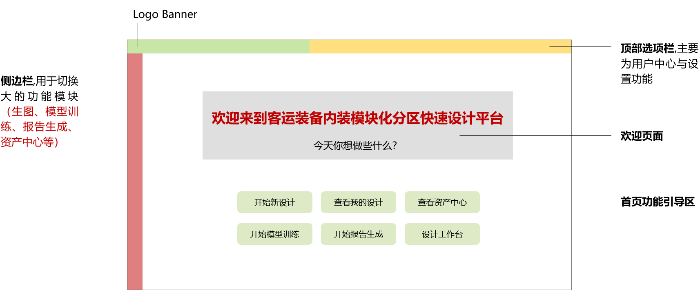

**图 1 说明：** 首页由 Logo Banner、平台侧边栏、顶部选项栏、居中欢迎区和 3×2 六入口组成。图中的绿色、黄色、红色和灰色主要用于标注区域，原文没有把这些颜色定义为最终主题色。

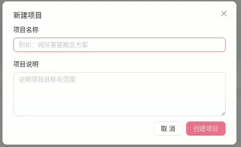

**图 2 说明：** 弹窗示意包含项目名称和任务说明，并提供取消、确认类操作；原文没有规定字段长度、必填规则、唯一性或项目与会话之间的创建关系。

### 3.2 详细工作界面总体骨架

| ID | 性质 | 甲方需求 | 来源/配图 |
| --- | --- | --- | --- |
| FRAME-01 | 明确 | 进入详细工作界面后，页面从左至右划分为侧边栏、任务栏、结果生成显示区、生成内容编辑区和生成功能模块切换区。 | 1，图 3 |
| FRAME-02 | 明确 | 侧边栏用于大的功能模块切换。 | 1、1.1，图 3、图 4 |
| FRAME-03 | 明确 | 任务栏允许点选显示或隐藏。 | 1、1.2，图 3、图 5 |
| FRAME-04 | 明确 | 主显示区承担生成结果展示。 | 1、1.5，图 3 |
| FRAME-05 | 明确 | 内容编辑区与功能模块切换区位于主显示区下方。 | 1、1.6、1.7，图 3 |

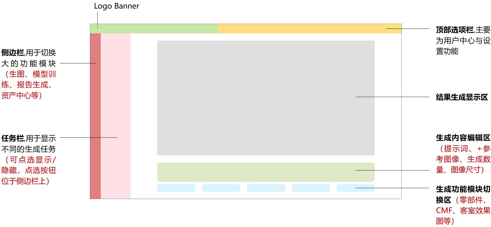

**图 3 说明：** 图中明确表达“两级左侧区域”：最左侧是平台功能侧边栏，其右侧是可折叠任务栏；右侧主区自上而下为结果区、内容编辑区和模块切换区。

### 3.3 侧边栏

| ID | 性质 | 甲方需求 | 来源/配图 |
| --- | --- | --- | --- |
| NAV-01 | 明确 | 侧边栏承担平台大功能模块切换。 | 1.1，图 4 |
| NAV-02 | 明确 | 菜单从上到下依次为：设计生成、模型训练、资产中心、报告生成、设计工作台。 | 1.1，图 4 |

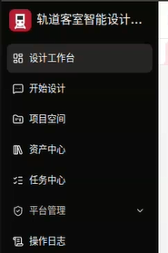

**图 4 说明：** 该图给出黑色窄侧栏样例和五个菜单的纵向顺序，但未定义侧栏宽度、是否显示“首页”、折叠方式、图标集和管理员菜单位置。

### 3.4 任务栏

| ID | 性质 | 甲方需求 | 来源/配图 |
| --- | --- | --- | --- |
| TASK-01 | 明确 | 任务栏用于记录并显示不同任务下的生成记录。 | 1.2，图 5 |
| TASK-02 | 明确 | 用户可在任务栏查阅历史生成结果。 | 1.2，图 5 |
| TASK-03 | 明确 | 用户可从任务栏新增新项目的对话。 | 1.2，图 5 |
| TASK-04 | 明确 | 任务栏右侧设置显示/隐藏控制按钮。 | 1.2，图 5 |
| TASK-05 | 明确 | 文档指定通过“》”和“《”表达展开与收起。 | 1.2，图 5 |
| TASK-06 | 明确 | 通过任务栏新建项目时输入项目名称和任务说明。 | 1.2，图 2 |

**图 5 说明：** 示例包含项目选择、新建会话、搜索历史、历史会话卡片和右侧折叠按钮；图示名称“新建会话”与正文“新增新项目的对话”并不完全一致。

### 3.5 Logo Banner

| ID | 性质 | 甲方需求 | 来源/配图 |
| --- | --- | --- | --- |
| BRAND-01 | 明确 | 顶部 Logo 区域包含中国中车 Logo 与平台名称。 | 1.3，图 6 |
| BRAND-02 | 明确 | Logo 使用 PNG 格式的中车标识；平台名称固定为“客运装备内装模块化分区快速设计平台”。 | 1.3，图 6 |

**图 6 说明：** 图示为红色中车标识加平台全称的横向组合。原文提到“见相关附件”，但当前 DOCX 中没有独立、可确认授权范围的中车 PNG/SVG 品牌源文件。

### 3.6 顶部选项栏

| ID | 性质 | 甲方需求 | 来源/配图 |
| --- | --- | --- | --- |
| TOP-01 | 明确 | 顶部选项栏显示设置、主题模式、信息提醒、用户名称和用户头像。 | 1.4，图 7 |
| TOP-02 | 明确 | 从左至右顺序为：设置、白天/夜间模式切换、信息与提醒、用户名称、用户头像。 | 1.4，图 7 |
| TOP-03 | 参考 | 图示可作为图标密度和横向排列的视觉参考。 | 1.4，图 7 |

**图 7 说明：** 截图只展示紧凑图标序列，未给出搜索、当前项目、帮助、退出登录等既有平台功能是否保留的规则。

### 3.7 结果生成显示区

| ID | 性质 | 甲方需求 | 来源/配图 |
| --- | --- | --- | --- |
| RESULT-01 | 明确 | 每一轮生成指令发出后，在结果区展示对应多模态结果。 | 1.5，图 8 |
| RESULT-02 | 明确 | 每一步骤的生成结果连续显示。 | 1.5，图 8 |
| RESULT-03 | 明确 | 用户通过滚动查找历史生成记录。 | 1.5，图 8 |
| RESULT-04 | 明确 | 每次生成结果左下角不显示本次使用的工作流名称。 | 1.5，图 8 |
| RESULT-05 | 明确 | 用户可点选历史记录中任意一步骤的多模态结果。 | 1.5，图 8 |
| RESULT-06 | 明确 | 生成图像下方提供“深化设计”入口，用于进入下一轮设计。 | 1.5，图 8 |
| RESULT-07 | 参考 | 多图片结果根据数量采用不同拼图式排列。 | 1.5，图 9 |
| RESULT-08 | 明确 | 点击任一生成图像后可全屏放大。 | 1.5，图 10 |
| RESULT-09 | 明确 | 全屏预览左右两侧提供上一张、下一张切换按钮。 | 1.5，图 10 |

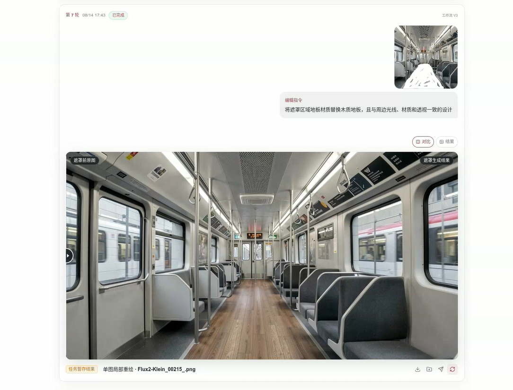

**图 8 说明：** 示例强调按轮次连续展示输入与大图结果，并在结果卡片底部保留操作区；红色箭头指向需继续设计的结果操作位置。

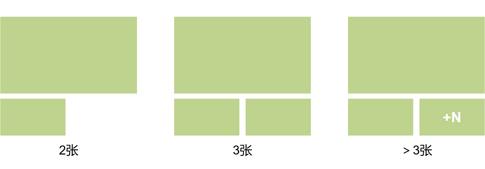

**图 9 说明：** 两张图使用并排布局，三张图使用一大两小，四张以上使用四格并以“+N”表示剩余图片。原文称为“参考”，未规定超过四张后的完整展示上限。

**图 10 说明：** 图像居中显示，左右边缘提供切换箭头；未定义缩放、拖动、键盘、移动端手势和关闭方式。

### 3.8 生成内容编辑区

| ID | 性质 | 甲方需求 | 来源/配图 |
| --- | --- | --- | --- |
| COMPOSER-01 | 明确 | 内容编辑区支持上传 1 张至多张图片。 | 1.6，图 11 |
| COMPOSER-02 | 明确 | 内容编辑区支持填写文本。 | 1.6，图 11 |
| COMPOSER-03 | 明确 | 内容编辑区支持选择生成功能和微调参数。 | 1.6，图 11 |
| COMPOSER-04 | 明确 | 编辑区分上、中、下三部分：图片添加区、文本输入区、功能与参数选择区。 | 1.6，图 11 |
| COMPOSER-05 | 明确 | 初始默认模式为文生图。 | 1.6，图 11 |
| COMPOSER-06 | 明确 | 默认文生图状态下，输入框顶部的上传图片入口隐藏。 | 1.6，图 11 |
| COMPOSER-07 | 参考 | 文生图切换为图生图时，上传图像区域按图 12 的流程出现并参与生成。 | 1.6，图 12 |

**图 11 说明：** 上方是图片素材区域，中间是较大的提示词输入区，下方集中放置能力、参数、尺寸、更多和发送操作。

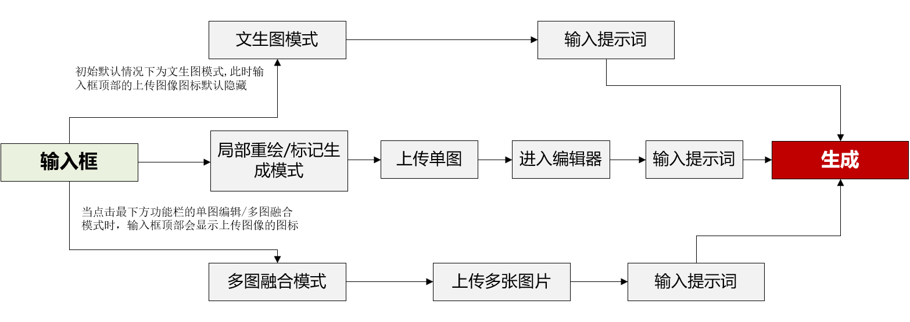

**图 12 说明：** 文生图只有文本输入；选择需要图片的功能后增加图片输入，再把图片、提示词和参数共同提交。图中的流程节点未定义失败回退、素材删除和多图排序。

### 3.9 生成功能模块切换区

| ID | 性质 | 甲方需求 | 来源/配图 |
| --- | --- | --- | --- |
| MODE-01 | 明确 | 功能模块切换区位于内容编辑区下方。 | 1.7，图 13 |
| MODE-02 | 明确 | 用户可快速切换不同生成功能模块。 | 1.7，图 13 |
| MODE-03 | 明确 | 从左至右依次为：客室零部件生成、CMF 生成、客室效果生成、报告生成。 | 1.7，图 13 |

**图 13 说明：** 四个模块以横向卡片形式排列，图中示例同时出现了具体能力缩略入口；需与“模块”和“能力”两级概念区分。

### 3.10 文本多模态 API / 问答助手

| ID | 性质 | 甲方需求 | 来源/配图 |
| --- | --- | --- | --- |
| ASSIST-01 | 明确 | 平台以问答助手形式提供文本及图文多模态问答。 | 1.8，无配图 |
| ASSIST-02 | 明确 | 前端右下角显示问答助手图标，点击后打开对话框。 | 1.8，无配图 |

## 4. 功能模块需求

### 4.1 设计生成总则

| ID | 性质 | 甲方需求 | 来源/配图 |
| --- | --- | --- | --- |
| DESIGN-01 | 明确 | 设计生成是平台核心功能，基于多模态能力完成智能生成。 | 2.1，图 14 |
| DESIGN-02 | 明确 | 设计生成内容分为 CMF、客室零部件、客室效果三大类。 | 2.1，图 14 |
| DESIGN-03 | 明确 | 三类生成模块可在模块切换区切换，并允许具有不同的表单预设。 | 2.1，图 14 |

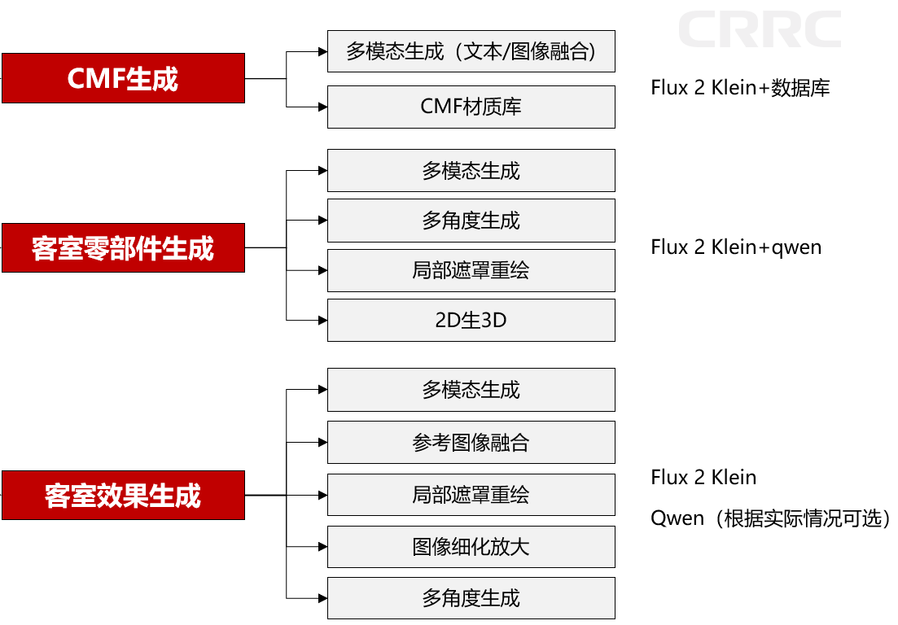

**图 14 说明：** CMF、客室零部件和客室效果各自对应一组工作流/能力；图中同时标注 Flux、Qwen、2D 生 3D 等技术路线，但没有给出服务协议和最终能力清单。

### 4.2 CMF 生成

#### 4.2.1 输入和工具栏

| ID | 性质 | 甲方需求 | 来源/配图 |
| --- | --- | --- | --- |
| CMF-01 | 明确 | CMF 面向客室花纹纹样、贴图材质等内容的多模态设计生成。 | 2.1.1 |
| CMF-02 | 明确 | 提示词占位文案改为“描述你的设计需求，如生成二方连续/四方连续、颜色、面料材质、图案形式、风格、图像尺寸的纹样…”。 | 2.1.1 |
| CMF-03 | 明确 | 工具栏从左至右为：生成尺寸、局部重绘、多图融合、图像放大、图片理解、添加 LoRA、提示词模板、更多。 | 2.1.1，图 15 |
| CMF-04 | 明确 | 选择局部重绘、多图融合、图像放大或图片理解后，输入框顶部出现图片添加区。 | 2.1.1，图 15 |
| CMF-05 | 明确 | 上述工具中只有多图融合允许输入多张图片，其余功能使用单图。 | 2.1.1，图 15 |

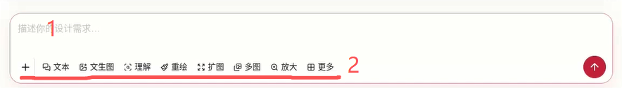

**图 15 说明：** 红色“1”标注输入内容区，红色“2”标注底部工具栏；该图被 CMF、客室零部件和客室效果三个模块重复引用。

#### 4.2.2 CMF 结果操作

| ID | 性质 | 甲方需求 | 来源/配图 |
| --- | --- | --- | --- |
| CMF-06 | 明确 | 结果支持下载到本地。 | 2.1.1，图 16 |
| CMF-07 | 明确 | 结果支持添加到资产中心，并让用户选择资产中心的存储分类地址。 | 2.1.1，图 16 |
| CMF-08 | 明确 | 结果支持“重新绘制”，即不改变提示词和相关内容直接重新生成。 | 2.1.1，图 16 |
| CMF-09 | 明确 | 结果支持局部重绘，点击后进入遮罩编辑器。 | 2.1.1，图 16 |
| CMF-10 | 明确 | 结果支持多图融合。 | 2.1.1，图 16 |
| CMF-11 | 参考 | 多图融合可以采用“回填到底部编辑器”或“独立弹窗”两种交互方案。 | 2.1.1，图 16 |
| CMF-12 | 明确 | 结果支持图像放大；用户选择放大倍率后直接进入生成流程。 | 2.1.1，图 16 |
| CMF-13 | 明确 | 结果支持图像理解。 | 2.1.1，图 16 |
| CMF-14 | 参考 | 不易通过图标表达的结果操作可以改用文字按钮。 | 2.1.1 |

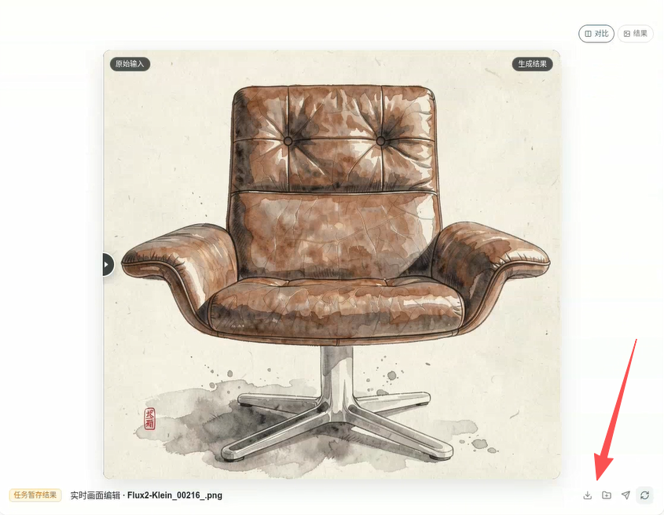

**图 16 说明：** 红色箭头指向结果卡片右下角操作区。原文为各操作赋予业务含义，但图中图标较小，不能单凭截图确认最终图标样式。

### 4.3 提示词模板

| ID | 性质 | 甲方需求 | 来源/配图 |
| --- | --- | --- | --- |
| PROMPT-01 | 明确 | 提示词模板用于为用户提供输入参考。 | 2.1.1.1，图 17 |
| PROMPT-02 | 明确 | 提示词模板采用一级菜单和二级菜单。 | 2.1.1.1，图 17 |
| PROMPT-03 | 参考 | CMF 一级菜单可包含颜色、材质、纹样类型等类别；二级菜单可包含红/蓝/绿、布料/皮革、二方连续/四方连续等具体参数。 | 2.1.1.1，图 17 |
| PROMPT-04 | 明确 | CMF、客室零部件、客室效果三个模块使用不同的预设词汇。 | 2.1.1.1 |
| PROMPT-05 | 待定义 | 具体分类和词库后续讨论；当前阶段可先制作按钮并打通工作流。 | 2.1.1.1 |

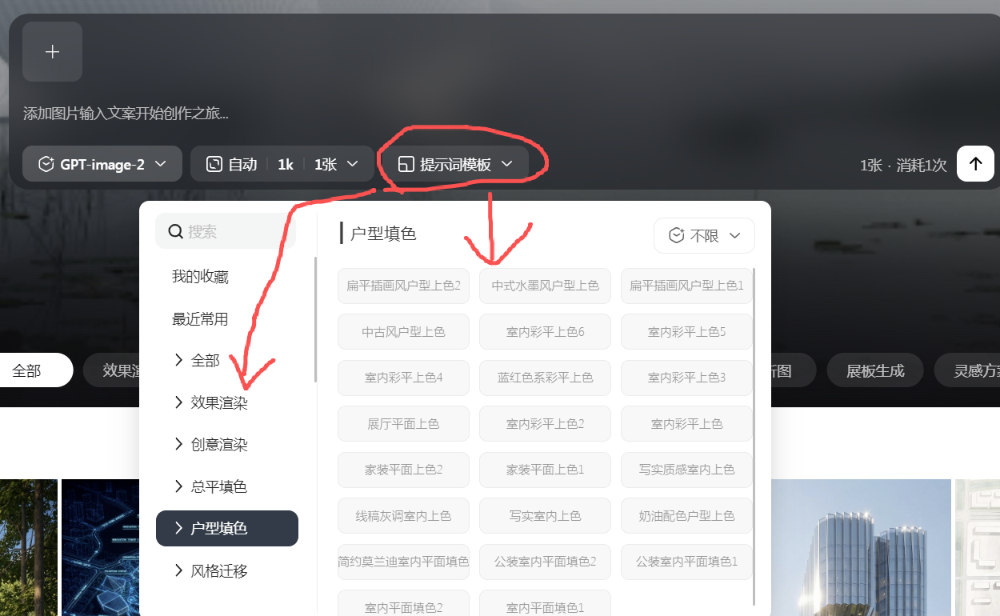

**图 17 说明：** 示例通过顶部分类和弹出选项快速拼接提示词。图中没有定义多选、取消、排序、生成句式、收藏、最近使用和持久化方式。

### 4.4 客室零部件生成

#### 4.4.1 输入和工具栏

| ID | 性质 | 甲方需求 | 来源/配图 |
| --- | --- | --- | --- |
| PART-01 | 明确 | 零部件生成面向客室独立零部件的工业设计、材质及二维/三维多模态生成。 | 2.1.2 |
| PART-02 | 明确 | 提示词占位文案改为“描述你的设计需求，如生成部件类型、角度、颜色、表面材质、图像尺寸等…”。 | 2.1.2 |
| PART-03 | 明确 | 工具栏从左至右为：生成尺寸、局部重绘、标记修改、多图融合、多角度生成、三维生成、图像放大、图片理解、添加 LoRA、提示词模板、更多。 | 2.1.2，图 15 |
| PART-04 | 明确 | 选择局部重绘、标记修改、多图融合、多角度生成、三维生成、图像放大或图片理解后，输入框顶部出现图片添加区。 | 2.1.2，图 15 |
| PART-05 | 明确 | 上述工具中只有多图融合允许输入多张图片，其余功能使用单图。 | 2.1.2，图 15 |

#### 4.4.2 零部件结果操作

| ID | 性质 | 甲方需求 | 来源/配图 |
| --- | --- | --- | --- |
| PART-06 | 明确 | 结果支持下载到本地。 | 2.1.2，图 16 |
| PART-07 | 明确 | 结果支持添加到资产中心，并选择存储分类地址。 | 2.1.2，图 16 |
| PART-08 | 明确 | 结果支持不改变提示词和参数的重新生成。 | 2.1.2，图 16 |
| PART-09 | 明确 | 结果支持局部重绘并进入遮罩编辑器。 | 2.1.2，图 16 |
| PART-10 | 明确 | 结果支持标记修改并进入标记工具编辑器。 | 2.1.2，图 16 |
| PART-11 | 明确 | 结果支持多图融合。 | 2.1.2，图 16 |
| PART-12 | 参考 | 多图融合可以采用回填底部编辑器或独立弹窗两种交互。 | 2.1.2 |
| PART-13 | 明确 | 结果支持图像放大，选择倍率后直接生成。 | 2.1.2，图 16 |
| PART-14 | 明确 | 结果支持图像理解。 | 2.1.2，图 16 |
| PART-15 | 明确 | 结果支持多角度生成。 | 2.1.2，图 16 |
| PART-16 | 明确 | 结果支持三维生成。 | 2.1.2，图 16 |
| PART-17 | 参考 | 不易通过图标表达的功能可以使用文字按钮。 | 2.1.2 |

### 4.5 三维生成结果

| ID | 性质 | 甲方需求 | 来源/配图 |
| --- | --- | --- | --- |
| MODEL3D-01 | 参考 | 零部件选择三维生成后，结果区使用三维模型查看界面展示结果。 | 2.1.2.1，图 18 |
| MODEL3D-02 | 明确 | 三维结果支持下载到本地。 | 2.1.2.1，图 18 |
| MODEL3D-03 | 明确 | 三维结果支持添加到资产中心，并选择存储分类地址。 | 2.1.2.1，图 18 |
| MODEL3D-04 | 明确 | 三维结果支持在不修改提示词和相关内容的情况下重新生成。 | 2.1.2.1，图 18 |
| MODEL3D-05 | 待定义 | 三维结果还能进行哪些深化操作，原文明示后续探讨。 | 2.1.2.1 |

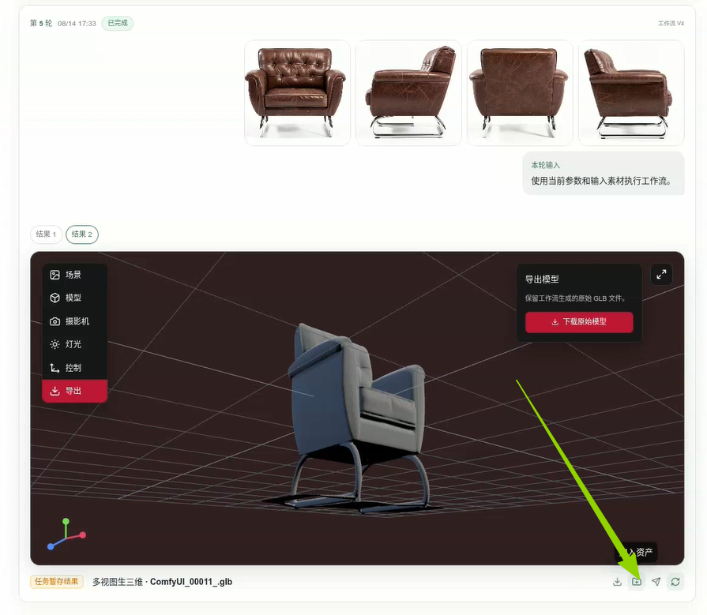

**图 18 说明：** 上部显示同轮次图片结果，下部为可交互三维查看器，左侧可切换查看/控制能力；原文没有定义输出格式、相机控制、材质、测量、剖切和导出范围。

### 4.6 客室效果生成

#### 4.6.1 输入和工具栏

| ID | 性质 | 甲方需求 | 来源/配图 |
| --- | --- | --- | --- |
| EFFECT-01 | 明确 | 客室效果生成面向客室整体视觉效果及 CMF 更改的二维设计生成。 | 2.1.3 |
| EFFECT-02 | 明确 | 提示词占位文案改为“描述你的设计需求，如生成客室类型、画面角度、部件颜色、材质、图像尺寸等…”。 | 2.1.3 |
| EFFECT-03 | 明确 | 工具栏从左至右为：生成尺寸、标记生成、局部重绘、部件/材质融合、平面图填色、环境更改、图像放大、图像理解、添加 LoRA、提示词模板、更多。 | 2.1.3，图 15 |
| EFFECT-04 | 明确 | 选择标记生成、局部重绘、部件/材质融合、平面图填色、环境更改、图像放大或图像理解后，顶部出现图片添加区。 | 2.1.3，图 15 |
| EFFECT-05 | 明确 | 上述工具中只有部件/材质融合允许输入多张图片，其余功能使用单图。 | 2.1.3，图 15 |

#### 4.6.2 客室效果结果操作

| ID | 性质 | 甲方需求 | 来源/配图 |
| --- | --- | --- | --- |
| EFFECT-06 | 明确 | 结果支持下载到本地。 | 2.1.3，图 19 |
| EFFECT-07 | 明确 | 结果支持添加到资产中心，并选择存储分类地址。 | 2.1.3，图 19 |
| EFFECT-08 | 明确 | 结果支持不修改提示词和相关内容的重新生成。 | 2.1.3，图 19 |
| EFFECT-09 | 明确 | 结果支持局部重绘并进入遮罩编辑器。 | 2.1.3，图 19 |
| EFFECT-10 | 明确 | 结果支持标记修改并进入标记工具编辑器。 | 2.1.3，图 19 |
| EFFECT-11 | 明确 | 结果支持部件/材质融合。 | 2.1.3，图 19 |
| EFFECT-12 | 参考 | 部件/材质融合可以采用回填底部编辑器或独立弹窗两种交互。 | 2.1.3 |
| EFFECT-13 | 明确 | 结果支持图像放大，选择倍率后直接生成。 | 2.1.3，图 19 |
| EFFECT-14 | 明确 | 结果支持环境更改。 | 2.1.3，图 19 |
| EFFECT-15 | 明确 | 结果支持图像理解。 | 2.1.3，图 19 |
| EFFECT-16 | 明确 | 结果支持多角度生成。 | 2.1.3，图 19 |
| EFFECT-17 | 参考 | 不易通过图标表达的功能可以使用文字按钮。 | 2.1.3 |

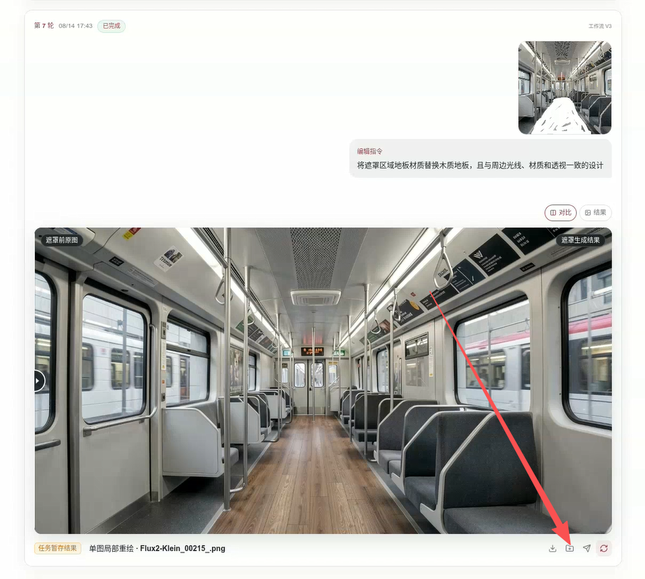

**图 19 说明：** 图中红色箭头指向结果操作区。正文对操作编号出现重复“6”，因此应以功能名称而非原编号作为后续确认依据。

### 4.7 环境更改

| ID | 性质 | 甲方需求 | 来源/配图 |
| --- | --- | --- | --- |
| ENV-01 | 明确 | 环境更改用于修改客室内光环境和车窗外环境。 | 2.1.3.1，图 20 |
| ENV-02 | 参考 | 原文提出通过 Flux 的文本理解能力实现环境更改。 | 2.1.3.1 |
| ENV-03 | 明确 | 用户上传一张图片，并通过文本输入发起环境更改生成。 | 2.1.3.1，图 20 |
| ENV-04 | 明确 | 界面至少包含一个图片上传区和一个文本输入框。 | 2.1.3.1，图 20 |
| ENV-05 | 参考 | 环境提示词模板一级菜单可分为光环境、窗外环境；二级菜单可包含白天/阴天/夜晚和户外/森林/草地/沙漠/城市等。 | 2.1.3.1 |
| ENV-06 | 待定义 | 环境提示词词库后续讨论；当前可先制作按钮并打通工作流。 | 2.1.3.1 |

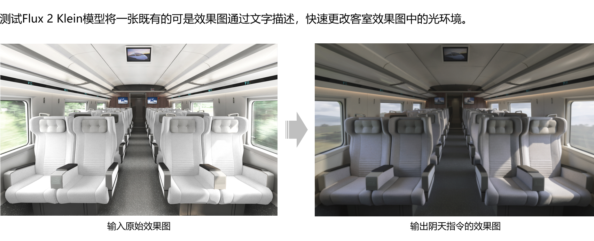

**图 20 说明：** 示例展示原始客室图与修改光照/窗外环境后的对比结果，属于能力效果示意，不构成模型质量、分辨率或一致性指标。

### 4.8 报告生成

| ID | 性质 | 甲方需求 | 来源/配图 |
| --- | --- | --- | --- |
| REPORT-01 | 明确 | 报告生成使用资产中心或本地上传的图片集、文字作为输入。 | 2.1.5，图 21 |
| REPORT-02 | 明确 | 系统按照一定格式自动生成结构化报告。 | 2.1.5 |
| REPORT-03 | 明确 | 输出支持 Word 与 PPT 格式。 | 2.1.5，图 21 |
| REPORT-04 | 明确 | 前端主要包含输入框、下拉框和图片上传框。 | 2.1.5，图 21 |
| REPORT-05 | 待定义 | 输入框和下拉框的具体参数取决于后续确定的 Word/PPT 生成技术路线。 | 2.1.5 |

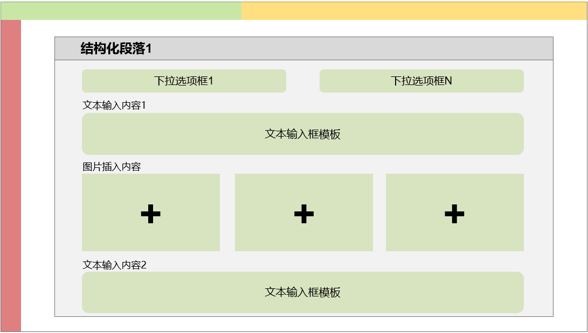

**图 21 说明：** 示意包含报告类型、输出格式、文字说明和多个图片素材位；黄色标注强调 Word/PPT，但模板、章节结构、页数、图片数量和输出文件标准均未定义。

> 原文章节从 2.1.3 直接跳到 2.1.5，缺少 2.1.4。结合 1.7 的四模块结构判断，2.1.5 应为报告生成，但应请甲方确认是否只是编号错误，还是缺失了一个功能章节。

### 4.9 模型训练

| ID | 性质 | 甲方需求 | 来源/配图 |
| --- | --- | --- | --- |
| TRAIN-01 | 明确 | 平台提供模型训练模块。 | 2.2，图 22 |
| TRAIN-02 | 参考 | 模型训练模块可参考 Liblib 等成熟软件的界面和流程。 | 2.2，图 22 |

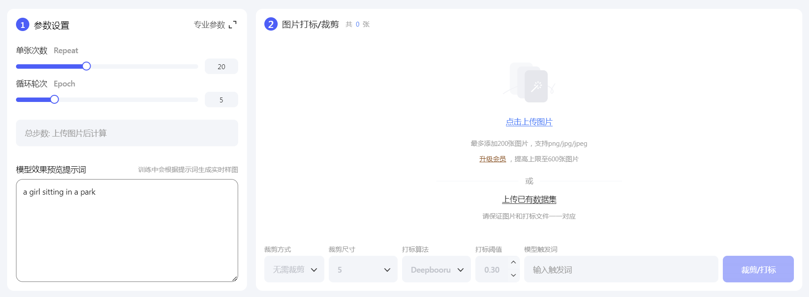

**图 22 说明：** 参考图呈现训练参数、触发词/提示词、训练图片上传与标注/裁剪等区域，但原文没有明确必须实现的字段、默认值、取值范围、训练后端和验收指标。

### 4.10 资产中心

| ID | 性质 | 甲方需求 | 来源/配图 |
| --- | --- | --- | --- |
| ASSET-01 | 明确 | 资产中心存储生成图像集、三维模型、报告和训练模型（LoRA）。 | 2.3，无配图 |
| ASSET-02 | 明确 | 资产中心具备分类功能。 | 2.3 |
| ASSET-03 | 明确 | 资产中心具备检索功能。 | 2.3 |
| ASSET-04 | 明确 | 生成图像集细分为 CMF 图像集、客室零部件图像集、客室图像集。 | 2.3 |
| ASSET-05 | 明确 | 资产中心一级业务分类还包括生成三维模型。 | 2.3 |
| ASSET-06 | 明确 | 资产中心一级业务分类还包括生成报告。 | 2.3 |
| ASSET-07 | 明确 | 资产中心一级业务分类还包括微调模型。 | 2.3 |
| ASSET-08 | 明确 | 其他生成模块执行“保存到资产中心”时，应识别来源板块并存入相应分类；原文强调不能跨板块、跨内容领域存储。 | 2.3 |

### 4.11 设计工作台与辅助功能

| ID | 性质 | 甲方需求 | 来源/配图 |
| --- | --- | --- | --- |
| WORKBENCH-01 | 参考 | 设计工作台可以保持当前已有功能架构。 | 2.4，无配图 |
| AUX-01 | 待定义 | 其他辅助功能主要涉及设置、用户设置，后续再详细讨论。 | 2.5，无配图 |

## 5. 需要向甲方确认的问题

### 5.1 P0：不确认就会影响架构、范围或验收

| 编号 | 需要确认的问题 | 原因与建议 |
| --- | --- | --- |
| Q-P0-01 | 首页第六入口“设计工作台”具体进入哪个页面？它与侧边栏中的“设计工作台”、详细设计界面是否为同一概念？ | 文档同时把登录页称首页、把详细生成页描述为工作界面，又保留“设计工作台”入口，名词边界不清。建议甲方给出页面清单和路由关系图。 |
| Q-P0-02 | “开始新设计”究竟是创建一个新项目、在已有项目中创建新对话，还是一次完成两者？ | HOME-05、TASK-03、TASK-06 混用“项目”“任务”“对话”。三者的数据关系会直接影响权限、资产归属和历史记录。 |
| Q-P0-03 | 新建弹窗的最终字段、必填规则和生命周期是什么？ | 图 2 显示项目名称、任务说明，但没有负责人、成员、编号、重名规则、取消和创建失败处理。 |
| Q-P0-04 | 侧边栏是否严格只保留五项？首页、项目管理、任务中心、通知、用户与权限、审计等平台功能放在哪里？ | 直接按图 4 删除既有入口会造成平台治理能力不可达。建议确认“图示为业务主菜单”还是“完整菜单”。 |
| Q-P0-05 | 详细工作区是否要求像素级一致？目标分辨率、浏览器、缩放比例和响应式断点是什么？ | 文档多次使用“参考效果”，截图色块也明显具有标注性质。没有设备基线无法进行“严格一致”验收。 |
| Q-P0-06 | CMF、零部件、客室效果三类工具栏是否必须完全按原文各自的 8/11/11 项及顺序展示？ | 三类功能数量、命名和图片输入规则不同，若改成共用快捷工具会偏离原文；需要甲方确认允许统一抽象到何种程度。 |
| Q-P0-07 | 每个功能对应的后端服务、输入参数、输出类型、超时、取消、失败码和版本由谁提供？ | 文档主要描述前端与效果，没有形成可执行 API 契约。没有契约只能完成禁用界面，不能完成全链路。 |
| Q-P0-08 | 报告生成最终采用何种模板、服务和文件格式？ | “Word/PPT”需明确为 `.docx`/`.pptx`，并确定模板来源、章节结构、图片规则、字体、页数、是否可编辑及输出资产登记。 |
| Q-P0-09 | 模型训练的目标究竟是 LoRA 训练还是其他微调方式？训练后端和算力环境由谁提供？ | “参考 Liblib”不足以定义功能。需确认基础模型、数据集协议、参数范围、显存、队列、进度、取消、失败和模型资产格式。 |
| Q-P0-10 | 资产“不能跨板块、跨内容领域存储”是硬性权限限制，还是只要求系统默认自动归类？ | 硬限制会阻断同一项目内 CMF、零部件、效果图之间的资产复用，并与平台以资产作为能力交换协议的现有设计冲突。建议采用默认归类 + 标签/来源追踪，而非禁止复用。 |
| Q-P0-11 | 中国中车 Logo 的正式文件和使用授权由谁提供？是否有品牌规范？ | 从截图裁切或自行仿制商标存在清晰度和授权风险。应提供官方 PNG/SVG、留白、最小尺寸和色彩规范。 |
| Q-P0-12 | “工作流名称不显示”是否允许展示面向用户的能力名称、能力版本和任务编号？ | 完全隐藏所有来源信息会降低结果追溯和故障定位能力。建议只隐藏内部工作流/节点信息，保留业务能力与任务标识。 |

### 5.2 P1：决定交互细节和可用性

| 编号 | 需要确认的问题 | 原因与建议 |
| --- | --- | --- |
| Q-P1-01 | “查看我的设计”用单一长下拉框还是可搜索、可分页的历史列表？按项目还是按用户聚合？ | 对话数量增加后，普通下拉框不可扩展。建议确认检索字段、排序、项目过滤和已删除会话规则。 |
| Q-P1-02 | 任务栏中的记录单位是项目、设计会话、生成任务还是生成轮次？ | 图 5 的“历史会话”和正文“不同任务下的生成记录”不是同一层级。 |
| Q-P1-03 | 任务栏折叠按钮必须使用全角“》/《”，还是允许使用一致的折叠图标并提供悬浮说明？ | 全角字符在不同字体中对齐不稳定，图标更适合可访问性和主题统一。 |
| Q-P1-04 | 顶部栏是否保留当前项目、搜索、帮助、退出等既有功能？ | 图 7 只展示五项，不能判断未画出的能力是否需要删除。 |
| Q-P1-05 | 首页和工作区配图中的绿色、黄色、红色、灰色是最终配色，还是区域标注色？ | 如果是标注色，应使用现有主题；如果是设计色，需要甲方提供色值和品牌规范。 |
| Q-P1-06 | 多图片布局超过四张时最多显示几张？“+N”点击后是全屏相册还是展开网格？ | 图 9 只表达 2、3、4+ 的示意。 |
| Q-P1-07 | 全屏图片预览是否需要缩放、拖动、下载、键盘方向键、Esc 关闭和移动端手势？ | 图 10 只明确左右切换。建议至少确认桌面端键盘操作与关闭方式。 |
| Q-P1-08 | “点选历史记录中的任意一步骤”是选择该轮作为当前上下文，还是点击结果图才可深化？ | 结果轮次、单个结果和“深化设计”按钮的选择边界未定义。 |
| Q-P1-09 | “重新绘制”与“重新生成”是否为同一含义？是否固定复用原参数、随机种子和输入素材？ | 原文只说明不修改提示词及相关内容，没有说明随机种子是否复用。建议术语统一为“重新运行”并保留完整输入快照。 |
| Q-P1-10 | 多图融合的两种交互方案是二选一还是同时提供？ | 同时实现会增加重复流程和维护成本。建议优先统一回填到底部编辑器，弹窗只在确有独立操作价值时保留。 |
| Q-P1-11 | 多角度生成和三维生成结果区的“回填编辑器/弹窗”文字是否为复制粘贴错误？ | 原文描述仍写“上传其他融合图像素材”，与多角度、三维生成语义不匹配。 |
| Q-P1-12 | 客室效果结果操作的最终顺序和数量是什么？ | 原文编号重复“6”，随后编号整体偏移；请以最终功能清单重新编号签字确认。 |
| Q-P1-13 | “标记生成”和结果区“标记修改”是否指同一能力？标记数据格式是什么？ | 名称不一致，会影响能力映射、历史恢复和资产血缘。 |
| Q-P1-14 | “平面图填色”“部件/材质融合”“环境更改”各自的输入张数、遮罩/标记要求和输出类型是什么？ | 仅有功能名称，不能形成参数 Schema。 |
| Q-P1-15 | “添加 LoRA”是选择已有 LoRA、组合多个 LoRA，还是触发训练？是否允许调节权重？ | 文档把训练模块与生成时添加 LoRA 分开，但没有定义两者关系。 |
| Q-P1-16 | “更多”中首版需要开放哪些参数？ | 原文明示具体参数下次讨论。未确认前不应自行暴露底层节点参数。 |
| Q-P1-17 | 提示词模板是否支持多选、排序、删除、收藏、最近使用、用户自定义和持久化？ | 只有两级示例词库，尚无完整交互和数据规则。 |
| Q-P1-18 | 环境更改必须绑定 Flux，还是只要求达到业务效果并允许替换模型/供应商？ | 把产品需求绑定具体模型会削弱服务替换能力。建议把 Flux 作为当前参考实现，验收以输入输出契约和效果指标为准。 |
| Q-P1-19 | 三维输出格式和查看器能力是什么？ | 需明确 GLB/GLTF/OBJ/FBX/STEP 等格式，以及旋转、缩放、材质、灯光、测量、剖切和导出范围。 |
| Q-P1-20 | 报告输入图数量、来源、排序、图注和正文编辑规则是什么？ | 图 21 只显示若干上传位，不能支持结构化报告验收。 |

### 5.3 P2：范围、质量和上线条件

| 编号 | 需要确认的问题 | 原因与建议 |
| --- | --- | --- |
| Q-P2-01 | 多模态问答助手使用哪个服务，允许哪些附件类型，聊天记录保留多久？ | 需明确用户隔离、项目上下文、敏感信息、附件大小和服务不可用表现。 |
| Q-P2-02 | 图片上传的格式、尺寸、大小、数量、排序和删除规则是什么？ | 三个生成模块都依赖输入素材，但文档只有“单图/多图”口径。 |
| Q-P2-03 | 生成图片和模型的最低质量指标是什么？ | 图 20 等仅为效果示意，没有分辨率、结构一致性、色差、耗时和成功率指标。 |
| Q-P2-04 | 任务并发、排队、取消、重试和超时规则是什么？ | 前端连续对话并不等于执行器可无限并发，需要甲方确认业务优先级与等待体验。 |
| Q-P2-05 | “下载时让用户选择保存地址”是否接受浏览器标准下载行为？ | 普通 Web 页面无法在所有浏览器中强制弹出目录选择器；建议接受浏览器下载设置，或限定支持 File System Access API 的浏览器。 |
| Q-P2-06 | “保存到资产中心时选择分类地址”是选择业务分类、文件夹，还是二者都选？ | 分类与目录是不同概念；建议业务分类由来源自动标记，用户只选择目标文件夹。 |
| Q-P2-07 | “设计工作台保持现有架构”所指的验收基线版本和截图是什么？ | “当前”会随开发变化，必须冻结版本、提交或截图才能验收。 |
| Q-P2-08 | 2.1.4 是否缺失？ | 章节从 2.1.3 跳到 2.1.5，需确认是否仅为编号错误。 |
| Q-P2-09 | 设置和用户设置首期是否在范围内？ | 2.5 明示待补充；在甲方补充前应标记为未定义，不作为完成阻断项。 |
| Q-P2-10 | 是否需要无障碍、离线内网、浏览器兼容和目标性能指标？ | 文档没有说明键盘、屏幕阅读器、内网资源、首屏时间、大图加载和长会话性能。 |

## 6. 不合理或高风险表述及建议调整

| 项目 | 风险判断 | 建议修改为可执行口径 |
| --- | --- | --- |
| 下载时必须让用户选择保存地址 | **跨浏览器不可稳定保证。** 浏览器安全策略通常由用户下载设置决定。 | “触发标准浏览器下载；在支持 File System Access API 的指定浏览器中可选增强为保存位置选择。” |
| 资产不能跨板块、跨内容领域存储 | **会限制设计资产复用，且分类与权限混淆。** | “按来源应用和业务用途自动归类、保留血缘；同一项目内在权限和输入契约允许时可复用，跨项目禁止越权。” |
| 模型训练参考 Liblib | **仅有竞品截图，无法开发和验收。** | 补充训练类型、基础模型、数据集、字段、默认值、范围、算力、队列、进度、取消、输出模型格式和质量指标。 |
| “更多”参数后续讨论，但要求先打通工作流 | **如果工作流必填参数未定义，无法保证提交有效。** | 先冻结最小可执行参数 Schema 和默认值，再把非核心参数收进“更多”。 |
| 提示词模板具体词库后续讨论 | **按钮可做，但业务价值和验收不可完成。** | 把首版范围拆为“模板框架”与“甲方词库数据”两个交付项，分别验收。 |
| 指定 Flux 实现环境更改 | **产品需求与供应商/模型实现耦合。** | 用输入、输出、效果和服务级指标定义能力；Flux 作为可替换适配器之一。 |
| 从截图或“相关附件”使用中车 Logo | **当前没有可独立确认授权的品牌文件。** | 由甲方提供官方源文件和品牌使用规范后再替换，未提供前使用占位或现有已授权标识。 |
| 多图融合、多角度、三维均同时提供两套入口 | **交互重复，开发与测试成本翻倍。** | 每类能力先确认一条主流程；确有高频快捷需求时再补第二入口。 |
| 三维深化“不知道，可后续探讨” | **不是可验收需求。** | 首版只承诺查看、下载、入资产、重新运行；其他能力另立需求单。 |
| 设计工作台“按现有架构保持” | **没有冻结基线，容易产生验收争议。** | 指定 Git 提交、版本号或签字截图作为“现有架构”基线。 |

## 7. 建议甲方签字确认的最小清单

1. 页面信息架构：页面名称、六个首页入口去向、侧边栏完整菜单、项目/会话/任务层级。
2. 视觉验收基线：目标分辨率、浏览器、主题色、是否像素级、Logo 正式资源。
3. 三类生成模块：各自工具名称、顺序、输入张数、参数 Schema、结果操作及工作流映射。
4. 资产规则：业务分类、文件夹、自动归类、项目内复用和跨项目权限边界。
5. 外部服务：ComfyUI/其他图像服务、Flux、2D 生 3D、LoRA、报告生成和多模态问答的接口与部署责任。
6. 待定义内容：提示词模板词库、“更多”参数、三维深化、报告模板、训练参数、设置与用户设置。
7. 非功能验收：任务并发与失败、上传限制、目标质量、性能、浏览器兼容、内网部署和无障碍。

## 8. 结论

这份文档已经清楚描述了首页、两级侧栏工作区、连续结果、统一输入器、四个业务模块入口，以及 CMF/零部件/客室效果三类生成能力的主要交互方向；这些内容可以作为前端信息架构和首版交互的基础。

但它还不是完整的“全链路上线需求规格”：报告、LoRA 训练、提示词模板、更多参数、三维深化、辅助设置和多数外部服务协议仍处于参考或待讨论状态；资产“禁止跨领域”、浏览器指定保存地址、指定 Flux、竞品截图代替训练规格等表述也需要调整。建议甲方先确认第 5～7 节，之后再冻结开发范围和验收标准。
